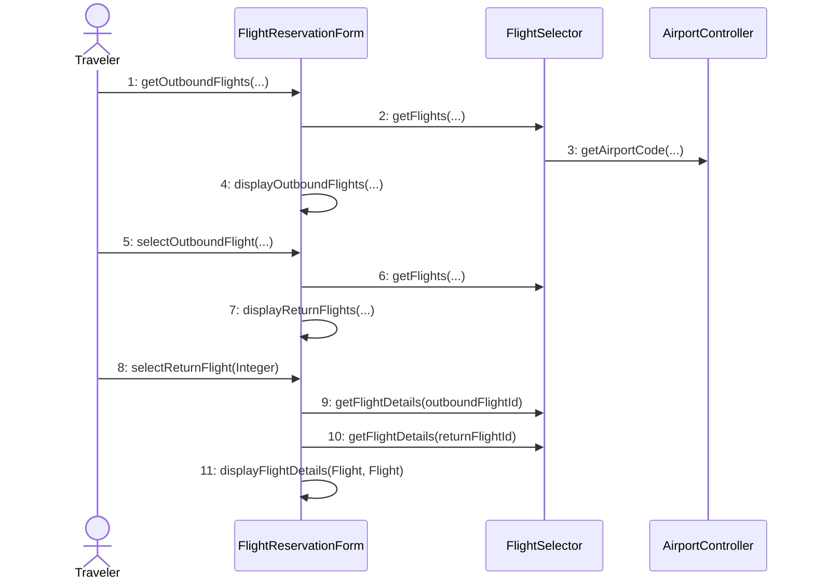
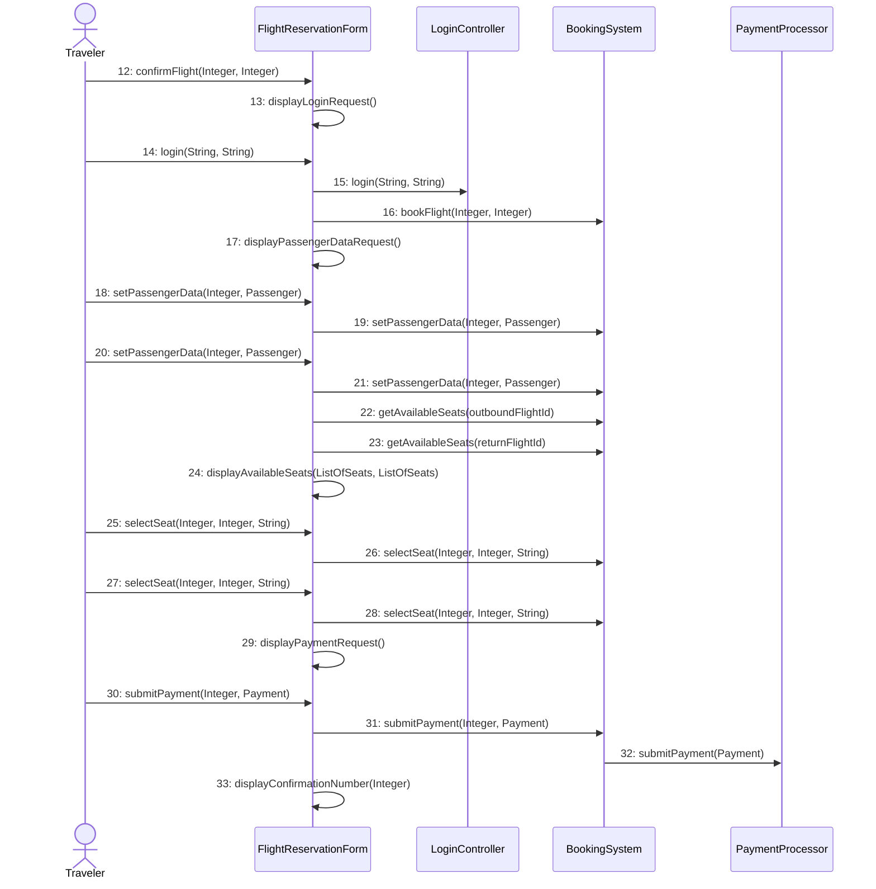

# Worked Example: Book a Flight

Use this reference only when you need a concrete example of the workflow on a multi-step transactional scenario.

## Scenario Steps

| Step | Actor Action | System Response |
|---|---|---|
| B1 | Traveler enters the site's URL | |
| B2 | | System displays the home page |
| B3 | Traveler enters departure/arrival airports, dates, number of adults and children; selects "Search flights" | |
| B4 | | System displays outbound flights sorted by price |
| B5 | Traveler selects an outbound flight | |
| B6 | | System displays return flights |
| B7 | Traveler selects a return flight | |
| B8 | | System displays flight details |
| B9 | Traveler confirms the flight | |
| B10 | Traveler provides user ID and password | |
| B11 | Traveler provides passenger information | |
| B12 | | System displays available seats |
| B13 | Traveler selects seats | |
| B14 | Traveler provides credit-card and billing information | |
| B15 | | System provides a confirmation number |

## What this example is demonstrating

- Browser/navigation steps B1-B2 are skipped because they are outside application scope.
- Boundary operations stay close to user actions; controller operations stay reusable.
- Standalone steps (B9, B10) are allowed when the next step is not a direct response.
- B11 and B12 are kept as separate operations because capturing passengers and retrieving seat maps are different responsibilities.
- Class and sequence diagrams are updated together after each design decision.

## Walkthrough by scenario chunk

### B3-B4 — Search outbound flights

**Boundary**
- `FlightReservationForm`
- Operation: `getOutboundFlights(departureAirport : String, arrivalAirport : String, departureDate : Date, returnDate : Date, numberAdults : Integer, numberKids : Integer)`

**Missing-information convention**
- If the product supports one-way travel, either:
  - use sentinel `returnDate = 01/01/0001`, or
  - add `returnFlag : Boolean`.
- In this example the sentinel convention is used and documented.

**Controller**
- `FlightSelector.getFlights(...) : ListOfFlights`
- The controller name is generic because the same logic serves outbound and return searches.

**Supporting controller**
- `AirportController.getAirportCode(town : String, location : String) : String`
- This exists only when the scenario allows city/state input instead of airport codes.

**Entities created here**
- `Flight(flightId : Integer, departureAirport : String, arrivalAirport : String, departureDate : Date, departureTime : String, arrivalDate : Date, arrivalTime : String)`
- `FlightLeg(flightLegId : Integer, airline : String, flightNumber : String, departureAirport : String, arrivalAirport : String, departureDate : Date, departureTime : String, arrivalDate : Date, arrivalTime : String)`
- `ListOfFlights`

**Relationships**
- `Flight "1" o-- "1..n" FlightLeg`
- `ListOfFlights "1" o-- "0..n" Flight`

**Display/self-call**
- `FlightReservationForm.displayOutboundFlights(flights : ListOfFlights)`

**Why these choices matter**
- `FlightSelector`, not `OutboundFlightSelector`: the business service should survive a new UI path.
- `flightLegId`, not `flightNumber + departureDate`: single synthetic identifiers are easier to reference later.

### B5-B6 — Select outbound flight, then show return flights

**Boundary**
- `selectOutboundFlight(flightId : Integer, airport : String, date : Date)`

**Controller reuse**
- Reuse `FlightSelector.getFlights(...)`.

**Display/self-call**
- `displayReturnFlights(flights : ListOfFlights)`

**Reasoning**
- The boundary operation name stays UI-specific because the user is choosing an outbound flight.
- The controller operation stays generic because the search logic is still the same.

### B7-B8 — Select return flight, then show itinerary details

**Boundary**
- `selectReturnFlight(flightId : Integer)`

**Controller**
- `FlightSelector.getFlightDetails(flightId : Integer) : Flight`

**Display/self-call**
- `displayFlightDetails(outboundFlight : Flight, returnFlight : Flight)`

**Reasoning**
- The summary screen needs two detail lookups: one for the selected outbound flight and one for the selected return flight.
- The display operation accepts two `Flight` objects rather than an ambiguous untyped bundle.

### B9 — Confirm flight (standalone)

**Boundary**
- `confirmFlight(outboundFlightId : Integer, returnFlightId : Integer)`

**Controller**
- `BookingSystem.bookFlight(outboundFlightId : Integer, returnFlightId : Integer) : Integer`

**Reasoning**
- `BookingSystem` is separate from `FlightSelector` because searching and booking change for different reasons.
- For one-way travel, `returnFlightId = 0` under the documented convention.

### B10 — Login (standalone)

**Boundary**
- `displayLoginRequest()`
- `login(userId : String, password : String)`

**Controller**
- `LoginController.login(userId : String, password : String) : Boolean`

**Reasoning**
- Authentication is isolated so related features such as password reset or MFA do not pollute booking logic.

### B11 — Capture passenger data

**Boundary**
- `displayPassengerDataRequest()`
- `setPassengerData(reservationId : Integer, passenger : Passenger)`

**Controller**
- `BookingSystem.setPassengerData(reservationId : Integer, passenger : Passenger)`

**Entity**
- `Passenger(passengerId : Integer, firstName : String, lastName : String, middleInitial : Byte, dateOfBirth : Date, address : String, city : String, state : String, zipCode : String, country : String, frequentFlyerNumber : String)`

**Reasoning**
- This operation is called once per passenger.
- Passenger capture is intentionally separate from seat retrieval; otherwise one operation would mix data entry with seat-map lookup.

### B12-B13 — Retrieve and assign seats

**Boundary**
- `getAvailableSeats(flightId : Integer)`
- `displayAvailableSeats(outboundSeats : ListOfSeats, returnSeats : ListOfSeats)`
- `selectSeat(reservationNumber : Integer, passengerId : Integer, seatNumber : String)`

**Controller**
- `BookingSystem.getAvailableSeats(flightId : Integer) : ListOfSeats`
- `BookingSystem.selectSeat(reservationNumber : Integer, passengerId : Integer, seatNumber : String)`

**Entities**
- `Seat(seatId : Integer, seatNumber : String, cabinClass : String)`
- `ListOfSeats`
- `Reservation(reservationNumber : Integer, customerId : String, outboundFlightId : Integer, returnFlightId : Integer)`
- `FlightLegReservation(flightLegReservationId : Integer, flightLegId : Integer, passengerId : Integer, seatNumber : String)`

**Relationships**
- `ListOfSeats "1" o-- "0..n" Seat`
- `Reservation "1" -- "1..n" FlightLegReservation`
- `FlightLegReservation "0..1" -- "1" Passenger`

**Reasoning**
- `seatNumber` is `String`, not `Integer`, because values like `12C` are common.
- `getAvailableSeats` is called once per selected flight, which is why the full sequence below shows two calls before the display step.

### B14-B15 — Take payment and show confirmation

**Boundary**
- `displayPaymentRequest()`
- `submitPayment(reservationId : Integer, payment : Payment)`
- `displayConfirmationNumber(reservationNumber : Integer)`

**Controller**
- `BookingSystem.submitPayment(reservationId : Integer, payment : Payment) : Boolean`
- `PaymentProcessor.submitPayment(payment : Payment) : Boolean`

**Entity**
- `Payment(paymentId : Integer, creditCardNumber : String, expirationDate : Date, cardholderName : String, billingAddress : String)`

**Reasoning**
- Payment processing is split out because it usually fronts an external service with its own failure modes and rules.
- The confirmation number displayed at the end is the reservation number created earlier by `bookFlight(...)` and revealed only after successful payment.

## Final Class Diagram

```mermaid
classDiagram
    class FlightReservationForm {
        +getOutboundFlights(departureAirport: String, arrivalAirport: String, departureDate: Date, returnDate: Date, numberAdults: Integer, numberKids: Integer)
        +displayOutboundFlights(flights: ListOfFlights)
        +selectOutboundFlight(flightId: Integer, airport: String, date: Date)
        +displayReturnFlights(flights: ListOfFlights)
        +selectReturnFlight(flightId: Integer)
        +displayFlightDetails(outboundFlight: Flight, returnFlight: Flight)
        +confirmFlight(outboundFlightId: Integer, returnFlightId: Integer)
        +displayLoginRequest()
        +login(userId: String, password: String)
        +displayPassengerDataRequest()
        +setPassengerData(reservationId: Integer, passenger: Passenger)
        +getAvailableSeats(flightId: Integer)
        +displayAvailableSeats(outboundSeats: ListOfSeats, returnSeats: ListOfSeats)
        +selectSeat(reservationNumber: Integer, passengerId: Integer, seatNumber: String)
        +displayPaymentRequest()
        +submitPayment(reservationId: Integer, payment: Payment)
        +displayConfirmationNumber(reservationNumber: Integer)
    }

    class FlightSelector {
        +getFlights(departureAirport: String, arrivalAirport: String, departureDate: Date, returnDate: Date, numberAdults: Integer, numberKids: Integer) ListOfFlights
        +getFlightDetails(flightId: Integer) Flight
    }

    class AirportController {
        +getAirportCode(town: String, location: String) String
    }

    class LoginController {
        +login(userId: String, password: String) Boolean
    }

    class BookingSystem {
        +bookFlight(outboundFlightId: Integer, returnFlightId: Integer) Integer
        +setPassengerData(reservationId: Integer, passenger: Passenger)
        +getAvailableSeats(flightId: Integer) ListOfSeats
        +selectSeat(reservationNumber: Integer, passengerId: Integer, seatNumber: String)
        +submitPayment(reservationId: Integer, payment: Payment) Boolean
    }

    class PaymentProcessor {
        +submitPayment(payment: Payment) Boolean
    }

    class Flight {
        +flightId : Integer
        +departureAirport : String
        +arrivalAirport : String
        +departureDate : Date
        +departureTime : String
        +arrivalDate : Date
        +arrivalTime : String
    }

    class FlightLeg {
        +flightLegId : Integer
        +airline : String
        +flightNumber : String
        +departureAirport : String
        +arrivalAirport : String
        +departureDate : Date
        +departureTime : String
        +arrivalDate : Date
        +arrivalTime : String
    }

    class ListOfFlights

    class Seat {
        +seatId : Integer
        +seatNumber : String
        +cabinClass : String
    }

    class ListOfSeats

    class Passenger {
        +passengerId : Integer
        +firstName : String
        +lastName : String
        +middleInitial : Byte
        +dateOfBirth : Date
        +address : String
        +city : String
        +state : String
        +zipCode : String
        +country : String
        +frequentFlyerNumber : String
    }

    class Reservation {
        +reservationNumber : Integer
        +customerId : String
        +outboundFlightId : Integer
        +returnFlightId : Integer
    }

    class FlightLegReservation {
        +flightLegReservationId : Integer
        +flightLegId : Integer
        +passengerId : Integer
        +seatNumber : String
    }

    class Payment {
        +paymentId : Integer
        +creditCardNumber : String
        +expirationDate : Date
        +cardholderName : String
        +billingAddress : String
    }

    FlightReservationForm ..> FlightSelector : calls
    FlightReservationForm ..> LoginController : calls
    FlightReservationForm ..> BookingSystem : calls
    FlightSelector ..> AirportController : optional lookup
    BookingSystem ..> PaymentProcessor : delegates payment

    ListOfFlights "1" o-- "0..n" Flight : contains
    Flight "1" o-- "1..n" FlightLeg : contains
    ListOfSeats "1" o-- "0..n" Seat : contains
    Reservation "1" -- "1..n" FlightLegReservation
    FlightLegReservation "0..1" -- "1" Passenger
    Reservation "1" -- "0..1" Payment : settles
```

## Final Sequence Diagram

### Part 1 — Search and selection

### Part 2 — Booking, seats, and payment

## Class Inventory

| Class | Stereotype | Key attributes | Key operations | Rationale |
|---|---|---|---|---|
| FlightReservationForm | Boundary | — | Search, selection, login, passenger, seat, payment display/actions | One UI surface owns the booking flow |
| FlightSelector | Controller | — | `getFlights`, `getFlightDetails` | Search logic stays separate from booking and payment |
| AirportController | Controller | — | `getAirportCode` | Optional normalization of city/state input to airport codes |
| LoginController | Controller | — | `login` | Authentication changes independently from booking |
| BookingSystem | Controller | — | `bookFlight`, `setPassengerData`, `getAvailableSeats`, `selectSeat`, `submitPayment` | Coordinates the booking transaction |
| PaymentProcessor | Controller | — | `submitPayment` | Encapsulates external payment concerns |
| Flight | Entity | `flightId`, airports, dates, times | — | Represents one bookable flight option |
| FlightLeg | Entity | `flightLegId`, carrier and segment data | — | Represents one segment within a flight |
| ListOfFlights | Entity wrapper | — | — | Prevents ambiguous multi-flight returns |
| Seat | Entity | `seatId`, `seatNumber`, `cabinClass` | — | Represents one selectable seat |
| ListOfSeats | Entity wrapper | — | — | Carries zero or more seat options |
| Passenger | Entity | `passengerId`, personal data | — | Stores traveler details per passenger |
| Reservation | Entity | `reservationNumber`, customer and selected flight IDs | — | Core booking record |
| FlightLegReservation | Entity | `flightLegReservationId`, `flightLegId`, `passengerId`, `seatNumber` | — | Links seat assignment to one passenger on one leg |
| Payment | Entity | `paymentId`, card data, billing address | — | Represents payment details tied to a reservation |
