# Domain Model Class Diagram - HRMS Truong Dai hoc Thuy Loi

> Derived from business requirements: "Team 1_ Tim hieu yeu cau khach hang va lap ke hoach du an" and "Yeu cau khach hang".
> This diagram represents the **domain model**, NOT the database schema.

```mermaid
classDiagram
    direction TB

    %% ===== ENUMERATIONS =====

    class VaiTro {
        <<enumeration>>
        QUAN_TRI_VIEN
        CAN_BO_TCCB
        CAN_BO_TCKT
        CAN_BO_NHAN_SU
    }

    class TrangThaiTaiKhoan {
        <<enumeration>>
        DANG_HOAT_DONG
        BI_KHOA
    }

    class TrangThaiLamViec {
        <<enumeration>>
        DANG_CHO_XET
        DANG_CONG_TAC
        DA_THOI_VIEC
    }

    class TrangThaiHopDongNS {
        <<enumeration>>
        CHUA_HOP_DONG
        CON_HIEU_LUC
        HET_HIEU_LUC
        CHO_GIA_HAN
    }

    class LoaiDonVi {
        <<enumeration>>
        HOI_DONG
        BAN
        KHOA
        PHONG
        BO_MON
        PHONG_THI_NGHIEM
        TRUNG_TAM
    }

    class TrangThaiDonVi {
        <<enumeration>>
        DANG_HOAT_DONG
        GIAI_THE
        SAP_NHAP
    }

    class TrangThaiHopDong {
        <<enumeration>>
        CON_HIEU_LUC
        HET_HIEU_LUC
    }

    class TrangThaiDanhMuc {
        <<enumeration>>
        DANG_SU_DUNG
        NGUNG_SU_DUNG
    }

    class TrangThaiKhoaDaoTao {
        <<enumeration>>
        DANG_MO_DANG_KY
        DANG_DAO_TAO
        DA_HOAN_THANH
    }

    class TrangThaiThamGia {
        <<enumeration>>
        DA_DANG_KY
        DANG_HOC
        HOAN_THANH
        KHONG_DAT
    }

    %% ===== CORE ENTITIES =====

    class TaiKhoan {
        -String email
        -String matKhau
        -VaiTro vaiTro
        -TrangThaiTaiKhoan trangThai
        +dangNhap()
        +dangXuat()
        +doiMatKhau()
        +khoaTaiKhoan()
        +moKhoaTaiKhoan()
        +phanQuyen()
    }

    class NhanSu {
        -String maCanBo
        -String hoTen
        -Date ngaySinh
        -String gioiTinh
        -String soCCCD
        -String queQuan
        -String diaChi
        -String maSoThue
        -String soBHXH
        -String soBHYT
        -String email
        -String soDienThoai
        -File anhChanDung
        -String trinhDoVanHoa
        -String trinhDoDaoTao
        -String chucDanhNgheNghiep
        -String chucDanhKhoaHoc
        -Boolean laNguoiNuocNgoai
        -TrangThaiLamViec trangThaiLamViec
        -TrangThaiHopDongNS trangThaiHopDong
        -Date ngayThoiViec
        -String lyDoThoiViec
        +themMoi()
        +chinhSua()
        +danhDauThoiViec()
        +xemChiTiet()
        +inHoSo()
        +xuatExcel()
    }

    class ThongTinNguoiNuocNgoai {
        -String soVisa
        -Date ngayHetHanVisa
        -String soHoChieu
        -Date ngayHetHanHoChieu
        -String soGiayPhepLaoDong
        -Date ngayHetHanGPLD
        -File fileGPLD
    }

    class ThongTinGiaDinh {
        -String moiQuanHe
        -String hoTen
        -String thongTinChiTiet
    }

    class ThongTinNganHang {
        -String tenNganHang
        -String soTaiKhoan
    }

    class QuaTrinhCongTac {
        -String noiCongTac
        -String thoiGianCongTac
    }

    class ThongTinDangDoan {
        -Date ngayVaoDoan
        -Date ngayVaoDang
        -String thongTinChiTiet
    }

    class BangCap {
        -String tenBang
        -String truong
        -String nganh
        -Int namTotNghiep
        -String xepLoai
        -File filePDF
    }

    class ChungChi {
        -String tenChungChi
        -String noiCap
        -Date ngayCap
        -Date ngayHetHan
        -File filePDF
    }

    %% ===== ORGANIZATIONAL STRUCTURE =====

    class DonViToChuc {
        -String maDonVi
        -String tenDonVi
        -LoaiDonVi loaiDonVi
        -Date ngayThanhLap
        -String diaChi
        -String diaChiVanPhong
        -String email
        -String soDienThoai
        -String website
        -Boolean laDonViNut
        -TrangThaiDonVi trangThai
        +themMoi()
        +suaThongTin()
        +giaiThe()
        +sapNhap()
        +xemChiTiet()
    }

    class QuyetDinhDonVi {
        -Date ngayHieuLuc
        -String soQuyetDinh
        -Date ngayQuyetDinh
        -File fileDinhKem
        -String lyDo
        -String loaiSuKien
    }

    class BoNhiem {
        -String chucVu
        -Date ngayBatDau
        +boNhiem()
        +baiNhiem()
    }

    %% ===== SALARY & ALLOWANCE =====

    class HeSoLuong {
        -String ngachVienChuc
        -String bacLuong
        -Double heSoLuong
        -TrangThaiDanhMuc trangThai
        +themMoi()
        +sua()
        +xoa()
        +ngungSuDung()
    }

    class LoaiPhuCap {
        -String tenLoaiPhuCap
        -String moTa
        -String cachTinh
        -TrangThaiDanhMuc trangThai
        +themMoi()
        +sua()
        +ngungSuDung()
    }

    %% ===== CONTRACT =====

    class LoaiHopDong {
        -String tenLoaiHopDong
        -Int soThangToiThieu
        -Int soThangToiDa
        -Int soLanGiaHanToiDa
        -Int thoiGianChoGiaHan
        -TrangThaiDanhMuc trangThai
        +themMoi()
        +sua()
        +ngungSuDung()
    }

    class HopDongLaoDong {
        -String soHopDong
        -Date ngayKy
        -Date ngayHieuLuc
        -Date ngayHetHan
        -String donViCongTac
        -String noiDung
        -File filePDF
        -TrangThaiHopDong trangThai
        +taoMoi()
        +capNhatTrangThai()
    }

    class PhuLucHopDong {
        -Date ngayHieuLuc
        -String dieuKhoanBoSung
        -String quyDinhMoi
        -String luuYQuanTrong
    }

    %% ===== EVALUATION =====

    class DanhGia {
        <<abstract>>
        -Date ngayQuyetDinh
        -Boolean dangHoatDong
        +ghiNhanDanhGia()*
    }

    class KhenThuong {
        -String loaiKhenThuong
        -String tenKhenThuong
        -String soQuyetDinh
        -String noiDung
        -Double soTienThuong
    }

    class KyLuat {
        -String loaiKyLuat
        -String tenKyLuat
        -String lyDo
        -String hinhThucXuLy
    }

    %% ===== TRAINING =====

    class KhoaDaoTao {
        -String tenKhoaDaoTao
        -String loaiKhoaDaoTao
        -Date thoiGianBatDau
        -Date thoiGianKetThuc
        -String diaDiem
        -Double kinhPhi
        -String camKetSauDaoTao
        -String tenChungChi
        -String loaiChungChi
        -Date thoiGianMoDangKy_Tu
        -Date thoiGianMoDangKy_Den
        -Int gioiHanSoNguoi
        -TrangThaiKhoaDaoTao trangThai
        +moKhoaDaoTao()
        +suaThongTin()
        +xemChiTiet()
    }

    class DangKyDaoTao {
        -Date thoiDiemDangKy
        -TrangThaiThamGia trangThaiThamGia
        -Date ngayHoanThanh
        -File fileChungChi
        +dangKy()
        +ghiNhanKetQua()
    }

    %% ===== AUDIT =====

    class NhatKyHeThong {
        -DateTime thoiGian
        -String taiKhoan
        -String hoTen
        -String vaiTro
        -String loaiHanhDong
        -String doiTuong
        -String maDoiTuong
        -String moTaChiTiet
        -String diaChiIP
    }

    %% ========================================
    %% RELATIONSHIPS
    %% ========================================

    %% --- Account & Personnel ---
    TaiKhoan "1" --> "1" NhanSu : lienKetVoi

    %% --- Personnel Compositions (value objects owned by NhanSu) ---
    NhanSu "1" *-- "0..1" ThongTinNguoiNuocNgoai : co
    NhanSu "1" *-- "0..*" ThongTinGiaDinh : co
    NhanSu "1" *-- "1" ThongTinNganHang : co
    NhanSu "1" *-- "0..*" QuaTrinhCongTac : co
    NhanSu "1" *-- "0..1" ThongTinDangDoan : co
    NhanSu "1" *-- "0..*" BangCap : co
    NhanSu "1" *-- "0..*" ChungChi : co

    %% --- Salary & Allowance ---
    NhanSu "0..*" --> "0..1" HeSoLuong : apDung
    NhanSu "0..*" --> "0..*" LoaiPhuCap : huong

    %% --- Contract ---
    NhanSu "1" *-- "0..*" HopDongLaoDong : ky
    HopDongLaoDong "0..*" --> "1" LoaiHopDong : thuocLoai
    HopDongLaoDong "1" *-- "0..*" PhuLucHopDong : boSung

    %% --- Evaluation (Inheritance) ---
    DanhGia <|-- KhenThuong
    DanhGia <|-- KyLuat
    NhanSu "1" *-- "0..*" DanhGia : nhanDuoc

    %% --- Organization ---
    DonViToChuc "0..1" o-- "0..*" DonViToChuc : donViCha
    DonViToChuc "1" *-- "0..*" QuyetDinhDonVi : co

    %% --- Appointment (Association Class) ---
    BoNhiem "0..*" --> "1" NhanSu : boNhiemCho
    BoNhiem "0..*" --> "1" DonViToChuc : taiDonVi

    %% --- Training (Association Class) ---
    DangKyDaoTao "0..*" --> "1" NhanSu : nguoiDangKy
    DangKyDaoTao "0..*" --> "1" KhoaDaoTao : khoaHoc

    %% --- Audit Log ---
    TaiKhoan "1" --> "0..*" NhatKyHeThong : taoRa
```

