## CHAPTER 11

## Object-Oriented Design

This  chapter  shows  you  how  the  requirements  gathered  so  far  can  act  as  a  basis  for  objectoriented system design. There are many approaches to design, and the method described here is one of them. The generic approach presented can be applied regardless of the architecture and implementation language. However, this high-level design should be refined by taking into consideration programming language and system architecture.

Figure 11.1 presents a high-level view of this approach. For each scenario we create one sequence diagram. While creating sequence diagrams, at the same time we create classes that encapsulate required functionality. The classes, their attributes and operations, and the relationships between classes are depicted in the class diagrams.

Sections 11.2 and 11.3 show you how to use two IBM tools for design: Rational Rose and Rational Software Architect.

### Figure 11.1: Creating design diagrams from scenarios
This diagram maps the high-level workflow of the design process, demonstrating how use cases and scenarios drive both interaction (sequence) diagrams and class diagrams.
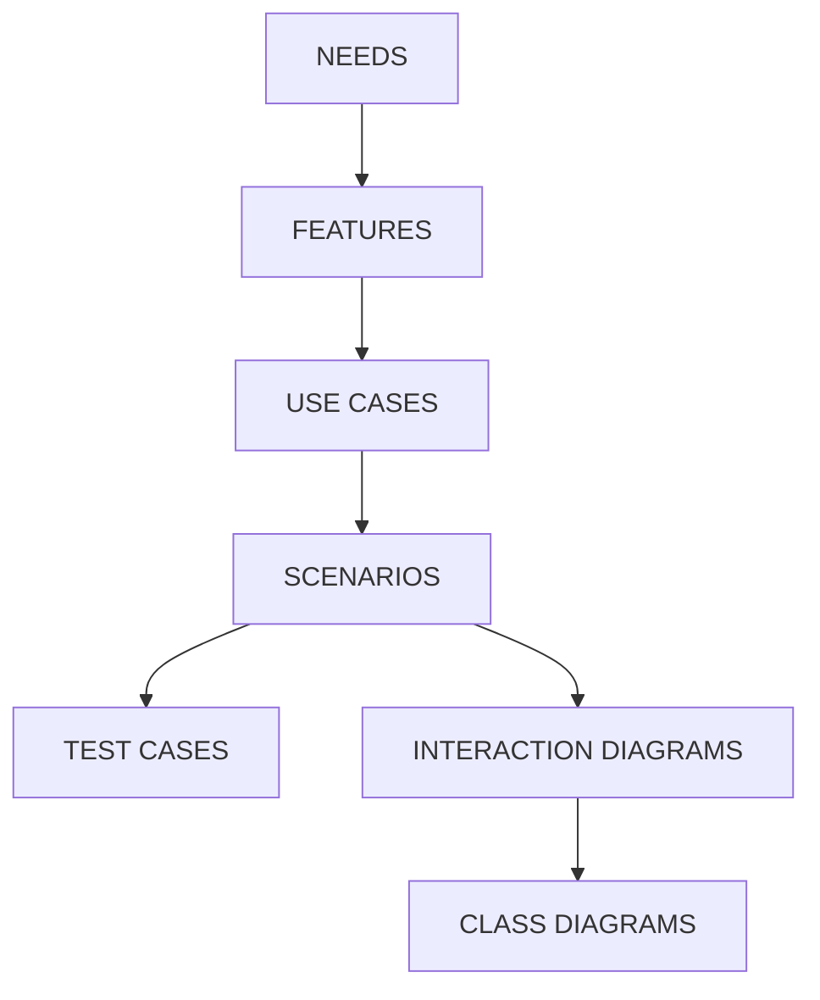

## 11.1 System Design from Use Cases

Design can be done using the Unified Modeling Language (UML)-a graphical modeling language  that  uses  standardized  notation  for  creating  abstract  models  of  systems  [BOO04] [BOO05].

The core task of the presented method is creating a sequence diagram for each scenario. At the same time, classes are designed and relationships between classes are shown on the class diagrams.

When we design interaction diagrams, messages from an actor should go to a boundary class (usually representing a user interface form). The boundary class then passes messages to a controller class, which subsequently collaborates with the appropriate entity classes.

We will follow these steps for each scenario:

1. Get a pair of use case steps: user's request and system's response.
2. Decide which boundary class will provide the interaction with the actors.
3. Create a name for an operation that will allow the actor to pass input values to the system.
4. Design arguments for this operation. Usually there is one argument for each user interface (UI) control on the screen. For example, a text variable may represent an entry field, and a Boolean variable may represent a radio button or a checkbox.

5. Decide what controller operation should provide this functionality.
6. Decide what controller class should provide this operation (pick from existing classes or create a new one).
7. Design arguments and the return value of the operation (if needed, create new entity classes).
4. 8 If needed, create in the boundary class an operation that displays on the screen information obtained from the controller class.
9. Continue the same tasks for the next use case steps.

As an example, let's look at the basic flow of the Book a flight use case.

We can skip the following first two steps because this functionality is provided not by our application, but by the Internet and a browser:

- B1. Traveler enters the site's URL.
- B2. System displays the home page.

The next two steps provide a list of flights based on departure and arrival airport and date and number of passengers.

## B3. Traveler enters:

Departure airport, departure date

Arrival airport, return date

Number of traveling adults and children

Traveler selects 'Search flights.'

- B4. System displays outbound flights sorted by price.

Let's  create  a  class  FlightReservationForm  that  will  include  UI  functionality  related  to these use case steps. In UML a class is represented by a rectangle with three compartments:

- The upper compartment has a class name.
- The middle compartment has attributes.
- The lower compartment has operations.

The FlightReservationForm  class  does  not  have  any  attributes.  The  first  operation  is getOutboundFlights, as shown in Figure 11.2.

### Figure 11.2: UML representation of a class
This is the initial representation of the boundary class representing the user interface, which contains an operation but no attributes yet.
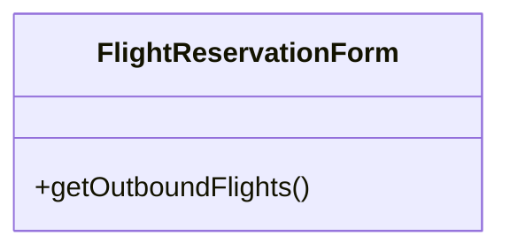

Quite often arguments of the designed operation consist of the variables provided by the user. The arguments of an operation getOutboundFlights are as follows:

- Departure airport
- Arrival airport
- Departure date
- Return date
- Number of traveling adults
- Number of traveling children

At this stage we need to think about whether the system has all the required information to perform the operation. For example, how will the system know if we need a one-way or return flight? We can have a rule that if the Traveler does not specify a return date, he or she needs a oneway ticket. In the class operation we cannot just skip an argument, but we can set a convention that if a date is 01/01/0001, it means that the Traveler did not enter the date, indicating no return flight. Another option would be to add a Boolean argument returnFlag, indicating whether it is a return flight.

We can show the arguments on the UML diagram, but doing so makes classes look very wide, as shown in Figure 11.3.

### Figure 11.3: Showing operation signature on the class diagram
This expands Figure 11.2 by showing the exact arguments passed by the actor via the user interface controls (e.g., departure date, arrival airport, number of kids).
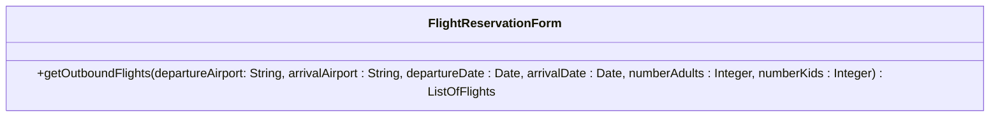

| FlightReservationForm                                                                                                                                                         |
|-------------------------------------------------------------------------------------------------------------------------------------------------------------------------------|
| getOutboundFlights(departureAirport: String, arrivalAirport : String, departureDate : Date, arrivalDate : Date, numberAdults : Integer, numberKids : Integer) : ListOfFlights |

As soon as we have an operation of the boundary class, we need to design an operation of the controller class that will supply to the boundary class required information.

Let's  call  this  operation  getFlights  and  the  controller  class  providing  this  operation FlightSelector. The arguments of getFlights from the class FlightSelector will be the same as the arguments of getOutboundFlights from the class FlightReservationForm. Why do we call one operation getOutboundFlights while calling another operation getFlights? Because the functionality of the controller class is the same regardless of whether the requested fights are outbound or return, it needs to return a list of flights based on some input attributes. The boundary class, however, behaves in a slightly different manner in the case of outbound and return flights, because the user interface differs slightly in these two cases.

Now we need to define entity classes that will be used to return flight information. Let's encapsulate all flight-related information in the class Flight. Let's design the attributes this class will have:

- Departure airport
- Arrival airport
- Departure date
- Departure time
- Arrival date
- Arrival time

Because none of the attributes uniquely identifies the flight, we can add an additional attribute called flightId. For performance reasons it is better to define it as Integer rather than String. In our design of the Flight class, we mean a full connection between departure and destination airport. However, if it is not a direct flight, it will consist of many 'flight legs' with stopovers between them. One flight will contain one or more flight legs. In object-oriented design this is called an aggregation . Figure 11.4 shows a UML representation of the classes Flight and FlightLeg, as well as the aggregation between them. Class FlightLeg contains similar attributes as class Flight, but they describe separate legs. In addition, it contains the Airline name and the FlightNumber used by this airline to identify the flight.

### Figure 11.4: Aggregation between classes Flight and FlightLeg
This diagram defines entity classes that encapsulate the flight data and shows the 1-to-many aggregation relationship between a `Flight` and its `FlightLeg` segments.
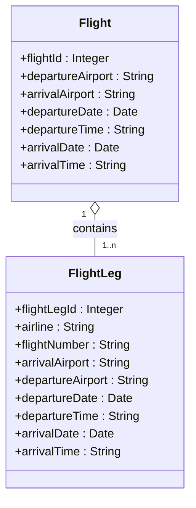

For this class we also need to add an attribute called flightLegId. FlightNumber does not uniquely identify the flight because on different days we can have flights with the same number. Another approach would be to use a pair of attributes such as Flight Number and Departure Date, but using two attributes for identification is less convenient.

Both classes, Flight and FlightLeg, have some attributes, but no operations. It is quite common for one of the compartments of the class to be empty. Entity classes have attributes but no operations, and controller classes have operations but no attributes.

Because we expect many flights as a result of a search, the object returned by the function getFlights is a list of Flight objects. We can define a new class called ListOfFlights. In a UML diagram we can show that ListOfFlights contains zero or more objects of the class Flight, as shown in Figure 11.5. The multiplicity is from 0 to n because the list can be empty.

After we have designed Flight, ListOfFlights, and a portion of the classes FlightReservationForm and FlightSelector, we can depict the search-related use case step in a sequence diagram, as shown in Figure 11.6. On the sequence diagram we show messages sent between the objects. A dashed line descending from each object is called a lifeline .

The boundary class FlightReservationForm on this diagram represents the user interface or front end of the application, which interacts with an actor. The controller class FlightSelector represents  back-end  processing.  Implementation  of  these  classes  depends  on  the  system's architecture.

### Figure 11.5: ListOfFlights aggregates many flights
To capture the expected multiple search results, a new class is defined to aggregate zero or more `Flight` objects.
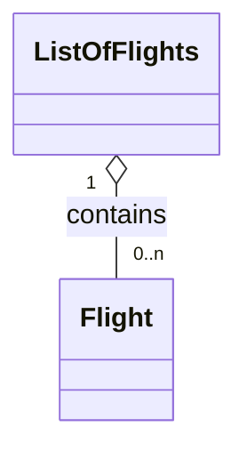

### Figure 11.6: A sequence diagram showing the invoking of the operation getOutboundFlights
This plots the chronological start of the sequence where the `Traveler` (actor) sends a message to the boundary class (`FlightReservationForm`), which then passes a message to the controller class (`FlightSelector`).
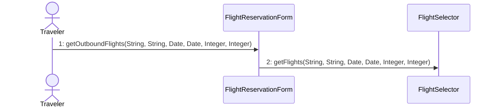

As soon as FlightReservationForm gets a list of flights from FlightSelector, it displays it on the  screen.  For  this  we  may  define  a  reflexive  operation  called  displayOutboundFlights.  The return value of this operation may be a Boolean showing whether the operation was successful.

Sometimes we need more than one controller operation to implement required functionality.  In  our  system one of the requirements says that besides an airport code, the system shall accept  a  city/state  or  city/country  pair.  To  model  this  functionality  we  can  introduce  a  class AirportController that has an operation getAirportCode (town, location). Why don't we name this class AirportCodeResolver? Because in the future we may use the same class to find adjacent airports or any other airport-related operations, so giving it a more generic class name gives us better flexibility.

If the string describing the airport in the argument to the operation getFlights is not a threedigit airport code, FlightSelector assumes that it contains a city/state or city/country pair. It also passes this argument to AirportController, which returns an airport code based on the input variables (see Figure 11.7).

### Figure 11.7: FlightSelector calls the getAirportCode operation
An additional controller class (`AirportController`) is introduced to resolve user input that may be a city name rather than a direct 3-letter airport code.
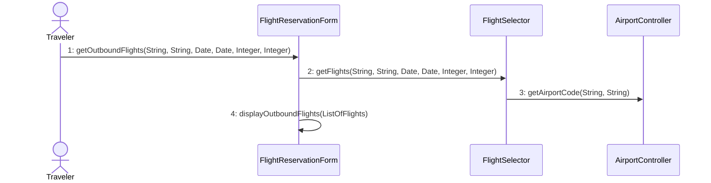

As soon as we are done modeling for steps B3 and B4, we can proceed to the next steps:

- B5. Traveler selects a flight.
- B6. System displays return flights.

The boundary class operation that supports this functionality may be called selectOutboundFlight, and the arguments can be as follows:

- flightId: ID of the selected outbound flight
- airport: Boarding airport for the return flight
- date: Date of the return flight

The return value is a collection of Flight objects.

To get a list of return flights, we may use the already-defined operation getFlights of the class FlightSelector. Because displaying return flights on the screen requires slightly different functionality than displaying outbound flights, we need to define another boundary class operation called displayReturnFlights. We can add the three new messages to the sequence diagram, as shown in Figure 11.8.

Let's consider the next two use case steps:

- B7. Traveler selects return flight.
- B8. System displays details of the flight.

The boundary class operation can be called selectReturnFlight.

Now we need a controller operation that returns flight details based on flightId:

- Name of the operation: getFlightDetails
- Argument: flightId

- Return value: Flight
- Class implementing this operation: FlightSelector

### Figure 11.8: The sequence diagram after adding the getReturnFlights message
Here, the user selects their outbound flight, prompting the system to query and display the matching return flights.
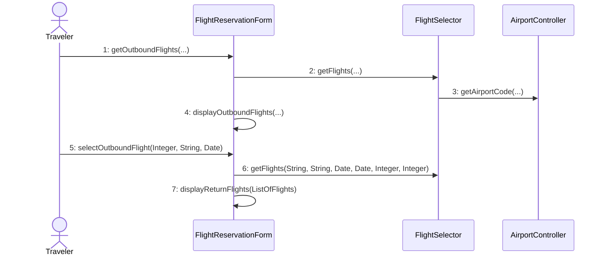

We add operation getFlightDetails to the class FlightSelector, and we add appropriate messages to the sequence diagram. Because we need the details on outbound and return flights, we will have two separate calls of this operation. The boundary class operation displaying details of both flights on the screen will be called displayFlightDetails (see Figure 11.9).

Because step B10 is not a response for step B9, we are taking only one step for the design of the next operation:

- B9. Traveler confirms the flight.

The boundary class operation is called confirmFlight, and its arguments include IDs for both flights.

So far we are getting information about available flights. Now we want to start actual booking of the flight. We can group all booking-related functionality in the separate controller class called  BookingSystem.  How  to  split  the  functionality  between  the  classes  is  a  decision  for the designer. In our case we could consider combining the functionality of FlightSelector and BookingSystem into one big class called FlightController. However, this class would be too big and would provide functionality that is too broad.

### Figure 11.9: The sequence diagram after adding flight details messages
The traveler selects a return flight, triggering two calls to `FlightSelector` to retrieve the specific details for both the outbound and return flights.
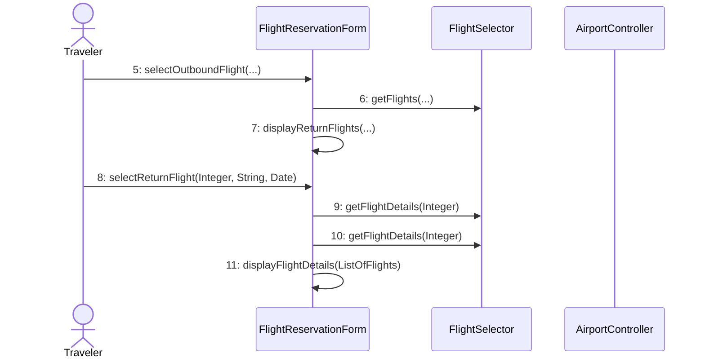

Let's  create  a  class  called  BookingSystem  and  add  an  operation  called  bookFlight  that takes as an argument two flight IDs-one for outbound flights and one for return flights. If we are booking a one-way flight, the second argument is 0. The operation returns reservationNumber as a return value. We will need this ID for future reference. Figure 11.10 shows an initial representation of this class. We will add more operations later.

### Figure 11.10: Initial design of the class BookingSystem
A dedicated controller class encapsulates the actual business logic of reserving the flights.
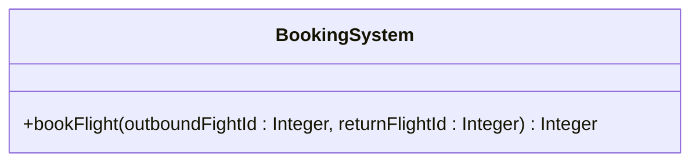

The next step is also being taken alone for the operation design:

B10. Traveler provides userid and password to proceed with buying a ticket.

It is convenient to extract all login functions to a separate object, such as LoginController (see Figure 11.11). It will contain functionality related to changing passwords, recovering forgotten  passwords,  and  so  on.  The  operation  Login  takes  userid  and  password  as  arguments.

The return value is a Boolean confirming whether the login was successful. The corresponding boundary class function may also be called login.

### Figure 11.11: Class LoginController
A dedicated controller handles authentication and account functionality.
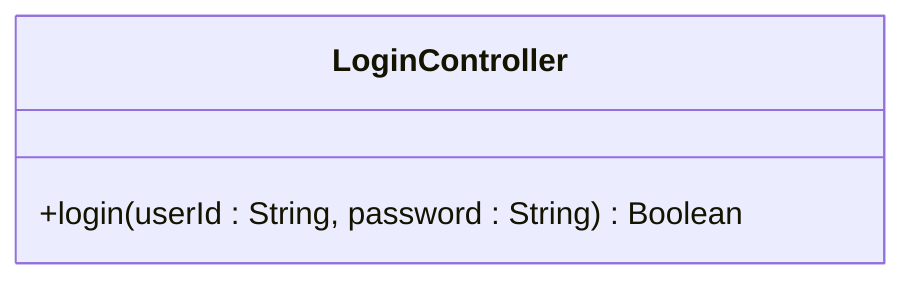

The next two scenario steps are as follows:

B11. Traveler provides passenger information.

- B12. System displays available seats.

These two steps are actually unrelated. Even though displaying seats comes as a response to providing passenger information, it is better to split this functionality into two different operations. This offers better flexibility in case we want to change the process flow in the future.

First, the boundary class invokes its operation displayPassengerDataRequest.

To accept passenger information, the boundary class as well as controller class Booking System can have an operation setPassengerData that takes a Passenger object as an argument. The Passenger object contains the following attributes:

- Passenger ID
- First name
- Last name
- Middle initial
- Date of birth
- Address

Figure 11.12 shows a UML representation of this class.

### Figure 11.12: The Passenger class
An entity class designed to encapsulate all personal data collected about the traveler.
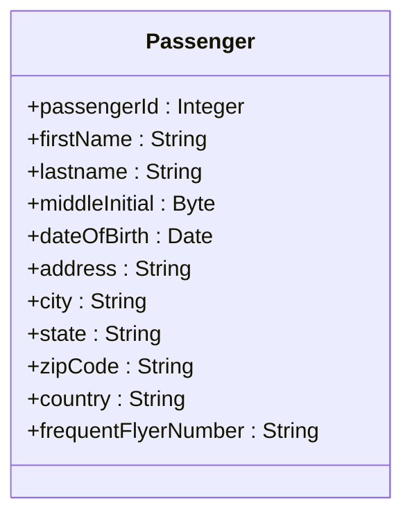

Besides the Passenger object, the operation setPassengerData should contain a second argument specifying the reservation ID so that the system assigns this data to the correct reservation.

The operation may be invoked many times, depending on how many passengers are traveling.

The boundary class operation and the corresponding controller class operation related to step B12 is getAvailableSeats. As an argument it takes a flightId and returns a list of available seat numbers. The controller operation is provided by the class Booking System. When the boundary class gets the list of seats from the controller class, it invokes an operation displayAvailableSeats.

After the Traveler gets a list of available seats, we need to design a way to notify the system which seats the Traveler selected:

B13. Traveler selects seats.

The seat selected by the Traveler is supplied to the boundary class using operation selectSeat and then is forwarded to the BookingSystem class using the operation of the same name. This operation takes three arguments: reservationNumber, passengerId, and seatNumber. The variable seatNumber has a type String instead of Integer because airplane seats are usually coded with a combination of row number and a letter representing a seat, such as 5A, 5B, 5C. The return value is not important in this case. It may return a completion code specifying whether the operation ended successfully.

The operation is called a number of times equal to the number of passengers.

Internally, reservation information may be stored in an object called Reservation. It has the following attributes:

- reservationNumber
- customerId (may be equal to user ID that makes a reservation)
- outboundFlightId
- returnFlightId

This class is associated with one or more FlightLegReservation objects that assign a specific seat number to a pair FlightLeg/Passenger, as shown in Figure 11.13.

The next two steps process payment information:

B14. Traveler provides credit card information and billing address.

B15. System provides a confirmation number.

Payments may be handled by a separate class called PaymentProcessor. This class internally uses a connection to the billing systems of major credit cards. From an interface point of

view it has a method submitPayment that contains an object Payment as an argument. This object has the following attributes:

- Credit card number
- Expiration date
- Cardholder name
- Billing address

### Figure 11.13: Class Reservation and related classes
This diagram maps the booking records. A `Reservation` tracks the overall customer's flights, which associates with `FlightLegReservation` objects to map a specific seat to a specific `Passenger`.
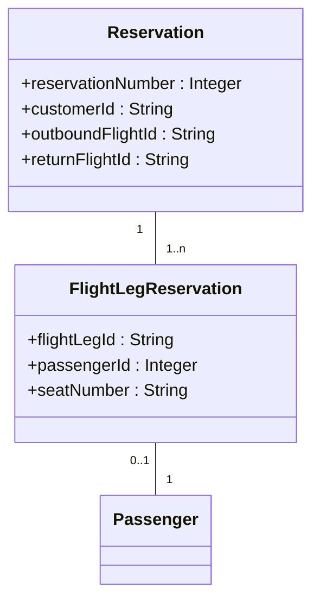

The FlightReservationForm class and the class BookingSystem also contain an operation submitPayment.  This  operation, however, has an additional argument  reservationId,  so BookingSystem knows which reservation has been paid. When BookingSystem's submitPayment  operation  is  invoked,  internally  it  calls  the  submitPayment  operation  of PaymentProcessor. It is okay for different classes to have operations with the same name. (We already had a boundary class and a controller class with the same operation name.)

After going through all the steps of the Book the flight basic flow, our class diagram may look like that shown in Figure 11.14. The second part of the sequence diagram is shown in Figure 11.15. (The first part was shown in Figure 11.9.)

The approach presented here assumes simultaneous creation of class and sequence diagrams. Some designers prefer to create collaboration diagrams first and then design details of the classes. In this case when we assign a name to a message, this message is not yet defined in the class, so we cannot just select it from the list. We need to create a placeholder for this message. To distinguish placeholders from actual messages, we can put the comment sign // before the name and write a name in free form (spaces are allowed). An example is // get outbound flights (see Figure 11.16). After we define this operation in a class, we substitute the placeholder for an actual operation. However, the advantage of first creating an actual operation on a class diagram is that we do not need to worry about future replacement.

### Figure 11.14: Comprehensive class diagram for the Book a flight basic flow
This large structural diagram brings together all the boundary, controller, and entity classes designed in the preceding steps (Note: Detailed attributes are condensed to match the figure's structural relationships).
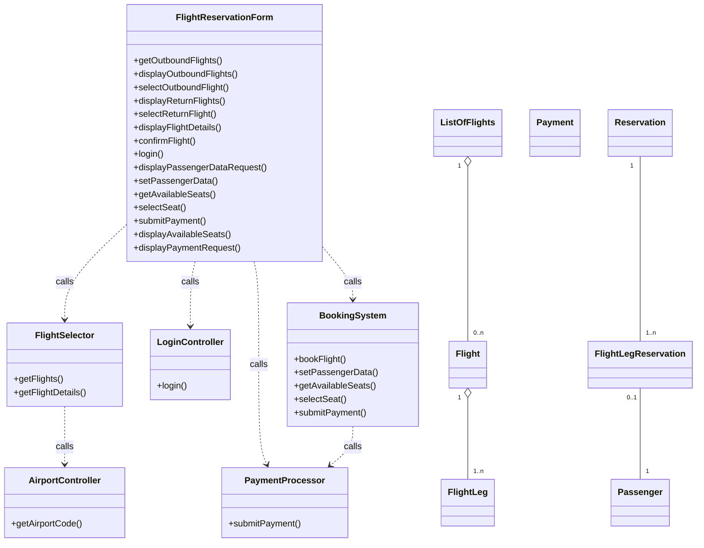

### Figure 11.15: Sequence diagram representing the basic flow of the Book a flight use case (Part 2)
This represents the second half of the sequence diagram (continuation of Figure 11.9), covering confirmation, login, passenger details, seating, and payment.
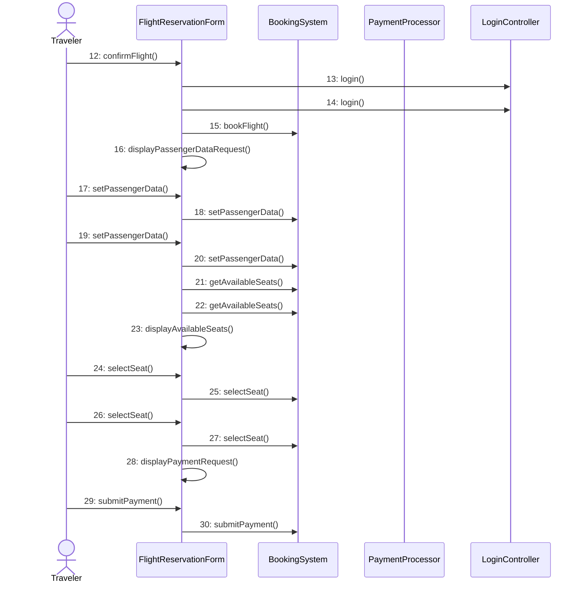

### Figure 11.16: Sequence diagram with comments instead of actual operation names
For designers who prefer to build sequence diagrams before fully defining the class operations, placeholders (using the `//` comment syntax) are used.
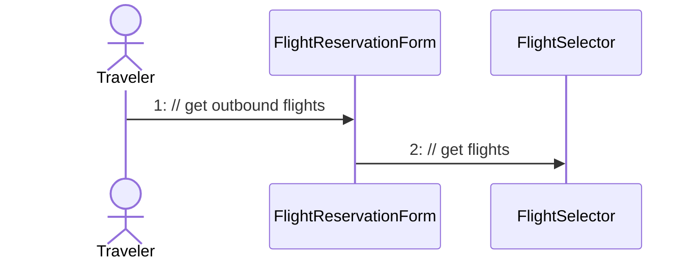