# V. XÁC ĐỊNH CÁC LỚP, XÂY DỰNG BIỂU ĐỒ LỚP

## 5.1. Xác định các lớp — Biểu đồ lớp Hệ thống HRMS

> **Phạm vi biểu đồ cập nhật:** Biểu đồ này mô tả đồng thời lớp miền nghiệp vụ (Entity), lớp biên tương tác (Boundary) và lớp điều khiển nghiệp vụ (Controller) để bảo đảm truy vết đầy đủ cho 48 Use Case, bao gồm các UC 4.43 – 4.48 mới được bổ sung.

---

**Các kiểu liệt kê (Enumeration)**

### 5.1.1. VaiTro (Vai trò) — *«enumeration»*

**Các giá trị liệt kê (literals):**

| STT | Literal | Ý nghĩa |
| --- | --- | --- |
| 1 | QUAN\_TRI\_VIEN | Quản trị viên |
| 2 | CAN\_BO\_TCCB | Cán bộ Tổ chức Cán bộ |
| 3 | CAN\_BO\_TCKT | Cán bộ Tài chính Kế toán |
| 4 | CAN\_BO\_NHAN\_SU | Cán bộ / Nhân sự |

### 5.1.2. TrangThaiTaiKhoan (Trạng thái tài khoản) — *«enumeration»*

**Các giá trị liệt kê (literals):**

| STT | Literal | Ý nghĩa |
| --- | --- | --- |
| 1 | DANG\_HOAT\_DONG | Đang hoạt động |
| 2 | BI\_KHOA | Bị khóa |

### 5.1.3. TrangThaiLamViec (Trạng thái làm việc) — *«enumeration»*

**Các giá trị liệt kê (literals):**

| STT | Literal | Ý nghĩa |
| --- | --- | --- |
| 1 | DANG\_CHO\_XET | Đang chờ xét |
| 2 | DANG\_CONG\_TAC | Đang công tác |
| 3 | DA\_THOI\_VIEC | Đã thôi việc |

### 5.1.4. TrangThaiHopDongNS (Trạng thái hợp đồng nhân sự) — *«enumeration»*

**Các giá trị liệt kê (literals):**

| STT | Literal | Ý nghĩa |
| --- | --- | --- |
| 1 | CHUA\_HOP\_DONG | Chưa có hợp đồng |
| 2 | CON\_HIEU\_LUC | Còn hiệu lực |
| 3 | HET\_HIEU\_LUC | Hết hiệu lực |
| 4 | CHO\_GIA\_HAN | Chờ gia hạn |

> **Ghi chú thiết kế – Tự động chuyển trạng thái hợp đồng:** Hệ thống sử dụng bộ hẹn giờ (System Timer / Scheduled Job) để tự động chuyển trạng thái hợp đồng nhân sự từ "Còn hiệu lực" (`CON_HIEU_LUC`) sang "Chờ gia hạn" (`CHO_GIA_HAN`) khi thời gian còn lại của hợp đồng ≤ giá trị `thoiGianChoGiaHan` được cấu hình trong loại hợp đồng tương ứng (xem UC 4.19). Quá trình này chạy định kỳ hàng ngày và không yêu cầu thao tác thủ công từ người dùng.

> **Ghi chú thiết kế – Tự động thôi việc theo hợp đồng:** Khi hợp đồng hết hiệu lực và không có gia hạn hợp lệ trong thời gian cho phép, `SystemTimer` phối hợp với xử lý nghiệp vụ hợp đồng để cập nhật `NhanSu.trangThaiHopDong`, tự động đánh dấu thôi việc theo FEAT 7.6 / UC 4.27 A1, đồng thời làm đầu vào cho cơ chế tự động khóa tài khoản theo FEAT 2.6. Các UC liên quan trực tiếp: UC 4.43, UC 4.44, UC 4.45.

### 5.1.5. LoaiDonVi (Loại đơn vị) — *«enumeration»*

**Các giá trị liệt kê (literals):**

| STT | Literal | Ý nghĩa |
| --- | --- | --- |
| 1 | HOI\_DONG | Hội đồng |
| 2 | BAN | Ban |
| 3 | KHOA | Khoa |
| 4 | PHONG | Phòng |
| 5 | BO\_MON | Bộ môn |
| 6 | PHONG\_THI\_NGHIEM | Phòng thí nghiệm |
| 7 | TRUNG\_TAM | Trung tâm |

### 5.1.6. TrangThaiDonVi (Trạng thái đơn vị) — *«enumeration»*

**Các giá trị liệt kê (literals):**

| STT | Literal | Ý nghĩa |
| --- | --- | --- |
| 1 | DANG\_HOAT\_DONG | Đang hoạt động |
| 2 | GIAI\_THE | Giải thể |
| 3 | SAP\_NHAP | Sáp nhập |

### 5.1.7. TrangThaiHopDong (Trạng thái hợp đồng) — *«enumeration»*

**Các giá trị liệt kê (literals):**

| STT | Literal | Ý nghĩa |
| --- | --- | --- |
| 1 | CHUA\_HIEU\_LUC | Chưa có hiệu lực |
| 2 | CON\_HIEU\_LUC | Còn hiệu lực |
| 3 | HET\_HIEU\_LUC | Hết hiệu lực |

> **Ghi chú thiết kế – Trạng thái hợp đồng chi tiết:** Để nhất quán giữa UC 4.22 và UC 4.44, thiết kế quy ước rằng hợp đồng có `ngayHieuLuc` lớn hơn ngày hiện tại được khởi tạo ở trạng thái `CHUA_HIEU_LUC`; khi đến ngày hiệu lực thì chuyển sang `CON_HIEU_LUC`. Trường hợp chấm dứt trước hạn theo UC 4.45 được lưu qua `BanGhiChamDutHopDong`, còn `HopDongLaoDong.trangThai` được cập nhật về `HET_HIEU_LUC`.

### 5.1.8. TrangThaiDanhMuc (Trạng thái danh mục) — *«enumeration»*

**Các giá trị liệt kê (literals):**

| STT | Literal | Ý nghĩa |
| --- | --- | --- |
| 1 | DANG\_SU\_DUNG | Đang sử dụng |
| 2 | NGUNG\_SU\_DUNG | Ngừng sử dụng |

### 5.1.9. TrangThaiKhoaDaoTao (Trạng thái khóa đào tạo) — *«enumeration»*

**Các giá trị liệt kê (literals):**

| STT | Literal | Ý nghĩa |
| --- | --- | --- |
| 1 | DANG\_MO\_DANG\_KY | Đang mở đăng ký |
| 2 | DANG\_DAO\_TAO | Đang đào tạo |
| 3 | DA\_HOAN\_THANH | Đã hoàn thành |

### 5.1.10. TrangThaiThamGia (Trạng thái tham gia) — *«enumeration»*

**Các giá trị liệt kê (literals):**

| STT | Literal | Ý nghĩa |
| --- | --- | --- |
| 1 | DA\_DANG\_KY | Đã đăng ký |
| 2 | DANG\_HOC | Đang học |
| 3 | HOAN\_THANH | Hoàn thành |
| 4 | KHONG\_DAT | Không đạt |

> **Ghi chú thiết kế – Tự động chuyển trạng thái tham gia:** Khi phòng TCCB chuyển trạng thái khóa đào tạo từ "Đang mở đăng ký" (`DANG_MO_DANG_KY`) sang "Đang đào tạo" (`DANG_DAO_TAO`) thông qua UC 4.34, hệ thống tự động batch-update tất cả bản ghi `DangKyDaoTao` có `trangThaiThamGia = DA_DANG_KY` sang `DANG_HOC`. Quá trình này đảm bảo không còn khoảng trống logic giữa trạng thái "Đã đăng ký" và "Đang học".

---

**Các lớp miền nghiệp vụ (Entity), lớp giá trị (Value Object) và lớp hỗ trợ**

### 5.1.11. TaiKhoan (Tài khoản) — *«entity»*

**Thuộc tính:**

| STT | Tên thuộc tính | Kiểu dữ liệu | Khả năng truy cập | Mô tả |
| --- | --- | --- | --- | --- |
| 1 | maCanBo | String | private | Mã cán bộ |
| 2 | email | String | private | Email nhận mật khẩu |
| 3 | matKhau | String | private | Mật khẩu (đã mã hóa) |
| 4 | vaiTro | VaiTro | private | Vai trò người dùng |
| 5 | trangThai | TrangThaiTaiKhoan | private | Trạng thái tài khoản |

**Phương thức:**

| STT | Tên phương thức | Kiểu trả về | Mô tả |
| --- | --- | --- | --- |
| 1 | dangNhap() | void | Đăng nhập hệ thống |
| 2 | dangXuat() | void | Đăng xuất hệ thống |
| 3 | doiMatKhau() | void | Đổi mật khẩu |
| 4 | khoaTaiKhoan() | void | Khóa tài khoản |
| 5 | moKhoaTaiKhoan() | void | Mở khóa tài khoản |
| 6 | phanQuyen() | void | Phân quyền tài khoản |

### 5.1.12. NhanSu (Nhân sự) — *«entity»*

**Thuộc tính:**

| STT | Tên thuộc tính | Kiểu dữ liệu | Khả năng truy cập | Mô tả |
| --- | --- | --- | --- | --- |
| 1 | maCanBo | String | private | Mã cán bộ |
| 2 | hoTen | String | private | Họ và tên |
| 3 | ngaySinh | Date | private | Ngày sinh |
| 4 | gioiTinh | String | private | Giới tính |
| 5 | soCCCD | String | private | Số CCCD/CMND |
| 6 | queQuan | String | private | Quê quán |
| 7 | diaChi | String | private | Địa chỉ |
| 8 | maSoThue | String | private | Mã số thuế |
| 9 | soBHXH | String | private | Số Bảo hiểm xã hội |
| 10 | soBHYT | String | private | Số Bảo hiểm y tế |
| 11 | email | String | private | Email |
| 12 | soDienThoai | String | private | Số điện thoại |
| 13 | anhChanDung | File | private | Ảnh chân dung |
| 14 | trinhDoVanHoa | String | private | Trình độ văn hóa |
| 15 | trinhDoDaoTao | String | private | Trình độ đào tạo |
| 16 | chucDanhNgheNghiep | String | private | Chức danh nghề nghiệp |
| 17 | chucDanhKhoaHoc | String | private | Chức danh khoa học (Học hàm) |
| 18 | laNguoiNuocNgoai | Boolean | private | Là người nước ngoài |
| 19 | trangThaiLamViec | TrangThaiLamViec | private | Trạng thái làm việc |
| 20 | trangThaiHopDong | TrangThaiHopDongNS | private | Trạng thái hợp đồng |
| 21 | ngayThoiViec | Date | private | Ngày thôi việc (nếu có) |
| 22 | lyDoThoiViec | String | private | Lý do thôi việc (nếu có) |

**Phương thức:**

| STT | Tên phương thức | Kiểu trả về | Mô tả |
| --- | --- | --- | --- |
| 1 | themMoi() | void | Thêm mới hồ sơ nhân sự |
| 2 | chinhSua() | void | Chỉnh sửa hồ sơ nhân sự |
| 3 | danhDauThoiViec() | void | Đánh dấu nhân sự đã thôi việc |
| 4 | xemChiTiet() | NhanSu | Xem chi tiết hồ sơ nhân sự |
| 5 | inHoSo() | File | In hồ sơ nhân sự |
| 6 | xuatExcel() | File | Xuất danh sách nhân sự ra Excel |

> **Ghi chú thiết kế – Hiển thị hồ sơ:** Việc ẩn/hiện mục khen thưởng/kỷ luật khi xem hồ sơ được điều khiển bởi lớp cấu hình `CauHinhHienThiHoSo` theo UC 4.48 / FEAT 7.9; `NhanSu` là đối tượng dữ liệu chịu tác động của cấu hình này ở các UC 4.28 và 4.38.

### 5.1.13. ThongTinNguoiNuocNgoai (Thông tin người nước ngoài) — *«value object»*

**Thuộc tính:**

| STT | Tên thuộc tính | Kiểu dữ liệu | Khả năng truy cập | Mô tả |
| --- | --- | --- | --- | --- |
| 1 | soVisa | String | private | Số visa |
| 2 | ngayHetHanVisa | Date | private | Ngày hết hạn visa |
| 3 | soHoChieu | String | private | Số hộ chiếu |
| 4 | ngayHetHanHoChieu | Date | private | Ngày hết hạn hộ chiếu |
| 5 | soGiayPhepLaoDong | String | private | Số giấy phép lao động |
| 6 | ngayHetHanGPLD | Date | private | Ngày hết hạn GPLD |
| 7 | fileGPLD | File | private | File giấy phép lao động |

**Phương thức:** Không có — lớp giá trị (value object) thuộc `NhanSu`.

### 5.1.14. ThongTinGiaDinh (Thông tin gia đình) — *«value object»*

**Thuộc tính:**

| STT | Tên thuộc tính | Kiểu dữ liệu | Khả năng truy cập | Mô tả |
| --- | --- | --- | --- | --- |
| 1 | moiQuanHe | String | private | Mối quan hệ |
| 2 | hoTen | String | private | Họ và tên |
| 3 | thongTinChiTiet | String | private | Thông tin chi tiết |

**Phương thức:** Không có — lớp giá trị (value object) thuộc `NhanSu`.

### 5.1.15. ThongTinNganHang (Thông tin ngân hàng) — *«value object»*

**Thuộc tính:**

| STT | Tên thuộc tính | Kiểu dữ liệu | Khả năng truy cập | Mô tả |
| --- | --- | --- | --- | --- |
| 1 | tenNganHang | String | private | Tên ngân hàng |
| 2 | soTaiKhoan | String | private | Số tài khoản |

**Phương thức:** Không có — lớp giá trị (value object) thuộc `NhanSu`.

### 5.1.16. QuaTrinhCongTac (Quá trình công tác) — *«value object»*

**Thuộc tính:**

| STT | Tên thuộc tính | Kiểu dữ liệu | Khả năng truy cập | Mô tả |
| --- | --- | --- | --- | --- |
| 1 | noiCongTac | String | private | Nơi công tác |
| 2 | thoiGianCongTac | String | private | Thời gian công tác |

**Phương thức:** Không có — lớp giá trị (value object) thuộc `NhanSu`.

### 5.1.17. ThongTinDangDoan (Thông tin Đảng / Đoàn) — *«value object»*

**Thuộc tính:**

| STT | Tên thuộc tính | Kiểu dữ liệu | Khả năng truy cập | Mô tả |
| --- | --- | --- | --- | --- |
| 1 | ngayVaoDoan | Date | private | Ngày vào Đoàn |
| 2 | ngayVaoDang | Date | private | Ngày vào Đảng |
| 3 | thongTinChiTiet | String | private | Thông tin chi tiết |

**Phương thức:** Không có — lớp giá trị (value object) thuộc `NhanSu`.

### 5.1.18. BangCap (Bằng cấp) — *«value object»*

**Thuộc tính:**

| STT | Tên thuộc tính | Kiểu dữ liệu | Khả năng truy cập | Mô tả |
| --- | --- | --- | --- | --- |
| 1 | tenBang | String | private | Tên bằng cấp |
| 2 | truong | String | private | Trường |
| 3 | nganh | String | private | Ngành |
| 4 | namTotNghiep | Int | private | Năm tốt nghiệp |
| 5 | xepLoai | String | private | Xếp loại |
| 6 | filePDF | File | private | File bằng cấp (PDF) |

**Phương thức:** Không có — lớp giá trị (value object) thuộc `NhanSu`.

### 5.1.19. ChungChi (Chứng chỉ) — *«value object»*

**Thuộc tính:**

| STT | Tên thuộc tính | Kiểu dữ liệu | Khả năng truy cập | Mô tả |
| --- | --- | --- | --- | --- |
| 1 | tenChungChi | String | private | Tên chứng chỉ |
| 2 | noiCap | String | private | Nơi cấp |
| 3 | ngayCap | Date | private | Ngày cấp |
| 4 | ngayHetHan | Date | private | Ngày hết hạn |
| 5 | filePDF | File | private | File chứng chỉ (PDF) |

**Phương thức:** Không có — lớp giá trị (value object) thuộc `NhanSu`.

### 5.1.20. DonViToChuc (Đơn vị tổ chức) — *«entity»*

**Thuộc tính:**

| STT | Tên thuộc tính | Kiểu dữ liệu | Khả năng truy cập | Mô tả |
| --- | --- | --- | --- | --- |
| 1 | maDonVi | String | private | Mã đơn vị |
| 2 | tenDonVi | String | private | Tên đơn vị |
| 3 | loaiDonVi | LoaiDonVi | private | Loại đơn vị |
| 4 | ngayThanhLap | Date | private | Ngày thành lập |
| 5 | diaChi | String | private | Địa chỉ |
| 6 | diaChiVanPhong | String | private | Địa chỉ văn phòng |
| 7 | email | String | private | Email |
| 8 | soDienThoai | String | private | Số điện thoại |
| 9 | website | String | private | Website |
| 10 | laDonViNut | Boolean | private | Là đơn vị nút (lá) |
| 11 | trangThai | TrangThaiDonVi | private | Trạng thái đơn vị |

**Phương thức:**

| STT | Tên phương thức | Kiểu trả về | Mô tả |
| --- | --- | --- | --- |
| 1 | themMoi() | void | Thêm mới đơn vị tổ chức |
| 2 | suaThongTin() | void | Sửa thông tin đơn vị |
| 3 | giaiThe() | void | Giải thể đơn vị |
| 4 | sapNhap() | void | Sáp nhập đơn vị |
| 5 | xemChiTiet() | DonViToChuc | Xem chi tiết đơn vị |

### 5.1.21. QuyetDinhDonVi (Quyết định đơn vị) — *«entity»*

**Thuộc tính:**

| STT | Tên thuộc tính | Kiểu dữ liệu | Khả năng truy cập | Mô tả |
| --- | --- | --- | --- | --- |
| 1 | ngayHieuLuc | Date | private | Ngày hiệu lực |
| 2 | soQuyetDinh | String | private | Số quyết định |
| 3 | ngayQuyetDinh | Date | private | Ngày quyết định |
| 4 | fileDinhKem | File | private | File đính kèm |
| 5 | lyDo | String | private | Lý do |
| 6 | loaiSuKien | String | private | Loại sự kiện (Giải thể/Sáp nhập) |

**Phương thức:** Không có — dữ liệu lịch sử quyết định gắn với `DonViToChuc`.

### 5.1.22. BoNhiem (Bổ nhiệm) — *«entity»*

**Thuộc tính:**

| STT | Tên thuộc tính | Kiểu dữ liệu | Khả năng truy cập | Mô tả |
| --- | --- | --- | --- | --- |
| 1 | chucVu | String | private | Chức vụ |
| 2 | ngayBatDau | Date | private | Ngày bắt đầu |

**Phương thức:**

| STT | Tên phương thức | Kiểu trả về | Mô tả |
| --- | --- | --- | --- |
| 1 | boNhiem() | void | Bổ nhiệm nhân sự vào chức vụ |
| 2 | baiNhiem() | void | Bãi nhiệm nhân sự khỏi chức vụ |

### 5.1.23. HeSoLuong (Hệ số lương) — *«entity»*

**Thuộc tính:**

| STT | Tên thuộc tính | Kiểu dữ liệu | Khả năng truy cập | Mô tả |
| --- | --- | --- | --- | --- |
| 1 | ngachVienChuc | String | private | Ngạch viên chức |
| 2 | bacLuong | Int | private | Bậc lương |
| 3 | heSoLuong | Double | private | Hệ số lương |
| 4 | trangThai | TrangThaiDanhMuc | private | Trạng thái danh mục |

**Phương thức:**

| STT | Tên phương thức | Kiểu trả về | Mô tả |
| --- | --- | --- | --- |
| 1 | themMoi() | void | Thêm mới hệ số lương |
| 2 | sua() | void | Sửa hệ số lương |
| 3 | xoa() | void | Xóa hệ số lương |
| 4 | ngungSuDung() | void | Ngừng sử dụng hệ số lương |

### 5.1.24. LoaiPhuCap (Loại phụ cấp) — *«entity»*

**Thuộc tính:**

| STT | Tên thuộc tính | Kiểu dữ liệu | Khả năng truy cập | Mô tả |
| --- | --- | --- | --- | --- |
| 1 | tenLoaiPhuCap | String | private | Tên loại phụ cấp |
| 2 | moTa | String | private | Mô tả |
| 3 | cachTinh | String | private | Cách tính phụ cấp |
| 4 | trangThai | TrangThaiDanhMuc | private | Trạng thái danh mục |

**Phương thức:**

| STT | Tên phương thức | Kiểu trả về | Mô tả |
| --- | --- | --- | --- |
| 1 | themMoi() | void | Thêm mới loại phụ cấp |
| 2 | sua() | void | Sửa loại phụ cấp |
| 3 | ngungSuDung() | void | Ngừng sử dụng loại phụ cấp |

### 5.1.25. LoaiHopDong (Loại hợp đồng) — *«entity»*

**Thuộc tính:**

| STT | Tên thuộc tính | Kiểu dữ liệu | Khả năng truy cập | Mô tả |
| --- | --- | --- | --- | --- |
| 1 | tenLoaiHopDong | String | private | Tên loại hợp đồng |
| 2 | soThangToiThieu | Int | private | Số tháng tối thiểu |
| 3 | soThangToiDa | Int | private | Số tháng tối đa |
| 4 | soLanGiaHanToiDa | Int | private | Số lần gia hạn tối đa |
| 5 | thoiGianChoGiaHan | Int | private | Thời gian chờ gia hạn (ngày) |
| 6 | trangThai | TrangThaiDanhMuc | private | Trạng thái danh mục |

**Phương thức:**

| STT | Tên phương thức | Kiểu trả về | Mô tả |
| --- | --- | --- | --- |
| 1 | themMoi() | void | Thêm mới loại hợp đồng |
| 2 | sua() | void | Sửa loại hợp đồng |
| 3 | ngungSuDung() | void | Ngừng sử dụng loại hợp đồng |

### 5.1.26. HopDongLaoDong (Hợp đồng lao động) — *«entity»*

**Thuộc tính:**

| STT | Tên thuộc tính | Kiểu dữ liệu | Khả năng truy cập | Mô tả |
| --- | --- | --- | --- | --- |
| 1 | soHopDong | String | private | Số hợp đồng |
| 2 | ngayKy | Date | private | Ngày ký hợp đồng |
| 3 | ngayHieuLuc | Date | private | Ngày hiệu lực |
| 4 | ngayHetHan | Date | private | Ngày hết hạn |
| 5 | donViCongTac | String | private | Đơn vị công tác |
| 6 | noiDung | String | private | Nội dung hợp đồng |
| 7 | filePDF | File | private | File hợp đồng (PDF) |
| 8 | trangThai | TrangThaiHopDong | private | Trạng thái hợp đồng |

**Phương thức:**

| STT | Tên phương thức | Kiểu trả về | Mô tả |
| --- | --- | --- | --- |
| 1 | taoMoi() | void | Tạo mới hợp đồng lao động |
| 2 | capNhatTrangThai() | void | Cập nhật trạng thái hợp đồng |
| 3 | xemDanhSach() | List | Xem danh sách hợp đồng |
| 4 | xemChiTiet() | HopDongLaoDong | Xem chi tiết hợp đồng |
| 5 | chinhSua() | void | Chỉnh sửa hợp đồng |
| 6 | chamDutTruocHan() | void | Chấm dứt hợp đồng trước hạn |

> **Ghi chú thiết kế – Truy vết UC hợp đồng:** Lớp `HopDongLaoDong` bao phủ các UC 4.22, 4.43, 4.44, 4.45 tương ứng với FEAT 5.1 – 5.4; việc chấm dứt trước hạn được lưu bổ sung qua lớp `BanGhiChamDutHopDong`.

### 5.1.27. PhuLucHopDong (Phụ lục hợp đồng) — *«value object»*

**Thuộc tính:**

| STT | Tên thuộc tính | Kiểu dữ liệu | Khả năng truy cập | Mô tả |
| --- | --- | --- | --- | --- |
| 1 | ngayHieuLuc | Date | private | Ngày hiệu lực |
| 2 | dieuKhoanBoSung | String | private | Điều khoản bổ sung |
| 3 | quyDinhMoi | String | private | Quy định mới |
| 4 | luuYQuanTrong | String | private | Lưu ý quan trọng |

**Phương thức:** Không có — lớp giá trị (value object) thuộc `HopDongLaoDong`.

### 5.1.28. DanhGia (Đánh giá) — *«entity» «abstract»*

**Thuộc tính:**

| STT | Tên thuộc tính | Kiểu dữ liệu | Khả năng truy cập | Mô tả |
| --- | --- | --- | --- | --- |
| 1 | ngayQuyetDinh | Date | private | Ngày quyết định |

**Phương thức:**

| STT | Tên phương thức | Kiểu trả về | Mô tả |
| --- | --- | --- | --- |
| 1 | ghiNhanDanhGia()* | void | Ghi nhận đánh giá (abstract) |
| 2 | xemLichSu() | List | Xem lịch sử đánh giá |
| 3 | timKiem() | List | Tìm kiếm đánh giá |
| 4 | loc() | List | Lọc danh sách đánh giá |

> **Ghi chú thiết kế – Truy vết UC đánh giá:** `DanhGia` là thực thể lõi cho UC 4.29, UC 4.46 và UC 4.47; các thao tác xem lịch sử, tìm kiếm và lọc được điều phối qua `DanhGiaController` và có thể trả về lớp bao `DanhSachKetQuaDanhGia`.

### 5.1.29. KhenThuong (Khen thưởng) — *«entity» kế thừa DanhGia*

**Thuộc tính:**

| STT | Tên thuộc tính | Kiểu dữ liệu | Khả năng truy cập | Mô tả |
| --- | --- | --- | --- | --- |
| 1 | loaiKhenThuong | String | private | Loại khen thưởng |
| 2 | tenKhenThuong | String | private | Tên khen thưởng |
| 3 | soQuyetDinh | String | private | Số quyết định |
| 4 | noiDung | String | private | Nội dung khen thưởng |
| 5 | soTienThuong | Double | private | Số tiền thưởng |

**Phương thức:** Kế thừa từ `DanhGia`.

### 5.1.30. KyLuat (Kỷ luật) — *«entity» kế thừa DanhGia*

**Thuộc tính:**

| STT | Tên thuộc tính | Kiểu dữ liệu | Khả năng truy cập | Mô tả |
| --- | --- | --- | --- | --- |
| 1 | loaiKyLuat | String | private | Loại kỷ luật |
| 2 | tenKyLuat | String | private | Tên kỷ luật |
| 3 | lyDo | String | private | Lý do kỷ luật |
| 4 | hinhThucXuLy | String | private | Hình thức xử lý |

**Phương thức:** Kế thừa từ `DanhGia`.

### 5.1.31. KhoaDaoTao (Khóa đào tạo) — *«entity»*

**Thuộc tính:**

| STT | Tên thuộc tính | Kiểu dữ liệu | Khả năng truy cập | Mô tả |
| --- | --- | --- | --- | --- |
| 1 | tenKhoaDaoTao | String | private | Tên khóa đào tạo |
| 2 | loaiKhoaDaoTao | String | private | Loại khóa đào tạo |
| 3 | thoiGianBatDau | Date | private | Thời gian bắt đầu |
| 4 | thoiGianKetThuc | Date | private | Thời gian kết thúc |
| 5 | diaDiem | String | private | Địa điểm |
| 6 | kinhPhi | Double | private | Kinh phí |
| 7 | camKetSauDaoTao | String | private | Cam kết sau đào tạo |
| 8 | tenChungChi | String | private | Tên chứng chỉ |
| 9 | loaiChungChi | String | private | Loại chứng chỉ |
| 10 | thoiGianMoDangKy\_Tu | Date | private | Thời gian mở đăng ký (từ) |
| 11 | thoiGianMoDangKy\_Den | Date | private | Thời gian mở đăng ký (đến) |
| 12 | gioiHanSoNguoi | Int | private | Giới hạn số người |
| 13 | trangThai | TrangThaiKhoaDaoTao | private | Trạng thái khóa đào tạo |

**Phương thức:**

| STT | Tên phương thức | Kiểu trả về | Mô tả |
| --- | --- | --- | --- |
| 1 | moKhoaDaoTao() | void | Mở khóa đào tạo mới |
| 2 | suaThongTin() | void | Sửa thông tin khóa đào tạo |
| 3 | xemChiTiet() | KhoaDaoTao | Xem chi tiết khóa đào tạo |

### 5.1.32. DangKyDaoTao (Đăng ký đào tạo) — *«entity»*

**Thuộc tính:**

| STT | Tên thuộc tính | Kiểu dữ liệu | Khả năng truy cập | Mô tả |
| --- | --- | --- | --- | --- |
| 1 | thoiDiemDangKy | Date | private | Thời điểm đăng ký |
| 2 | trangThaiThamGia | TrangThaiThamGia | private | Trạng thái tham gia |
| 3 | ngayHoanThanh | Date | private | Ngày hoàn thành |
| 4 | fileChungChi | File | private | File chứng chỉ |

**Phương thức:**

| STT | Tên phương thức | Kiểu trả về | Mô tả |
| --- | --- | --- | --- |
| 1 | dangKy() | void | Đăng ký tham gia khóa đào tạo |
| 2 | ghiNhanKetQua() | void | Ghi nhận kết quả đào tạo |

### 5.1.33. NhatKyHeThong (Nhật ký hệ thống) — *«entity»*

**Thuộc tính:**

| STT | Tên thuộc tính | Kiểu dữ liệu | Khả năng truy cập | Mô tả |
| --- | --- | --- | --- | --- |
| 1 | thoiGian | DateTime | private | Thời gian ghi nhật ký |
| 2 | taiKhoan | String | private | Tài khoản thực hiện |
| 3 | hoTen | String | private | Họ tên người thực hiện |
| 4 | vaiTro | String | private | Vai trò người thực hiện |
| 5 | loaiHanhDong | String | private | Loại hành động |
| 6 | doiTuong | String | private | Đối tượng |
| 7 | maDoiTuong | String | private | Mã đối tượng |
| 8 | moTaChiTiet | String | private | Mô tả chi tiết |
| 9 | diaChiIP | String | private | Địa chỉ IP |

**Phương thức:** Không có — lớp ghi log chỉ-đọc.

### 5.1.34. BanGhiChamDutHopDong (Bản ghi chấm dứt hợp đồng) — *«value object»*

**Thuộc tính:**

| STT | Tên thuộc tính | Kiểu dữ liệu | Khả năng truy cập | Mô tả |
| --- | --- | --- | --- | --- |
| 1 | lyDo | String | private | Lý do chấm dứt trước hạn |
| 2 | ngayHieuLuc | Date | private | Ngày chấm dứt có hiệu lực |

> **Ghi chú thiết kế:** Lớp này được thêm để lưu vết UC 4.45 / FEAT 5.4, tách riêng dữ liệu chấm dứt trước hạn khỏi bản thân hợp đồng lao động nhưng không mang vòng đời độc lập với `HopDongLaoDong`.

**Phương thức:** Không có — lớp giá trị (value object) thuộc `HopDongLaoDong`.

### 5.1.35. DanhSachKetQuaDanhGia (Danh sách kết quả đánh giá) — *«wrapper»*

**Thuộc tính:**

| STT | Tên thuộc tính | Kiểu dữ liệu | Khả năng truy cập | Mô tả |
| --- | --- | --- | --- | --- |
| 1 | tuKhoa | String | private | Từ khóa tìm kiếm hiện tại |
| 2 | tongSoBanGhi | Int | private | Tổng số bản ghi phù hợp |
| 3 | trangHienTai | Int | private | Trang hiện tại |
| 4 | kichThuocTrang | Int | private | Kích thước trang |

> **Ghi chú thiết kế:** Lớp bao kết quả được dùng cho UC 4.46 – 4.47 để gom danh sách bản ghi đánh giá và thông tin phân trang/lọc.

**Phương thức:** Không có — lớp bao (wrapper) cho kết quả tìm kiếm/lọc.

### 5.1.36. CauHinhHienThiHoSo (Cấu hình hiển thị hồ sơ) — *«configuration»*

**Thuộc tính:**

| STT | Tên thuộc tính | Kiểu dữ liệu | Khả năng truy cập | Mô tả |
| --- | --- | --- | --- | --- |
| 1 | vaiTro | VaiTro | private | Vai trò được áp dụng cấu hình |
| 2 | anKhenThuong | Boolean | private | Ẩn/hiện mục khen thưởng |
| 3 | anKyLuat | Boolean | private | Ẩn/hiện mục kỷ luật |

> **Ghi chú thiết kế:** Đây là cấu hình mức toàn hệ thống cho UC 4.48 / FEAT 7.9. Cấu hình này áp dụng khi hiển thị `NhanSu`, nhưng không làm thay đổi dữ liệu đánh giá gốc.

**Phương thức:** Không có — dữ liệu cấu hình được quản lý qua `CauHinhHoSoController`.

---

**Các lớp biên (Boundary)**

### 5.1.37. ManHinhHopDongLaoDong (Màn hình hợp đồng lao động) — *«boundary»*

**Thuộc tính:** Không có — lớp biên chỉ chứa thao tác giao diện.

**Phương thức:**

| STT | Tên phương thức | Kiểu trả về | Mô tả |
| --- | --- | --- | --- |
| 1 | chonTabHopDong() | void | Người dùng truy cập tab hợp đồng trong hồ sơ nhân sự |
| 2 | hienThiDanhSachHopDong() | void | Hiển thị danh sách hợp đồng lao động |
| 3 | hienThiChiTietHopDong() | void | Hiển thị chi tiết hợp đồng được chọn |
| 4 | moFormChinhSua() | void | Mở biểu mẫu chỉnh sửa hợp đồng chưa có hiệu lực |
| 5 | moFormChamDutTruocHan() | void | Mở biểu mẫu chấm dứt hợp đồng trước hạn |

### 5.1.38. ManHinhDanhGia (Màn hình đánh giá) — *«boundary»*

**Thuộc tính:** Không có — lớp biên chỉ chứa thao tác giao diện.

**Phương thức:**

| STT | Tên phương thức | Kiểu trả về | Mô tả |
| --- | --- | --- | --- |
| 1 | chonTabDanhGia() | void | Người dùng truy cập tab khen thưởng/kỷ luật |
| 2 | hienThiLichSuDanhGia() | void | Hiển thị lịch sử đánh giá theo thời gian |
| 3 | nhapTieuChiTimKiem() | void | Nhập từ khóa và tiêu chí tìm kiếm/lọc |
| 4 | hienThiKetQuaLoc() | void | Hiển thị danh sách kết quả phù hợp |
| 5 | hienThiChiTietDanhGia() | void | Hiển thị chi tiết bản ghi đánh giá |

### 5.1.39. ManHinhCauHinhHienThiHoSo (Màn hình cấu hình hiển thị hồ sơ) — *«boundary»*

**Thuộc tính:** Không có — lớp biên chỉ chứa thao tác giao diện.

**Phương thức:**

| STT | Tên phương thức | Kiểu trả về | Mô tả |
| --- | --- | --- | --- |
| 1 | hienThiDanhSachVaiTro() | void | Hiển thị các vai trò và trạng thái ẩn/hiện tương ứng |
| 2 | capNhatAnHien() | void | Bật/tắt hiển thị khen thưởng/kỷ luật theo vai trò |
| 3 | luuCauHinh() | void | Lưu cấu hình hiển thị hồ sơ |

---

**Các lớp điều khiển (Controller)**

### 5.1.40. HopDongController (Điều khiển hợp đồng) — *«control»*

**Thuộc tính:** Không có — lớp điều khiển chỉ chứa thao tác nghiệp vụ.

**Phương thức:**

| STT | Tên phương thức | Kiểu trả về | Mô tả |
| --- | --- | --- | --- |
| 1 | xemDanhSachHopDong() | List | Điều phối lấy danh sách hợp đồng của nhân sự |
| 2 | xemChiTietHopDong() | HopDongLaoDong | Điều phối lấy chi tiết hợp đồng |
| 3 | chinhSuaHopDongChuaHieuLuc() | void | Xử lý chỉnh sửa hợp đồng chưa có hiệu lực |
| 4 | chamDutHopDongTruocHan() | void | Xử lý chấm dứt hợp đồng trước hạn |
| 5 | dongBoTrangThaiNhanSu() | void | Đồng bộ trạng thái hợp đồng/thôi việc của nhân sự |

### 5.1.41. DanhGiaController (Điều khiển đánh giá) — *«control»*

**Thuộc tính:** Không có — lớp điều khiển chỉ chứa thao tác nghiệp vụ.

**Phương thức:**

| STT | Tên phương thức | Kiểu trả về | Mô tả |
| --- | --- | --- | --- |
| 1 | xemLichSuDanhGia() | List | Điều phối xem lịch sử đánh giá của nhân sự |
| 2 | timKiemDanhGia() | DanhSachKetQuaDanhGia | Điều phối tìm kiếm đánh giá |
| 3 | locDanhGia() | DanhSachKetQuaDanhGia | Điều phối lọc danh sách đánh giá |
| 4 | taiChiTietDanhGia() | DanhGia | Lấy chi tiết bản ghi đánh giá |

### 5.1.42. CauHinhHoSoController (Điều khiển cấu hình hồ sơ) — *«control»*

**Thuộc tính:** Không có — lớp điều khiển chỉ chứa thao tác nghiệp vụ.

**Phương thức:**

| STT | Tên phương thức | Kiểu trả về | Mô tả |
| --- | --- | --- | --- |
| 1 | taiCauHinhHienThi() | CauHinhHienThiHoSo | Tải cấu hình hiển thị hồ sơ hiện hành |
| 2 | luuCauHinhHienThi() | void | Lưu cấu hình ẩn/hiện khen thưởng/kỷ luật |
| 3 | apDungCauHinhAnHien() | void | Áp dụng cấu hình khi hiển thị hồ sơ nhân sự |

### 5.1.43. TaiKhoanController (Điều khiển tài khoản) — *«control»*

**Thuộc tính:** Không có — lớp điều khiển chỉ chứa thao tác nghiệp vụ.

**Phương thức:**

| STT | Tên phương thức | Kiểu trả về | Mô tả |
| --- | --- | --- | --- |
| 1 | khoaTaiKhoanTheoTrangThaiNhanSu() | void | Khóa tài khoản khi nhân sự đã thôi việc |
| 2 | dongBoTrangThaiTaiKhoan() | void | Đồng bộ trạng thái tài khoản với hồ sơ nhân sự |

### 5.1.44. SystemTimer (Bộ hẹn giờ hệ thống) — *«control»*

**Thuộc tính:** Không có — lớp điều khiển tự động chạy định kỳ.

**Phương thức:**

| STT | Tên phương thức | Kiểu trả về | Mô tả |
| --- | --- | --- | --- |
| 1 | kiemTraHopDongSapHetHan() | void | Kiểm tra và chuyển hợp đồng sang trạng thái chờ gia hạn |
| 2 | kiemTraHopDongHetHan() | void | Kiểm tra hợp đồng hết hiệu lực và kích hoạt xử lý tiếp theo |
| 3 | tuDongDanhDauThoiViec() | void | Tự động đánh dấu thôi việc theo FEAT 7.6 |
| 4 | tuDongKhoaTaiKhoan() | void | Tự động khóa tài khoản theo FEAT 2.6 |

---

**Quan hệ giữa các lớp**

> **Ghi chú ký pháp:** Các quan hệ `«dependency»` bên dưới dùng để mô tả sự phụ thuộc sử dụng giữa Boundary/Controller và các lớp miền trong thiết kế BCE; chúng không biểu diễn quan hệ cấu trúc bền vững như association/composition của miền nghiệp vụ.

| STT | Lớp nguồn | Quan hệ | Lớp đích | Mô tả |
| --- | --- | --- | --- | --- |
| 1 | TaiKhoan | 0..1 → 1 | NhanSu | Mỗi tài khoản liên kết đúng một nhân sự; mỗi nhân sự có tối đa một tài khoản |
| 2 | NhanSu | 1 ◆ 0..1 | ThongTinNguoiNuocNgoai | Nhân sự có tối đa một thông tin người nước ngoài |
| 3 | NhanSu | 1 ◆ 0..\* | ThongTinGiaDinh | Nhân sự có nhiều thông tin gia đình |
| 4 | NhanSu | 1 ◆ 1 | ThongTinNganHang | Nhân sự có một thông tin ngân hàng |
| 5 | NhanSu | 1 ◆ 0..\* | QuaTrinhCongTac | Nhân sự có nhiều quá trình công tác |
| 6 | NhanSu | 1 ◆ 0..1 | ThongTinDangDoan | Nhân sự có tối đa một thông tin Đảng/Đoàn |
| 7 | NhanSu | 1 ◆ 0..\* | BangCap | Nhân sự có nhiều bằng cấp |
| 8 | NhanSu | 1 ◆ 0..\* | ChungChi | Nhân sự có nhiều chứng chỉ |
| 9 | NhanSu | 0..\* → 0..1 | HeSoLuong | Nhân sự áp dụng một hệ số lương |
| 10 | NhanSu | 0..\* → 0..\* | LoaiPhuCap | Nhân sự hưởng nhiều loại phụ cấp |
| 11 | NhanSu | 1 ◆ 0..\* | HopDongLaoDong | Nhân sự ký nhiều hợp đồng |
| 12 | HopDongLaoDong | 0..\* → 1 | LoaiHopDong | Hợp đồng thuộc một loại hợp đồng |
| 13 | HopDongLaoDong | 1 ◆ 0..\* | PhuLucHopDong | Hợp đồng có thể có nhiều phụ lục |
| 14 | DanhGia | ◁— | KhenThuong | KhenThuong kế thừa DanhGia |
| 15 | DanhGia | ◁— | KyLuat | KyLuat kế thừa DanhGia |
| 16 | NhanSu | 1 ◆ 0..\* | DanhGia | Nhân sự nhận nhiều đánh giá |
| 17 | DonViToChuc | 0..1 ◇ 0..\* | DonViToChuc | Đơn vị cha chứa nhiều đơn vị con |
| 18 | DonViToChuc | 1 ◆ 0..\* | QuyetDinhDonVi | Đơn vị có nhiều quyết định |
| 19 | BoNhiem | 0..\* → 1 | NhanSu | Bổ nhiệm cho nhân sự |
| 20 | BoNhiem | 0..\* → 1 | DonViToChuc | Bổ nhiệm tại đơn vị |
| 21 | DangKyDaoTao | 0..\* → 1 | NhanSu | Người đăng ký đào tạo |
| 22 | DangKyDaoTao | 0..\* → 1 | KhoaDaoTao | Đăng ký khóa đào tạo |
| 23 | TaiKhoan | 1 → 0..\* | NhatKyHeThong | Tài khoản tạo nhiều nhật ký |
| 24 | HopDongLaoDong | 1 ◆ 0..1 | BanGhiChamDutHopDong | Hợp đồng có tối đa một bản ghi chấm dứt trước hạn |
| 25 | DanhSachKetQuaDanhGia | 1 ◇ 0..\* | DanhGia | Lớp bao kết quả tạm thời gom nhiều bản ghi đánh giá trả về từ tìm kiếm/lọc |
| 26 | ManHinhHopDongLaoDong | «dependency» | HopDongController | Màn hình hợp đồng gọi controller nghiệp vụ hợp đồng |
| 27 | HopDongController | «dependency» | HopDongLaoDong | Controller truy vấn/cập nhật hợp đồng |
| 28 | HopDongController | «dependency» | BanGhiChamDutHopDong | Controller ghi nhận dữ liệu chấm dứt trước hạn |
| 29 | HopDongController | «dependency» | NhanSu | Controller đồng bộ trạng thái hợp đồng và trạng thái thôi việc |
| 30 | ManHinhDanhGia | «dependency» | DanhGiaController | Màn hình đánh giá gọi controller nghiệp vụ đánh giá |
| 31 | DanhGiaController | «dependency» | DanhGia | Controller truy vấn dữ liệu đánh giá |
| 32 | DanhGiaController | «dependency» | DanhSachKetQuaDanhGia | Controller tạo/tải lớp bao kết quả đánh giá |
| 33 | ManHinhCauHinhHienThiHoSo | «dependency» | CauHinhHoSoController | Màn hình cấu hình gọi controller cấu hình hồ sơ |
| 34 | CauHinhHoSoController | «dependency» | CauHinhHienThiHoSo | Controller quản lý cấu hình ẩn/hiện hồ sơ |
| 35 | CauHinhHoSoController | «dependency» | NhanSu | Controller đọc dữ liệu nhân sự khi áp dụng cấu hình hiển thị |
| 36 | SystemTimer | «dependency» | HopDongController | Bộ hẹn giờ điều phối tự động xử lý hợp đồng |
| 37 | SystemTimer | «dependency» | TaiKhoanController | Bộ hẹn giờ điều phối tự động khóa tài khoản |
| 38 | TaiKhoanController | «dependency» | TaiKhoan | Controller khóa/mở và đồng bộ trạng thái tài khoản |
| 39 | TaiKhoanController | «dependency» | NhanSu | Controller đọc trạng thái thôi việc của nhân sự |

## 5.2. Xây dựng biểu đồ lớp

```mermaid
classDiagram
    direction TB

    %% ===== ENUMERATIONS =====

    class VaiTro {
        <<enumeration>>
        QUAN_TRI_VIEN
        CAN_BO_TCCB
        CAN_BO_TCKT
        CAN_BO_NHAN_SU
    }

    class TrangThaiTaiKhoan {
        <<enumeration>>
        DANG_HOAT_DONG
        BI_KHOA
    }

    class TrangThaiLamViec {
        <<enumeration>>
        DANG_CHO_XET
        DANG_CONG_TAC
        DA_THOI_VIEC
    }

    class TrangThaiHopDongNS {
        <<enumeration>>
        CHUA_HOP_DONG
        CON_HIEU_LUC
        HET_HIEU_LUC
        CHO_GIA_HAN
    }

    class LoaiDonVi {
        <<enumeration>>
        HOI_DONG
        BAN
        KHOA
        PHONG
        BO_MON
        PHONG_THI_NGHIEM
        TRUNG_TAM
    }

    class TrangThaiDonVi {
        <<enumeration>>
        DANG_HOAT_DONG
        GIAI_THE
        SAP_NHAP
    }

    class TrangThaiHopDong {
        <<enumeration>>
        CHUA_HIEU_LUC
        CON_HIEU_LUC
        HET_HIEU_LUC
    }

    class TrangThaiDanhMuc {
        <<enumeration>>
        DANG_SU_DUNG
        NGUNG_SU_DUNG
    }

    class TrangThaiKhoaDaoTao {
        <<enumeration>>
        DANG_MO_DANG_KY
        DANG_DAO_TAO
        DA_HOAN_THANH
    }

    class TrangThaiThamGia {
        <<enumeration>>
        DA_DANG_KY
        DANG_HOC
        HOAN_THANH
        KHONG_DAT
    }

    %% ===== CORE ENTITIES =====

    class TaiKhoan {
        -String maCanBo
        -String email
        -String matKhau
        -VaiTro vaiTro
        -TrangThaiTaiKhoan trangThai
        +dangNhap()
        +dangXuat()
        +doiMatKhau()
        +khoaTaiKhoan()
        +moKhoaTaiKhoan()
        +phanQuyen()
    }

    class NhanSu {
        -String maCanBo
        -String hoTen
        -Date ngaySinh
        -String gioiTinh
        -String soCCCD
        -String queQuan
        -String diaChi
        -String maSoThue
        -String soBHXH
        -String soBHYT
        -String email
        -String soDienThoai
        -File anhChanDung
        -String trinhDoVanHoa
        -String trinhDoDaoTao
        -String chucDanhNgheNghiep
        -String chucDanhKhoaHoc
        -Boolean laNguoiNuocNgoai
        -TrangThaiLamViec trangThaiLamViec
        -TrangThaiHopDongNS trangThaiHopDong
        -Date ngayThoiViec
        -String lyDoThoiViec
        +themMoi()
        +chinhSua()
        +danhDauThoiViec()
        +xemChiTiet()
        +inHoSo()
        +xuatExcel()
    }

    class ThongTinNguoiNuocNgoai {
        <<value object>>
        -String soVisa
        -Date ngayHetHanVisa
        -String soHoChieu
        -Date ngayHetHanHoChieu
        -String soGiayPhepLaoDong
        -Date ngayHetHanGPLD
        -File fileGPLD
    }

    class ThongTinGiaDinh {
        <<value object>>
        -String moiQuanHe
        -String hoTen
        -String thongTinChiTiet
    }

    class ThongTinNganHang {
        <<value object>>
        -String tenNganHang
        -String soTaiKhoan
    }

    class QuaTrinhCongTac {
        <<value object>>
        -String noiCongTac
        -String thoiGianCongTac
    }

    class ThongTinDangDoan {
        <<value object>>
        -Date ngayVaoDoan
        -Date ngayVaoDang
        -String thongTinChiTiet
    }

    class BangCap {
        <<value object>>
        -String tenBang
        -String truong
        -String nganh
        -Int namTotNghiep
        -String xepLoai
        -File filePDF
    }

    class ChungChi {
        <<value object>>
        -String tenChungChi
        -String noiCap
        -Date ngayCap
        -Date ngayHetHan
        -File filePDF
    }

    %% ===== ORGANIZATIONAL STRUCTURE =====

    class DonViToChuc {
        -String maDonVi
        -String tenDonVi
        -LoaiDonVi loaiDonVi
        -Date ngayThanhLap
        -String diaChi
        -String diaChiVanPhong
        -String email
        -String soDienThoai
        -String website
        -Boolean laDonViNut
        -TrangThaiDonVi trangThai
        +themMoi()
        +suaThongTin()
        +giaiThe()
        +sapNhap()
        +xemChiTiet()
    }

    class QuyetDinhDonVi {
        -Date ngayHieuLuc
        -String soQuyetDinh
        -Date ngayQuyetDinh
        -File fileDinhKem
        -String lyDo
        -String loaiSuKien
    }

    class BoNhiem {
        -String chucVu
        -Date ngayBatDau
        +boNhiem()
        +baiNhiem()
    }

    %% ===== SALARY & ALLOWANCE =====

    class HeSoLuong {
        -String ngachVienChuc
        -Int bacLuong
        -Double heSoLuong
        -TrangThaiDanhMuc trangThai
        +themMoi()
        +sua()
        +xoa()
        +ngungSuDung()
    }

    class LoaiPhuCap {
        -String tenLoaiPhuCap
        -String moTa
        -String cachTinh
        -TrangThaiDanhMuc trangThai
        +themMoi()
        +sua()
        +ngungSuDung()
    }

    %% ===== CONTRACT =====

    class LoaiHopDong {
        -String tenLoaiHopDong
        -Int soThangToiThieu
        -Int soThangToiDa
        -Int soLanGiaHanToiDa
        -Int thoiGianChoGiaHan
        -TrangThaiDanhMuc trangThai
        +themMoi()
        +sua()
        +ngungSuDung()
    }

    class HopDongLaoDong {
        -String soHopDong
        -Date ngayKy
        -Date ngayHieuLuc
        -Date ngayHetHan
        -String donViCongTac
        -String noiDung
        -File filePDF
        -TrangThaiHopDong trangThai
        +taoMoi()
        +capNhatTrangThai()
        +xemDanhSach()
        +xemChiTiet()
        +chinhSua()
        +chamDutTruocHan()
    }

    class PhuLucHopDong {
        <<value object>>
        -Date ngayHieuLuc
        -String dieuKhoanBoSung
        -String quyDinhMoi
        -String luuYQuanTrong
    }

    class BanGhiChamDutHopDong {
        <<value object>>
        -String lyDo
        -Date ngayHieuLuc
    }

    %% ===== EVALUATION =====

    class DanhGia {
        <<abstract>>
        -Date ngayQuyetDinh
        +ghiNhanDanhGia()*
        +xemLichSu()
        +timKiem()
        +loc()
    }

    class KhenThuong {
        -String loaiKhenThuong
        -String tenKhenThuong
        -String soQuyetDinh
        -String noiDung
        -Double soTienThuong
    }

    class KyLuat {
        -String loaiKyLuat
        -String tenKyLuat
        -String lyDo
        -String hinhThucXuLy
    }

    class DanhSachKetQuaDanhGia {
        <<wrapper>>
        -String tuKhoa
        -Int tongSoBanGhi
        -Int trangHienTai
        -Int kichThuocTrang
    }

    class CauHinhHienThiHoSo {
        <<configuration>>
        -VaiTro vaiTro
        -Boolean anKhenThuong
        -Boolean anKyLuat
    }

    %% ===== BOUNDARY / CONTROLLER =====

    class ManHinhHopDongLaoDong {
        <<boundary>>
        +chonTabHopDong()
        +hienThiDanhSachHopDong()
        +hienThiChiTietHopDong()
        +moFormChinhSua()
        +moFormChamDutTruocHan()
    }

    class ManHinhDanhGia {
        <<boundary>>
        +chonTabDanhGia()
        +hienThiLichSuDanhGia()
        +nhapTieuChiTimKiem()
        +hienThiKetQuaLoc()
        +hienThiChiTietDanhGia()
    }

    class ManHinhCauHinhHienThiHoSo {
        <<boundary>>
        +hienThiDanhSachVaiTro()
        +capNhatAnHien()
        +luuCauHinh()
    }

    class HopDongController {
        <<control>>
        +xemDanhSachHopDong()
        +xemChiTietHopDong()
        +chinhSuaHopDongChuaHieuLuc()
        +chamDutHopDongTruocHan()
        +dongBoTrangThaiNhanSu()
    }

    class DanhGiaController {
        <<control>>
        +xemLichSuDanhGia()
        +timKiemDanhGia()
        +locDanhGia()
        +taiChiTietDanhGia()
    }

    class CauHinhHoSoController {
        <<control>>
        +taiCauHinhHienThi()
        +luuCauHinhHienThi()
        +apDungCauHinhAnHien()
    }

    class TaiKhoanController {
        <<control>>
        +khoaTaiKhoanTheoTrangThaiNhanSu()
        +dongBoTrangThaiTaiKhoan()
    }

    class SystemTimer {
        <<control>>
        +kiemTraHopDongSapHetHan()
        +kiemTraHopDongHetHan()
        +tuDongDanhDauThoiViec()
        +tuDongKhoaTaiKhoan()
    }

    %% ===== TRAINING =====

    class KhoaDaoTao {
        -String tenKhoaDaoTao
        -String loaiKhoaDaoTao
        -Date thoiGianBatDau
        -Date thoiGianKetThuc
        -String diaDiem
        -Double kinhPhi
        -String camKetSauDaoTao
        -String tenChungChi
        -String loaiChungChi
        -Date thoiGianMoDangKy_Tu
        -Date thoiGianMoDangKy_Den
        -Int gioiHanSoNguoi
        -TrangThaiKhoaDaoTao trangThai
        +moKhoaDaoTao()
        +suaThongTin()
        +xemChiTiet()
    }

    class DangKyDaoTao {
        -Date thoiDiemDangKy
        -TrangThaiThamGia trangThaiThamGia
        -Date ngayHoanThanh
        -File fileChungChi
        +dangKy()
        +ghiNhanKetQua()
    }

    %% ===== AUDIT =====

    class NhatKyHeThong {
        -DateTime thoiGian
        -String taiKhoan
        -String hoTen
        -String vaiTro
        -String loaiHanhDong
        -String doiTuong
        -String maDoiTuong
        -String moTaChiTiet
        -String diaChiIP
    }

    %% ========================================
    %% RELATIONSHIPS
    %% ========================================

    %% --- Account & Personnel ---
    TaiKhoan "0..1" --> "1" NhanSu : lienKetVoi

    %% --- Personnel Compositions (value objects owned by NhanSu) ---
    NhanSu "1" *-- "0..1" ThongTinNguoiNuocNgoai : co
    NhanSu "1" *-- "0..*" ThongTinGiaDinh : co
    NhanSu "1" *-- "1" ThongTinNganHang : co
    NhanSu "1" *-- "0..*" QuaTrinhCongTac : co
    NhanSu "1" *-- "0..1" ThongTinDangDoan : co
    NhanSu "1" *-- "0..*" BangCap : co
    NhanSu "1" *-- "0..*" ChungChi : co

    %% --- Salary & Allowance ---
    NhanSu "0..*" --> "0..1" HeSoLuong : apDung
    NhanSu "0..*" --> "0..*" LoaiPhuCap : huong

    %% --- Contract ---
    NhanSu "1" *-- "0..*" HopDongLaoDong : ky
    HopDongLaoDong "0..*" --> "1" LoaiHopDong : thuocLoai
    HopDongLaoDong "1" *-- "0..*" PhuLucHopDong : boSung
    HopDongLaoDong "1" *-- "0..1" BanGhiChamDutHopDong : chamDutBang

    %% --- Evaluation (Inheritance) ---
    DanhGia <|-- KhenThuong
    DanhGia <|-- KyLuat
    NhanSu "1" *-- "0..*" DanhGia : nhanDuoc
    DanhSachKetQuaDanhGia "1" o-- "0..*" DanhGia : baoGom

    %% --- Organization ---
    DonViToChuc "0..1" o-- "0..*" DonViToChuc : donViCha
    DonViToChuc "1" *-- "0..*" QuyetDinhDonVi : co

    %% --- Appointment (Association Class) ---
    BoNhiem "0..*" --> "1" NhanSu : boNhiemCho
    BoNhiem "0..*" --> "1" DonViToChuc : taiDonVi

    %% --- Training (Association Class) ---
    DangKyDaoTao "0..*" --> "1" NhanSu : nguoiDangKy
    DangKyDaoTao "0..*" --> "1" KhoaDaoTao : khoaHoc

    %% --- Audit Log ---
    TaiKhoan "1" --> "0..*" NhatKyHeThong : taoRa

    %% --- Boundary / Controller ---
    ManHinhHopDongLaoDong ..> HopDongController : goi
    HopDongController ..> HopDongLaoDong : xuLy
    HopDongController ..> BanGhiChamDutHopDong : ghiNhan
    HopDongController ..> NhanSu : dongBoTrangThai

    ManHinhDanhGia ..> DanhGiaController : goi
    DanhGiaController ..> DanhGia : truyVan
    DanhGiaController ..> DanhSachKetQuaDanhGia : taoKetQua

    ManHinhCauHinhHienThiHoSo ..> CauHinhHoSoController : goi
    CauHinhHoSoController ..> CauHinhHienThiHoSo : quanLy
    CauHinhHoSoController ..> NhanSu : docDuLieuHienThi

    %% --- Automation ---
    SystemTimer ..> HopDongController : kichHoatFEAT76
    SystemTimer ..> TaiKhoanController : kichHoatFEAT26
    TaiKhoanController ..> TaiKhoan : dongBoKhoa
    TaiKhoanController ..> NhanSu : docTrangThaiThoiViec

    note for SystemTimer "Chạy định kỳ để hỗ trợ FEAT 7.6 (tự động thôi việc) và FEAT 2.6 (tự động khóa tài khoản)."
```

