# V. XÁC ĐỊNH CÁC LỚP, XÂY DỰNG BIỂU ĐỒ LỚP

## 5.1. Xác định các lớp — Biểu đồ lớp Hệ thống HRMS

**Các lớp liệt kê (Enumeration)**

### 5.1.1. VaiTro (Vai trò)

| STT | Tên thuộc tính | Kiểu dữ liệu | Mô tả |
| --- | --- | --- | --- |
| 1 | QUAN\_TRI\_VIEN | enum | Quản trị viên |
| 2 | CAN\_BO\_TCCB | enum | Cán bộ Tổ chức Cán bộ |
| 3 | CAN\_BO\_TCKT | enum | Cán bộ Tài chính Kế toán |
| 4 | CAN\_BO\_NHAN\_SU | enum | Cán bộ / Nhân sự |

### 5.1.2. TrangThaiTaiKhoan (Trạng thái tài khoản)

| STT | Tên thuộc tính | Kiểu dữ liệu | Mô tả |
| --- | --- | --- | --- |
| 1 | DANG\_HOAT\_DONG | enum | Đang hoạt động |
| 2 | BI\_KHOA | enum | Bị khóa |

### 5.1.3. TrangThaiLamViec (Trạng thái làm việc)

| STT | Tên thuộc tính | Kiểu dữ liệu | Mô tả |
| --- | --- | --- | --- |
| 1 | DANG\_CHO\_XET | enum | Đang chờ xét |
| 2 | DANG\_CONG\_TAC | enum | Đang công tác |
| 3 | DA\_THOI\_VIEC | enum | Đã thôi việc |

### 5.1.4. TrangThaiHopDongNS (Trạng thái hợp đồng nhân sự)

| STT | Tên thuộc tính | Kiểu dữ liệu | Mô tả |
| --- | --- | --- | --- |
| 1 | CHUA\_HOP\_DONG | enum | Chưa có hợp đồng |
| 2 | CON\_HIEU\_LUC | enum | Còn hiệu lực |
| 3 | HET\_HIEU\_LUC | enum | Hết hiệu lực |
| 4 | CHO\_GIA\_HAN | enum | Chờ gia hạn |

> **Ghi chú thiết kế – Tự động chuyển trạng thái hợp đồng:** Hệ thống sử dụng bộ hẹn giờ (System Timer / Scheduled Job) để tự động chuyển trạng thái hợp đồng nhân sự từ "Còn hiệu lực" (`CON_HIEU_LUC`) sang "Chờ gia hạn" (`CHO_GIA_HAN`) khi thời gian còn lại của hợp đồng ≤ giá trị `thoiGianChoGiaHan` được cấu hình trong loại hợp đồng tương ứng (xem UC 4.19). Quá trình này chạy định kỳ hàng ngày và không yêu cầu thao tác thủ công từ người dùng.

### 5.1.5. LoaiDonVi (Loại đơn vị)

| STT | Tên thuộc tính | Kiểu dữ liệu | Mô tả |
| --- | --- | --- | --- |
| 1 | HOI\_DONG | enum | Hội đồng |
| 2 | BAN | enum | Ban |
| 3 | KHOA | enum | Khoa |
| 4 | PHONG | enum | Phòng |
| 5 | BO\_MON | enum | Bộ môn |
| 6 | PHONG\_THI\_NGHIEM | enum | Phòng thí nghiệm |
| 7 | TRUNG\_TAM | enum | Trung tâm |

### 5.1.6. TrangThaiDonVi (Trạng thái đơn vị)

| STT | Tên thuộc tính | Kiểu dữ liệu | Mô tả |
| --- | --- | --- | --- |
| 1 | DANG\_HOAT\_DONG | enum | Đang hoạt động |
| 2 | GIAI\_THE | enum | Giải thể |
| 3 | SAP\_NHAP | enum | Sáp nhập |

### 5.1.7. TrangThaiHopDong (Trạng thái hợp đồng)

| STT | Tên thuộc tính | Kiểu dữ liệu | Mô tả |
| --- | --- | --- | --- |
| 1 | CON\_HIEU\_LUC | enum | Còn hiệu lực |
| 2 | HET\_HIEU\_LUC | enum | Hết hiệu lực |

### 5.1.8. TrangThaiDanhMuc (Trạng thái danh mục)

| STT | Tên thuộc tính | Kiểu dữ liệu | Mô tả |
| --- | --- | --- | --- |
| 1 | DANG\_SU\_DUNG | enum | Đang sử dụng |
| 2 | NGUNG\_SU\_DUNG | enum | Ngừng sử dụng |

### 5.1.9. TrangThaiKhoaDaoTao (Trạng thái khóa đào tạo)

| STT | Tên thuộc tính | Kiểu dữ liệu | Mô tả |
| --- | --- | --- | --- |
| 1 | DANG\_MO\_DANG\_KY | enum | Đang mở đăng ký |
| 2 | DANG\_DAO\_TAO | enum | Đang đào tạo |
| 3 | DA\_HOAN\_THANH | enum | Đã hoàn thành |

### 5.1.10. TrangThaiThamGia (Trạng thái tham gia)

| STT | Tên thuộc tính | Kiểu dữ liệu | Mô tả |
| --- | --- | --- | --- |
| 1 | DA\_DANG\_KY | enum | Đã đăng ký |
| 2 | DANG\_HOC | enum | Đang học |
| 3 | HOAN\_THANH | enum | Hoàn thành |
| 4 | KHONG\_DAT | enum | Không đạt |

> **Ghi chú thiết kế – Tự động chuyển trạng thái tham gia:** Khi phòng TCCB chuyển trạng thái khóa đào tạo từ "Đang mở đăng ký" (`DANG_MO_DANG_KY`) sang "Đang đào tạo" (`DANG_DAO_TAO`) thông qua UC 4.34, hệ thống tự động batch-update tất cả bản ghi `DangKyDaoTao` có `trangThaiThamGia = DA_DANG_KY` sang `DANG_HOC`. Quá trình này đảm bảo không còn khoảng trống logic giữa trạng thái "Đã đăng ký" và "Đang học".

**Các lớp thực thể (Entity)**

### 5.1.11. TaiKhoan (Tài khoản)

| STT | Tên thuộc tính | Kiểu dữ liệu | Mô tả |
| --- | --- | --- | --- |
| 1 | maCanBo | String | Mã cán bộ |
| 2 | email | String | Email nhận mật khẩu |
| 3 | matKhau | String | Mật khẩu (đã mã hóa) |
| 4 | vaiTro | VaiTro | Vai trò người dùng |
| 5 | trangThai | TrangThaiTaiKhoan | Trạng thái tài khoản |

### 5.1.12. NhanSu (Nhân sự)

| STT | Tên thuộc tính | Kiểu dữ liệu | Mô tả |
| --- | --- | --- | --- |
| 1 | maCanBo | String | Mã cán bộ |
| 2 | hoTen | String | Họ và tên |
| 3 | ngaySinh | Date | Ngày sinh |
| 4 | gioiTinh | String | Giới tính |
| 5 | soCCCD | String | Số CCCD/CMND |
| 6 | queQuan | String | Quê quán |
| 7 | diaChi | String | Địa chỉ |
| 8 | maSoThue | String | Mã số thuế |
| 9 | soBHXH | String | Số Bảo hiểm xã hội |
| 10 | soBHYT | String | Số Bảo hiểm y tế |
| 11 | email | String | Email |
| 12 | soDienThoai | String | Số điện thoại |
| 13 | anhChanDung | File | Ảnh chân dung |
| 14 | trinhDoVanHoa | String | Trình độ văn hóa |
| 15 | trinhDoDaoTao | String | Trình độ đào tạo |
| 16 | chucDanhNgheNghiep | String | Chức danh nghề nghiệp |
| 17 | chucDanhKhoaHoc | String | Chức danh khoa học (Học hàm) |
| 18 | laNguoiNuocNgoai | Boolean | Là người nước ngoài |
| 19 | trangThaiLamViec | TrangThaiLamViec | Trạng thái làm việc |
| 20 | trangThaiHopDong | TrangThaiHopDongNS | Trạng thái hợp đồng |
| 21 | ngayThoiViec | Date | Ngày thôi việc (nếu có) |
| 22 | lyDoThoiViec | String | Lý do thôi việc (nếu có) |

### 5.1.13. ThongTinNguoiNuocNgoai (Thông tin người nước ngoài)

| STT | Tên thuộc tính | Kiểu dữ liệu | Mô tả |
| --- | --- | --- | --- |
| 1 | soVisa | String | Số visa |
| 2 | ngayHetHanVisa | Date | Ngày hết hạn visa |
| 3 | soHoChieu | String | Số hộ chiếu |
| 4 | ngayHetHanHoChieu | Date | Ngày hết hạn hộ chiếu |
| 5 | soGiayPhepLaoDong | String | Số giấy phép lao động |
| 6 | ngayHetHanGPLD | Date | Ngày hết hạn GPLD |
| 7 | fileGPLD | File | File giấy phép lao động |

### 5.1.14. ThongTinGiaDinh (Thông tin gia đình)

| STT | Tên thuộc tính | Kiểu dữ liệu | Mô tả |
| --- | --- | --- | --- |
| 1 | moiQuanHe | String | Mối quan hệ |
| 2 | hoTen | String | Họ và tên |
| 3 | thongTinChiTiet | String | Thông tin chi tiết |

### 5.1.15. ThongTinNganHang (Thông tin ngân hàng)

| STT | Tên thuộc tính | Kiểu dữ liệu | Mô tả |
| --- | --- | --- | --- |
| 1 | tenNganHang | String | Tên ngân hàng |
| 2 | soTaiKhoan | String | Số tài khoản |

### 5.1.16. QuaTrinhCongTac (Quá trình công tác)

| STT | Tên thuộc tính | Kiểu dữ liệu | Mô tả |
| --- | --- | --- | --- |
| 1 | noiCongTac | String | Nơi công tác |
| 2 | thoiGianCongTac | String | Thời gian công tác |

### 5.1.17. ThongTinDangDoan (Thông tin Đảng / Đoàn)

| STT | Tên thuộc tính | Kiểu dữ liệu | Mô tả |
| --- | --- | --- | --- |
| 1 | ngayVaoDoan | Date | Ngày vào Đoàn |
| 2 | ngayVaoDang | Date | Ngày vào Đảng |
| 3 | thongTinChiTiet | String | Thông tin chi tiết |

### 5.1.18. BangCap (Bằng cấp)

| STT | Tên thuộc tính | Kiểu dữ liệu | Mô tả |
| --- | --- | --- | --- |
| 1 | tenBang | String | Tên bằng cấp |
| 2 | truong | String | Trường |
| 3 | nganh | String | Ngành |
| 4 | namTotNghiep | Int | Năm tốt nghiệp |
| 5 | xepLoai | String | Xếp loại |
| 6 | filePDF | File | File bằng cấp (PDF) |

### 5.1.19. ChungChi (Chứng chỉ)

| STT | Tên thuộc tính | Kiểu dữ liệu | Mô tả |
| --- | --- | --- | --- |
| 1 | tenChungChi | String | Tên chứng chỉ |
| 2 | noiCap | String | Nơi cấp |
| 3 | ngayCap | Date | Ngày cấp |
| 4 | ngayHetHan | Date | Ngày hết hạn |
| 5 | filePDF | File | File chứng chỉ (PDF) |

### 5.1.20. DonViToChuc (Đơn vị tổ chức)

| STT | Tên thuộc tính | Kiểu dữ liệu | Mô tả |
| --- | --- | --- | --- |
| 1 | maDonVi | String | Mã đơn vị |
| 2 | tenDonVi | String | Tên đơn vị |
| 3 | loaiDonVi | LoaiDonVi | Loại đơn vị |
| 4 | ngayThanhLap | Date | Ngày thành lập |
| 5 | diaChi | String | Địa chỉ |
| 6 | diaChiVanPhong | String | Địa chỉ văn phòng |
| 7 | email | String | Email |
| 8 | soDienThoai | String | Số điện thoại |
| 9 | website | String | Website |
| 10 | laDonViNut | Boolean | Là đơn vị nút (lá) |
| 11 | trangThai | TrangThaiDonVi | Trạng thái đơn vị |

### 5.1.21. QuyetDinhDonVi (Quyết định đơn vị)

| STT | Tên thuộc tính | Kiểu dữ liệu | Mô tả |
| --- | --- | --- | --- |
| 1 | ngayHieuLuc | Date | Ngày hiệu lực |
| 2 | soQuyetDinh | String | Số quyết định |
| 3 | ngayQuyetDinh | Date | Ngày quyết định |
| 4 | fileDinhKem | File | File đính kèm |
| 5 | lyDo | String | Lý do |
| 6 | loaiSuKien | String | Loại sự kiện (Giải thể/Sáp nhập) |

### 5.1.22. BoNhiem (Bổ nhiệm)

| STT | Tên thuộc tính | Kiểu dữ liệu | Mô tả |
| --- | --- | --- | --- |
| 1 | chucVu | String | Chức vụ |
| 2 | ngayBatDau | Date | Ngày bắt đầu |

### 5.1.23. HeSoLuong (Hệ số lương)

| STT | Tên thuộc tính | Kiểu dữ liệu | Mô tả |
| --- | --- | --- | --- |
| 1 | ngachVienChuc | String | Ngạch viên chức |
| 2 | bacLuong | Int | Bậc lương |
| 3 | heSoLuong | Double | Hệ số lương |
| 4 | trangThai | TrangThaiDanhMuc | Trạng thái danh mục |

### 5.1.24. LoaiPhuCap (Loại phụ cấp)

| STT | Tên thuộc tính | Kiểu dữ liệu | Mô tả |
| --- | --- | --- | --- |
| 1 | tenLoaiPhuCap | String | Tên loại phụ cấp |
| 2 | moTa | String | Mô tả |
| 3 | cachTinh | String | Cách tính phụ cấp |
| 4 | trangThai | TrangThaiDanhMuc | Trạng thái danh mục |

### 5.1.25. LoaiHopDong (Loại hợp đồng)

| STT | Tên thuộc tính | Kiểu dữ liệu | Mô tả |
| --- | --- | --- | --- |
| 1 | tenLoaiHopDong | String | Tên loại hợp đồng |
| 2 | soThangToiThieu | Int | Số tháng tối thiểu |
| 3 | soThangToiDa | Int | Số tháng tối đa |
| 4 | soLanGiaHanToiDa | Int | Số lần gia hạn tối đa |
| 5 | thoiGianChoGiaHan | Int | Thời gian chờ gia hạn (ngày) |
| 6 | trangThai | TrangThaiDanhMuc | Trạng thái danh mục |

### 5.1.26. HopDongLaoDong (Hợp đồng lao động)

| STT | Tên thuộc tính | Kiểu dữ liệu | Mô tả |
| --- | --- | --- | --- |
| 1 | soHopDong | String | Số hợp đồng |
| 2 | ngayKy | Date | Ngày ký hợp đồng |
| 3 | ngayHieuLuc | Date | Ngày hiệu lực |
| 4 | ngayHetHan | Date | Ngày hết hạn |
| 5 | donViCongTac | String | Đơn vị công tác |
| 6 | noiDung | String | Nội dung hợp đồng |
| 7 | filePDF | File | File hợp đồng (PDF) |
| 8 | trangThai | TrangThaiHopDong | Trạng thái hợp đồng |

### 5.1.27. PhuLucHopDong (Phụ lục hợp đồng)

| STT | Tên thuộc tính | Kiểu dữ liệu | Mô tả |
| --- | --- | --- | --- |
| 1 | ngayHieuLuc | Date | Ngày hiệu lực |
| 2 | dieuKhoanBoSung | String | Điều khoản bổ sung |
| 3 | quyDinhMoi | String | Quy định mới |
| 4 | luuYQuanTrong | String | Lưu ý quan trọng |

### 5.1.28. DanhGia (Đánh giá) — *<>*

| STT | Tên thuộc tính | Kiểu dữ liệu | Mô tả |
| --- | --- | --- | --- |
| 1 | ngayQuyetDinh | Date | Ngày quyết định |
| 2 | dangHoatDong | Boolean | Đang hoạt động |

### 5.1.29. KhenThuong (Khen thưởng) — *kế thừa DanhGia*

| STT | Tên thuộc tính | Kiểu dữ liệu | Mô tả |
| --- | --- | --- | --- |
| 1 | loaiKhenThuong | String | Loại khen thưởng |
| 2 | tenKhenThuong | String | Tên khen thưởng |
| 3 | soQuyetDinh | String | Số quyết định |
| 4 | noiDung | String | Nội dung khen thưởng |
| 5 | soTienThuong | Double | Số tiền thưởng |

### 5.1.30. KyLuat (Kỷ luật) — *kế thừa DanhGia*

| STT | Tên thuộc tính | Kiểu dữ liệu | Mô tả |
| --- | --- | --- | --- |
| 1 | loaiKyLuat | String | Loại kỷ luật |
| 2 | tenKyLuat | String | Tên kỷ luật |
| 3 | lyDo | String | Lý do kỷ luật |
| 4 | hinhThucXuLy | String | Hình thức xử lý |

### 5.1.31. KhoaDaoTao (Khóa đào tạo)

| STT | Tên thuộc tính | Kiểu dữ liệu | Mô tả |
| --- | --- | --- | --- |
| 1 | tenKhoaDaoTao | String | Tên khóa đào tạo |
| 2 | loaiKhoaDaoTao | String | Loại khóa đào tạo |
| 3 | thoiGianBatDau | Date | Thời gian bắt đầu |
| 4 | thoiGianKetThuc | Date | Thời gian kết thúc |
| 5 | diaDiem | String | Địa điểm |
| 6 | kinhPhi | Double | Kinh phí |
| 7 | camKetSauDaoTao | String | Cam kết sau đào tạo |
| 8 | tenChungChi | String | Tên chứng chỉ |
| 9 | loaiChungChi | String | Loại chứng chỉ |
| 10 | thoiGianMoDangKy\_Tu | Date | Thời gian mở đăng ký (từ) |
| 11 | thoiGianMoDangKy\_Den | Date | Thời gian mở đăng ký (đến) |
| 12 | gioiHanSoNguoi | Int | Giới hạn số người |
| 13 | trangThai | TrangThaiKhoaDaoTao | Trạng thái khóa đào tạo |

### 5.1.32. DangKyDaoTao (Đăng ký đào tạo)

| STT | Tên thuộc tính | Kiểu dữ liệu | Mô tả |
| --- | --- | --- | --- |
| 1 | thoiDiemDangKy | Date | Thời điểm đăng ký |
| 2 | trangThaiThamGia | TrangThaiThamGia | Trạng thái tham gia |
| 3 | ngayHoanThanh | Date | Ngày hoàn thành |
| 4 | fileChungChi | File | File chứng chỉ |

### 5.1.33. NhatKyHeThong (Nhật ký hệ thống)

| STT | Tên thuộc tính | Kiểu dữ liệu | Mô tả |
| --- | --- | --- | --- |
| 1 | thoiGian | DateTime | Thời gian ghi nhật ký |
| 2 | taiKhoan | String | Tài khoản thực hiện |
| 3 | hoTen | String | Họ tên người thực hiện |
| 4 | vaiTro | String | Vai trò người thực hiện |
| 5 | loaiHanhDong | String | Loại hành động |
| 6 | doiTuong | String | Đối tượng |
| 7 | maDoiTuong | String | Mã đối tượng |
| 8 | moTaChiTiet | String | Mô tả chi tiết |
| 9 | diaChiIP | String | Địa chỉ IP |

**Quan hệ giữa các lớp**

| STT | Lớp nguồn | Quan hệ | Lớp đích | Mô tả |
| --- | --- | --- | --- | --- |
| 1 | TaiKhoan | 1 → 1 | NhanSu | Một tài khoản liên kết một nhân sự |
| 2 | NhanSu | 1 ◆ 0..1 | ThongTinNguoiNuocNgoai | Nhân sự có tối đa một thông tin người nước ngoài |
| 3 | NhanSu | 1 ◆ 0..\* | ThongTinGiaDinh | Nhân sự có nhiều thông tin gia đình |
| 4 | NhanSu | 1 ◆ 1 | ThongTinNganHang | Nhân sự có một tài khoản ngân hàng |
| 5 | NhanSu | 1 ◆ 0..\* | QuaTrinhCongTac | Nhân sự có nhiều quá trình công tác |
| 6 | NhanSu | 1 ◆ 0..1 | ThongTinDangDoan | Nhân sự có tối đa một thông tin Đảng/Đoàn |
| 7 | NhanSu | 1 ◆ 0..\* | BangCap | Nhân sự có nhiều bằng cấp |
| 8 | NhanSu | 1 ◆ 0..\* | ChungChi | Nhân sự có nhiều chứng chỉ |
| 9 | NhanSu | 0..\* → 0..1 | HeSoLuong | Nhân sự áp dụng một hệ số lương |
| 10 | NhanSu | 0..\* → 0..\* | LoaiPhuCap | Nhân sự hưởng nhiều loại phụ cấp |
| 11 | NhanSu | 1 ◆ 0..\* | HopDongLaoDong | Nhân sự ký nhiều hợp đồng |
| 12 | HopDongLaoDong | 0..\* → 1 | LoaiHopDong | Hợp đồng thuộc một loại hợp đồng |
| 13 | HopDongLaoDong | 1 ◆ 0..\* | PhuLucHopDong | Hợp đồng có nhiều phụ lục |
| 14 | DanhGia | ◁— | KhenThuong | KhenThuong kế thừa DanhGia |
| 15 | DanhGia | ◁— | KyLuat | KyLuat kế thừa DanhGia |
| 16 | NhanSu | 1 ◆ 0..\* | DanhGia | Nhân sự nhận nhiều đánh giá |
| 17 | DonViToChuc | 0..1 ◇ 0..\* | DonViToChuc | Đơn vị cha chứa nhiều đơn vị con |
| 18 | DonViToChuc | 1 ◆ 0..\* | QuyetDinhDonVi | Đơn vị có nhiều quyết định |
| 19 | BoNhiem | 0..\* → 1 | NhanSu | Bổ nhiệm cho nhân sự |
| 20 | BoNhiem | 0..\* → 1 | DonViToChuc | Bổ nhiệm tại đơn vị |
| 21 | DangKyDaoTao | 0..\* → 1 | NhanSu | Người đăng ký đào tạo |
| 22 | DangKyDaoTao | 0..\* → 1 | KhoaDaoTao | Đăng ký khóa đào tạo |
| 23 | TaiKhoan | 1 → 0..\* | NhatKyHeThong | Tài khoản tạo nhiều nhật ký |

## 5.2. Xây dựng biểu đồ lớp

```mermaid
classDiagram
    direction TB

    %% ===== ENUMERATIONS =====

    class VaiTro {
        <<enumeration>>
        QUAN_TRI_VIEN
        CAN_BO_TCCB
        CAN_BO_TCKT
        CAN_BO_NHAN_SU
    }

    class TrangThaiTaiKhoan {
        <<enumeration>>
        DANG_HOAT_DONG
        BI_KHOA
    }

    class TrangThaiLamViec {
        <<enumeration>>
        DANG_CHO_XET
        DANG_CONG_TAC
        DA_THOI_VIEC
    }

    class TrangThaiHopDongNS {
        <<enumeration>>
        CHUA_HOP_DONG
        CON_HIEU_LUC
        HET_HIEU_LUC
        CHO_GIA_HAN
    }

    class LoaiDonVi {
        <<enumeration>>
        HOI_DONG
        BAN
        KHOA
        PHONG
        BO_MON
        PHONG_THI_NGHIEM
        TRUNG_TAM
    }

    class TrangThaiDonVi {
        <<enumeration>>
        DANG_HOAT_DONG
        GIAI_THE
        SAP_NHAP
    }

    class TrangThaiHopDong {
        <<enumeration>>
        CON_HIEU_LUC
        HET_HIEU_LUC
    }

    class TrangThaiDanhMuc {
        <<enumeration>>
        DANG_SU_DUNG
        NGUNG_SU_DUNG
    }

    class TrangThaiKhoaDaoTao {
        <<enumeration>>
        DANG_MO_DANG_KY
        DANG_DAO_TAO
        DA_HOAN_THANH
    }

    class TrangThaiThamGia {
        <<enumeration>>
        DA_DANG_KY
        DANG_HOC
        HOAN_THANH
        KHONG_DAT
    }

    %% ===== CORE ENTITIES =====

    class TaiKhoan {
        -String email
        -String matKhau
        -VaiTro vaiTro
        -TrangThaiTaiKhoan trangThai
        +dangNhap()
        +dangXuat()
        +doiMatKhau()
        +khoaTaiKhoan()
        +moKhoaTaiKhoan()
        +phanQuyen()
    }

    class NhanSu {
        -String maCanBo
        -String hoTen
        -Date ngaySinh
        -String gioiTinh
        -String soCCCD
        -String queQuan
        -String diaChi
        -String maSoThue
        -String soBHXH
        -String soBHYT
        -String email
        -String soDienThoai
        -File anhChanDung
        -String trinhDoVanHoa
        -String trinhDoDaoTao
        -String chucDanhNgheNghiep
        -String chucDanhKhoaHoc
        -Boolean laNguoiNuocNgoai
        -TrangThaiLamViec trangThaiLamViec
        -TrangThaiHopDongNS trangThaiHopDong
        -Date ngayThoiViec
        -String lyDoThoiViec
        +themMoi()
        +chinhSua()
        +danhDauThoiViec()
        +xemChiTiet()
        +inHoSo()
        +xuatExcel()
    }

    class ThongTinNguoiNuocNgoai {
        -String soVisa
        -Date ngayHetHanVisa
        -String soHoChieu
        -Date ngayHetHanHoChieu
        -String soGiayPhepLaoDong
        -Date ngayHetHanGPLD
        -File fileGPLD
    }

    class ThongTinGiaDinh {
        -String moiQuanHe
        -String hoTen
        -String thongTinChiTiet
    }

    class ThongTinNganHang {
        -String tenNganHang
        -String soTaiKhoan
    }

    class QuaTrinhCongTac {
        -String noiCongTac
        -String thoiGianCongTac
    }

    class ThongTinDangDoan {
        -Date ngayVaoDoan
        -Date ngayVaoDang
        -String thongTinChiTiet
    }

    class BangCap {
        -String tenBang
        -String truong
        -String nganh
        -Int namTotNghiep
        -String xepLoai
        -File filePDF
    }

    class ChungChi {
        -String tenChungChi
        -String noiCap
        -Date ngayCap
        -Date ngayHetHan
        -File filePDF
    }

    %% ===== ORGANIZATIONAL STRUCTURE =====

    class DonViToChuc {
        -String maDonVi
        -String tenDonVi
        -LoaiDonVi loaiDonVi
        -Date ngayThanhLap
        -String diaChi
        -String diaChiVanPhong
        -String email
        -String soDienThoai
        -String website
        -Boolean laDonViNut
        -TrangThaiDonVi trangThai
        +themMoi()
        +suaThongTin()
        +giaiThe()
        +sapNhap()
        +xemChiTiet()
    }

    class QuyetDinhDonVi {
        -Date ngayHieuLuc
        -String soQuyetDinh
        -Date ngayQuyetDinh
        -File fileDinhKem
        -String lyDo
        -String loaiSuKien
    }

    class BoNhiem {
        -String chucVu
        -Date ngayBatDau
        +boNhiem()
        +baiNhiem()
    }

    %% ===== SALARY & ALLOWANCE =====

    class HeSoLuong {
        -String ngachVienChuc
        -String bacLuong
        -Double heSoLuong
        -TrangThaiDanhMuc trangThai
        +themMoi()
        +sua()
        +xoa()
        +ngungSuDung()
    }

    class LoaiPhuCap {
        -String tenLoaiPhuCap
        -String moTa
        -String cachTinh
        -TrangThaiDanhMuc trangThai
        +themMoi()
        +sua()
        +ngungSuDung()
    }

    %% ===== CONTRACT =====

    class LoaiHopDong {
        -String tenLoaiHopDong
        -Int soThangToiThieu
        -Int soThangToiDa
        -Int soLanGiaHanToiDa
        -Int thoiGianChoGiaHan
        -TrangThaiDanhMuc trangThai
        +themMoi()
        +sua()
        +ngungSuDung()
    }

    class HopDongLaoDong {
        -String soHopDong
        -Date ngayKy
        -Date ngayHieuLuc
        -Date ngayHetHan
        -String donViCongTac
        -String noiDung
        -File filePDF
        -TrangThaiHopDong trangThai
        +taoMoi()
        +capNhatTrangThai()
    }

    class PhuLucHopDong {
        -Date ngayHieuLuc
        -String dieuKhoanBoSung
        -String quyDinhMoi
        -String luuYQuanTrong
    }

    %% ===== EVALUATION =====

    class DanhGia {
        <<abstract>>
        -Date ngayQuyetDinh
        -Boolean dangHoatDong
        +ghiNhanDanhGia()*
    }

    class KhenThuong {
        -String loaiKhenThuong
        -String tenKhenThuong
        -String soQuyetDinh
        -String noiDung
        -Double soTienThuong
    }

    class KyLuat {
        -String loaiKyLuat
        -String tenKyLuat
        -String lyDo
        -String hinhThucXuLy
    }

    %% ===== TRAINING =====

    class KhoaDaoTao {
        -String tenKhoaDaoTao
        -String loaiKhoaDaoTao
        -Date thoiGianBatDau
        -Date thoiGianKetThuc
        -String diaDiem
        -Double kinhPhi
        -String camKetSauDaoTao
        -String tenChungChi
        -String loaiChungChi
        -Date thoiGianMoDangKy_Tu
        -Date thoiGianMoDangKy_Den
        -Int gioiHanSoNguoi
        -TrangThaiKhoaDaoTao trangThai
        +moKhoaDaoTao()
        +suaThongTin()
        +xemChiTiet()
    }

    class DangKyDaoTao {
        -Date thoiDiemDangKy
        -TrangThaiThamGia trangThaiThamGia
        -Date ngayHoanThanh
        -File fileChungChi
        +dangKy()
        +ghiNhanKetQua()
    }

    %% ===== AUDIT =====

    class NhatKyHeThong {
        -DateTime thoiGian
        -String taiKhoan
        -String hoTen
        -String vaiTro
        -String loaiHanhDong
        -String doiTuong
        -String maDoiTuong
        -String moTaChiTiet
        -String diaChiIP
    }

    %% ========================================
    %% RELATIONSHIPS
    %% ========================================

    %% --- Account & Personnel ---
    TaiKhoan "1" --> "1" NhanSu : lienKetVoi

    %% --- Personnel Compositions (value objects owned by NhanSu) ---
    NhanSu "1" *-- "0..1" ThongTinNguoiNuocNgoai : co
    NhanSu "1" *-- "0..*" ThongTinGiaDinh : co
    NhanSu "1" *-- "1" ThongTinNganHang : co
    NhanSu "1" *-- "0..*" QuaTrinhCongTac : co
    NhanSu "1" *-- "0..1" ThongTinDangDoan : co
    NhanSu "1" *-- "0..*" BangCap : co
    NhanSu "1" *-- "0..*" ChungChi : co

    %% --- Salary & Allowance ---
    NhanSu "0..*" --> "0..1" HeSoLuong : apDung
    NhanSu "0..*" --> "0..*" LoaiPhuCap : huong

    %% --- Contract ---
    NhanSu "1" *-- "0..*" HopDongLaoDong : ky
    HopDongLaoDong "0..*" --> "1" LoaiHopDong : thuocLoai
    HopDongLaoDong "1" *-- "0..*" PhuLucHopDong : boSung

    %% --- Evaluation (Inheritance) ---
    DanhGia <|-- KhenThuong
    DanhGia <|-- KyLuat
    NhanSu "1" *-- "0..*" DanhGia : nhanDuoc

    %% --- Organization ---
    DonViToChuc "0..1" o-- "0..*" DonViToChuc : donViCha
    DonViToChuc "1" *-- "0..*" QuyetDinhDonVi : co

    %% --- Appointment (Association Class) ---
    BoNhiem "0..*" --> "1" NhanSu : boNhiemCho
    BoNhiem "0..*" --> "1" DonViToChuc : taiDonVi

    %% --- Training (Association Class) ---
    DangKyDaoTao "0..*" --> "1" NhanSu : nguoiDangKy
    DangKyDaoTao "0..*" --> "1" KhoaDaoTao : khoaHoc

    %% --- Audit Log ---
    TaiKhoan "1" --> "0..*" NhatKyHeThong : taoRa
```

