# V. XÁC ĐỊNH CÁC LỚP, XÂY DỰNG BIỂU ĐỒ LỚP

## 5.1. Xác định các lớp — Biểu đồ lớp Hệ thống HRMS

> Tài liệu này là artefact thiết kế chính để neo đường truy vết **UC → Design** cho toàn bộ 48 use case của hệ thống HRMS Trường Đại học Thủy Lợi theo mẫu **Boundary – Controller – Entity (BCE)**. Khác với baseline trước chỉ đặc tả Entity và Enumeration, phiên bản này đặc tả đầy đủ **Boundary**, **Controller**, **Entity** và **Enumeration** cùng các quan hệ và phụ thuộc chính giữa chúng.

> **Quy ước đọc tài liệu:** Tên lớp, tên thuộc tính và tên phương thức tuân theo quy ước đặt tên Java; phần mô tả vẫn giữ bằng tiếng Việt. Boundary tập trung vào thao tác giao diện, Controller tập trung điều phối nghiệp vụ, Entity tập trung trạng thái miền dữ liệu bền vững. Truy vết use case chi tiết được tổng hợp tại **Mục 5.5**.

### 5.1.1. TaiKhoan (Tài khoản) — *«entity»*

> Lớp biểu diễn thông tin xác thực và phân quyền truy cập của người dùng hệ thống. Lớp này bao phủ các UC đăng nhập, đổi mật khẩu, quản lý tài khoản, phân quyền, khóa/mở khóa tài khoản và tự động khóa tài khoản khi nhân sự thôi việc.

**Bảng thuộc tính:**

| STT | Thuộc tính | Kiểu dữ liệu | Mô tả |
|-----|-----------|--------------|-------|
| 1 | id | Long | Mã định danh tài khoản |
| 2 | ngayTao | LocalDateTime | Thời điểm tạo tài khoản |
| 3 | ngayCapNhat | LocalDateTime | Thời điểm cập nhật gần nhất |
| 4 | tenDangNhap | String | Tên đăng nhập dùng để xác thực |
| 5 | matKhau | String | Mật khẩu đã được mã hóa |
| 6 | email | String | Email nhận thông báo và mật khẩu khởi tạo |
| 7 | vaiTro | VaiTro | Vai trò truy cập của tài khoản |
| 8 | trangThai | TrangThaiTaiKhoan | Trạng thái hoạt động hoặc bị khóa |
| 9 | nhanSu | HoSoNhanSu | Hồ sơ nhân sự được liên kết với tài khoản |

**Bảng phương thức:**

| STT | Phương thức | Tham số | Kiểu trả về | Mô tả |
|-----|------------|---------|-------------|-------|
| 1 | authenticate() | String tenDangNhap, String matKhau | Boolean | Kiểm tra thông tin đăng nhập |
| 2 | changePassword() | String matKhauCu, String matKhauMoi | Boolean | Đổi mật khẩu của tài khoản |
| 3 | assignRole() | VaiTro vaiTro | Void | Gán hoặc thay đổi vai trò cho tài khoản |
| 4 | changeStatus() | TrangThaiTaiKhoan trangThai | Void | Khóa hoặc mở khóa tài khoản |
| 5 | linkNhanSu() | HoSoNhanSu nhanSu | Void | Liên kết tài khoản với hồ sơ nhân sự |

### 5.1.2. HoSoNhanSu (Hồ sơ nhân sự) — *«entity»*

> Lớp trung tâm lưu trữ toàn bộ thông tin cá nhân, học vấn, công tác, lương và trạng thái làm việc của một nhân sự. Đây là hạt nhân dữ liệu cho các UC quản lý hồ sơ, hợp đồng, đánh giá, điều chuyển, đào tạo và self-service.

**Bảng thuộc tính:**

| STT | Thuộc tính | Kiểu dữ liệu | Mô tả |
|-----|-----------|--------------|-------|
| 1 | id | Long | Mã định danh hồ sơ |
| 2 | ngayTao | LocalDateTime | Thời điểm tạo hồ sơ |
| 3 | ngayCapNhat | LocalDateTime | Thời điểm cập nhật gần nhất |
| 4 | maCBo | String | Mã cán bộ được sinh tự động |
| 5 | hoTen | String | Họ và tên nhân sự |
| 6 | ngaySinh | LocalDate | Ngày sinh |
| 7 | gioiTinh | GioiTinh | Giới tính của nhân sự |
| 8 | cccd | String | Số căn cước công dân |
| 9 | queQuan | String | Quê quán |
| 10 | diaChi | String | Địa chỉ thường trú hoặc liên hệ |
| 11 | maSoThue | String | Mã số thuế cá nhân |
| 12 | soBHXH | String | Số bảo hiểm xã hội |
| 13 | soBHYT | String | Số bảo hiểm y tế |
| 14 | email | String | Email liên hệ |
| 15 | sdtLienHe | String | Số điện thoại liên hệ |
| 16 | anhChanDung | String | Đường dẫn ảnh chân dung |
| 17 | trinhDoVanHoa | String | Trình độ văn hóa |
| 18 | trinhDoDaoTao | String | Trình độ đào tạo |
| 19 | chucDanhNgheNghiep | String | Chức danh nghề nghiệp |
| 20 | chucDanhKhoaHoc | String | Chức danh khoa học |
| 21 | thongTinDangDoan | String | Thông tin Đảng/Đoàn |
| 22 | trangThaiLamViec | TrangThaiLamViec | Trạng thái làm việc hiện tại |
| 23 | trangThaiHopDong | TrangThaiHopDongNhanSu | Trạng thái hợp đồng tổng quát của nhân sự |
| 24 | laNguoiNuocNgoai | Boolean | Đánh dấu nhân sự là người nước ngoài |
| 25 | heSoLuong | HeSoLuong | Hệ số lương hiện hành được áp dụng |
| 26 | ngayThoiViec | LocalDate | Ngày thôi việc nếu có |
| 27 | lyDoThoiViec | String | Lý do thôi việc |

**Bảng phương thức:**

| STT | Phương thức | Tham số | Kiểu trả về | Mô tả |
|-----|------------|---------|-------------|-------|
| 1 | generateMaCBo() | Không | String | Sinh mã cán bộ duy nhất |
| 2 | validateHoSo() | Không | Boolean | Kiểm tra tính đầy đủ và logic của hồ sơ |
| 3 | markResigned() | LocalDate ngayThoiViec, String lyDo | Void | Đánh dấu thôi việc cho nhân sự |
| 4 | updateTrangThaiHopDong() | TrangThaiHopDongNhanSu trangThai | Void | Đồng bộ trạng thái hợp đồng tổng quát |
| 5 | assignHeSoLuong() | HeSoLuong heSoLuong | Void | Gán hệ số lương cho hồ sơ |
| 6 | assignPhuCap() | PhuCapNhanSu phuCapNhanSu | Void | Gán phụ cấp cho hồ sơ nhân sự |

### 5.1.3. ThongTinNguoiNuocNgoai (Thông tin người nước ngoài) — *«entity»*

> Lớp tách riêng các thông tin đặc thù áp dụng cho nhân sự là người nước ngoài nhằm tránh làm phình lớp Hồ sơ nhân sự và thể hiện rõ dữ liệu giấy tờ cư trú/lao động có tính tùy chọn.

**Bảng thuộc tính:**

| STT | Thuộc tính | Kiểu dữ liệu | Mô tả |
|-----|-----------|--------------|-------|
| 1 | id | Long | Mã định danh thông tin người nước ngoài |
| 2 | soVisa | String | Số visa |
| 3 | ngayHetHanVisa | LocalDate | Ngày hết hạn visa |
| 4 | soHoChieu | String | Số hộ chiếu |
| 5 | ngayHetHanHoChieu | LocalDate | Ngày hết hạn hộ chiếu |
| 6 | soGiayPhepLaoDong | String | Số giấy phép lao động |
| 7 | ngayHetHanGiayPhepLaoDong | LocalDate | Ngày hết hạn giấy phép lao động |
| 8 | fileGiayPhepLaoDong | String | Đường dẫn file giấy phép lao động |

**Bảng phương thức:**

| STT | Phương thức | Tham số | Kiểu trả về | Mô tả |
|-----|------------|---------|-------------|-------|
| 1 | validateVisa() | LocalDate ngayThamChieu | Boolean | Kiểm tra visa còn hiệu lực hay không |
| 2 | validatePassport() | LocalDate ngayThamChieu | Boolean | Kiểm tra hộ chiếu còn hiệu lực hay không |
| 3 | validateWorkPermit() | LocalDate ngayThamChieu | Boolean | Kiểm tra giấy phép lao động còn hiệu lực hay không |

### 5.1.4. ThongTinGiaDinh (Thông tin gia đình) — *«entity»*

> Lớp lưu các thành viên gia đình và người phụ thuộc của một nhân sự. Dữ liệu này phục vụ đầy đủ cho tab thông tin gia đình trong hồ sơ nhân sự.

**Bảng thuộc tính:**

| STT | Thuộc tính | Kiểu dữ liệu | Mô tả |
|-----|-----------|--------------|-------|
| 1 | id | Long | Mã định danh thông tin gia đình |
| 2 | ngayTao | LocalDateTime | Thời điểm tạo bản ghi |
| 3 | ngayCapNhat | LocalDateTime | Thời điểm cập nhật gần nhất |
| 4 | moiQuanHe | String | Quan hệ với nhân sự: cha, mẹ, vợ/chồng, con... |
| 5 | hoTen | String | Họ tên thành viên gia đình |
| 6 | ngaySinh | LocalDate | Ngày sinh của thành viên |
| 7 | ngheNghiep | String | Nghề nghiệp hiện tại |
| 8 | laNguoiPhuThuoc | Boolean | Đánh dấu người phụ thuộc |

**Bảng phương thức:**

| STT | Phương thức | Tham số | Kiểu trả về | Mô tả |
|-----|------------|---------|-------------|-------|
| 1 | markDependent() | Boolean laNguoiPhuThuoc | Void | Cập nhật trạng thái người phụ thuộc |
| 2 | validateRelationship() | Không | Boolean | Kiểm tra hợp lệ quan hệ gia đình |

### 5.1.5. ThongTinNganHang (Thông tin ngân hàng) — *«entity»*

> Lớp lưu thông tin tài khoản ngân hàng phục vụ trả lương và đối soát tài chính cho một nhân sự. Thông tin này là tùy chọn theo dữ liệu thực tế nhưng vẫn được quản lý như thành phần của hồ sơ nhân sự.

**Bảng thuộc tính:**

| STT | Thuộc tính | Kiểu dữ liệu | Mô tả |
|-----|-----------|--------------|-------|
| 1 | id | Long | Mã định danh thông tin ngân hàng |
| 2 | ngayTao | LocalDateTime | Thời điểm tạo bản ghi |
| 3 | ngayCapNhat | LocalDateTime | Thời điểm cập nhật gần nhất |
| 4 | tenNganHang | String | Tên ngân hàng thụ hưởng |
| 5 | soTaiKhoan | String | Số tài khoản ngân hàng |

**Bảng phương thức:**

| STT | Phương thức | Tham số | Kiểu trả về | Mô tả |
|-----|------------|---------|-------------|-------|
| 1 | verifyAccountFormat() | Không | Boolean | Kiểm tra định dạng số tài khoản hợp lệ |
| 2 | maskForDisplay() | Không | String | Trả về số tài khoản ở dạng che bớt ký tự khi hiển thị |

### 5.1.6. QuaTrinhCongTac (Quá trình công tác) — *«entity»*

> Lớp ghi nhận lịch sử công tác trước khi về trường hoặc các giai đoạn nghề nghiệp liên quan của nhân sự. Thông tin này phục vụ tra cứu, xem chi tiết và in hồ sơ.

**Bảng thuộc tính:**

| STT | Thuộc tính | Kiểu dữ liệu | Mô tả |
|-----|-----------|--------------|-------|
| 1 | id | Long | Mã định danh quá trình công tác |
| 2 | ngayTao | LocalDateTime | Thời điểm tạo bản ghi |
| 3 | ngayCapNhat | LocalDateTime | Thời điểm cập nhật gần nhất |
| 4 | noiCongTac | String | Nơi công tác trong giai đoạn tương ứng |
| 5 | thoiGianBatDau | LocalDate | Thời điểm bắt đầu công tác |
| 6 | thoiGianKetThuc | LocalDate | Thời điểm kết thúc công tác |

**Bảng phương thức:**

| STT | Phương thức | Tham số | Kiểu trả về | Mô tả |
|-----|------------|---------|-------------|-------|
| 1 | calculateDuration() | Không | Integer | Tính số tháng công tác của giai đoạn |
| 2 | validateTimeline() | Không | Boolean | Kiểm tra mốc thời gian bắt đầu/kết thúc hợp lệ |

### 5.1.7. BangCap (Bằng cấp) — *«entity»*

> Lớp biểu diễn từng bằng cấp học thuật gắn với hồ sơ nhân sự. Dữ liệu này dùng cho hồ sơ, thống kê trình độ và kiểm tra file minh chứng.

**Bảng thuộc tính:**

| STT | Thuộc tính | Kiểu dữ liệu | Mô tả |
|-----|-----------|--------------|-------|
| 1 | id | Long | Mã định danh bằng cấp |
| 2 | ngayTao | LocalDateTime | Thời điểm tạo bản ghi |
| 3 | ngayCapNhat | LocalDateTime | Thời điểm cập nhật gần nhất |
| 4 | tenBang | String | Tên bằng cấp |
| 5 | truong | String | Trường cấp bằng |
| 6 | nganh | String | Ngành đào tạo |
| 7 | namTotNghiep | Integer | Năm tốt nghiệp |
| 8 | xepLoai | String | Xếp loại tốt nghiệp |
| 9 | filePdf | String | Đường dẫn file PDF bằng cấp |

**Bảng phương thức:**

| STT | Phương thức | Tham số | Kiểu trả về | Mô tả |
|-----|------------|---------|-------------|-------|
| 1 | verifyAttachment() | Không | Boolean | Kiểm tra file minh chứng đính kèm |
| 2 | validateGraduationYear() | Integer namHienTai | Boolean | Kiểm tra năm tốt nghiệp hợp lệ |

### 5.1.8. ChungChi (Chứng chỉ) — *«entity»*

> Lớp lưu trữ các chứng chỉ chuyên môn, nghiệp vụ và chứng chỉ sau đào tạo của nhân sự. Lớp này phục vụ cập nhật hồ sơ, xem chi tiết và kiểm tra hạn hiệu lực chứng chỉ.

**Bảng thuộc tính:**

| STT | Thuộc tính | Kiểu dữ liệu | Mô tả |
|-----|-----------|--------------|-------|
| 1 | id | Long | Mã định danh chứng chỉ |
| 2 | ngayTao | LocalDateTime | Thời điểm tạo bản ghi |
| 3 | ngayCapNhat | LocalDateTime | Thời điểm cập nhật gần nhất |
| 4 | tenChungChi | String | Tên chứng chỉ |
| 5 | noiCap | String | Nơi cấp chứng chỉ |
| 6 | ngayCap | LocalDate | Ngày cấp chứng chỉ |
| 7 | ngayHetHan | LocalDate | Ngày hết hạn chứng chỉ |
| 8 | filePdf | String | Đường dẫn file PDF chứng chỉ |

**Bảng phương thức:**

| STT | Phương thức | Tham số | Kiểu trả về | Mô tả |
|-----|------------|---------|-------------|-------|
| 1 | isExpired() | LocalDate ngayThamChieu | Boolean | Kiểm tra chứng chỉ đã hết hạn hay chưa |
| 2 | verifyAttachment() | Không | Boolean | Kiểm tra file minh chứng đính kèm |

### 5.1.9. DonViToChuc (Đơn vị tổ chức) — *«entity»*

> Lớp mô hình hóa cơ cấu tổ chức dạng cây của Trường Đại học Thủy Lợi. Lớp này quản lý thông tin đơn vị, trạng thái hoạt động, quan hệ cha-con và dữ liệu phục vụ bổ nhiệm/điều chuyển nhân sự.

**Bảng thuộc tính:**

| STT | Thuộc tính | Kiểu dữ liệu | Mô tả |
|-----|-----------|--------------|-------|
| 1 | id | Long | Mã định danh đơn vị |
| 2 | ngayTao | LocalDateTime | Thời điểm tạo đơn vị |
| 3 | ngayCapNhat | LocalDateTime | Thời điểm cập nhật gần nhất |
| 4 | maDonVi | String | Mã đơn vị duy nhất |
| 5 | tenDonVi | String | Tên đơn vị tổ chức |
| 6 | loaiDonVi | LoaiDonVi | Loại đơn vị theo cơ cấu trường |
| 7 | donViCha | DonViToChuc | Đơn vị quản lý cấp trên |
| 8 | ngayThanhLap | LocalDate | Ngày thành lập đơn vị |
| 9 | diaChi | String | Địa chỉ liên hệ chính |
| 10 | diaChiVanPhong | String | Địa chỉ văn phòng làm việc |
| 11 | email | String | Email đơn vị |
| 12 | soDienThoai | String | Số điện thoại liên hệ |
| 13 | website | String | Website của đơn vị |
| 14 | trangThai | TrangThaiDonVi | Trạng thái hoạt động của đơn vị |
| 15 | laDonViNut | Boolean | Đánh dấu đơn vị không cho phép thêm đơn vị con |
| 16 | soQuyetDinh | String | Số quyết định khi thay đổi trạng thái |
| 17 | ngayQuyetDinh | LocalDate | Ngày quyết định thay đổi trạng thái |
| 18 | fileQuyetDinh | String | Tệp quyết định đính kèm |
| 19 | ngayHieuLucTrangThai | LocalDate | Ngày hiệu lực của trạng thái mới |
| 20 | lyDoThayDoi | String | Lý do giải thể hoặc sáp nhập |

**Bảng phương thức:**

| STT | Phương thức | Tham số | Kiểu trả về | Mô tả |
|-----|------------|---------|-------------|-------|
| 1 | addChild() | DonViToChuc donViCon | Void | Thêm đơn vị con vào cây tổ chức |
| 2 | changeStatus() | TrangThaiDonVi trangThai, LocalDate ngayHieuLuc | Void | Cập nhật trạng thái giải thể hoặc sáp nhập |
| 3 | transferChildren() | DonViToChuc donViMoi | Void | Điều chuyển toàn bộ đơn vị con sang đơn vị khác |
| 4 | mergeTo() | DonViToChuc donViNhanSapNhap | Void | Sáp nhập đơn vị hiện tại vào đơn vị nhận |
| 5 | validateParent() | DonViToChuc donViChaMoi | Boolean | Kiểm tra đơn vị cha được chọn có hợp lệ hay không |

### 5.1.10. HopDongLaoDong (Hợp đồng lao động) — *«entity»*

> Lớp biểu diễn từng hợp đồng lao động gắn với một hồ sơ nhân sự. Lớp này bao phủ các nghiệp vụ tạo mới, xem chi tiết, chỉnh sửa trước hiệu lực, theo dõi gia hạn và chấm dứt trước hạn.

**Bảng thuộc tính:**

| STT | Thuộc tính | Kiểu dữ liệu | Mô tả |
|-----|-----------|--------------|-------|
| 1 | id | Long | Mã định danh hợp đồng |
| 2 | ngayTao | LocalDateTime | Thời điểm tạo hợp đồng |
| 3 | ngayCapNhat | LocalDateTime | Thời điểm cập nhật gần nhất |
| 4 | soHD | String | Số hợp đồng |
| 5 | loaiHopDong | LoaiHopDong | Loại hợp đồng tham chiếu danh mục |
| 6 | ngayKy | LocalDate | Ngày ký hợp đồng |
| 7 | ngayHieuLuc | LocalDate | Ngày hợp đồng bắt đầu có hiệu lực |
| 8 | ngayHetHan | LocalDate | Ngày hết hạn hợp đồng |
| 9 | donViCongTac | DonViToChuc | Đơn vị công tác theo hợp đồng |
| 10 | noiDungHopDong | String | Nội dung, điều khoản và quyền lợi hợp đồng |
| 11 | filePdf | String | Đường dẫn file PDF hợp đồng |
| 12 | trangThai | TrangThaiHopDong | Trạng thái hiện hành của hợp đồng |
| 13 | ngayChamDut | LocalDate | Ngày chấm dứt trước hạn nếu có |
| 14 | lyDoChamDut | String | Lý do chấm dứt trước hạn |

**Bảng phương thức:**

| STT | Phương thức | Tham số | Kiểu trả về | Mô tả |
|-----|------------|---------|-------------|-------|
| 1 | validateThoiHan() | Không | Boolean | Kiểm tra thời hạn theo cấu hình loại hợp đồng |
| 2 | activate() | Không | Void | Kích hoạt hợp đồng theo ngày hiệu lực |
| 3 | moveToWaitingRenewal() | Không | Void | Chuyển hợp đồng sang trạng thái chờ gia hạn |
| 4 | terminateEarly() | LocalDate ngayChamDut, String lyDo | Void | Chấm dứt hợp đồng trước hạn |

### 5.1.11. BoNhiem (Bổ nhiệm) — *«entity»*

> Lớp lưu các quyết định bổ nhiệm, điều chuyển và bãi nhiệm nhân sự tại đơn vị tổ chức. Lớp này là lịch sử biến động chức vụ và đơn vị công tác của nhân sự.

**Bảng thuộc tính:**

| STT | Thuộc tính | Kiểu dữ liệu | Mô tả |
|-----|-----------|--------------|-------|
| 1 | id | Long | Mã định danh quyết định bổ nhiệm |
| 2 | ngayTao | LocalDateTime | Thời điểm tạo bản ghi |
| 3 | ngayCapNhat | LocalDateTime | Thời điểm cập nhật gần nhất |
| 4 | nhanSu | HoSoNhanSu | Nhân sự được bổ nhiệm hoặc điều chuyển |
| 5 | donVi | DonViToChuc | Đơn vị công tác được gán |
| 6 | chucVu | String | Chức vụ đảm nhiệm tại đơn vị |
| 7 | ngayBatDau | LocalDate | Ngày bắt đầu đảm nhiệm |
| 8 | ngayKetThuc | LocalDate | Ngày kết thúc hoặc bãi nhiệm |

**Bảng phương thức:**

| STT | Phương thức | Tham số | Kiểu trả về | Mô tả |
|-----|------------|---------|-------------|-------|
| 1 | appoint() | HoSoNhanSu nhanSu, DonViToChuc donVi, String chucVu | Void | Bổ nhiệm nhân sự vào đơn vị |
| 2 | transfer() | DonViToChuc donViMoi, LocalDate ngayBatDau | Void | Điều chuyển nhân sự sang đơn vị mới |
| 3 | dismiss() | LocalDate ngayKetThuc, String lyDo | Void | Bãi nhiệm nhân sự khỏi chức vụ hiện tại |

### 5.1.12. DanhGia (Đánh giá) — *«entity»* *(abstract)*

> Lớp trừu tượng ghi nhận phần thông tin chung của các quyết định đánh giá đối với nhân sự. Việc phân biệt khen thưởng và kỷ luật được biểu diễn bằng các lớp con kế thừa thay vì dùng enumeration loại đánh giá.

**Bảng thuộc tính:**

| STT | Thuộc tính | Kiểu dữ liệu | Mô tả |
|-----|-----------|--------------|-------|
| 1 | id | Long | Mã định danh bản ghi đánh giá |
| 2 | ngayTao | LocalDateTime | Thời điểm tạo bản ghi |
| 3 | ngayCapNhat | LocalDateTime | Thời điểm cập nhật gần nhất |
| 4 | ngayQuyetDinh | LocalDate | Ngày ra quyết định |
| 5 | soQuyetDinh | String | Số quyết định đánh giá |
| 6 | noiDung | String | Nội dung quyết định |
| 7 | mucDo | String | Mức độ tác động hoặc xếp loại |
| 8 | capQuyetDinh | String | Cấp ban hành quyết định |

**Bảng phương thức:**

| STT | Phương thức | Tham số | Kiểu trả về | Mô tả |
|-----|------------|---------|-------------|-------|
| 1 | validateDecisionInfo() | Không | Boolean | Kiểm tra tính đầy đủ của thông tin quyết định |
| 2 | summarize() | Không | String | Tạo chuỗi mô tả ngắn phục vụ hiển thị danh sách |

### 5.1.13. KhenThuong (Khen thưởng) — *«entity»*

> Lớp con của Đánh giá dùng để ghi nhận các quyết định khen thưởng. Lớp này bổ sung các thông tin đặc thù của phần thưởng và hình thức khen thưởng.

**Bảng thuộc tính:**

| STT | Thuộc tính | Kiểu dữ liệu | Mô tả |
|-----|-----------|--------------|-------|
| 1 | hinhThucKhenThuong | String | Hình thức khen thưởng |
| 2 | giaTriThuong | Double | Giá trị thưởng nếu có |

**Bảng phương thức:**

| STT | Phương thức | Tham số | Kiểu trả về | Mô tả |
|-----|------------|---------|-------------|-------|
| 1 | applyRewardDetails() | String hinhThucKhenThuong, Double giaTriThuong | Void | Cập nhật thông tin khen thưởng đặc thù |
| 2 | hasMonetaryReward() | Không | Boolean | Kiểm tra quyết định có giá trị thưởng vật chất hay không |

### 5.1.14. KyLuat (Kỷ luật) — *«entity»*

> Lớp con của Đánh giá dùng để ghi nhận các quyết định kỷ luật. Lớp này bổ sung các thông tin đặc thù về hình thức xử lý và thời hạn áp dụng kỷ luật.

**Bảng thuộc tính:**

| STT | Thuộc tính | Kiểu dữ liệu | Mô tả |
|-----|-----------|--------------|-------|
| 1 | hinhThucKyLuat | String | Hình thức kỷ luật |
| 2 | thoiGianKyLuat | Integer | Thời gian áp dụng kỷ luật (tháng) |

**Bảng phương thức:**

| STT | Phương thức | Tham số | Kiểu trả về | Mô tả |
|-----|------------|---------|-------------|-------|
| 1 | applyDisciplineDetails() | String hinhThucKyLuat, Integer thoiGianKyLuat | Void | Cập nhật thông tin kỷ luật đặc thù |
| 2 | validateDisciplinePeriod() | Không | Boolean | Kiểm tra thời gian kỷ luật hợp lệ |

### 5.1.15. KhoaDaoTao (Khóa đào tạo) — *«entity»*

> Lớp mô tả một khóa đào tạo do nhà trường mở cho cán bộ, giảng viên. Lớp này quản lý kế hoạch, thời gian đăng ký, trạng thái tổ chức và thông tin chứng chỉ sau đào tạo.

**Bảng thuộc tính:**

| STT | Thuộc tính | Kiểu dữ liệu | Mô tả |
|-----|-----------|--------------|-------|
| 1 | id | Long | Mã định danh khóa đào tạo |
| 2 | ngayTao | LocalDateTime | Thời điểm tạo khóa |
| 3 | ngayCapNhat | LocalDateTime | Thời điểm cập nhật gần nhất |
| 4 | tenKhoa | String | Tên khóa đào tạo |
| 5 | loaiKhoa | String | Loại khóa đào tạo |
| 6 | thoiGianBatDau | LocalDate | Ngày bắt đầu đào tạo |
| 7 | thoiGianKetThuc | LocalDate | Ngày kết thúc đào tạo |
| 8 | diaDiem | String | Địa điểm tổ chức |
| 9 | kinhPhi | Double | Kinh phí đào tạo |
| 10 | camKet | String | Cam kết sau đào tạo |
| 11 | chungChiSauDaoTao | String | Thông tin chứng chỉ sau đào tạo |
| 12 | thoiGianMoDangKy | LocalDate | Ngày bắt đầu mở đăng ký |
| 13 | thoiGianDongDangKy | LocalDate | Ngày đóng đăng ký |
| 14 | gioiHanSoNguoi | Integer | Số lượng người tham gia tối đa |
| 15 | trangThai | TrangThaiKhoaDaoTao | Trạng thái hiện tại của khóa đào tạo |

**Bảng phương thức:**

| STT | Phương thức | Tham số | Kiểu trả về | Mô tả |
|-----|------------|---------|-------------|-------|
| 1 | openRegistration() | Không | Void | Mở đăng ký cho khóa đào tạo |
| 2 | startTraining() | Không | Void | Chuyển khóa sang trạng thái đang đào tạo |
| 3 | completeTraining() | Không | Void | Kết thúc khóa đào tạo |
| 4 | isOpenForRegistration() | LocalDate ngayHienTai | Boolean | Kiểm tra khóa còn trong thời gian mở đăng ký |

### 5.1.16. DangKyDaoTao (Đăng ký đào tạo) — *«entity»*

> Lớp biểu diễn mối quan hệ tham gia giữa nhân sự và khóa đào tạo. Lớp này lưu trạng thái tham gia, kết quả sau đào tạo và file chứng chỉ hoàn thành.

**Bảng thuộc tính:**

| STT | Thuộc tính | Kiểu dữ liệu | Mô tả |
|-----|-----------|--------------|-------|
| 1 | id | Long | Mã định danh đăng ký đào tạo |
| 2 | ngayTao | LocalDateTime | Thời điểm tạo đăng ký |
| 3 | ngayCapNhat | LocalDateTime | Thời điểm cập nhật gần nhất |
| 4 | nhanSu | HoSoNhanSu | Nhân sự đăng ký khóa đào tạo |
| 5 | khoaDaoTao | KhoaDaoTao | Khóa đào tạo được đăng ký |
| 6 | thoiDiemDangKy | LocalDateTime | Thời điểm đăng ký tham gia |
| 7 | trangThaiThamGia | TrangThaiThamGia | Trạng thái tham gia hiện tại |
| 8 | ngayHoanThanh | LocalDate | Ngày hoàn thành khóa học |
| 9 | fileChungChi | String | Đường dẫn file chứng chỉ hoàn thành |

**Bảng phương thức:**

| STT | Phương thức | Tham số | Kiểu trả về | Mô tả |
|-----|------------|---------|-------------|-------|
| 1 | register() | HoSoNhanSu nhanSu, KhoaDaoTao khoaDaoTao | DangKyDaoTao | Đăng ký tham gia khóa đào tạo |
| 2 | cancelRegistration() | Không | Void | Hủy đăng ký trước khi khóa bắt đầu |
| 3 | recordTrainingResult() | TrangThaiThamGia trangThai, LocalDate ngayHoanThanh | Void | Ghi nhận kết quả tham gia đào tạo |

### 5.1.17. NhatKyHeThong (Nhật ký hệ thống) — *«entity»*

> Lớp ghi vết toàn bộ thao tác quan trọng trong hệ thống để phục vụ giám sát, kiểm toán và truy vết sự cố. Lớp này gắn trực tiếp với UC Audit Log và các yêu cầu logging toàn hệ thống.

**Bảng thuộc tính:**

| STT | Thuộc tính | Kiểu dữ liệu | Mô tả |
|-----|-----------|--------------|-------|
| 1 | id | Long | Mã định danh bản ghi log |
| 2 | ngayTao | LocalDateTime | Thời điểm tạo log |
| 3 | ngayCapNhat | LocalDateTime | Thời điểm cập nhật gần nhất |
| 4 | thoiGianThaoTac | LocalDateTime | Thời gian phát sinh hành động |
| 5 | taiKhoan | TaiKhoan | Tài khoản thực hiện hành động |
| 6 | hoTenNguoiThucHien | String | Họ tên người thực hiện thao tác |
| 7 | vaiTro | VaiTro | Vai trò tại thời điểm thao tác |
| 8 | loaiHanhDong | LoaiHanhDong | Loại hành động được ghi log |
| 9 | doiTuongBiTacDong | String | Tên module hoặc đối tượng bị tác động |
| 10 | maDoiTuong | String | Mã đối tượng bị tác động |
| 11 | moTaChiTiet | String | Mô tả chi tiết thay đổi |
| 12 | giaTriTruoc | String | Giá trị trước khi thay đổi |
| 13 | giaTriSau | String | Giá trị sau khi thay đổi |
| 14 | diaChiIP | String | Địa chỉ IP của người thao tác |

**Bảng phương thức:**

| STT | Phương thức | Tham số | Kiểu trả về | Mô tả |
|-----|------------|---------|-------------|-------|
| 1 | recordAction() | TaiKhoan taiKhoan, LoaiHanhDong loaiHanhDong, String doiTuong | NhatKyHeThong | Ghi nhận tự động một thao tác hệ thống |
| 2 | captureSnapshot() | String giaTriTruoc, String giaTriSau | Void | Lưu vết giá trị trước/sau của thay đổi |

### 5.1.18. CauHinhHeThong (Cấu hình hệ thống) — *«entity»*

> Lớp lưu các cấu hình ở mức toàn hệ thống, đặc biệt là cấu hình ẩn/hiện mục khen thưởng và kỷ luật trong hồ sơ nhân sự theo vai trò. Lớp này giúp thay đổi hành vi hiển thị mà không cần sửa mã nguồn.

**Bảng thuộc tính:**

| STT | Thuộc tính | Kiểu dữ liệu | Mô tả |
|-----|-----------|--------------|-------|
| 1 | id | Long | Mã định danh cấu hình |
| 2 | ngayTao | LocalDateTime | Thời điểm tạo cấu hình |
| 3 | ngayCapNhat | LocalDateTime | Thời điểm cập nhật gần nhất |
| 4 | nhomCauHinh | String | Nhóm cấu hình nghiệp vụ |
| 5 | tenCauHinh | String | Tên cấu hình cụ thể |
| 6 | giaTri | String | Giá trị cấu hình đang áp dụng |
| 7 | vaiTroApDung | VaiTro | Vai trò được áp dụng cấu hình |

**Bảng phương thức:**

| STT | Phương thức | Tham số | Kiểu trả về | Mô tả |
|-----|------------|---------|-------------|-------|
| 1 | applyVisibilitySetting() | VaiTro vaiTro, String giaTri | Void | Áp dụng cấu hình ẩn/hiện cho vai trò |
| 2 | isAppliedToRole() | VaiTro vaiTro | Boolean | Kiểm tra cấu hình có áp dụng cho vai trò hay không |

### 5.1.19. HeSoLuong (Hệ số lương) — *«entity»*

> Lớp lưu danh mục hệ số lương theo ngạch và bậc phục vụ nhập liệu hồ sơ nhân sự. Đây là dữ liệu tham chiếu dùng cho quản lý lương và thống kê nhân sự.

**Bảng thuộc tính:**

| STT | Thuộc tính | Kiểu dữ liệu | Mô tả |
|-----|-----------|--------------|-------|
| 1 | id | Long | Mã định danh hệ số lương |
| 2 | ngayTao | LocalDateTime | Thời điểm tạo bản ghi |
| 3 | ngayCapNhat | LocalDateTime | Thời điểm cập nhật gần nhất |
| 4 | ngachVienChuc | String | Ngạch viên chức tương ứng |
| 5 | bacLuong | Integer | Bậc lương trong ngạch |
| 6 | heSoLuong | Double | Giá trị hệ số lương |
| 7 | trangThai | TrangThaiDanhMuc | Trạng thái sử dụng của danh mục |

**Bảng phương thức:**

| STT | Phương thức | Tham số | Kiểu trả về | Mô tả |
|-----|------------|---------|-------------|-------|
| 1 | activate() | Không | Void | Kích hoạt lại hệ số lương |
| 2 | deactivate() | Không | Void | Ngừng sử dụng hệ số lương |
| 3 | validateScale() | Không | Boolean | Kiểm tra ngạch, bậc và hệ số hợp lệ |

### 5.1.20. LoaiPhuCap (Loại phụ cấp) — *«entity»*

> Lớp lưu danh mục các loại phụ cấp có thể áp dụng cho nhân sự. Dữ liệu này hỗ trợ nhập liệu hồ sơ, hiển thị chế độ lương và quản trị trạng thái sử dụng danh mục.

**Bảng thuộc tính:**

| STT | Thuộc tính | Kiểu dữ liệu | Mô tả |
|-----|-----------|--------------|-------|
| 1 | id | Long | Mã định danh loại phụ cấp |
| 2 | ngayTao | LocalDateTime | Thời điểm tạo bản ghi |
| 3 | ngayCapNhat | LocalDateTime | Thời điểm cập nhật gần nhất |
| 4 | tenLoaiPhuCap | String | Tên loại phụ cấp |
| 5 | moTa | String | Mô tả chi tiết loại phụ cấp |
| 6 | cachTinh | String | Quy tắc hoặc cách tính phụ cấp |
| 7 | trangThai | TrangThaiDanhMuc | Trạng thái sử dụng của danh mục |

**Bảng phương thức:**

| STT | Phương thức | Tham số | Kiểu trả về | Mô tả |
|-----|------------|---------|-------------|-------|
| 1 | activate() | Không | Void | Kích hoạt lại loại phụ cấp |
| 2 | deactivate() | Không | Void | Ngừng sử dụng loại phụ cấp |
| 3 | estimateValue() | Double coSoTinh | Double | Ước tính giá trị phụ cấp theo cách tính |

### 5.1.21. LoaiHopDong (Loại hợp đồng) — *«entity»*

> Lớp lưu danh mục loại hợp đồng theo quy định, bao gồm các ràng buộc về thời hạn và gia hạn. Lớp này là tham chiếu bắt buộc cho việc tạo và kiểm tra hợp đồng lao động.

**Bảng thuộc tính:**

| STT | Thuộc tính | Kiểu dữ liệu | Mô tả |
|-----|-----------|--------------|-------|
| 1 | id | Long | Mã định danh loại hợp đồng |
| 2 | ngayTao | LocalDateTime | Thời điểm tạo bản ghi |
| 3 | ngayCapNhat | LocalDateTime | Thời điểm cập nhật gần nhất |
| 4 | tenLoaiHopDong | String | Tên loại hợp đồng |
| 5 | soThangToiThieu | Integer | Số tháng tối thiểu được phép |
| 6 | soThangToiDa | Integer | Số tháng tối đa được phép |
| 7 | soLanGiaHanToiDa | Integer | Số lần gia hạn tối đa |
| 8 | thoiGianChoGiaHan | Integer | Số ngày cho phép chờ gia hạn |
| 9 | trangThai | TrangThaiDanhMuc | Trạng thái sử dụng của danh mục |

**Bảng phương thức:**

| STT | Phương thức | Tham số | Kiểu trả về | Mô tả |
|-----|------------|---------|-------------|-------|
| 1 | activate() | Không | Void | Kích hoạt lại loại hợp đồng |
| 2 | deactivate() | Không | Void | Ngừng sử dụng loại hợp đồng |
| 3 | validateDuration() | Integer soThang | Boolean | Kiểm tra thời hạn hợp đồng có hợp lệ hay không |
| 4 | canRenew() | Integer soLanDaGiaHan | Boolean | Kiểm tra còn được phép gia hạn hay không |

### 5.1.22. PhuCapNhanSu (Phụ cấp nhân sự) — *«entity»*

> Lớp trung gian biểu diễn loại phụ cấp cụ thể được gán cho một nhân sự cùng giá trị áp dụng. Lớp này hỗ trợ quản lý nhiều phụ cấp trên cùng một hồ sơ nhân sự.

**Bảng thuộc tính:**

| STT | Thuộc tính | Kiểu dữ liệu | Mô tả |
|-----|-----------|--------------|-------|
| 1 | id | Long | Mã định danh phụ cấp nhân sự |
| 2 | ngayTao | LocalDateTime | Thời điểm tạo bản ghi |
| 3 | ngayCapNhat | LocalDateTime | Thời điểm cập nhật gần nhất |
| 4 | nhanSu | HoSoNhanSu | Nhân sự được hưởng phụ cấp |
| 5 | loaiPhuCap | LoaiPhuCap | Loại phụ cấp được áp dụng |
| 6 | giaTri | Double | Giá trị phụ cấp thực tế |

**Bảng phương thức:**

| STT | Phương thức | Tham số | Kiểu trả về | Mô tả |
|-----|------------|---------|-------------|-------|
| 1 | assignAllowance() | HoSoNhanSu nhanSu, LoaiPhuCap loaiPhuCap, Double giaTri | PhuCapNhanSu | Gán loại phụ cấp cho nhân sự |
| 2 | updateAllowanceValue() | Double giaTri | Void | Cập nhật giá trị phụ cấp thực tế |

### 5.1.23. DangNhapForm (Biểu mẫu đăng nhập) — *«boundary»*

> Boundary tiếp nhận các thao tác xác thực của người dùng ở màn hình đăng nhập, đổi mật khẩu và đăng xuất. Lớp này là điểm vào UI cho UC 4.1, 4.2 và 4.3.

**Bảng thuộc tính:**

| STT | Thuộc tính | Kiểu dữ liệu | Mô tả |
|-----|-----------|--------------|-------|
| 1 | pageTitle | String | Tiêu đề màn hình đăng nhập |
| 2 | lastMessage | String | Thông báo gần nhất hiển thị cho người dùng |

**Bảng phương thức:**

| STT | Phương thức | Tham số | Kiểu trả về | Mô tả |
|-----|------------|---------|-------------|-------|
| 1 | displayLoginForm() | Không | Void | Hiển thị màn hình đăng nhập |
| 2 | submitLogin() | String tenDangNhap, String matKhau | Void | Gửi yêu cầu đăng nhập |
| 3 | displayError() | String message | Void | Hiển thị thông báo lỗi |
| 4 | displayChangePasswordForm() | Không | Void | Hiển thị màn hình đổi mật khẩu |
| 5 | submitChangePassword() | String matKhauCu, String matKhauMoi, String xacNhanMatKhau | Void | Gửi yêu cầu đổi mật khẩu |
| 6 | displaySuccess() | String message | Void | Hiển thị thông báo thành công |
| 7 | logout() | Không | Void | Kích hoạt thao tác đăng xuất |

### 5.1.24. QuanLyTaiKhoanPage (Trang quản lý tài khoản) — *«boundary»*

> Boundary phục vụ quản trị viên thao tác với danh sách tài khoản, biểu mẫu thêm/sửa, phân quyền và thay đổi trạng thái tài khoản trong nhóm UC 4.4 đến 4.8.

**Bảng thuộc tính:**

| STT | Thuộc tính | Kiểu dữ liệu | Mô tả |
|-----|-----------|--------------|-------|
| 1 | filters | Map | Bộ lọc tài khoản đang áp dụng |
| 2 | selectedTaiKhoanId | Long | Mã tài khoản đang được thao tác |

**Bảng phương thức:**

| STT | Phương thức | Tham số | Kiểu trả về | Mô tả |
|-----|------------|---------|-------------|-------|
| 1 | displayDanhSachTaiKhoan() | Không | Void | Hiển thị danh sách tài khoản |
| 2 | displayThemTaiKhoanForm() | Không | Void | Hiển thị biểu mẫu thêm tài khoản |
| 3 | submitThemTaiKhoan() | TaiKhoan taiKhoan | Void | Gửi yêu cầu thêm tài khoản |
| 4 | displayChiTietTaiKhoan() | Long id | Void | Hiển thị chi tiết tài khoản |
| 5 | displaySuaTaiKhoanForm() | Long id | Void | Hiển thị biểu mẫu sửa tài khoản |
| 6 | submitSuaTaiKhoan() | TaiKhoan taiKhoan | Void | Gửi yêu cầu cập nhật tài khoản |
| 7 | submitXoaTaiKhoan() | Long id | Void | Gửi yêu cầu xóa tài khoản |
| 8 | displayPhanQuyenForm() | Long id | Void | Hiển thị biểu mẫu phân quyền |
| 9 | submitPhanQuyen() | Long id, VaiTro vaiTro | Void | Gửi yêu cầu phân quyền |
| 10 | submitDoiTrangThai() | Long id, TrangThaiTaiKhoan trangThai | Void | Gửi yêu cầu đổi trạng thái tài khoản |
| 11 | displayConfirmDialog() | String message | Void | Hiển thị hộp thoại xác nhận |

### 5.1.25. CoCauToChucPage (Trang cơ cấu tổ chức) — *«boundary»*

> Boundary thể hiện cây tổ chức, chi tiết đơn vị và các biểu mẫu tạo/sửa đơn vị, bổ nhiệm, điều chuyển, bãi nhiệm trong nhóm UC 4.9 đến 4.11, 4.30 đến 4.32 và 4.39.

**Bảng thuộc tính:**

| STT | Thuộc tính | Kiểu dữ liệu | Mô tả |
|-----|-----------|--------------|-------|
| 1 | selectedDonViId | Long | Mã đơn vị đang được chọn |
| 2 | currentTreeState | Map | Trạng thái hiển thị cây tổ chức |

**Bảng phương thức:**

| STT | Phương thức | Tham số | Kiểu trả về | Mô tả |
|-----|------------|---------|-------------|-------|
| 1 | displayCayToChuc() | Không | Void | Hiển thị cây cơ cấu tổ chức |
| 2 | displayThemDonViForm() | Không | Void | Hiển thị biểu mẫu thêm đơn vị |
| 3 | submitThemDonVi() | DonViToChuc donVi | Void | Gửi yêu cầu thêm đơn vị |
| 4 | displaySuaDonViForm() | Long id | Void | Hiển thị biểu mẫu sửa đơn vị |
| 5 | submitSuaDonVi() | DonViToChuc donVi | Void | Gửi yêu cầu sửa đơn vị |
| 6 | submitDoiTrangThaiDonVi() | Long id, TrangThaiDonVi trangThai | Void | Gửi yêu cầu cập nhật trạng thái đơn vị |
| 7 | displayChiTietDonVi() | Long id | Void | Hiển thị chi tiết đơn vị |
| 8 | displayBoNhiemForm() | Không | Void | Hiển thị biểu mẫu bổ nhiệm |
| 9 | submitBoNhiem() | BoNhiem boNhiem | Void | Gửi yêu cầu bổ nhiệm |
| 10 | displayDieuChuyenForm() | Không | Void | Hiển thị biểu mẫu điều chuyển |
| 11 | submitDieuChuyen() | BoNhiem boNhiem | Void | Gửi yêu cầu điều chuyển |
| 12 | displayBaiNhiemForm() | Long id | Void | Hiển thị biểu mẫu bãi nhiệm |
| 13 | submitBaiNhiem() | Long id, LocalDate ngayKetThuc, String lyDo | Void | Gửi yêu cầu bãi nhiệm |

### 5.1.26. DanhMucHeSoLuongPage (Trang danh mục hệ số lương) — *«boundary»*

> Boundary phục vụ quản lý danh mục hệ số lương trong các UC 4.12 đến 4.15.

**Bảng thuộc tính:**

| STT | Thuộc tính | Kiểu dữ liệu | Mô tả |
|-----|-----------|--------------|-------|
| 1 | selectedHeSoId | Long | Mã hệ số lương đang chọn |
| 2 | filters | Map | Bộ lọc danh mục đang áp dụng |

**Bảng phương thức:**

| STT | Phương thức | Tham số | Kiểu trả về | Mô tả |
|-----|------------|---------|-------------|-------|
| 1 | displayDanhSachHeSoLuong() | Không | Void | Hiển thị danh sách hệ số lương |
| 2 | displayThemHeSoLuongForm() | Không | Void | Hiển thị biểu mẫu thêm hệ số lương |
| 3 | submitThemHeSoLuong() | HeSoLuong heSoLuong | Void | Gửi yêu cầu thêm hệ số lương |
| 4 | displaySuaHeSoLuongForm() | Long id | Void | Hiển thị biểu mẫu sửa hệ số lương |
| 5 | submitSuaHeSoLuong() | HeSoLuong heSoLuong | Void | Gửi yêu cầu sửa hệ số lương |
| 6 | submitXoaHeSoLuong() | Long id | Void | Gửi yêu cầu xóa hệ số lương |
| 7 | submitDoiTrangThai() | Long id, TrangThaiDanhMuc trangThai | Void | Gửi yêu cầu đổi trạng thái hệ số lương |

### 5.1.27. DanhMucPhuCapPage (Trang danh mục phụ cấp) — *«boundary»*

> Boundary phục vụ quản lý danh mục loại phụ cấp trong các UC 4.16 đến 4.18.

**Bảng thuộc tính:**

| STT | Thuộc tính | Kiểu dữ liệu | Mô tả |
|-----|-----------|--------------|-------|
| 1 | selectedLoaiPhuCapId | Long | Mã loại phụ cấp đang chọn |
| 2 | filters | Map | Bộ lọc danh mục đang áp dụng |

**Bảng phương thức:**

| STT | Phương thức | Tham số | Kiểu trả về | Mô tả |
|-----|------------|---------|-------------|-------|
| 1 | displayDanhSachPhuCap() | Không | Void | Hiển thị danh sách loại phụ cấp |
| 2 | displayThemPhuCapForm() | Không | Void | Hiển thị biểu mẫu thêm loại phụ cấp |
| 3 | submitThemPhuCap() | LoaiPhuCap loaiPhuCap | Void | Gửi yêu cầu thêm loại phụ cấp |
| 4 | displaySuaPhuCapForm() | Long id | Void | Hiển thị biểu mẫu sửa loại phụ cấp |
| 5 | submitSuaPhuCap() | LoaiPhuCap loaiPhuCap | Void | Gửi yêu cầu sửa loại phụ cấp |
| 6 | submitDoiTrangThai() | Long id, TrangThaiDanhMuc trangThai | Void | Gửi yêu cầu đổi trạng thái loại phụ cấp |

### 5.1.28. DanhMucHopDongPage (Trang danh mục hợp đồng) — *«boundary»*

> Boundary phục vụ quản lý danh mục loại hợp đồng trong các UC 4.19 đến 4.21.

**Bảng thuộc tính:**

| STT | Thuộc tính | Kiểu dữ liệu | Mô tả |
|-----|-----------|--------------|-------|
| 1 | selectedLoaiHopDongId | Long | Mã loại hợp đồng đang chọn |
| 2 | filters | Map | Bộ lọc danh mục đang áp dụng |

**Bảng phương thức:**

| STT | Phương thức | Tham số | Kiểu trả về | Mô tả |
|-----|------------|---------|-------------|-------|
| 1 | displayDanhSachLoaiHopDong() | Không | Void | Hiển thị danh sách loại hợp đồng |
| 2 | displayThemLoaiHopDongForm() | Không | Void | Hiển thị biểu mẫu thêm loại hợp đồng |
| 3 | submitThemLoaiHopDong() | LoaiHopDong loaiHopDong | Void | Gửi yêu cầu thêm loại hợp đồng |
| 4 | displaySuaLoaiHopDongForm() | Long id | Void | Hiển thị biểu mẫu sửa loại hợp đồng |
| 5 | submitSuaLoaiHopDong() | LoaiHopDong loaiHopDong | Void | Gửi yêu cầu sửa loại hợp đồng |
| 6 | submitDoiTrangThai() | Long id, TrangThaiDanhMuc trangThai | Void | Gửi yêu cầu đổi trạng thái loại hợp đồng |

### 5.1.29. DanhSachNhanSuPage (Trang danh sách nhân sự) — *«boundary»*

> Boundary phụ trách màn hình danh sách hồ sơ nhân sự, tìm kiếm thời gian thực và lọc nâng cao cho UC 4.23 và 4.24.

**Bảng thuộc tính:**

| STT | Thuộc tính | Kiểu dữ liệu | Mô tả |
|-----|-----------|--------------|-------|
| 1 | keyword | String | Từ khóa đang nhập |
| 2 | filters | Map | Bộ lọc nâng cao đang áp dụng |
| 3 | selectedNhanSuId | Long | Mã nhân sự được chọn từ danh sách |

**Bảng phương thức:**

| STT | Phương thức | Tham số | Kiểu trả về | Mô tả |
|-----|------------|---------|-------------|-------|
| 1 | displayDanhSachNhanSu() | Không | Void | Hiển thị danh sách hồ sơ nhân sự |
| 2 | submitTimKiem() | String keyword | Void | Gửi yêu cầu tìm kiếm hồ sơ |
| 3 | submitLocNhanSu() | Map filters | Void | Gửi yêu cầu lọc hồ sơ theo nhiều tiêu chí |
| 4 | displayKetQuaLoc() | List<HoSoNhanSu> danhSach | Void | Hiển thị kết quả lọc/tìm kiếm |
| 5 | selectNhanSu() | Long id | Void | Chọn một hồ sơ nhân sự |

### 5.1.30. HoSoNhanSuForm (Biểu mẫu hồ sơ nhân sự) — *«boundary»*

> Boundary phục vụ các thao tác thêm mới, cập nhật, xem chi tiết, thôi việc, in hồ sơ và xuất Excel đối với hồ sơ nhân sự trong UC 4.25 đến 4.28 và 4.38.

**Bảng thuộc tính:**

| STT | Thuộc tính | Kiểu dữ liệu | Mô tả |
|-----|-----------|--------------|-------|
| 1 | currentHoSoId | Long | Mã hồ sơ đang được xem/chỉnh sửa |
| 2 | currentTab | String | Tab thông tin đang được hiển thị |

**Bảng phương thức:**

| STT | Phương thức | Tham số | Kiểu trả về | Mô tả |
|-----|------------|---------|-------------|-------|
| 1 | displayThemHoSoForm() | Không | Void | Hiển thị biểu mẫu thêm hồ sơ |
| 2 | submitThemHoSo() | HoSoNhanSu hoSo | Void | Gửi yêu cầu thêm hồ sơ |
| 3 | displayChiTietHoSo() | Long id | Void | Hiển thị chi tiết hồ sơ |
| 4 | displaySuaHoSoForm() | Long id | Void | Hiển thị biểu mẫu sửa hồ sơ |
| 5 | submitSuaHoSo() | HoSoNhanSu hoSo | Void | Gửi yêu cầu cập nhật hồ sơ |
| 6 | submitThoiViec() | Long id, LocalDate ngayThoiViec, String lyDo | Void | Gửi yêu cầu đánh dấu thôi việc |
| 7 | displayConfirmThoiViec() | Không | Void | Hiển thị hộp thoại xác nhận thôi việc |
| 8 | displayInHoSo() | Long id | Void | Hiển thị bản in hồ sơ |
| 9 | displayXuatExcel() | Long id | Void | Kích hoạt xuất hồ sơ ra Excel |

### 5.1.31. HopDongLaoDongForm (Biểu mẫu hợp đồng lao động) — *«boundary»*

> Boundary phục vụ tạo mới, xem danh sách, xem chi tiết, sửa trước hiệu lực và chấm dứt trước hạn đối với hợp đồng lao động trong UC 4.22 và 4.43 đến 4.45.

**Bảng thuộc tính:**

| STT | Thuộc tính | Kiểu dữ liệu | Mô tả |
|-----|-----------|--------------|-------|
| 1 | currentNhanSuId | Long | Mã nhân sự đang thao tác hợp đồng |
| 2 | selectedHopDongId | Long | Mã hợp đồng đang được chọn |

**Bảng phương thức:**

| STT | Phương thức | Tham số | Kiểu trả về | Mô tả |
|-----|------------|---------|-------------|-------|
| 1 | displayThemHopDongForm() | Không | Void | Hiển thị biểu mẫu thêm hợp đồng |
| 2 | submitThemHopDong() | HopDongLaoDong hopDong | Void | Gửi yêu cầu thêm hợp đồng |
| 3 | displayDanhSachHopDong() | Long nhanSuId | Void | Hiển thị danh sách hợp đồng của nhân sự |
| 4 | displayChiTietHopDong() | Long id | Void | Hiển thị chi tiết hợp đồng |
| 5 | displaySuaHopDongForm() | Long id | Void | Hiển thị biểu mẫu sửa hợp đồng |
| 6 | submitSuaHopDong() | HopDongLaoDong hopDong | Void | Gửi yêu cầu sửa hợp đồng |
| 7 | displayChamDutHopDongForm() | Long id | Void | Hiển thị biểu mẫu chấm dứt trước hạn |
| 8 | submitChamDutHopDong() | Long id, String lyDo, LocalDate ngayChamDut | Void | Gửi yêu cầu chấm dứt hợp đồng |

### 5.1.32. DanhGiaForm (Biểu mẫu đánh giá) — *«boundary»*

> Boundary phục vụ ghi nhận, xem lịch sử, tìm kiếm và lọc danh sách khen thưởng/kỷ luật trong UC 4.29, 4.46 và 4.47.

**Bảng thuộc tính:**

| STT | Thuộc tính | Kiểu dữ liệu | Mô tả |
|-----|-----------|--------------|-------|
| 1 | selectedNhanSuId | Long | Mã nhân sự đang thao tác đánh giá |
| 2 | filters | Map | Bộ lọc đánh giá đang áp dụng |

**Bảng phương thức:**

| STT | Phương thức | Tham số | Kiểu trả về | Mô tả |
|-----|------------|---------|-------------|-------|
| 1 | displayThemDanhGiaForm() | Không | Void | Hiển thị biểu mẫu thêm đánh giá |
| 2 | submitThemDanhGia() | DanhGia danhGia | Void | Gửi yêu cầu thêm đánh giá |
| 3 | displayLichSuDanhGia() | Long nhanSuId | Void | Hiển thị lịch sử đánh giá của nhân sự |
| 4 | submitTimKiemDanhGia() | Map filters | Void | Gửi yêu cầu tìm kiếm/lọc đánh giá |
| 5 | displayKetQuaTimKiem() | List<DanhGia> danhSach | Void | Hiển thị kết quả tìm kiếm đánh giá |

### 5.1.33. KhoaDaoTaoPage (Trang khóa đào tạo) — *«boundary»*

> Boundary phục vụ mở khóa đào tạo, sửa khóa, xem chi tiết, đăng ký đào tạo, cập nhật kết quả và xem danh sách khóa đã đăng ký trong UC 4.33 đến 4.36 và 4.40 đến 4.41.

**Bảng thuộc tính:**

| STT | Thuộc tính | Kiểu dữ liệu | Mô tả |
|-----|-----------|--------------|-------|
| 1 | selectedKhoaId | Long | Mã khóa đào tạo đang được chọn |
| 2 | selectedDangKyId | Long | Mã đăng ký đào tạo đang được chọn |

**Bảng phương thức:**

| STT | Phương thức | Tham số | Kiểu trả về | Mô tả |
|-----|------------|---------|-------------|-------|
| 1 | displayDanhSachKhoaDaoTao() | Không | Void | Hiển thị danh sách khóa đào tạo |
| 2 | displayThemKhoaForm() | Không | Void | Hiển thị biểu mẫu mở khóa đào tạo |
| 3 | submitThemKhoa() | KhoaDaoTao khoa | Void | Gửi yêu cầu thêm khóa đào tạo |
| 4 | displaySuaKhoaForm() | Long id | Void | Hiển thị biểu mẫu sửa khóa đào tạo |
| 5 | submitSuaKhoa() | KhoaDaoTao khoa | Void | Gửi yêu cầu sửa khóa đào tạo |
| 6 | displayDangKyForm() | Long khoaId | Void | Hiển thị biểu mẫu đăng ký đào tạo |
| 7 | submitDangKy() | DangKyDaoTao dangKy | Void | Gửi yêu cầu đăng ký/hủy đăng ký đào tạo |
| 8 | displayKetQuaDaoTao() | Long dangKyId | Void | Hiển thị kết quả đào tạo |
| 9 | submitCapNhatKetQua() | Long dangKyId, TrangThaiThamGia ketQua, LocalDate ngayHoanThanh | Void | Gửi yêu cầu cập nhật kết quả đào tạo |
| 10 | displayDanhSachDaoTaoCuaToi() | Không | Void | Hiển thị danh sách khóa đào tạo đã đăng ký của cá nhân |

### 5.1.34. BaoCaoThongKePage (Trang báo cáo thống kê) — *«boundary»*

> Boundary phục vụ UC 4.37 bằng cách hiển thị các nhóm báo cáo, biểu đồ, bảng tổng hợp và xuất báo cáo theo định dạng yêu cầu.

**Bảng thuộc tính:**

| STT | Thuộc tính | Kiểu dữ liệu | Mô tả |
|-----|-----------|--------------|-------|
| 1 | selectedReportType | String | Loại báo cáo đang được chọn |
| 2 | reportFilters | Map | Bộ lọc báo cáo đang áp dụng |

**Bảng phương thức:**

| STT | Phương thức | Tham số | Kiểu trả về | Mô tả |
|-----|------------|---------|-------------|-------|
| 1 | displayBaoCaoTongQuan() | Không | Void | Hiển thị danh sách nhóm báo cáo thống kê |
| 2 | chonLoaiBaoCao() | String loai | Void | Chọn loại báo cáo cần xem |
| 3 | displayBieuDo() | Map data | Void | Hiển thị biểu đồ và bảng dữ liệu |
| 4 | submitXuatBaoCao() | String loai, String dinhDang | Void | Gửi yêu cầu xuất báo cáo |

### 5.1.35. NhatKyHeThongPage (Trang nhật ký hệ thống) — *«boundary»*

> Boundary phục vụ quản trị viên xem danh sách log, lọc, xem chi tiết và xuất nhật ký hệ thống trong UC 4.42.

**Bảng thuộc tính:**

| STT | Thuộc tính | Kiểu dữ liệu | Mô tả |
|-----|-----------|--------------|-------|
| 1 | filters | Map | Bộ lọc nhật ký đang áp dụng |
| 2 | selectedLogId | Long | Mã bản ghi log đang được chọn |

**Bảng phương thức:**

| STT | Phương thức | Tham số | Kiểu trả về | Mô tả |
|-----|------------|---------|-------------|-------|
| 1 | displayDanhSachNhatKy() | Không | Void | Hiển thị danh sách nhật ký hệ thống |
| 2 | submitLocNhatKy() | Map filters | Void | Gửi yêu cầu lọc nhật ký |
| 3 | displayChiTietNhatKy() | Long id | Void | Hiển thị chi tiết nhật ký |
| 4 | submitXuatNhatKy() | String dinhDang | Void | Gửi yêu cầu xuất nhật ký |

### 5.1.36. CauHinhHeThongPage (Trang cấu hình hệ thống) — *«boundary»*

> Boundary phục vụ UC 4.48 để hiển thị danh sách cấu hình và nhận thao tác thay đổi giá trị cấu hình hiển thị hồ sơ theo vai trò.

**Bảng thuộc tính:**

| STT | Thuộc tính | Kiểu dữ liệu | Mô tả |
|-----|-----------|--------------|-------|
| 1 | selectedConfigId | Long | Mã cấu hình đang được chọn |
| 2 | currentGroup | String | Nhóm cấu hình đang được hiển thị |

**Bảng phương thức:**

| STT | Phương thức | Tham số | Kiểu trả về | Mô tả |
|-----|------------|---------|-------------|-------|
| 1 | displayDanhSachCauHinh() | Không | Void | Hiển thị danh sách cấu hình |
| 2 | submitCapNhatCauHinh() | Long id, String giaTri | Void | Gửi yêu cầu cập nhật cấu hình |
| 3 | displayConfirmDialog() | String message | Void | Hiển thị hộp thoại xác nhận |

### 5.1.37. AuthController (Bộ điều phối xác thực) — *«controller»*

> Controller điều phối toàn bộ logic xác thực, đăng xuất và đổi mật khẩu. Lớp này được gọi từ màn hình đăng nhập nhưng không phụ thuộc vào ngữ cảnh một UI cụ thể.

**Bảng thuộc tính:**

| STT | Thuộc tính | Kiểu dữ liệu | Mô tả |
|-----|-----------|--------------|-------|
| 1 | sessionTimeoutMinutes | Integer | Số phút timeout phiên làm việc |
| 2 | minimumPasswordLength | Integer | Độ dài tối thiểu của mật khẩu |

**Bảng phương thức:**

| STT | Phương thức | Tham số | Kiểu trả về | Mô tả |
|-----|------------|---------|-------------|-------|
| 1 | login() | String tenDangNhap, String matKhau | Boolean | Xác thực đăng nhập |
| 2 | logout() | Long taiKhoanId | Void | Hủy phiên làm việc của tài khoản |
| 3 | changePassword() | Long taiKhoanId, String matKhauCu, String matKhauMoi | Boolean | Đổi mật khẩu tài khoản |
| 4 | validatePassword() | String matKhau | Boolean | Kiểm tra chính sách mật khẩu |

### 5.1.38. TaiKhoanController (Bộ điều phối tài khoản) — *«controller»*

> Controller điều phối các nghiệp vụ quản lý tài khoản người dùng: tạo mới, cập nhật, xóa logic, tra cứu, phân quyền và khóa/mở khóa tài khoản.

**Bảng thuộc tính:**

| STT | Thuộc tính | Kiểu dữ liệu | Mô tả |
|-----|-----------|--------------|-------|
| 1 | defaultPasswordLength | Integer | Độ dài mật khẩu khởi tạo tự động |
| 2 | auditEnabled | Boolean | Cờ bật/tắt ghi nhật ký thay đổi tài khoản |

**Bảng phương thức:**

| STT | Phương thức | Tham số | Kiểu trả về | Mô tả |
|-----|------------|---------|-------------|-------|
| 1 | createTaiKhoan() | TaiKhoan taiKhoan | TaiKhoan | Tạo tài khoản mới |
| 2 | updateTaiKhoan() | TaiKhoan taiKhoan | TaiKhoan | Cập nhật thông tin tài khoản |
| 3 | deleteTaiKhoan() | Long id | Boolean | Xóa logic tài khoản |
| 4 | findTaiKhoanById() | Long id | TaiKhoan | Tìm tài khoản theo mã định danh |
| 5 | findAllTaiKhoan() | Không | List<TaiKhoan> | Lấy danh sách toàn bộ tài khoản |
| 6 | assignRole() | Long id, VaiTro vaiTro | Void | Phân quyền tài khoản |
| 7 | changeStatus() | Long id, TrangThaiTaiKhoan trangThai | Void | Đổi trạng thái tài khoản |
| 8 | autoLockOnResign() | Long nhanSuId | Void | Tự động khóa tài khoản khi nhân sự thôi việc |

### 5.1.39. ToChucController (Bộ điều phối tổ chức) — *«controller»*

> Controller điều phối các nghiệp vụ liên quan đến cây tổ chức, tạo/sửa đơn vị và thay đổi trạng thái đơn vị theo quyết định tổ chức.

**Bảng thuộc tính:**

| STT | Thuộc tính | Kiểu dữ liệu | Mô tả |
|-----|-----------|--------------|-------|
| 1 | rootDonViId | Long | Mã đơn vị gốc của hệ thống |
| 2 | validateInactiveUnit | Boolean | Cờ kiểm tra ràng buộc đơn vị không còn hoạt động |

**Bảng phương thức:**

| STT | Phương thức | Tham số | Kiểu trả về | Mô tả |
|-----|------------|---------|-------------|-------|
| 1 | createDonVi() | DonViToChuc donVi | DonViToChuc | Tạo đơn vị tổ chức mới |
| 2 | updateDonVi() | DonViToChuc donVi | DonViToChuc | Cập nhật thông tin đơn vị |
| 3 | changeStatusDonVi() | Long id, TrangThaiDonVi trangThai | Void | Cập nhật trạng thái đơn vị |
| 4 | getDonViTree() | Không | List<DonViToChuc> | Lấy cây cơ cấu tổ chức |
| 5 | getDonViById() | Long id | DonViToChuc | Lấy chi tiết đơn vị theo mã |

### 5.1.40. BoNhiemController (Bộ điều phối bổ nhiệm) — *«controller»*

> Controller điều phối nghiệp vụ bổ nhiệm, điều chuyển, bãi nhiệm và xem lịch sử bổ nhiệm của nhân sự gắn với cơ cấu tổ chức.

**Bảng thuộc tính:**

| STT | Thuộc tính | Kiểu dữ liệu | Mô tả |
|-----|-----------|--------------|-------|
| 1 | checkManagerConstraint | Boolean | Cờ kiểm tra ràng buộc chức vụ quản lý |
| 2 | synchronizeNhanSuStatus | Boolean | Cờ đồng bộ trạng thái công tác của nhân sự |

**Bảng phương thức:**

| STT | Phương thức | Tham số | Kiểu trả về | Mô tả |
|-----|------------|---------|-------------|-------|
| 1 | boNhiem() | BoNhiem boNhiem | BoNhiem | Thực hiện bổ nhiệm nhân sự |
| 2 | dieuChuyen() | BoNhiem boNhiem | BoNhiem | Thực hiện điều chuyển nhân sự |
| 3 | baiNhiem() | Long id, LocalDate ngayKetThuc, String lyDo | Void | Thực hiện bãi nhiệm nhân sự |
| 4 | getLichSuBoNhiem() | Long nhanSuId | List<BoNhiem> | Lấy lịch sử bổ nhiệm của nhân sự |

### 5.1.41. DanhMucController (Bộ điều phối danh mục) — *«controller»*

> Controller dùng chung cho nhóm danh mục hệ số lương, loại phụ cấp và loại hợp đồng để tránh lặp lại logic kiểm tra trạng thái và nghiệp vụ cấu hình.

**Bảng thuộc tính:**

| STT | Thuộc tính | Kiểu dữ liệu | Mô tả |
|-----|-----------|--------------|-------|
| 1 | allowSoftDelete | Boolean | Cờ cho phép xóa logic danh mục |
| 2 | auditEnabled | Boolean | Cờ ghi nhật ký thay đổi danh mục |

**Bảng phương thức:**

| STT | Phương thức | Tham số | Kiểu trả về | Mô tả |
|-----|------------|---------|-------------|-------|
| 1 | createHeSoLuong() | HeSoLuong heSo | HeSoLuong | Tạo hệ số lương |
| 2 | updateHeSoLuong() | HeSoLuong heSo | HeSoLuong | Cập nhật hệ số lương |
| 3 | deleteHeSoLuong() | Long id | Boolean | Xóa logic hệ số lương |
| 4 | changeStatusHeSoLuong() | Long id, TrangThaiDanhMuc trangThai | Void | Đổi trạng thái hệ số lương |
| 5 | getAllHeSoLuong() | Không | List<HeSoLuong> | Lấy toàn bộ hệ số lương |
| 6 | createLoaiPhuCap() | LoaiPhuCap loaiPhuCap | LoaiPhuCap | Tạo loại phụ cấp |
| 7 | updateLoaiPhuCap() | LoaiPhuCap loaiPhuCap | LoaiPhuCap | Cập nhật loại phụ cấp |
| 8 | changeStatusLoaiPhuCap() | Long id, TrangThaiDanhMuc trangThai | Void | Đổi trạng thái loại phụ cấp |
| 9 | getAllLoaiPhuCap() | Không | List<LoaiPhuCap> | Lấy toàn bộ loại phụ cấp |
| 10 | createLoaiHopDong() | LoaiHopDong loaiHopDong | LoaiHopDong | Tạo loại hợp đồng |
| 11 | updateLoaiHopDong() | LoaiHopDong loaiHopDong | LoaiHopDong | Cập nhật loại hợp đồng |
| 12 | changeStatusLoaiHopDong() | Long id, TrangThaiDanhMuc trangThai | Void | Đổi trạng thái loại hợp đồng |
| 13 | getAllLoaiHopDong() | Không | List<LoaiHopDong> | Lấy toàn bộ loại hợp đồng |

### 5.1.42. HoSoNhanSuController (Bộ điều phối hồ sơ nhân sự) — *«controller»*

> Controller điều phối nghiệp vụ tạo/sửa hồ sơ, tìm kiếm, lọc, thôi việc, sinh mã cán bộ và xuất hồ sơ ra định dạng khác nhau.

**Bảng thuộc tính:**

| STT | Thuộc tính | Kiểu dữ liệu | Mô tả |
|-----|-----------|--------------|-------|
| 1 | maCBoPrefix | String | Tiền tố sinh mã cán bộ |
| 2 | exportEnabled | Boolean | Cờ cho phép xuất hồ sơ |

**Bảng phương thức:**

| STT | Phương thức | Tham số | Kiểu trả về | Mô tả |
|-----|------------|---------|-------------|-------|
| 1 | createHoSo() | HoSoNhanSu hoSo | HoSoNhanSu | Tạo hồ sơ nhân sự |
| 2 | updateHoSo() | HoSoNhanSu hoSo | HoSoNhanSu | Cập nhật hồ sơ nhân sự |
| 3 | findHoSoById() | Long id | HoSoNhanSu | Tìm hồ sơ theo mã |
| 4 | searchHoSo() | String keyword | List<HoSoNhanSu> | Tìm kiếm hồ sơ theo từ khóa |
| 5 | filterHoSo() | Map filters | List<HoSoNhanSu> | Lọc hồ sơ theo nhiều tiêu chí |
| 6 | markResigned() | Long id, LocalDate ngayThoiViec, String lyDo | Void | Đánh dấu thôi việc cho nhân sự |
| 7 | generateMaCBo() | Không | String | Sinh mã cán bộ |
| 8 | validateHoSo() | HoSoNhanSu hoSo | Boolean | Kiểm tra tính hợp lệ của hồ sơ |
| 9 | exportHoSo() | Long id, String dinhDang | byte[] | Xuất hồ sơ theo định dạng yêu cầu |

### 5.1.43. HopDongController (Bộ điều phối hợp đồng) — *«controller»*

> Controller điều phối tạo mới, sửa, tra cứu, chấm dứt hợp đồng trước hạn và đồng bộ trạng thái hợp đồng tổng quát ở cấp hồ sơ nhân sự.

**Bảng thuộc tính:**

| STT | Thuộc tính | Kiểu dữ liệu | Mô tả |
|-----|-----------|--------------|-------|
| 1 | validateOverlap | Boolean | Cờ kiểm tra trùng lặp thời hạn hợp đồng |
| 2 | autoSyncNhanSuStatus | Boolean | Cờ đồng bộ trạng thái hợp đồng của nhân sự |

**Bảng phương thức:**

| STT | Phương thức | Tham số | Kiểu trả về | Mô tả |
|-----|------------|---------|-------------|-------|
| 1 | createHopDong() | HopDongLaoDong hopDong | HopDongLaoDong | Tạo hợp đồng lao động |
| 2 | updateHopDong() | HopDongLaoDong hopDong | HopDongLaoDong | Cập nhật hợp đồng lao động |
| 3 | findHopDongById() | Long id | HopDongLaoDong | Tìm hợp đồng theo mã |
| 4 | getHopDongByNhanSu() | Long nhanSuId | List<HopDongLaoDong> | Lấy danh sách hợp đồng của nhân sự |
| 5 | terminateHopDong() | Long id, String lyDo, LocalDate ngayChamDut | Void | Chấm dứt hợp đồng trước hạn |
| 6 | syncTrangThaiHopDongNhanSu() | Long nhanSuId | Void | Đồng bộ trạng thái hợp đồng tổng quát của nhân sự |

### 5.1.44. DanhGiaController (Bộ điều phối đánh giá) — *«controller»*

> Controller điều phối nghiệp vụ ghi nhận, tra cứu lịch sử và tìm kiếm/lọc đánh giá khen thưởng – kỷ luật của nhân sự.

**Bảng thuộc tính:**

| STT | Thuộc tính | Kiểu dữ liệu | Mô tả |
|-----|-----------|--------------|-------|
| 1 | sortOrder | String | Thứ tự hiển thị lịch sử đánh giá |
| 2 | visibilityControlled | Boolean | Cờ cho biết chịu tác động bởi cấu hình hiển thị |

**Bảng phương thức:**

| STT | Phương thức | Tham số | Kiểu trả về | Mô tả |
|-----|------------|---------|-------------|-------|
| 1 | createDanhGia() | DanhGia danhGia | DanhGia | Tạo bản ghi đánh giá |
| 2 | getDanhGiaByNhanSu() | Long nhanSuId | List<DanhGia> | Lấy danh sách đánh giá của nhân sự |
| 3 | searchDanhGia() | Map filters | List<DanhGia> | Tìm kiếm/lọc đánh giá |
| 4 | getLichSuDanhGia() | Long nhanSuId | List<DanhGia> | Lấy lịch sử đánh giá theo thời gian |

### 5.1.45. DaoTaoController (Bộ điều phối đào tạo) — *«controller»*

> Controller điều phối toàn bộ nghiệp vụ đào tạo: mở khóa, sửa khóa, đăng ký/hủy đăng ký, cập nhật kết quả và lấy danh sách đào tạo của nhân sự.

**Bảng thuộc tính:**

| STT | Thuộc tính | Kiểu dữ liệu | Mô tả |
|-----|-----------|--------------|-------|
| 1 | maxBulkUpdateSize | Integer | Số lượng đăng ký cho phép cập nhật hàng loạt |
| 2 | requireCertificateOnComplete | Boolean | Cờ yêu cầu chứng chỉ khi hoàn thành khóa |

**Bảng phương thức:**

| STT | Phương thức | Tham số | Kiểu trả về | Mô tả |
|-----|------------|---------|-------------|-------|
| 1 | createKhoaDaoTao() | KhoaDaoTao khoa | KhoaDaoTao | Tạo khóa đào tạo |
| 2 | updateKhoaDaoTao() | KhoaDaoTao khoa | KhoaDaoTao | Cập nhật khóa đào tạo |
| 3 | getAllKhoaDaoTao() | Không | List<KhoaDaoTao> | Lấy danh sách khóa đào tạo |
| 4 | dangKyDaoTao() | DangKyDaoTao dangKy | DangKyDaoTao | Đăng ký hoặc tạo bản ghi tham gia đào tạo |
| 5 | capNhatKetQua() | Long dangKyId, TrangThaiThamGia ketQua, LocalDate ngayHoanThanh | Void | Cập nhật kết quả đào tạo |
| 6 | getDangKyByNhanSu() | Long nhanSuId | List<DangKyDaoTao> | Lấy danh sách đăng ký của nhân sự |

### 5.1.46. ThongKeController (Bộ điều phối thống kê) — *«controller»*

> Controller tổng hợp dữ liệu từ nhiều lớp entity để tạo ra báo cáo thống kê và xuất báo cáo phục vụ UC 4.37.

**Bảng thuộc tính:**

| STT | Thuộc tính | Kiểu dữ liệu | Mô tả |
|-----|-----------|--------------|-------|
| 1 | defaultChartType | String | Kiểu biểu đồ mặc định |
| 2 | allowExport | Boolean | Cờ cho phép xuất báo cáo |

**Bảng phương thức:**

| STT | Phương thức | Tham số | Kiểu trả về | Mô tả |
|-----|------------|---------|-------------|-------|
| 1 | thongKeNhanSu() | Không | Map | Tổng hợp thống kê nhân sự |
| 2 | thongKeHopDong() | Không | Map | Tổng hợp thống kê hợp đồng |
| 3 | thongKeDaoTao() | Không | Map | Tổng hợp thống kê đào tạo |
| 4 | thongKeDanhGia() | Không | Map | Tổng hợp thống kê đánh giá |
| 5 | xuatBaoCao() | String loai, String dinhDang | byte[] | Xuất báo cáo theo loại và định dạng |

### 5.1.47. NhatKyController (Bộ điều phối nhật ký) — *«controller»*

> Controller điều phối việc ghi nhận thao tác vào audit log, truy vấn nhật ký theo bộ lọc, xem chi tiết và xuất danh sách nhật ký.

**Bảng thuộc tính:**

| STT | Thuộc tính | Kiểu dữ liệu | Mô tả |
|-----|-----------|--------------|-------|
| 1 | defaultPageSize | Integer | Kích thước phân trang mặc định |
| 2 | exportEnabled | Boolean | Cờ cho phép xuất nhật ký |

**Bảng phương thức:**

| STT | Phương thức | Tham số | Kiểu trả về | Mô tả |
|-----|------------|---------|-------------|-------|
| 1 | recordAction() | Long taiKhoanId, LoaiHanhDong hanhDong, String doiTuong, String diaChiIP | NhatKyHeThong | Ghi nhận thao tác vào nhật ký |
| 2 | getNhatKy() | Map filters | List<NhatKyHeThong> | Lấy danh sách nhật ký theo bộ lọc |
| 3 | getNhatKyById() | Long id | NhatKyHeThong | Lấy chi tiết một bản ghi nhật ký |
| 4 | xuatNhatKy() | Map filters, String dinhDang | byte[] | Xuất danh sách nhật ký |

### 5.1.48. CauHinhController (Bộ điều phối cấu hình) — *«controller»*

> Controller điều phối việc tra cứu và cập nhật cấu hình hệ thống áp dụng theo vai trò người dùng.

**Bảng thuộc tính:**

| STT | Thuộc tính | Kiểu dữ liệu | Mô tả |
|-----|-----------|--------------|-------|
| 1 | cacheEnabled | Boolean | Cờ cho phép cache cấu hình |
| 2 | immediateApply | Boolean | Cờ áp dụng cấu hình ngay sau khi cập nhật |

**Bảng phương thức:**

| STT | Phương thức | Tham số | Kiểu trả về | Mô tả |
|-----|------------|---------|-------------|-------|
| 1 | getCauHinh() | Không | List<CauHinhHeThong> | Lấy danh sách cấu hình hệ thống |
| 2 | updateCauHinh() | Long id, String giaTri | CauHinhHeThong | Cập nhật cấu hình hệ thống |
| 3 | getCauHinhByVaiTro() | VaiTro vaiTro | List<CauHinhHeThong> | Lấy cấu hình áp dụng cho vai trò |

### 5.1.49. VaiTro (Vai trò) — *«enumeration»*

> Liệt kê các vai trò người dùng được hệ thống HRMS hỗ trợ để phục vụ RBAC và kiểm soát hiển thị chức năng.

**Bảng thuộc tính:**

| STT | Thuộc tính | Kiểu dữ liệu | Mô tả |
|-----|-----------|--------------|-------|
| 1 | ADMIN | VaiTro | Quản trị viên hệ thống |
| 2 | TCCB | VaiTro | Cán bộ Phòng Tổ chức - Cán bộ |
| 3 | TCKT | VaiTro | Cán bộ Phòng Tài chính - Kế toán |
| 4 | EMPLOYEE | VaiTro | Cán bộ, giảng viên hoặc nhân viên |

**Bảng phương thức:**

| STT | Phương thức | Tham số | Kiểu trả về | Mô tả |
|-----|------------|---------|-------------|-------|
| 1 | getValues() | Không | List<VaiTro> | Trả về toàn bộ các vai trò |
| 2 | fromValue() | String value | VaiTro | Chuyển chuỗi sang giá trị vai trò tương ứng |

### 5.1.50. TrangThaiTaiKhoan (Trạng thái tài khoản) — *«enumeration»*

> Liệt kê các trạng thái vận hành của tài khoản người dùng trong hệ thống.

**Bảng thuộc tính:**

| STT | Thuộc tính | Kiểu dữ liệu | Mô tả |
|-----|-----------|--------------|-------|
| 1 | DANG_HOAT_DONG | TrangThaiTaiKhoan | Tài khoản đang được phép sử dụng |
| 2 | BI_KHOA | TrangThaiTaiKhoan | Tài khoản bị khóa, không thể đăng nhập |

**Bảng phương thức:**

| STT | Phương thức | Tham số | Kiểu trả về | Mô tả |
|-----|------------|---------|-------------|-------|
| 1 | getValues() | Không | List<TrangThaiTaiKhoan> | Trả về tập trạng thái tài khoản |
| 2 | fromValue() | String value | TrangThaiTaiKhoan | Chuyển chuỗi sang trạng thái tài khoản |

### 5.1.51. TrangThaiDonVi (Trạng thái đơn vị) — *«enumeration»*

> Liệt kê các trạng thái nghiệp vụ của đơn vị tổ chức trong cơ cấu trường.

**Bảng thuộc tính:**

| STT | Thuộc tính | Kiểu dữ liệu | Mô tả |
|-----|-----------|--------------|-------|
| 1 | DANG_HOAT_DONG | TrangThaiDonVi | Đơn vị đang hoạt động bình thường |
| 2 | GIAI_THE | TrangThaiDonVi | Đơn vị đã giải thể |
| 3 | SAP_NHAP | TrangThaiDonVi | Đơn vị đã sáp nhập vào đơn vị khác |

**Bảng phương thức:**

| STT | Phương thức | Tham số | Kiểu trả về | Mô tả |
|-----|------------|---------|-------------|-------|
| 1 | getValues() | Không | List<TrangThaiDonVi> | Trả về tập trạng thái đơn vị |
| 2 | fromValue() | String value | TrangThaiDonVi | Chuyển chuỗi sang trạng thái đơn vị |

### 5.1.52. LoaiDonVi (Loại đơn vị) — *«enumeration»*

> Liệt kê các loại đơn vị xuất hiện trong cây cơ cấu tổ chức của Trường Đại học Thủy Lợi.

**Bảng thuộc tính:**

| STT | Thuộc tính | Kiểu dữ liệu | Mô tả |
|-----|-----------|--------------|-------|
| 1 | HOI_DONG | LoaiDonVi | Hội đồng |
| 2 | BAN | LoaiDonVi | Ban |
| 3 | KHOA | LoaiDonVi | Khoa |
| 4 | PHONG | LoaiDonVi | Phòng |
| 5 | BO_MON | LoaiDonVi | Bộ môn |
| 6 | PHONG_THI_NGHIEM | LoaiDonVi | Phòng thí nghiệm |
| 7 | TRUNG_TAM | LoaiDonVi | Trung tâm |

**Bảng phương thức:**

| STT | Phương thức | Tham số | Kiểu trả về | Mô tả |
|-----|------------|---------|-------------|-------|
| 1 | getValues() | Không | List<LoaiDonVi> | Trả về tập loại đơn vị |
| 2 | fromValue() | String value | LoaiDonVi | Chuyển chuỗi sang loại đơn vị |

### 5.1.53. TrangThaiHopDong (Trạng thái hợp đồng) — *«enumeration»*

> Liệt kê trạng thái vòng đời của từng hợp đồng lao động.

**Bảng thuộc tính:**

| STT | Thuộc tính | Kiểu dữ liệu | Mô tả |
|-----|-----------|--------------|-------|
| 1 | CHUA_CO_HIEU_LUC | TrangThaiHopDong | Hợp đồng đã tạo nhưng chưa đến ngày hiệu lực |
| 2 | CON_HIEU_LUC | TrangThaiHopDong | Hợp đồng đang có hiệu lực |
| 3 | CHO_GIA_HAN | TrangThaiHopDong | Hợp đồng đang ở giai đoạn chờ gia hạn |
| 4 | HET_HIEU_LUC | TrangThaiHopDong | Hợp đồng đã hết hiệu lực |

**Bảng phương thức:**

| STT | Phương thức | Tham số | Kiểu trả về | Mô tả |
|-----|------------|---------|-------------|-------|
| 1 | getValues() | Không | List<TrangThaiHopDong> | Trả về tập trạng thái hợp đồng |
| 2 | fromValue() | String value | TrangThaiHopDong | Chuyển chuỗi sang trạng thái hợp đồng |

### 5.1.54. TrangThaiLamViec (Trạng thái làm việc) — *«enumeration»*

> Liệt kê trạng thái làm việc tổng quát của nhân sự trong trường.

**Bảng thuộc tính:**

| STT | Thuộc tính | Kiểu dữ liệu | Mô tả |
|-----|-----------|--------------|-------|
| 1 | DANG_CHO_XET | TrangThaiLamViec | Nhân sự chưa được bố trí công tác chính thức |
| 2 | DANG_CONG_TAC | TrangThaiLamViec | Nhân sự đang công tác tại đơn vị |
| 3 | DA_THOI_VIEC | TrangThaiLamViec | Nhân sự đã thôi việc |

**Bảng phương thức:**

| STT | Phương thức | Tham số | Kiểu trả về | Mô tả |
|-----|------------|---------|-------------|-------|
| 1 | getValues() | Không | List<TrangThaiLamViec> | Trả về tập trạng thái làm việc |
| 2 | fromValue() | String value | TrangThaiLamViec | Chuyển chuỗi sang trạng thái làm việc |

### 5.1.55. TrangThaiHopDongNhanSu (Trạng thái hợp đồng nhân sự) — *«enumeration»*

> Liệt kê trạng thái hợp đồng tổng quát ở cấp hồ sơ nhân sự, được tổng hợp từ hợp đồng mới nhất hoặc hợp đồng đang hiệu lực.

**Bảng thuộc tính:**

| STT | Thuộc tính | Kiểu dữ liệu | Mô tả |
|-----|-----------|--------------|-------|
| 1 | CHUA_HOP_DONG | TrangThaiHopDongNhanSu | Nhân sự chưa có hợp đồng |
| 2 | CON_HIEU_LUC | TrangThaiHopDongNhanSu | Nhân sự đang có hợp đồng còn hiệu lực |
| 3 | HET_HIEU_LUC | TrangThaiHopDongNhanSu | Toàn bộ hợp đồng của nhân sự đã hết hiệu lực |
| 4 | CHO_GIA_HAN | TrangThaiHopDongNhanSu | Nhân sự đang ở giai đoạn chờ gia hạn hợp đồng |

**Bảng phương thức:**

| STT | Phương thức | Tham số | Kiểu trả về | Mô tả |
|-----|------------|---------|-------------|-------|
| 1 | getValues() | Không | List<TrangThaiHopDongNhanSu> | Trả về tập trạng thái hợp đồng nhân sự |
| 2 | fromValue() | String value | TrangThaiHopDongNhanSu | Chuyển chuỗi sang trạng thái hợp đồng nhân sự |

### 5.1.56. TrangThaiKhoaDaoTao (Trạng thái khóa đào tạo) — *«enumeration»*

> Liệt kê các trạng thái tổ chức của một khóa đào tạo theo vòng đời đào tạo.

**Bảng thuộc tính:**

| STT | Thuộc tính | Kiểu dữ liệu | Mô tả |
|-----|-----------|--------------|-------|
| 1 | DANG_MO_DANG_KY | TrangThaiKhoaDaoTao | Khóa đang mở cho đăng ký |
| 2 | DANG_DAO_TAO | TrangThaiKhoaDaoTao | Khóa đang diễn ra |
| 3 | DA_HOAN_THANH | TrangThaiKhoaDaoTao | Khóa đã hoàn thành |

**Bảng phương thức:**

| STT | Phương thức | Tham số | Kiểu trả về | Mô tả |
|-----|------------|---------|-------------|-------|
| 1 | getValues() | Không | List<TrangThaiKhoaDaoTao> | Trả về tập trạng thái khóa đào tạo |
| 2 | fromValue() | String value | TrangThaiKhoaDaoTao | Chuyển chuỗi sang trạng thái khóa đào tạo |

### 5.1.57. TrangThaiThamGia (Trạng thái tham gia) — *«enumeration»*

> Liệt kê các trạng thái tham gia của một nhân sự đối với một khóa đào tạo.

**Bảng thuộc tính:**

| STT | Thuộc tính | Kiểu dữ liệu | Mô tả |
|-----|-----------|--------------|-------|
| 1 | DA_DANG_KY | TrangThaiThamGia | Đã đăng ký tham gia khóa học |
| 2 | DANG_HOC | TrangThaiThamGia | Đang học hoặc đang tham gia |
| 3 | HOAN_THANH | TrangThaiThamGia | Hoàn thành khóa đào tạo |
| 4 | KHONG_DAT | TrangThaiThamGia | Không đạt yêu cầu sau đào tạo |
| 5 | DA_HUY | TrangThaiThamGia | Đã hủy đăng ký hoặc bị hủy tham gia |

**Bảng phương thức:**

| STT | Phương thức | Tham số | Kiểu trả về | Mô tả |
|-----|------------|---------|-------------|-------|
| 1 | getValues() | Không | List<TrangThaiThamGia> | Trả về tập trạng thái tham gia |
| 2 | fromValue() | String value | TrangThaiThamGia | Chuyển chuỗi sang trạng thái tham gia |

### 5.1.58. LoaiHanhDong (Loại hành động) — *«enumeration»*

> Liệt kê các hành động quan trọng được hệ thống ghi nhận vào nhật ký kiểm toán.

**Bảng thuộc tính:**

| STT | Thuộc tính | Kiểu dữ liệu | Mô tả |
|-----|-----------|--------------|-------|
| 1 | DANG_NHAP | LoaiHanhDong | Hành động đăng nhập |
| 2 | DANG_XUAT | LoaiHanhDong | Hành động đăng xuất |
| 3 | THEM | LoaiHanhDong | Hành động thêm dữ liệu |
| 4 | SUA | LoaiHanhDong | Hành động sửa dữ liệu |
| 5 | XOA | LoaiHanhDong | Hành động xóa dữ liệu |
| 6 | XUAT | LoaiHanhDong | Hành động xuất dữ liệu |
| 7 | PHAN_QUYEN | LoaiHanhDong | Hành động phân quyền tài khoản |
| 8 | THAY_DOI_TRANG_THAI | LoaiHanhDong | Hành động thay đổi trạng thái đối tượng |

**Bảng phương thức:**

| STT | Phương thức | Tham số | Kiểu trả về | Mô tả |
|-----|------------|---------|-------------|-------|
| 1 | getValues() | Không | List<LoaiHanhDong> | Trả về tập loại hành động |
| 2 | fromValue() | String value | LoaiHanhDong | Chuyển chuỗi sang loại hành động |

### 5.1.59. TrangThaiDanhMuc (Trạng thái danh mục) — *«enumeration»*

> Liệt kê trạng thái sử dụng của các danh mục cấu hình như hệ số lương, loại phụ cấp và loại hợp đồng.

**Bảng thuộc tính:**

| STT | Thuộc tính | Kiểu dữ liệu | Mô tả |
|-----|-----------|--------------|-------|
| 1 | DANG_SU_DUNG | TrangThaiDanhMuc | Danh mục đang được phép chọn và áp dụng |
| 2 | NGUNG_SU_DUNG | TrangThaiDanhMuc | Danh mục bị ngừng sử dụng nhưng vẫn giữ lịch sử |

**Bảng phương thức:**

| STT | Phương thức | Tham số | Kiểu trả về | Mô tả |
|-----|------------|---------|-------------|-------|
| 1 | getValues() | Không | List<TrangThaiDanhMuc> | Trả về tập trạng thái danh mục |
| 2 | fromValue() | String value | TrangThaiDanhMuc | Chuyển chuỗi sang trạng thái danh mục |

### 5.1.60. GioiTinh (Giới tính) — *«enumeration»*

> Liệt kê các giá trị giới tính được sử dụng thống nhất trong hồ sơ nhân sự và bộ lọc tra cứu.

**Bảng thuộc tính:**

| STT | Thuộc tính | Kiểu dữ liệu | Mô tả |
|-----|-----------|--------------|-------|
| 1 | NAM | GioiTinh | Giới tính nam |
| 2 | NU | GioiTinh | Giới tính nữ |

**Bảng phương thức:**

| STT | Phương thức | Tham số | Kiểu trả về | Mô tả |
|-----|------------|---------|-------------|-------|
| 1 | getValues() | Không | List<GioiTinh> | Trả về tập giá trị giới tính |
| 2 | fromValue() | String value | GioiTinh | Chuyển chuỗi sang giá trị giới tính |

## 5.2. Biểu đồ lớp tổng quát

```mermaid
classDiagram
    class TaiKhoan {
        <<entity>>
        +Long id
        +String tenDangNhap
        +String email
        +VaiTro vaiTro
        +TrangThaiTaiKhoan trangThai
        +authenticate(String, String) Boolean
        +changePassword(String, String) Boolean
    }

    class HoSoNhanSu {
        <<entity>>
        +Long id
        +String maCBo
        +String hoTen
        +TrangThaiLamViec trangThaiLamViec
        +TrangThaiHopDongNhanSu trangThaiHopDong
        +generateMaCBo() String
        +markResigned(LocalDate, String)
    }

    class ThongTinNguoiNuocNgoai {
        <<entity>>
        +Long id
        +String soVisa
        +String soHoChieu
        +String soGiayPhepLaoDong
    }

    class ThongTinGiaDinh { <<entity>> }
    class ThongTinNganHang { <<entity>> }
    class QuaTrinhCongTac { <<entity>> }
    class BangCap { <<entity>> }
    class ChungChi { <<entity>> }

    class DonViToChuc {
        <<entity>>
        +Long id
        +String maDonVi
        +String tenDonVi
        +LoaiDonVi loaiDonVi
        +TrangThaiDonVi trangThai
    }

    class HopDongLaoDong {
        <<entity>>
        +Long id
        +String soHD
        +TrangThaiHopDong trangThai
        +validateThoiHan() Boolean
        +terminateEarly(LocalDate, String)
    }

    class BoNhiem {
        <<entity>>
        +Long id
        +String chucVu
        +LocalDate ngayBatDau
        +LocalDate ngayKetThuc
    }

    class DanhGia {
        <<entity>>
        +Long id
        +LocalDate ngayQuyetDinh
        +String soQuyetDinh
        +String noiDung
    }

    class KhenThuong {
        <<entity>>
        +String hinhThucKhenThuong
        +Double giaTriThuong
    }

    class KyLuat {
        <<entity>>
        +String hinhThucKyLuat
        +Integer thoiGianKyLuat
    }

    class KhoaDaoTao {
        <<entity>>
        +Long id
        +String tenKhoa
        +TrangThaiKhoaDaoTao trangThai
    }

    class DangKyDaoTao {
        <<entity>>
        +Long id
        +TrangThaiThamGia trangThaiThamGia
        +LocalDate ngayHoanThanh
    }

    class NhatKyHeThong {
        <<entity>>
        +Long id
        +LocalDateTime thoiGianThaoTac
        +LoaiHanhDong loaiHanhDong
    }

    class CauHinhHeThong {
        <<entity>>
        +Long id
        +String tenCauHinh
        +String giaTri
        +VaiTro vaiTroApDung
    }

    class HeSoLuong { <<entity>> }
    class LoaiPhuCap { <<entity>> }
    class LoaiHopDong { <<entity>> }
    class PhuCapNhanSu { <<entity>> }

    class DangNhapForm {
        <<boundary>>
        +displayLoginForm()
        +submitLogin(String, String)
        +submitChangePassword(String, String, String)
        +logout()
    }

    class QuanLyTaiKhoanPage {
        <<boundary>>
        +displayDanhSachTaiKhoan()
        +submitThemTaiKhoan(TaiKhoan)
        +submitSuaTaiKhoan(TaiKhoan)
        +submitPhanQuyen(Long, VaiTro)
        +submitDoiTrangThai(Long, TrangThaiTaiKhoan)
    }

    class CoCauToChucPage {
        <<boundary>>
        +displayCayToChuc()
        +submitThemDonVi(DonViToChuc)
        +submitSuaDonVi(DonViToChuc)
        +submitBoNhiem(BoNhiem)
        +submitDieuChuyen(BoNhiem)
        +submitBaiNhiem(Long, LocalDate, String)
    }

    class DanhMucHeSoLuongPage { <<boundary>> }
    class DanhMucPhuCapPage { <<boundary>> }
    class DanhMucHopDongPage { <<boundary>> }

    class DanhSachNhanSuPage {
        <<boundary>>
        +submitTimKiem(String)
        +submitLocNhanSu(Map)
        +displayKetQuaLoc(List~HoSoNhanSu~)
    }

    class HoSoNhanSuForm {
        <<boundary>>
        +submitThemHoSo(HoSoNhanSu)
        +submitSuaHoSo(HoSoNhanSu)
        +submitThoiViec(Long, LocalDate, String)
        +displayInHoSo(Long)
        +displayXuatExcel(Long)
    }

    class HopDongLaoDongForm {
        <<boundary>>
        +submitThemHopDong(HopDongLaoDong)
        +displayDanhSachHopDong(Long)
        +submitSuaHopDong(HopDongLaoDong)
        +submitChamDutHopDong(Long, String, LocalDate)
    }

    class DanhGiaForm {
        <<boundary>>
        +submitThemDanhGia(DanhGia)
        +displayLichSuDanhGia(Long)
        +submitTimKiemDanhGia(Map)
    }

    class KhoaDaoTaoPage {
        <<boundary>>
        +submitThemKhoa(KhoaDaoTao)
        +submitSuaKhoa(KhoaDaoTao)
        +submitDangKy(DangKyDaoTao)
        +submitCapNhatKetQua(Long, TrangThaiThamGia, LocalDate)
    }

    class BaoCaoThongKePage {
        <<boundary>>
        +chonLoaiBaoCao(String)
        +displayBieuDo(Map)
        +submitXuatBaoCao(String, String)
    }

    class NhatKyHeThongPage {
        <<boundary>>
        +submitLocNhatKy(Map)
        +displayChiTietNhatKy(Long)
        +submitXuatNhatKy(String)
    }

    class CauHinhHeThongPage {
        <<boundary>>
        +displayDanhSachCauHinh()
        +submitCapNhatCauHinh(Long, String)
    }

    class AuthController {
        <<controller>>
        +login(String, String) Boolean
        +logout(Long)
        +changePassword(Long, String, String) Boolean
    }

    class TaiKhoanController {
        <<controller>>
        +createTaiKhoan(TaiKhoan) TaiKhoan
        +updateTaiKhoan(TaiKhoan) TaiKhoan
        +deleteTaiKhoan(Long) Boolean
        +assignRole(Long, VaiTro)
        +changeStatus(Long, TrangThaiTaiKhoan)
    }

    class ToChucController {
        <<controller>>
        +createDonVi(DonViToChuc) DonViToChuc
        +updateDonVi(DonViToChuc) DonViToChuc
        +changeStatusDonVi(Long, TrangThaiDonVi)
        +getDonViTree() List~DonViToChuc~
    }

    class BoNhiemController {
        <<controller>>
        +boNhiem(BoNhiem) BoNhiem
        +dieuChuyen(BoNhiem) BoNhiem
        +baiNhiem(Long, LocalDate, String)
    }

    class DanhMucController {
        <<controller>>
        +createHeSoLuong(HeSoLuong) HeSoLuong
        +createLoaiPhuCap(LoaiPhuCap) LoaiPhuCap
        +createLoaiHopDong(LoaiHopDong) LoaiHopDong
    }

    class HoSoNhanSuController {
        <<controller>>
        +createHoSo(HoSoNhanSu) HoSoNhanSu
        +updateHoSo(HoSoNhanSu) HoSoNhanSu
        +searchHoSo(String) List~HoSoNhanSu~
        +filterHoSo(Map) List~HoSoNhanSu~
        +markResigned(Long, LocalDate, String)
        +exportHoSo(Long, String) byte[]
    }

    class HopDongController {
        <<controller>>
        +createHopDong(HopDongLaoDong) HopDongLaoDong
        +updateHopDong(HopDongLaoDong) HopDongLaoDong
        +getHopDongByNhanSu(Long) List~HopDongLaoDong~
        +terminateHopDong(Long, String, LocalDate)
    }

    class DanhGiaController {
        <<controller>>
        +createDanhGia(DanhGia) DanhGia
        +getLichSuDanhGia(Long) List~DanhGia~
        +searchDanhGia(Map) List~DanhGia~
    }

    class DaoTaoController {
        <<controller>>
        +createKhoaDaoTao(KhoaDaoTao) KhoaDaoTao
        +updateKhoaDaoTao(KhoaDaoTao) KhoaDaoTao
        +dangKyDaoTao(DangKyDaoTao) DangKyDaoTao
        +capNhatKetQua(Long, TrangThaiThamGia, LocalDate)
    }

    class ThongKeController {
        <<controller>>
        +thongKeNhanSu() Map
        +thongKeHopDong() Map
        +thongKeDaoTao() Map
        +thongKeDanhGia() Map
    }

    class NhatKyController {
        <<controller>>
        +recordAction(Long, LoaiHanhDong, String, String) NhatKyHeThong
        +getNhatKy(Map) List~NhatKyHeThong~
        +xuatNhatKy(Map, String) byte[]
    }

    class CauHinhController {
        <<controller>>
        +getCauHinh() List~CauHinhHeThong~
        +updateCauHinh(Long, String) CauHinhHeThong
        +getCauHinhByVaiTro(VaiTro) List~CauHinhHeThong~
    }

    class VaiTro {
        <<enumeration>>
        ADMIN
        TCCB
        TCKT
        EMPLOYEE
    }

    class TrangThaiTaiKhoan {
        <<enumeration>>
        DANG_HOAT_DONG
        BI_KHOA
    }

    class TrangThaiDonVi {
        <<enumeration>>
        DANG_HOAT_DONG
        GIAI_THE
        SAP_NHAP
    }

    class LoaiDonVi {
        <<enumeration>>
        HOI_DONG
        BAN
        KHOA
        PHONG
        BO_MON
        PHONG_THI_NGHIEM
        TRUNG_TAM
    }

    class TrangThaiHopDong {
        <<enumeration>>
        CHUA_CO_HIEU_LUC
        CON_HIEU_LUC
        CHO_GIA_HAN
        HET_HIEU_LUC
    }

    class TrangThaiLamViec {
        <<enumeration>>
        DANG_CHO_XET
        DANG_CONG_TAC
        DA_THOI_VIEC
    }

    class TrangThaiHopDongNhanSu {
        <<enumeration>>
        CHUA_HOP_DONG
        CON_HIEU_LUC
        HET_HIEU_LUC
        CHO_GIA_HAN
    }

    class TrangThaiKhoaDaoTao {
        <<enumeration>>
        DANG_MO_DANG_KY
        DANG_DAO_TAO
        DA_HOAN_THANH
    }

    class TrangThaiThamGia {
        <<enumeration>>
        DA_DANG_KY
        DANG_HOC
        HOAN_THANH
        KHONG_DAT
        DA_HUY
    }

    class LoaiHanhDong {
        <<enumeration>>
        DANG_NHAP
        DANG_XUAT
        THEM
        SUA
        XOA
        XUAT
        PHAN_QUYEN
        THAY_DOI_TRANG_THAI
    }

    class TrangThaiDanhMuc {
        <<enumeration>>
        DANG_SU_DUNG
        NGUNG_SU_DUNG
    }

    class GioiTinh {
        <<enumeration>>
        NAM
        NU
    }

    DangNhapForm ..> AuthController : calls
    DangNhapForm ..> NhatKyController : calls
    QuanLyTaiKhoanPage ..> TaiKhoanController : calls
    QuanLyTaiKhoanPage ..> NhatKyController : calls
    CoCauToChucPage ..> ToChucController : calls
    CoCauToChucPage ..> BoNhiemController : calls
    DanhMucHeSoLuongPage ..> DanhMucController : calls
    DanhMucPhuCapPage ..> DanhMucController : calls
    DanhMucHopDongPage ..> DanhMucController : calls
    DanhSachNhanSuPage ..> HoSoNhanSuController : calls
    HoSoNhanSuForm ..> HoSoNhanSuController : calls
    HoSoNhanSuForm ..> TaiKhoanController : calls
    HopDongLaoDongForm ..> HopDongController : calls
    DanhGiaForm ..> DanhGiaController : calls
    KhoaDaoTaoPage ..> DaoTaoController : calls
    BaoCaoThongKePage ..> ThongKeController : calls
    NhatKyHeThongPage ..> NhatKyController : calls
    CauHinhHeThongPage ..> CauHinhController : calls

    AuthController ..> TaiKhoan : uses
    TaiKhoanController ..> TaiKhoan : uses
    TaiKhoanController ..> HoSoNhanSu : uses
    ToChucController ..> DonViToChuc : uses
    ToChucController ..> HoSoNhanSu : uses
    ToChucController ..> HopDongLaoDong : uses
    BoNhiemController ..> BoNhiem : uses
    BoNhiemController ..> HoSoNhanSu : uses
    BoNhiemController ..> DonViToChuc : uses
    DanhMucController ..> HeSoLuong : uses
    DanhMucController ..> LoaiPhuCap : uses
    DanhMucController ..> LoaiHopDong : uses
    HoSoNhanSuController ..> HoSoNhanSu : uses
    HoSoNhanSuController ..> ThongTinNguoiNuocNgoai : uses
    HoSoNhanSuController ..> HeSoLuong : uses
    HoSoNhanSuController ..> PhuCapNhanSu : uses
    HopDongController ..> HopDongLaoDong : uses
    HopDongController ..> HoSoNhanSu : uses
    HopDongController ..> LoaiHopDong : uses
    DanhGiaController ..> DanhGia : uses
    DanhGiaController ..> KhenThuong : uses
    DanhGiaController ..> KyLuat : uses
    DanhGiaController ..> HoSoNhanSu : uses
    DaoTaoController ..> KhoaDaoTao : uses
    DaoTaoController ..> DangKyDaoTao : uses
    DaoTaoController ..> HoSoNhanSu : uses
    ThongKeController ..> HoSoNhanSu : aggregates
    ThongKeController ..> DonViToChuc : aggregates
    ThongKeController ..> HopDongLaoDong : aggregates
    ThongKeController ..> DanhGia : aggregates
    ThongKeController ..> KhoaDaoTao : aggregates
    NhatKyController ..> NhatKyHeThong : uses
    NhatKyController ..> TaiKhoan : uses
    CauHinhController ..> CauHinhHeThong : uses
    CauHinhController ..> VaiTro : uses

    TaiKhoan "1" --> "0..1" HoSoNhanSu : liên kết với
    HoSoNhanSu "1" *-- "0..1" ThongTinNguoiNuocNgoai : có
    HoSoNhanSu "1" *-- "0..*" ThongTinGiaDinh : có
    HoSoNhanSu "1" *-- "0..1" ThongTinNganHang : có
    HoSoNhanSu "1" *-- "0..*" QuaTrinhCongTac : có
    HoSoNhanSu "1" *-- "0..*" BangCap : có
    HoSoNhanSu "1" *-- "0..*" ChungChi : có
    HoSoNhanSu "1" *-- "0..*" HopDongLaoDong : có
    HoSoNhanSu "1" *-- "0..*" DanhGia : có
    HoSoNhanSu "1" -- "0..*" BoNhiem : lịch sử bổ nhiệm
    HoSoNhanSu "1" -- "0..*" DangKyDaoTao : tham gia
    HoSoNhanSu "1" o-- "0..*" PhuCapNhanSu : hưởng
    DanhGia <|-- KhenThuong
    DanhGia <|-- KyLuat
    DonViToChuc "0..1" o-- "0..*" DonViToChuc : cha/con
    DonViToChuc "1" -- "0..*" BoNhiem : quản lý
    HopDongLaoDong "0..*" --> "1" LoaiHopDong : thuộc loại
    HopDongLaoDong "0..*" --> "1" DonViToChuc : công tác tại
    KhoaDaoTao "1" o-- "0..*" DangKyDaoTao : có
    PhuCapNhanSu "0..*" --> "1" LoaiPhuCap : thuộc loại
    NhatKyHeThong "0..*" --> "1" TaiKhoan : ghi bởi
    HoSoNhanSu "0..*" --> "1" HeSoLuong : áp dụng
    TaiKhoan "0..*" --> "1" VaiTro : gán vai trò
    TaiKhoan "0..*" --> "1" TrangThaiTaiKhoan : có trạng thái
    DonViToChuc "0..*" --> "1" LoaiDonVi : phân loại
    DonViToChuc "0..*" --> "1" TrangThaiDonVi : có trạng thái
    HoSoNhanSu "0..*" --> "1" GioiTinh : có giới tính
    HoSoNhanSu "0..*" --> "1" TrangThaiLamViec : làm việc
    HoSoNhanSu "0..*" --> "1" TrangThaiHopDongNhanSu : hợp đồng tổng quát
    HopDongLaoDong "0..*" --> "1" TrangThaiHopDong : trạng thái
    KhoaDaoTao "0..*" --> "1" TrangThaiKhoaDaoTao : trạng thái
    DangKyDaoTao "0..*" --> "1" TrangThaiThamGia : tham gia
    NhatKyHeThong "0..*" --> "1" LoaiHanhDong : hành động
    NhatKyHeThong "0..*" --> "1" VaiTro : vai trò thực hiện
    HeSoLuong "0..*" --> "1" TrangThaiDanhMuc : trạng thái
    LoaiPhuCap "0..*" --> "1" TrangThaiDanhMuc : trạng thái
    LoaiHopDong "0..*" --> "1" TrangThaiDanhMuc : trạng thái
    CauHinhHeThong "0..*" --> "1" VaiTro : áp dụng cho
```

## 5.3. Biểu đồ lớp chi tiết theo nhóm chức năng

### 5.3.1. Nhóm Hệ thống & Tài khoản

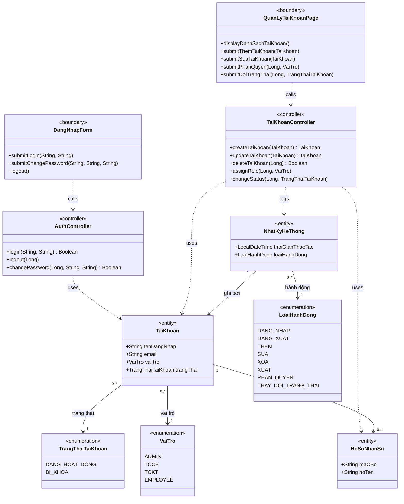

### 5.3.2. Nhóm Cơ cấu tổ chức

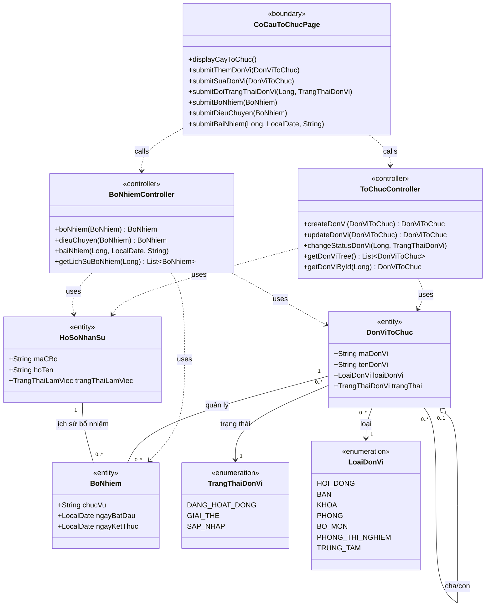

### 5.3.3. Nhóm Hồ sơ nhân sự

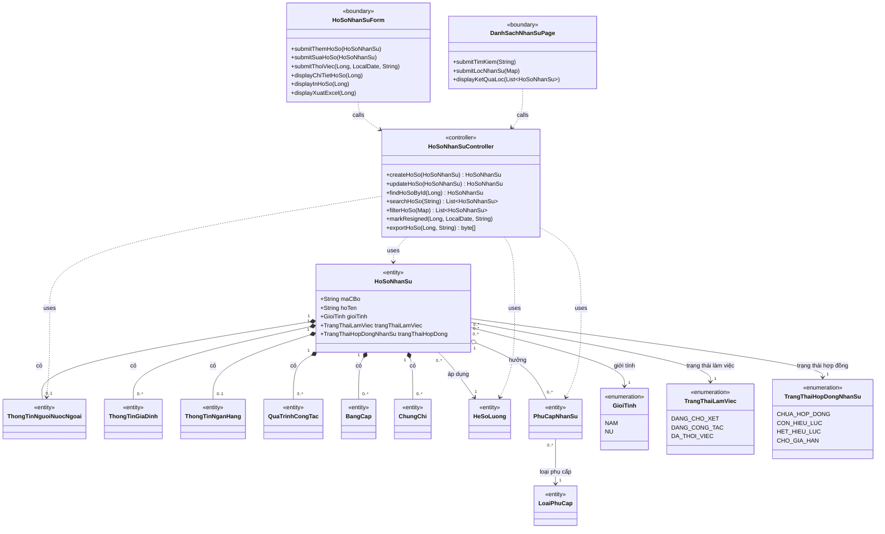

### 5.3.4. Nhóm Hợp đồng lao động

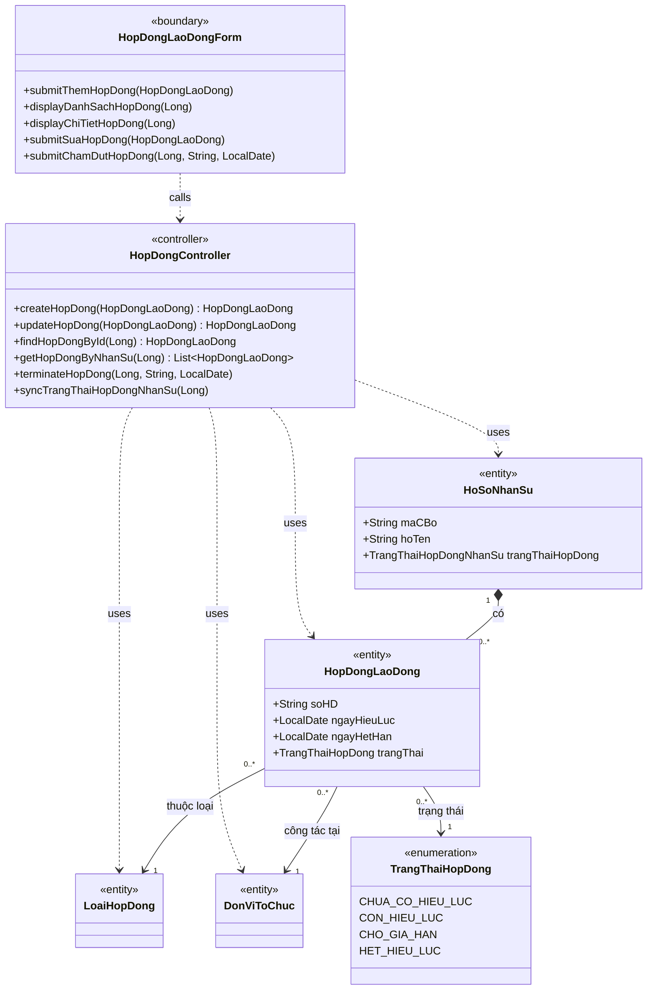

### 5.3.5. Nhóm Đánh giá khen thưởng/kỷ luật

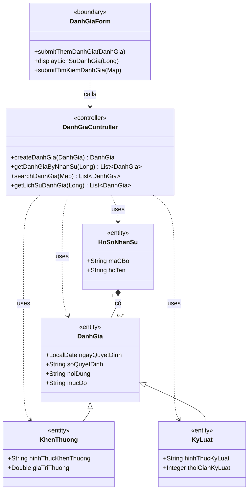

### 5.3.6. Nhóm Đào tạo & Phát triển

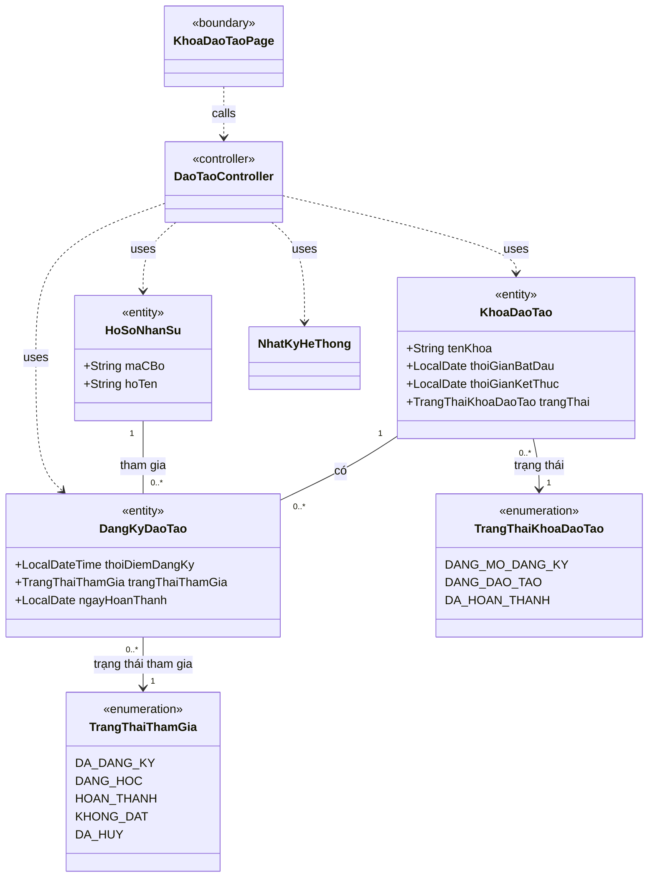

### 5.3.7. Nhóm Danh mục cấu hình

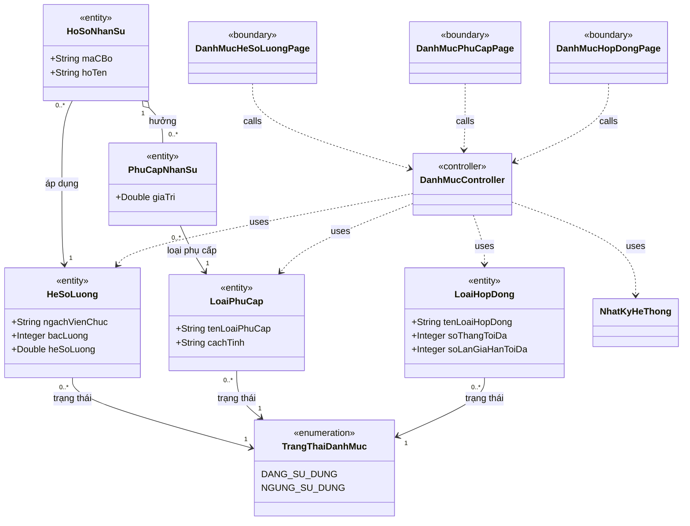

### 5.3.8. Nhóm Báo cáo & Thống kê

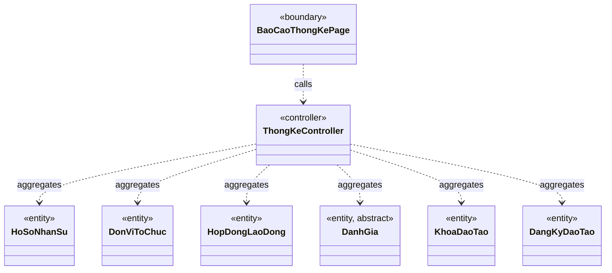

### 5.3.9. Nhóm Nhật ký hệ thống

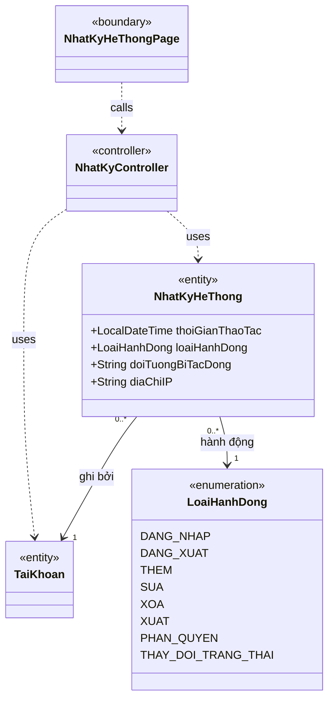

### 5.3.10. Nhóm Cấu hình hệ thống

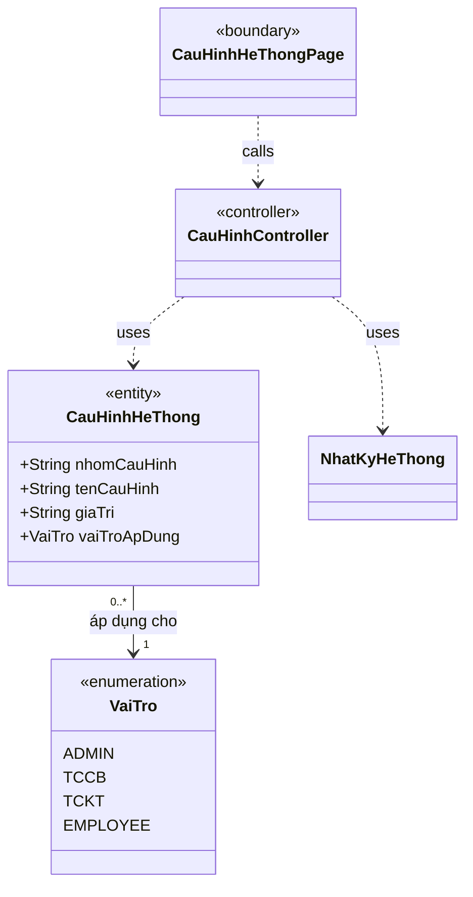

## 5.4. Bảng tổng hợp các lớp (Class Inventory)

| STT | Tên lớp | Loại | Mô tả ngắn | UC được truy vết tới |
|-----|---------|------|------------|-----------------------|
| 1 | TaiKhoan | Entity | Quản lý xác thực, phân quyền và trạng thái tài khoản người dùng | UC 4.1-4.8, 4.27 |
| 2 | HoSoNhanSu | Entity | Hồ sơ nhân sự trung tâm của toàn hệ thống | UC 4.22-4.29, 4.38 |
| 3 | ThongTinNguoiNuocNgoai | Entity | Lưu giấy tờ cư trú/lao động của nhân sự nước ngoài | UC 4.25-4.28, 4.38 |
| 4 | ThongTinGiaDinh | Entity | Lưu thành viên gia đình và người phụ thuộc của nhân sự | UC 4.25-4.28, 4.38 |
| 5 | ThongTinNganHang | Entity | Lưu tài khoản ngân hàng phục vụ trả lương | UC 4.25-4.28, 4.38 |
| 6 | QuaTrinhCongTac | Entity | Lưu lịch sử công tác của nhân sự | UC 4.25-4.28, 4.38 |
| 7 | BangCap | Entity | Lưu bằng cấp và minh chứng học vấn | UC 4.25-4.28, 4.38 |
| 8 | ChungChi | Entity | Lưu chứng chỉ chuyên môn và chứng chỉ đào tạo | UC 4.25-4.28, 4.36, 4.38 |
| 9 | DonViToChuc | Entity | Mô hình cây cơ cấu tổ chức và thông tin đơn vị | UC 4.9-4.11, 4.30-4.32, 4.39 |
| 10 | HopDongLaoDong | Entity | Quản lý vòng đời hợp đồng lao động của nhân sự | UC 4.22, 4.27, 4.43-4.45 |
| 11 | BoNhiem | Entity | Lưu lịch sử bổ nhiệm, điều chuyển và bãi nhiệm | UC 4.30-4.32 |
| 12 | DanhGia | Entity (abstract) | Phần thông tin chung của các quyết định đánh giá | UC 4.29, 4.46-4.47 |
| 13 | KhenThuong | Entity | Lớp con ghi nhận quyết định khen thưởng | UC 4.29, 4.46-4.47 |
| 14 | KyLuat | Entity | Lớp con ghi nhận quyết định kỷ luật | UC 4.29, 4.46-4.47 |
| 15 | KhoaDaoTao | Entity | Quản lý khóa đào tạo và trạng thái tổ chức khóa học | UC 4.33-4.36, 4.40-4.41 |
| 16 | DangKyDaoTao | Entity | Quản lý quan hệ tham gia đào tạo giữa nhân sự và khóa học | UC 4.35-4.41 |
| 17 | NhatKyHeThong | Entity | Ghi vết các thao tác quan trọng để kiểm toán hệ thống | UC 4.42 và các UC có thao tác ghi log |
| 18 | CauHinhHeThong | Entity | Lưu cấu hình ẩn/hiện mục đánh giá trong hồ sơ theo vai trò | UC 4.48 |
| 19 | HeSoLuong | Entity | Danh mục hệ số lương theo ngạch và bậc | UC 4.12-4.15, 4.25-4.28 |
| 20 | LoaiPhuCap | Entity | Danh mục loại phụ cấp áp dụng cho nhân sự | UC 4.16-4.18, 4.25-4.28 |
| 21 | LoaiHopDong | Entity | Danh mục loại hợp đồng và các ràng buộc gia hạn | UC 4.19-4.22, 4.43-4.45 |
| 22 | PhuCapNhanSu | Entity | Liên kết loại phụ cấp với nhân sự và giá trị áp dụng | UC 4.25-4.28, 4.38 |
| 23 | DangNhapForm | Boundary | Màn hình đăng nhập, đổi mật khẩu và đăng xuất | UC 4.1-4.3 |
| 24 | QuanLyTaiKhoanPage | Boundary | Trang quản lý danh sách tài khoản và phân quyền | UC 4.4-4.8 |
| 25 | CoCauToChucPage | Boundary | Trang cây tổ chức, đơn vị và bổ nhiệm/điều chuyển/bãi nhiệm | UC 4.9-4.11, 4.30-4.32, 4.39 |
| 26 | DanhMucHeSoLuongPage | Boundary | Trang danh mục hệ số lương | UC 4.12-4.15 |
| 27 | DanhMucPhuCapPage | Boundary | Trang danh mục loại phụ cấp | UC 4.16-4.18 |
| 28 | DanhMucHopDongPage | Boundary | Trang danh mục loại hợp đồng | UC 4.19-4.21 |
| 29 | DanhSachNhanSuPage | Boundary | Trang danh sách, tìm kiếm và lọc hồ sơ nhân sự | UC 4.23-4.24 |
| 30 | HoSoNhanSuForm | Boundary | Biểu mẫu thêm/sửa/xem/thôi việc/in/xuất hồ sơ nhân sự | UC 4.25-4.28, 4.38 |
| 31 | HopDongLaoDongForm | Boundary | Biểu mẫu hợp đồng lao động | UC 4.22, 4.43-4.45 |
| 32 | DanhGiaForm | Boundary | Biểu mẫu ghi nhận, tra cứu và lọc đánh giá | UC 4.29, 4.46-4.47 |
| 33 | KhoaDaoTaoPage | Boundary | Trang quản lý khóa đào tạo và đăng ký đào tạo | UC 4.33-4.36, 4.40-4.41 |
| 34 | BaoCaoThongKePage | Boundary | Trang xem biểu đồ, bảng thống kê và xuất báo cáo | UC 4.37 |
| 35 | NhatKyHeThongPage | Boundary | Trang xem và xuất nhật ký hệ thống | UC 4.42 |
| 36 | CauHinhHeThongPage | Boundary | Trang cấu hình hiển thị hồ sơ theo vai trò | UC 4.48 |
| 37 | AuthController | Controller | Điều phối đăng nhập, đăng xuất và đổi mật khẩu | UC 4.1-4.3 |
| 38 | TaiKhoanController | Controller | Điều phối tạo/sửa/xóa/phân quyền/đổi trạng thái tài khoản | UC 4.4-4.8 |
| 39 | ToChucController | Controller | Điều phối tạo/sửa/xem/cập nhật trạng thái đơn vị | UC 4.9-4.11, 4.32, 4.39 |
| 40 | BoNhiemController | Controller | Điều phối bổ nhiệm, điều chuyển, bãi nhiệm | UC 4.30-4.32 |
| 41 | DanhMucController | Controller | Điều phối cấu hình danh mục hệ số lương, phụ cấp, hợp đồng | UC 4.12-4.21 |
| 42 | HoSoNhanSuController | Controller | Điều phối hồ sơ nhân sự, tìm kiếm/lọc, thôi việc và xuất hồ sơ | UC 4.23-4.28, 4.38 |
| 43 | HopDongController | Controller | Điều phối hợp đồng lao động và đồng bộ trạng thái hợp đồng | UC 4.22, 4.43-4.45 |
| 44 | DanhGiaController | Controller | Điều phối đánh giá khen thưởng/kỷ luật | UC 4.29, 4.46-4.47 |
| 45 | DaoTaoController | Controller | Điều phối mở khóa, đăng ký và ghi nhận kết quả đào tạo | UC 4.33-4.36, 4.40-4.41 |
| 46 | ThongKeController | Controller | Điều phối tổng hợp dữ liệu thống kê và xuất báo cáo | UC 4.37 |
| 47 | NhatKyController | Controller | Điều phối ghi log, tra cứu và xuất nhật ký | UC 4.42 và logging của các UC khác |
| 48 | CauHinhController | Controller | Điều phối cập nhật cấu hình hiển thị hồ sơ theo vai trò | UC 4.48 |
| 49 | VaiTro | Enumeration | Nhóm vai trò truy cập của người dùng | UC 4.1, 4.4-4.7, 4.42, 4.48 |
| 50 | TrangThaiTaiKhoan | Enumeration | Trạng thái hoạt động hoặc bị khóa của tài khoản | UC 4.1, 4.4, 4.8, 4.27 |
| 51 | TrangThaiDonVi | Enumeration | Trạng thái nghiệp vụ của đơn vị tổ chức | UC 4.9-4.11, 4.32, 4.39 |
| 52 | LoaiDonVi | Enumeration | Phân loại đơn vị trong cơ cấu tổ chức | UC 4.9-4.11, 4.32, 4.39 |
| 53 | TrangThaiHopDong | Enumeration | Trạng thái vòng đời của từng hợp đồng lao động | UC 4.22, 4.27, 4.43-4.45 |
| 54 | TrangThaiLamViec | Enumeration | Trạng thái làm việc tổng quát của nhân sự | UC 4.23-4.27, 4.38 |
| 55 | TrangThaiHopDongNhanSu | Enumeration | Trạng thái hợp đồng tổng quát ở cấp hồ sơ nhân sự | UC 4.22-4.28, 4.38 |
| 56 | TrangThaiKhoaDaoTao | Enumeration | Trạng thái tổ chức của khóa đào tạo | UC 4.33-4.36, 4.40-4.41 |
| 57 | TrangThaiThamGia | Enumeration | Trạng thái tham gia đào tạo của nhân sự | UC 4.34-4.36, 4.40-4.41 |
| 58 | LoaiHanhDong | Enumeration | Phân loại hành động được ghi vào audit log | UC 4.42 và các UC ghi log |
| 59 | TrangThaiDanhMuc | Enumeration | Trạng thái sử dụng của danh mục cấu hình | UC 4.12-4.21 |
| 60 | GioiTinh | Enumeration | Giá trị giới tính dùng trong hồ sơ và bộ lọc | UC 4.23-4.26, 4.38 |

## 5.5. Ma trận truy vết UC → Design

| UC | Boundary chính | Controller chính | Entity/Enumeration chính | Ghi chú truy vết BCE |
|----|----------------|------------------|---------------------------|----------------------|
| UC 4.1 | `DangNhapForm` | `AuthController`, `NhatKyController` | `TaiKhoan`, `NhatKyHeThong`, `TrangThaiTaiKhoan`, `LoaiHanhDong` | Đăng nhập đi theo chuỗi Actor → Boundary → Controller → Entity, đồng thời ghi log đăng nhập. |
| UC 4.2 | `DangNhapForm` | `AuthController`, `NhatKyController` | `TaiKhoan`, `NhatKyHeThong`, `LoaiHanhDong` | Bao phủ đăng xuất thủ công và đăng xuất tự động theo timeout phiên. |
| UC 4.3 | `DangNhapForm` | `AuthController`, `NhatKyController` | `TaiKhoan`, `NhatKyHeThong`, `LoaiHanhDong` | Đổi mật khẩu dùng boundary riêng nhưng tái sử dụng controller xác thực. |
| UC 4.4 | `QuanLyTaiKhoanPage` | `TaiKhoanController` | `TaiKhoan`, `HoSoNhanSu`, `VaiTro`, `TrangThaiTaiKhoan` | Tìm kiếm tài khoản đi qua trang quản lý tài khoản và bộ điều phối tài khoản. |
| UC 4.5 | `QuanLyTaiKhoanPage` | `TaiKhoanController`, `NhatKyController` | `TaiKhoan`, `HoSoNhanSu`, `VaiTro`, `LoaiHanhDong` | Thêm tài khoản mới, liên kết hồ sơ nhân sự và ghi log thao tác thêm. |
| UC 4.6 | `QuanLyTaiKhoanPage` | `TaiKhoanController`, `NhatKyController` | `TaiKhoan`, `VaiTro`, `LoaiHanhDong` | Cập nhật tài khoản và lưu vết thay đổi. |
| UC 4.7 | `QuanLyTaiKhoanPage` | `TaiKhoanController`, `NhatKyController` | `TaiKhoan`, `VaiTro`, `LoaiHanhDong` | Phân quyền tài khoản là thao tác boundary riêng gọi controller phân quyền tái sử dụng. |
| UC 4.8 | `QuanLyTaiKhoanPage` | `TaiKhoanController`, `NhatKyController` | `TaiKhoan`, `TrangThaiTaiKhoan`, `LoaiHanhDong` | Bao phủ khóa/mở khóa thủ công và khóa tự động khi thôi việc. |
| UC 4.9 | `CoCauToChucPage` | `ToChucController`, `NhatKyController` | `DonViToChuc`, `LoaiDonVi`, `TrangThaiDonVi`, `LoaiHanhDong` | Tạo đơn vị mới trong cây tổ chức. |
| UC 4.10 | `CoCauToChucPage` | `ToChucController`, `NhatKyController` | `DonViToChuc`, `LoaiDonVi`, `LoaiHanhDong` | Sửa thông tin đơn vị và cập nhật cây tổ chức. |
| UC 4.11 | `CoCauToChucPage` | `ToChucController`, `NhatKyController` | `DonViToChuc`, `HoSoNhanSu`, `HopDongLaoDong`, `TrangThaiDonVi`, `LoaiHanhDong` | Cập nhật trạng thái đơn vị kéo theo đồng bộ nhân sự/hợp đồng. |
| UC 4.12 | `DanhMucHeSoLuongPage` | `DanhMucController`, `NhatKyController` | `HeSoLuong`, `TrangThaiDanhMuc`, `LoaiHanhDong` | Thêm mới hệ số lương. |
| UC 4.13 | `DanhMucHeSoLuongPage` | `DanhMucController`, `NhatKyController` | `HeSoLuong`, `TrangThaiDanhMuc`, `LoaiHanhDong` | Sửa danh mục hệ số lương. |
| UC 4.14 | `DanhMucHeSoLuongPage` | `DanhMucController`, `NhatKyController` | `HeSoLuong`, `LoaiHanhDong` | Xóa logic hệ số lương được tách ở controller thay vì entity. |
| UC 4.15 | `DanhMucHeSoLuongPage` | `DanhMucController`, `NhatKyController` | `HeSoLuong`, `TrangThaiDanhMuc`, `LoaiHanhDong` | Đổi trạng thái sử dụng của hệ số lương. |
| UC 4.16 | `DanhMucPhuCapPage` | `DanhMucController`, `NhatKyController` | `LoaiPhuCap`, `TrangThaiDanhMuc`, `LoaiHanhDong` | Thêm mới loại phụ cấp. |
| UC 4.17 | `DanhMucPhuCapPage` | `DanhMucController`, `NhatKyController` | `LoaiPhuCap`, `TrangThaiDanhMuc`, `LoaiHanhDong` | Sửa loại phụ cấp. |
| UC 4.18 | `DanhMucPhuCapPage` | `DanhMucController`, `NhatKyController` | `LoaiPhuCap`, `TrangThaiDanhMuc`, `LoaiHanhDong` | Đổi trạng thái loại phụ cấp. |
| UC 4.19 | `DanhMucHopDongPage` | `DanhMucController`, `NhatKyController` | `LoaiHopDong`, `TrangThaiDanhMuc`, `LoaiHanhDong` | Thêm mới loại hợp đồng. |
| UC 4.20 | `DanhMucHopDongPage` | `DanhMucController`, `NhatKyController` | `LoaiHopDong`, `TrangThaiDanhMuc`, `LoaiHanhDong` | Sửa loại hợp đồng. |
| UC 4.21 | `DanhMucHopDongPage` | `DanhMucController`, `NhatKyController` | `LoaiHopDong`, `TrangThaiDanhMuc`, `LoaiHanhDong` | Đổi trạng thái loại hợp đồng. |
| UC 4.22 | `HopDongLaoDongForm` | `HopDongController`, `NhatKyController` | `HopDongLaoDong`, `HoSoNhanSu`, `LoaiHopDong`, `TrangThaiHopDong`, `TrangThaiHopDongNhanSu`, `LoaiHanhDong` | Tạo hợp đồng mới và đồng bộ trạng thái hợp đồng của nhân sự. |
| UC 4.23 | `DanhSachNhanSuPage` | `HoSoNhanSuController` | `HoSoNhanSu`, `GioiTinh`, `TrangThaiLamViec`, `TrangThaiHopDongNhanSu` | Tìm kiếm hồ sơ nhân sự theo từ khóa. |
| UC 4.24 | `DanhSachNhanSuPage` | `HoSoNhanSuController` | `HoSoNhanSu`, `GioiTinh`, `TrangThaiLamViec`, `TrangThaiHopDongNhanSu` | Lọc danh sách hồ sơ theo nhiều tiêu chí. |
| UC 4.25 | `HoSoNhanSuForm` | `HoSoNhanSuController`, `NhatKyController` | `HoSoNhanSu`, `ThongTinNguoiNuocNgoai`, `ThongTinGiaDinh`, `ThongTinNganHang`, `QuaTrinhCongTac`, `BangCap`, `ChungChi`, `HeSoLuong`, `PhuCapNhanSu`, `LoaiHanhDong` | Thêm mới hồ sơ nhân sự và các thành phần cấu thành hồ sơ. |
| UC 4.26 | `HoSoNhanSuForm` | `HoSoNhanSuController`, `NhatKyController` | `HoSoNhanSu`, `ThongTinNguoiNuocNgoai`, `ThongTinGiaDinh`, `ThongTinNganHang`, `QuaTrinhCongTac`, `BangCap`, `ChungChi`, `HeSoLuong`, `PhuCapNhanSu`, `LoaiHanhDong` | Cập nhật chi tiết hồ sơ nhân sự. |
| UC 4.27 | `HoSoNhanSuForm` | `HoSoNhanSuController`, `TaiKhoanController`, `HopDongController`, `NhatKyController` | `HoSoNhanSu`, `TaiKhoan`, `HopDongLaoDong`, `TrangThaiLamViec`, `TrangThaiHopDongNhanSu`, `TrangThaiTaiKhoan`, `LoaiHanhDong` | Thôi việc kéo theo khóa tài khoản và đồng bộ hợp đồng. |
| UC 4.28 | `HoSoNhanSuForm` | `HoSoNhanSuController` | `HoSoNhanSu`, `ThongTinGiaDinh`, `ThongTinNganHang`, `QuaTrinhCongTac`, `BangCap`, `ChungChi`, `HeSoLuong`, `PhuCapNhanSu` | Xem chi tiết hồ sơ nhân sự ở chế độ chỉ đọc. |
| UC 4.29 | `DanhGiaForm` | `DanhGiaController`, `NhatKyController` | `DanhGia`, `KhenThuong`, `KyLuat`, `HoSoNhanSu`, `LoaiHanhDong` | Ghi nhận đánh giá dùng kế thừa thay cho enum loại đánh giá. |
| UC 4.30 | `CoCauToChucPage` | `BoNhiemController`, `NhatKyController` | `BoNhiem`, `HoSoNhanSu`, `DonViToChuc`, `LoaiHanhDong` | Bổ nhiệm/điều chuyển nhân sự cho đơn vị. |
| UC 4.31 | `CoCauToChucPage` | `BoNhiemController`, `NhatKyController` | `BoNhiem`, `HoSoNhanSu`, `DonViToChuc`, `LoaiHanhDong` | Bãi nhiệm nhân sự khỏi đơn vị tổ chức. |
| UC 4.32 | `CoCauToChucPage` | `ToChucController`, `BoNhiemController` | `DonViToChuc`, `BoNhiem`, `HoSoNhanSu`, `TrangThaiDonVi` | Xem chi tiết đơn vị và lịch sử nhân sự của đơn vị. |
| UC 4.33 | `KhoaDaoTaoPage` | `DaoTaoController`, `NhatKyController` | `KhoaDaoTao`, `TrangThaiKhoaDaoTao`, `LoaiHanhDong` | Mở khóa đào tạo mới. |
| UC 4.34 | `KhoaDaoTaoPage` | `DaoTaoController`, `NhatKyController` | `KhoaDaoTao`, `DangKyDaoTao`, `TrangThaiKhoaDaoTao`, `LoaiHanhDong` | Sửa thông tin khóa đào tạo đã mở. |
| UC 4.35 | `KhoaDaoTaoPage` | `DaoTaoController` | `KhoaDaoTao`, `DangKyDaoTao`, `TrangThaiKhoaDaoTao`, `TrangThaiThamGia` | Xem chi tiết khóa đào tạo và danh sách học viên. |
| UC 4.36 | `KhoaDaoTaoPage` | `DaoTaoController`, `NhatKyController` | `DangKyDaoTao`, `KhoaDaoTao`, `ChungChi`, `TrangThaiThamGia`, `LoaiHanhDong` | Ghi nhận kết quả đào tạo và lưu chứng chỉ vào hồ sơ. |
| UC 4.37 | `BaoCaoThongKePage` | `ThongKeController` | `HoSoNhanSu`, `DonViToChuc`, `HopDongLaoDong`, `DanhGia`, `KhoaDaoTao`, `DangKyDaoTao` | Thống kê tổng hợp dữ liệu từ nhiều entity lõi. |
| UC 4.38 | `HoSoNhanSuForm` | `HoSoNhanSuController`, `CauHinhController` | `HoSoNhanSu`, `HopDongLaoDong`, `DanhGia`, `CauHinhHeThong` | Self-service hồ sơ cá nhân vẫn tuân thủ chuỗi BCE và chịu tác động cấu hình hiển thị. |
| UC 4.39 | `CoCauToChucPage` | `ToChucController` | `DonViToChuc`, `BoNhiem`, `HoSoNhanSu` | Xem thông tin chi tiết đơn vị đang công tác của CBGV. |
| UC 4.40 | `KhoaDaoTaoPage` | `DaoTaoController`, `NhatKyController` | `DangKyDaoTao`, `KhoaDaoTao`, `TrangThaiThamGia`, `LoaiHanhDong` | Đăng ký/hủy đăng ký khóa đào tạo; trạng thái `DA_HUY` hỗ trợ trường hợp hủy. |
| UC 4.41 | `KhoaDaoTaoPage` | `DaoTaoController` | `DangKyDaoTao`, `KhoaDaoTao`, `TrangThaiThamGia` | Xem danh sách các khóa đào tạo đã đăng ký. |
| UC 4.42 | `NhatKyHeThongPage` | `NhatKyController` | `NhatKyHeThong`, `TaiKhoan`, `LoaiHanhDong`, `VaiTro` | Bao phủ xem, lọc, xem chi tiết và xuất audit log. |
| UC 4.43 | `HopDongLaoDongForm` | `HopDongController` | `HopDongLaoDong`, `HoSoNhanSu`, `LoaiHopDong`, `TrangThaiHopDong` | Xem danh sách và chi tiết hợp đồng lao động. |
| UC 4.44 | `HopDongLaoDongForm` | `HopDongController`, `NhatKyController` | `HopDongLaoDong`, `LoaiHopDong`, `TrangThaiHopDong`, `LoaiHanhDong` | Chỉnh sửa hợp đồng chưa có hiệu lực. |
| UC 4.45 | `HopDongLaoDongForm` | `HopDongController`, `NhatKyController` | `HopDongLaoDong`, `HoSoNhanSu`, `TrangThaiHopDong`, `TrangThaiHopDongNhanSu`, `LoaiHanhDong` | Chấm dứt hợp đồng lao động trước hạn. |
| UC 4.46 | `DanhGiaForm` | `DanhGiaController` | `DanhGia`, `KhenThuong`, `KyLuat`, `HoSoNhanSu`, `CauHinhHeThong` | Xem lịch sử đánh giá theo mô hình kế thừa và cấu hình hiển thị. |
| UC 4.47 | `DanhGiaForm` | `DanhGiaController` | `DanhGia`, `KhenThuong`, `KyLuat`, `HoSoNhanSu` | Tìm kiếm và lọc danh sách đánh giá. |
| UC 4.48 | `CauHinhHeThongPage` | `CauHinhController`, `NhatKyController` | `CauHinhHeThong`, `VaiTro`, `LoaiHanhDong` | Cập nhật cấu hình ẩn/hiện mục khen thưởng/kỷ luật theo vai trò. |
