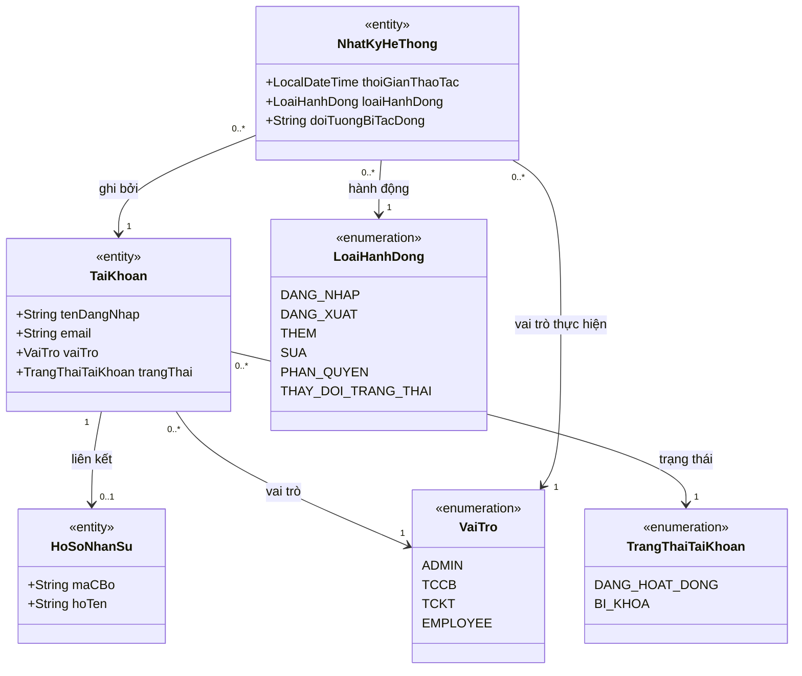
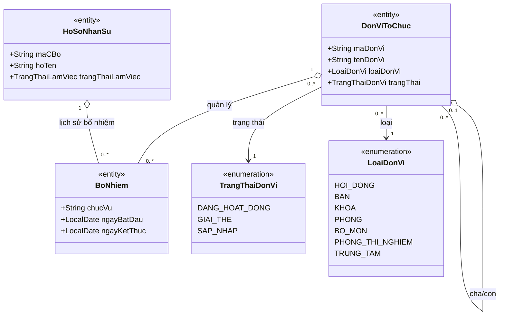
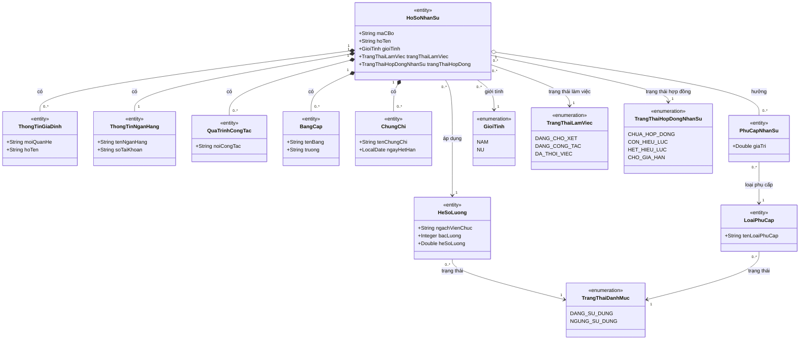
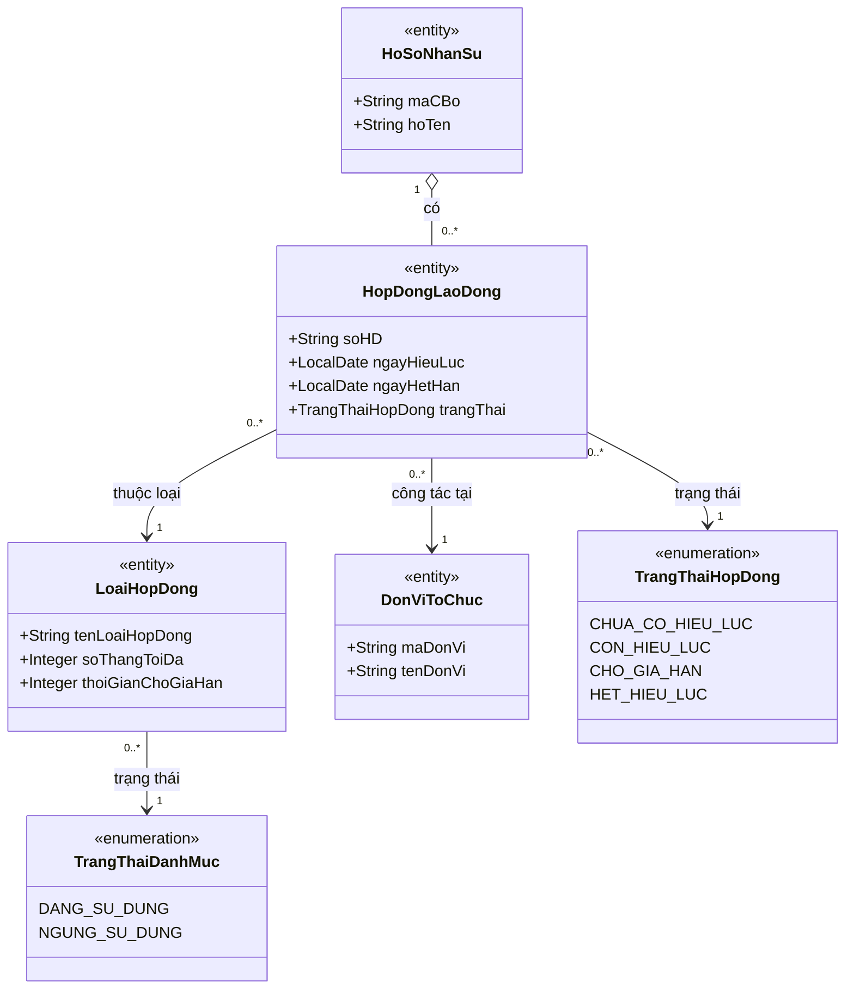
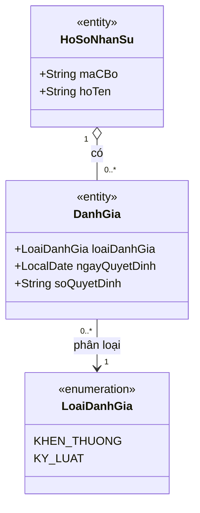
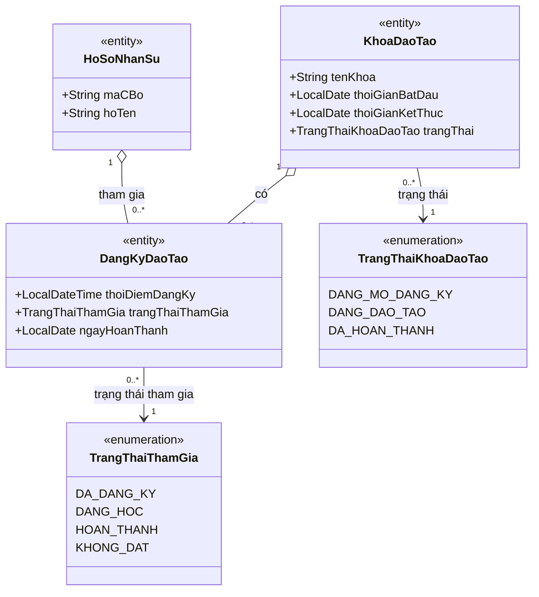
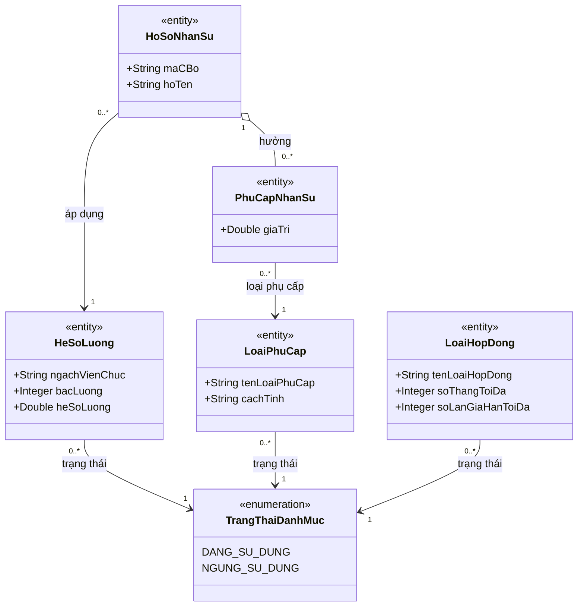
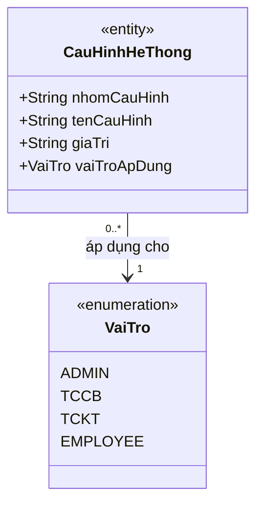

# V. XÁC ĐỊNH CÁC LỚP, XÂY DỰNG BIỂU ĐỒ LỚP

## 5.1. Xác định các lớp — Biểu đồ lớp Hệ thống HRMS

> Các lớp dưới đây được rút ra từ toàn bộ 48 use case của hệ thống HRMS cho Trường Đại học Thủy Lợi theo hướng BCE, chỉ giữ lại **Entity** và **Enumeration**. UC 4.37 về báo cáo/thống kê không tạo lớp nghiệp vụ riêng mà sử dụng dữ liệu tổng hợp từ các lớp lõi đã xác định.

### 5.1.1. TaiKhoan (Tài khoản) — *«entity»*

> Lớp biểu diễn thông tin xác thực và phân quyền truy cập của người dùng hệ thống. Lớp này bao phủ các UC đăng nhập, đổi mật khẩu, quản lý tài khoản, phân quyền và khóa/mở khóa tài khoản.

**Bảng thuộc tính:**

| STT | Thuộc tính | Kiểu dữ liệu | Mô tả |
|-----|-----------|--------------|-------|
| 1 | id | Long | Mã định danh tài khoản |
| 2 | ngayTao | LocalDateTime | Thời điểm tạo tài khoản |
| 3 | ngayCapNhat | LocalDateTime | Thời điểm cập nhật gần nhất |
| 4 | tenDangNhap | String | Tên đăng nhập dùng để xác thực |
| 5 | matKhau | String | Mật khẩu đã được mã hóa |
| 6 | email | String | Email nhận thông báo và mật khẩu khởi tạo |
| 7 | vaiTro | VaiTro | Vai trò truy cập của tài khoản |
| 8 | trangThai | TrangThaiTaiKhoan | Trạng thái hoạt động hoặc bị khóa |
| 9 | nhanSu | HoSoNhanSu | Hồ sơ nhân sự được liên kết với tài khoản |

**Bảng phương thức:**

| STT | Phương thức | Tham số | Kiểu trả về | Mô tả |
|-----|------------|---------|-------------|-------|
| 1 | create() | TaiKhoan taiKhoan | TaiKhoan | Tạo mới tài khoản |
| 2 | update() | TaiKhoan taiKhoan | TaiKhoan | Cập nhật thông tin tài khoản |
| 3 | delete() | Long id | Boolean | Xóa mềm tài khoản |
| 4 | findById() | Long id | TaiKhoan | Tìm tài khoản theo mã định danh |
| 5 | findAll() | Không | List<TaiKhoan> | Lấy danh sách toàn bộ tài khoản |
| 6 | authenticate() | String tenDangNhap, String matKhau | Boolean | Kiểm tra thông tin đăng nhập |
| 7 | changePassword() | String matKhauCu, String matKhauMoi | Boolean | Đổi mật khẩu của tài khoản |
| 8 | assignRole() | VaiTro vaiTro | Void | Gán hoặc thay đổi vai trò cho tài khoản |
| 9 | changeStatus() | TrangThaiTaiKhoan trangThai | Void | Khóa hoặc mở khóa tài khoản |

### 5.1.2. HoSoNhanSu (Hồ sơ nhân sự) — *«entity»*

> Lớp trung tâm lưu trữ toàn bộ thông tin cá nhân, học vấn, công tác, lương và trạng thái làm việc của một nhân sự. Đây là hạt nhân dữ liệu cho các UC quản lý hồ sơ, hợp đồng, đánh giá, điều chuyển, đào tạo và self-service.

**Bảng thuộc tính:**

| STT | Thuộc tính | Kiểu dữ liệu | Mô tả |
|-----|-----------|--------------|-------|
| 1 | id | Long | Mã định danh hồ sơ |
| 2 | ngayTao | LocalDateTime | Thời điểm tạo hồ sơ |
| 3 | ngayCapNhat | LocalDateTime | Thời điểm cập nhật gần nhất |
| 4 | maCBo | String | Mã cán bộ được sinh tự động |
| 5 | hoTen | String | Họ và tên nhân sự |
| 6 | ngaySinh | LocalDate | Ngày sinh |
| 7 | gioiTinh | GioiTinh | Giới tính của nhân sự |
| 8 | cccd | String | Số căn cước công dân |
| 9 | queQuan | String | Quê quán |
| 10 | diaChi | String | Địa chỉ thường trú hoặc liên hệ |
| 11 | maSoThue | String | Mã số thuế cá nhân |
| 12 | soBHXH | String | Số bảo hiểm xã hội |
| 13 | soBHYT | String | Số bảo hiểm y tế |
| 14 | email | String | Email liên hệ |
| 15 | sdtLienHe | String | Số điện thoại liên hệ |
| 16 | anhChanDung | String | Đường dẫn ảnh chân dung |
| 17 | trinhDoVanHoa | String | Trình độ văn hóa |
| 18 | trinhDoDaoTao | String | Trình độ đào tạo |
| 19 | chucDanhNgheNghiep | String | Chức danh nghề nghiệp |
| 20 | chucDanhKhoaHoc | String | Chức danh khoa học |
| 21 | thongTinDangDoan | String | Thông tin Đảng/Đoàn |
| 22 | trangThaiLamViec | TrangThaiLamViec | Trạng thái làm việc hiện tại |
| 23 | trangThaiHopDong | TrangThaiHopDongNhanSu | Trạng thái hợp đồng tổng quát của nhân sự |
| 24 | laNguoiNuocNgoai | Boolean | Đánh dấu nhân sự là người nước ngoài |
| 25 | soVisa | String | Số visa nếu là người nước ngoài |
| 26 | ngayHetHanVisa | LocalDate | Ngày hết hạn visa |
| 27 | soHoChieu | String | Số hộ chiếu |
| 28 | ngayHetHanHoChieu | LocalDate | Ngày hết hạn hộ chiếu |
| 29 | soGiayPhepLaoDong | String | Số giấy phép lao động |
| 30 | ngayHetHanGiayPhepLaoDong | LocalDate | Ngày hết hạn giấy phép lao động |
| 31 | fileGiayPhepLaoDong | String | Đường dẫn file giấy phép lao động |
| 32 | heSoLuong | HeSoLuong | Hệ số lương hiện hành được áp dụng |
| 33 | ngayThoiViec | LocalDate | Ngày thôi việc nếu có |
| 34 | lyDoThoiViec | String | Lý do thôi việc |

**Bảng phương thức:**

| STT | Phương thức | Tham số | Kiểu trả về | Mô tả |
|-----|------------|---------|-------------|-------|
| 1 | create() | HoSoNhanSu hoSoNhanSu | HoSoNhanSu | Tạo mới hồ sơ nhân sự |
| 2 | update() | HoSoNhanSu hoSoNhanSu | HoSoNhanSu | Cập nhật hồ sơ nhân sự |
| 3 | delete() | Long id | Boolean | Xóa mềm hồ sơ nhân sự |
| 4 | findById() | Long id | HoSoNhanSu | Tìm hồ sơ theo mã định danh |
| 5 | findAll() | Không | List<HoSoNhanSu> | Lấy danh sách toàn bộ hồ sơ |
| 6 | generateMaCBo() | Không | String | Sinh mã cán bộ duy nhất |
| 7 | validateHoSo() | Không | Boolean | Kiểm tra tính đầy đủ và logic của hồ sơ |
| 8 | markResigned() | LocalDate ngayThoiViec, String lyDo | Void | Đánh dấu thôi việc cho nhân sự |
| 9 | updateTrangThaiHopDong() | TrangThaiHopDongNhanSu trangThai | Void | Đồng bộ trạng thái hợp đồng tổng quát |
| 10 | assignHeSoLuong() | HeSoLuong heSoLuong | Void | Gán hệ số lương cho hồ sơ |

### 5.1.3. ThongTinGiaDinh (Thông tin gia đình) — *«entity»*

> Lớp lưu các thành viên gia đình và người phụ thuộc của một nhân sự. Dữ liệu này phục vụ đầy đủ cho tab thông tin gia đình trong hồ sơ nhân sự.

**Bảng thuộc tính:**

| STT | Thuộc tính | Kiểu dữ liệu | Mô tả |
|-----|-----------|--------------|-------|
| 1 | id | Long | Mã định danh thông tin gia đình |
| 2 | ngayTao | LocalDateTime | Thời điểm tạo bản ghi |
| 3 | ngayCapNhat | LocalDateTime | Thời điểm cập nhật gần nhất |
| 4 | moiQuanHe | String | Quan hệ với nhân sự: cha, mẹ, vợ/chồng, con... |
| 5 | hoTen | String | Họ tên thành viên gia đình |
| 6 | ngaySinh | LocalDate | Ngày sinh của thành viên |
| 7 | ngheNghiep | String | Nghề nghiệp hiện tại |
| 8 | laNguoiPhuThuoc | Boolean | Đánh dấu người phụ thuộc |

**Bảng phương thức:**

| STT | Phương thức | Tham số | Kiểu trả về | Mô tả |
|-----|------------|---------|-------------|-------|
| 1 | create() | ThongTinGiaDinh thongTinGiaDinh | ThongTinGiaDinh | Tạo mới thông tin gia đình |
| 2 | update() | ThongTinGiaDinh thongTinGiaDinh | ThongTinGiaDinh | Cập nhật thông tin gia đình |
| 3 | delete() | Long id | Boolean | Xóa mềm bản ghi gia đình |
| 4 | findById() | Long id | ThongTinGiaDinh | Tìm bản ghi theo mã định danh |
| 5 | findAll() | Không | List<ThongTinGiaDinh> | Lấy danh sách bản ghi gia đình |
| 6 | markDependent() | Boolean laNguoiPhuThuoc | Void | Cập nhật trạng thái người phụ thuộc |
| 7 | validateRelationship() | Không | Boolean | Kiểm tra hợp lệ quan hệ gia đình |

### 5.1.4. ThongTinNganHang (Thông tin ngân hàng) — *«entity»*

> Lớp lưu thông tin tài khoản ngân hàng phục vụ trả lương và đối soát tài chính cho một nhân sự. Mỗi hồ sơ nhân sự có đúng một thông tin ngân hàng tại một thời điểm.

**Bảng thuộc tính:**

| STT | Thuộc tính | Kiểu dữ liệu | Mô tả |
|-----|-----------|--------------|-------|
| 1 | id | Long | Mã định danh thông tin ngân hàng |
| 2 | ngayTao | LocalDateTime | Thời điểm tạo bản ghi |
| 3 | ngayCapNhat | LocalDateTime | Thời điểm cập nhật gần nhất |
| 4 | tenNganHang | String | Tên ngân hàng thụ hưởng |
| 5 | soTaiKhoan | String | Số tài khoản ngân hàng |

**Bảng phương thức:**

| STT | Phương thức | Tham số | Kiểu trả về | Mô tả |
|-----|------------|---------|-------------|-------|
| 1 | create() | ThongTinNganHang thongTinNganHang | ThongTinNganHang | Tạo mới thông tin ngân hàng |
| 2 | update() | ThongTinNganHang thongTinNganHang | ThongTinNganHang | Cập nhật thông tin ngân hàng |
| 3 | delete() | Long id | Boolean | Xóa mềm thông tin ngân hàng |
| 4 | findById() | Long id | ThongTinNganHang | Tìm bản ghi theo mã định danh |
| 5 | findAll() | Không | List<ThongTinNganHang> | Lấy danh sách thông tin ngân hàng |
| 6 | verifyAccountFormat() | Không | Boolean | Kiểm tra định dạng số tài khoản hợp lệ |

### 5.1.5. QuaTrinhCongTac (Quá trình công tác) — *«entity»*

> Lớp ghi nhận lịch sử công tác trước khi về trường hoặc các giai đoạn nghề nghiệp liên quan của nhân sự. Thông tin này phục vụ tra cứu, xem chi tiết và in hồ sơ.

**Bảng thuộc tính:**

| STT | Thuộc tính | Kiểu dữ liệu | Mô tả |
|-----|-----------|--------------|-------|
| 1 | id | Long | Mã định danh quá trình công tác |
| 2 | ngayTao | LocalDateTime | Thời điểm tạo bản ghi |
| 3 | ngayCapNhat | LocalDateTime | Thời điểm cập nhật gần nhất |
| 4 | noiCongTac | String | Nơi công tác trong giai đoạn tương ứng |
| 5 | thoiGianBatDau | LocalDate | Thời điểm bắt đầu công tác |
| 6 | thoiGianKetThuc | LocalDate | Thời điểm kết thúc công tác |

**Bảng phương thức:**

| STT | Phương thức | Tham số | Kiểu trả về | Mô tả |
|-----|------------|---------|-------------|-------|
| 1 | create() | QuaTrinhCongTac quaTrinhCongTac | QuaTrinhCongTac | Tạo mới quá trình công tác |
| 2 | update() | QuaTrinhCongTac quaTrinhCongTac | QuaTrinhCongTac | Cập nhật quá trình công tác |
| 3 | delete() | Long id | Boolean | Xóa mềm quá trình công tác |
| 4 | findById() | Long id | QuaTrinhCongTac | Tìm bản ghi theo mã định danh |
| 5 | findAll() | Không | List<QuaTrinhCongTac> | Lấy toàn bộ lịch sử công tác |
| 6 | calculateDuration() | Không | Integer | Tính số tháng công tác của giai đoạn |

### 5.1.6. BangCap (Bằng cấp) — *«entity»*

> Lớp biểu diễn từng bằng cấp học thuật gắn với hồ sơ nhân sự. Dữ liệu này dùng cho hồ sơ, thống kê trình độ và kiểm tra file minh chứng.

**Bảng thuộc tính:**

| STT | Thuộc tính | Kiểu dữ liệu | Mô tả |
|-----|-----------|--------------|-------|
| 1 | id | Long | Mã định danh bằng cấp |
| 2 | ngayTao | LocalDateTime | Thời điểm tạo bản ghi |
| 3 | ngayCapNhat | LocalDateTime | Thời điểm cập nhật gần nhất |
| 4 | tenBang | String | Tên bằng cấp |
| 5 | truong | String | Trường cấp bằng |
| 6 | nganh | String | Ngành đào tạo |
| 7 | namTotNghiep | Integer | Năm tốt nghiệp |
| 8 | xepLoai | String | Xếp loại tốt nghiệp |
| 9 | filePdf | String | Đường dẫn file PDF bằng cấp |

**Bảng phương thức:**

| STT | Phương thức | Tham số | Kiểu trả về | Mô tả |
|-----|------------|---------|-------------|-------|
| 1 | create() | BangCap bangCap | BangCap | Tạo mới bằng cấp |
| 2 | update() | BangCap bangCap | BangCap | Cập nhật thông tin bằng cấp |
| 3 | delete() | Long id | Boolean | Xóa mềm bằng cấp |
| 4 | findById() | Long id | BangCap | Tìm bằng cấp theo mã định danh |
| 5 | findAll() | Không | List<BangCap> | Lấy danh sách toàn bộ bằng cấp |
| 6 | verifyAttachment() | Không | Boolean | Kiểm tra file minh chứng đính kèm |

### 5.1.7. ChungChi (Chứng chỉ) — *«entity»*

> Lớp lưu trữ các chứng chỉ chuyên môn, nghiệp vụ và chứng chỉ sau đào tạo của nhân sự. Lớp này phục vụ cập nhật hồ sơ, xem chi tiết và kiểm tra hạn hiệu lực chứng chỉ.

**Bảng thuộc tính:**

| STT | Thuộc tính | Kiểu dữ liệu | Mô tả |
|-----|-----------|--------------|-------|
| 1 | id | Long | Mã định danh chứng chỉ |
| 2 | ngayTao | LocalDateTime | Thời điểm tạo bản ghi |
| 3 | ngayCapNhat | LocalDateTime | Thời điểm cập nhật gần nhất |
| 4 | tenChungChi | String | Tên chứng chỉ |
| 5 | noiCap | String | Nơi cấp chứng chỉ |
| 6 | ngayCap | LocalDate | Ngày cấp chứng chỉ |
| 7 | ngayHetHan | LocalDate | Ngày hết hạn chứng chỉ |
| 8 | filePdf | String | Đường dẫn file PDF chứng chỉ |

**Bảng phương thức:**

| STT | Phương thức | Tham số | Kiểu trả về | Mô tả |
|-----|------------|---------|-------------|-------|
| 1 | create() | ChungChi chungChi | ChungChi | Tạo mới chứng chỉ |
| 2 | update() | ChungChi chungChi | ChungChi | Cập nhật thông tin chứng chỉ |
| 3 | delete() | Long id | Boolean | Xóa mềm chứng chỉ |
| 4 | findById() | Long id | ChungChi | Tìm chứng chỉ theo mã định danh |
| 5 | findAll() | Không | List<ChungChi> | Lấy danh sách chứng chỉ |
| 6 | isExpired() | LocalDate ngayThamChieu | Boolean | Kiểm tra chứng chỉ đã hết hạn hay chưa |

### 5.1.8. DonViToChuc (Đơn vị tổ chức) — *«entity»*

> Lớp mô hình hóa cơ cấu tổ chức dạng cây của Trường Đại học Thủy Lợi. Lớp này quản lý thông tin đơn vị, trạng thái hoạt động, quan hệ cha-con và dữ liệu phục vụ bổ nhiệm/điều chuyển nhân sự.

**Bảng thuộc tính:**

| STT | Thuộc tính | Kiểu dữ liệu | Mô tả |
|-----|-----------|--------------|-------|
| 1 | id | Long | Mã định danh đơn vị |
| 2 | ngayTao | LocalDateTime | Thời điểm tạo đơn vị |
| 3 | ngayCapNhat | LocalDateTime | Thời điểm cập nhật gần nhất |
| 4 | maDonVi | String | Mã đơn vị duy nhất |
| 5 | tenDonVi | String | Tên đơn vị tổ chức |
| 6 | loaiDonVi | LoaiDonVi | Loại đơn vị theo cơ cấu trường |
| 7 | donViCha | DonViToChuc | Đơn vị quản lý cấp trên |
| 8 | ngayThanhLap | LocalDate | Ngày thành lập đơn vị |
| 9 | diaChi | String | Địa chỉ liên hệ chính |
| 10 | diaChiVanPhong | String | Địa chỉ văn phòng làm việc |
| 11 | email | String | Email đơn vị |
| 12 | soDienThoai | String | Số điện thoại liên hệ |
| 13 | website | String | Website của đơn vị |
| 14 | trangThai | TrangThaiDonVi | Trạng thái hoạt động của đơn vị |
| 15 | laDonViNut | Boolean | Đánh dấu đơn vị không cho phép thêm đơn vị con |
| 16 | soQuyetDinh | String | Số quyết định khi thay đổi trạng thái |
| 17 | ngayQuyetDinh | LocalDate | Ngày quyết định thay đổi trạng thái |
| 18 | fileQuyetDinh | String | Tệp quyết định đính kèm |
| 19 | ngayHieuLucTrangThai | LocalDate | Ngày hiệu lực của trạng thái mới |
| 20 | lyDoThayDoi | String | Lý do giải thể hoặc sáp nhập |

**Bảng phương thức:**

| STT | Phương thức | Tham số | Kiểu trả về | Mô tả |
|-----|------------|---------|-------------|-------|
| 1 | create() | DonViToChuc donViToChuc | DonViToChuc | Tạo mới đơn vị tổ chức |
| 2 | update() | DonViToChuc donViToChuc | DonViToChuc | Cập nhật thông tin đơn vị |
| 3 | delete() | Long id | Boolean | Xóa mềm đơn vị |
| 4 | findById() | Long id | DonViToChuc | Tìm đơn vị theo mã định danh |
| 5 | findAll() | Không | List<DonViToChuc> | Lấy danh sách toàn bộ đơn vị |
| 6 | addChild() | DonViToChuc donViCon | Void | Thêm đơn vị con vào cây tổ chức |
| 7 | changeStatus() | TrangThaiDonVi trangThai, LocalDate ngayHieuLuc | Void | Cập nhật trạng thái giải thể hoặc sáp nhập |
| 8 | transferChildren() | DonViToChuc donViMoi | Void | Điều chuyển toàn bộ đơn vị con sang đơn vị khác |
| 9 | mergeTo() | DonViToChuc donViNhanSapNhap | Void | Sáp nhập đơn vị hiện tại vào đơn vị nhận |

### 5.1.9. HopDongLaoDong (Hợp đồng lao động) — *«entity»*

> Lớp biểu diễn từng hợp đồng lao động gắn với một hồ sơ nhân sự. Lớp này bao phủ các nghiệp vụ tạo mới, xem chi tiết, chỉnh sửa trước hiệu lực, theo dõi gia hạn và chấm dứt trước hạn.

**Bảng thuộc tính:**

| STT | Thuộc tính | Kiểu dữ liệu | Mô tả |
|-----|-----------|--------------|-------|
| 1 | id | Long | Mã định danh hợp đồng |
| 2 | ngayTao | LocalDateTime | Thời điểm tạo hợp đồng |
| 3 | ngayCapNhat | LocalDateTime | Thời điểm cập nhật gần nhất |
| 4 | soHD | String | Số hợp đồng |
| 5 | loaiHopDong | LoaiHopDong | Loại hợp đồng tham chiếu danh mục |
| 6 | ngayKy | LocalDate | Ngày ký hợp đồng |
| 7 | ngayHieuLuc | LocalDate | Ngày hợp đồng bắt đầu có hiệu lực |
| 8 | ngayHetHan | LocalDate | Ngày hết hạn hợp đồng |
| 9 | donViCongTac | DonViToChuc | Đơn vị công tác theo hợp đồng |
| 10 | noiDungHopDong | String | Nội dung, điều khoản và quyền lợi hợp đồng |
| 11 | filePdf | String | Đường dẫn file PDF hợp đồng |
| 12 | trangThai | TrangThaiHopDong | Trạng thái hiện hành của hợp đồng |
| 13 | ngayChamDut | LocalDate | Ngày chấm dứt trước hạn nếu có |
| 14 | lyDoChamDut | String | Lý do chấm dứt trước hạn |

**Bảng phương thức:**

| STT | Phương thức | Tham số | Kiểu trả về | Mô tả |
|-----|------------|---------|-------------|-------|
| 1 | create() | HopDongLaoDong hopDongLaoDong | HopDongLaoDong | Tạo mới hợp đồng lao động |
| 2 | update() | HopDongLaoDong hopDongLaoDong | HopDongLaoDong | Cập nhật hợp đồng |
| 3 | delete() | Long id | Boolean | Xóa mềm hợp đồng |
| 4 | findById() | Long id | HopDongLaoDong | Tìm hợp đồng theo mã định danh |
| 5 | findAll() | Không | List<HopDongLaoDong> | Lấy danh sách toàn bộ hợp đồng |
| 6 | validateThoiHan() | Không | Boolean | Kiểm tra thời hạn theo cấu hình loại hợp đồng |
| 7 | activate() | Không | Void | Kích hoạt hợp đồng theo ngày hiệu lực |
| 8 | moveToWaitingRenewal() | Không | Void | Chuyển hợp đồng sang trạng thái chờ gia hạn |
| 9 | terminateEarly() | LocalDate ngayChamDut, String lyDo | Void | Chấm dứt hợp đồng trước hạn |

### 5.1.10. BoNhiem (Bổ nhiệm) — *«entity»*

> Lớp lưu các quyết định bổ nhiệm, điều chuyển và bãi nhiệm nhân sự tại đơn vị tổ chức. Lớp này là lịch sử biến động chức vụ và đơn vị công tác của nhân sự.

**Bảng thuộc tính:**

| STT | Thuộc tính | Kiểu dữ liệu | Mô tả |
|-----|-----------|--------------|-------|
| 1 | id | Long | Mã định danh quyết định bổ nhiệm |
| 2 | ngayTao | LocalDateTime | Thời điểm tạo bản ghi |
| 3 | ngayCapNhat | LocalDateTime | Thời điểm cập nhật gần nhất |
| 4 | nhanSu | HoSoNhanSu | Nhân sự được bổ nhiệm hoặc điều chuyển |
| 5 | donVi | DonViToChuc | Đơn vị công tác được gán |
| 6 | chucVu | String | Chức vụ đảm nhiệm tại đơn vị |
| 7 | ngayBatDau | LocalDate | Ngày bắt đầu đảm nhiệm |
| 8 | ngayKetThuc | LocalDate | Ngày kết thúc hoặc bãi nhiệm |

**Bảng phương thức:**

| STT | Phương thức | Tham số | Kiểu trả về | Mô tả |
|-----|------------|---------|-------------|-------|
| 1 | create() | BoNhiem boNhiem | BoNhiem | Tạo mới quyết định bổ nhiệm |
| 2 | update() | BoNhiem boNhiem | BoNhiem | Cập nhật thông tin bổ nhiệm |
| 3 | delete() | Long id | Boolean | Xóa mềm bản ghi bổ nhiệm |
| 4 | findById() | Long id | BoNhiem | Tìm bổ nhiệm theo mã định danh |
| 5 | findAll() | Không | List<BoNhiem> | Lấy danh sách lịch sử bổ nhiệm |
| 6 | appoint() | HoSoNhanSu nhanSu, DonViToChuc donVi, String chucVu | Void | Bổ nhiệm nhân sự vào đơn vị |
| 7 | transfer() | DonViToChuc donViMoi, LocalDate ngayBatDau | Void | Điều chuyển nhân sự sang đơn vị mới |
| 8 | dismiss() | LocalDate ngayKetThuc | Void | Bãi nhiệm nhân sự khỏi chức vụ hiện tại |

### 5.1.11. DanhGia (Đánh giá khen thưởng/kỷ luật) — *«entity»*

> Lớp ghi nhận các quyết định khen thưởng hoặc kỷ luật đối với nhân sự. Lớp này hỗ trợ lưu lịch sử đánh giá, xem chi tiết, tìm kiếm và lọc theo nhiều tiêu chí.

**Bảng thuộc tính:**

| STT | Thuộc tính | Kiểu dữ liệu | Mô tả |
|-----|-----------|--------------|-------|
| 1 | id | Long | Mã định danh bản ghi đánh giá |
| 2 | ngayTao | LocalDateTime | Thời điểm tạo bản ghi |
| 3 | ngayCapNhat | LocalDateTime | Thời điểm cập nhật gần nhất |
| 4 | loaiDanhGia | LoaiDanhGia | Phân loại khen thưởng hoặc kỷ luật |
| 5 | nhanSu | HoSoNhanSu | Nhân sự được đánh giá |
| 6 | ngayQuyetDinh | LocalDate | Ngày ra quyết định |
| 7 | soQuyetDinh | String | Số quyết định đánh giá |
| 8 | loaiKhenThuong | String | Loại khen thưởng nếu áp dụng |
| 9 | tenKhenThuong | String | Tên khen thưởng |
| 10 | noiDung | String | Nội dung khen thưởng |
| 11 | soTienThuong | Double | Số tiền thưởng nếu có |
| 12 | loaiKyLuat | String | Loại kỷ luật nếu áp dụng |
| 13 | tenKyLuat | String | Tên hình thức kỷ luật |
| 14 | lyDo | String | Lý do kỷ luật |
| 15 | hinhThucXuLy | String | Hình thức xử lý kỷ luật |

**Bảng phương thức:**

| STT | Phương thức | Tham số | Kiểu trả về | Mô tả |
|-----|------------|---------|-------------|-------|
| 1 | create() | DanhGia danhGia | DanhGia | Tạo mới bản ghi đánh giá |
| 2 | update() | DanhGia danhGia | DanhGia | Cập nhật bản ghi đánh giá |
| 3 | delete() | Long id | Boolean | Xóa mềm bản ghi đánh giá |
| 4 | findById() | Long id | DanhGia | Tìm đánh giá theo mã định danh |
| 5 | findAll() | Không | List<DanhGia> | Lấy danh sách toàn bộ đánh giá |
| 6 | recordReward() | String tenKhenThuong, LocalDate ngayQuyetDinh | Void | Ghi nhận quyết định khen thưởng |
| 7 | recordDiscipline() | String tenKyLuat, String lyDo | Void | Ghi nhận quyết định kỷ luật |
| 8 | validateByType() | Không | Boolean | Kiểm tra tập thuộc tính phù hợp với loại đánh giá |

### 5.1.12. KhoaDaoTao (Khóa đào tạo) — *«entity»*

> Lớp mô tả một khóa đào tạo do nhà trường mở cho cán bộ, giảng viên. Lớp này quản lý kế hoạch, thời gian đăng ký, trạng thái tổ chức và thông tin chứng chỉ sau đào tạo.

**Bảng thuộc tính:**

| STT | Thuộc tính | Kiểu dữ liệu | Mô tả |
|-----|-----------|--------------|-------|
| 1 | id | Long | Mã định danh khóa đào tạo |
| 2 | ngayTao | LocalDateTime | Thời điểm tạo khóa |
| 3 | ngayCapNhat | LocalDateTime | Thời điểm cập nhật gần nhất |
| 4 | tenKhoa | String | Tên khóa đào tạo |
| 5 | loaiKhoa | String | Loại khóa đào tạo |
| 6 | thoiGianBatDau | LocalDate | Ngày bắt đầu đào tạo |
| 7 | thoiGianKetThuc | LocalDate | Ngày kết thúc đào tạo |
| 8 | diaDiem | String | Địa điểm tổ chức |
| 9 | kinhPhi | Double | Kinh phí đào tạo |
| 10 | camKet | String | Cam kết sau đào tạo |
| 11 | chungChiSauDaoTao | String | Thông tin chứng chỉ sau đào tạo |
| 12 | thoiGianMoDangKy | LocalDate | Ngày bắt đầu mở đăng ký |
| 13 | thoiGianDongDangKy | LocalDate | Ngày đóng đăng ký |
| 14 | gioiHanSoNguoi | Integer | Số lượng người tham gia tối đa |
| 15 | trangThai | TrangThaiKhoaDaoTao | Trạng thái hiện tại của khóa đào tạo |

**Bảng phương thức:**

| STT | Phương thức | Tham số | Kiểu trả về | Mô tả |
|-----|------------|---------|-------------|-------|
| 1 | create() | KhoaDaoTao khoaDaoTao | KhoaDaoTao | Tạo mới khóa đào tạo |
| 2 | update() | KhoaDaoTao khoaDaoTao | KhoaDaoTao | Cập nhật thông tin khóa đào tạo |
| 3 | delete() | Long id | Boolean | Xóa mềm khóa đào tạo |
| 4 | findById() | Long id | KhoaDaoTao | Tìm khóa đào tạo theo mã định danh |
| 5 | findAll() | Không | List<KhoaDaoTao> | Lấy danh sách toàn bộ khóa đào tạo |
| 6 | openRegistration() | Không | Void | Mở đăng ký cho khóa đào tạo |
| 7 | startTraining() | Không | Void | Chuyển khóa sang trạng thái đang đào tạo |
| 8 | completeTraining() | Không | Void | Kết thúc khóa đào tạo |
| 9 | isOpenForRegistration() | LocalDate ngayHienTai | Boolean | Kiểm tra khóa còn trong thời gian mở đăng ký |

### 5.1.13. DangKyDaoTao (Đăng ký đào tạo) — *«entity»*

> Lớp biểu diễn mối quan hệ tham gia giữa nhân sự và khóa đào tạo. Lớp này lưu trạng thái tham gia, kết quả sau đào tạo và file chứng chỉ hoàn thành.

**Bảng thuộc tính:**

| STT | Thuộc tính | Kiểu dữ liệu | Mô tả |
|-----|-----------|--------------|-------|
| 1 | id | Long | Mã định danh đăng ký đào tạo |
| 2 | ngayTao | LocalDateTime | Thời điểm tạo đăng ký |
| 3 | ngayCapNhat | LocalDateTime | Thời điểm cập nhật gần nhất |
| 4 | nhanSu | HoSoNhanSu | Nhân sự đăng ký khóa đào tạo |
| 5 | khoaDaoTao | KhoaDaoTao | Khóa đào tạo được đăng ký |
| 6 | thoiDiemDangKy | LocalDateTime | Thời điểm đăng ký tham gia |
| 7 | trangThaiThamGia | TrangThaiThamGia | Trạng thái tham gia hiện tại |
| 8 | ngayHoanThanh | LocalDate | Ngày hoàn thành khóa học |
| 9 | fileChungChi | String | Đường dẫn file chứng chỉ hoàn thành |

**Bảng phương thức:**

| STT | Phương thức | Tham số | Kiểu trả về | Mô tả |
|-----|------------|---------|-------------|-------|
| 1 | create() | DangKyDaoTao dangKyDaoTao | DangKyDaoTao | Tạo mới đăng ký đào tạo |
| 2 | update() | DangKyDaoTao dangKyDaoTao | DangKyDaoTao | Cập nhật thông tin đăng ký |
| 3 | delete() | Long id | Boolean | Xóa hoặc hủy đăng ký đào tạo |
| 4 | findById() | Long id | DangKyDaoTao | Tìm đăng ký theo mã định danh |
| 5 | findAll() | Không | List<DangKyDaoTao> | Lấy danh sách toàn bộ đăng ký |
| 6 | register() | HoSoNhanSu nhanSu, KhoaDaoTao khoaDaoTao | DangKyDaoTao | Đăng ký tham gia khóa đào tạo |
| 7 | cancelRegistration() | Long id | Boolean | Hủy đăng ký trước khi khóa bắt đầu |
| 8 | recordTrainingResult() | TrangThaiThamGia trangThai, LocalDate ngayHoanThanh | Void | Ghi nhận kết quả tham gia đào tạo |

### 5.1.14. NhatKyHeThong (Nhật ký hệ thống) — *«entity»*

> Lớp ghi vết toàn bộ thao tác quan trọng trong hệ thống để phục vụ giám sát, kiểm toán và truy vết sự cố. Lớp này gắn trực tiếp với UC Audit Log và các yêu cầu logging toàn hệ thống.

**Bảng thuộc tính:**

| STT | Thuộc tính | Kiểu dữ liệu | Mô tả |
|-----|-----------|--------------|-------|
| 1 | id | Long | Mã định danh bản ghi log |
| 2 | ngayTao | LocalDateTime | Thời điểm tạo log |
| 3 | ngayCapNhat | LocalDateTime | Thời điểm cập nhật gần nhất |
| 4 | thoiGianThaoTac | LocalDateTime | Thời gian phát sinh hành động |
| 5 | taiKhoan | TaiKhoan | Tài khoản thực hiện hành động |
| 6 | hoTenNguoiThucHien | String | Họ tên người thực hiện thao tác |
| 7 | vaiTro | VaiTro | Vai trò tại thời điểm thao tác |
| 8 | loaiHanhDong | LoaiHanhDong | Loại hành động được ghi log |
| 9 | doiTuongBiTacDong | String | Tên module hoặc đối tượng bị tác động |
| 10 | maDoiTuong | String | Mã đối tượng bị tác động |
| 11 | moTaChiTiet | String | Mô tả chi tiết thay đổi |
| 12 | giaTriTruoc | String | Giá trị trước khi thay đổi |
| 13 | giaTriSau | String | Giá trị sau khi thay đổi |
| 14 | diaChiIP | String | Địa chỉ IP của người thao tác |

**Bảng phương thức:**

| STT | Phương thức | Tham số | Kiểu trả về | Mô tả |
|-----|------------|---------|-------------|-------|
| 1 | create() | NhatKyHeThong nhatKyHeThong | NhatKyHeThong | Tạo mới bản ghi nhật ký |
| 2 | update() | NhatKyHeThong nhatKyHeThong | NhatKyHeThong | Cập nhật bản ghi log |
| 3 | delete() | Long id | Boolean | Xóa mềm bản ghi log |
| 4 | findById() | Long id | NhatKyHeThong | Tìm log theo mã định danh |
| 5 | findAll() | Không | List<NhatKyHeThong> | Lấy danh sách toàn bộ log |
| 6 | recordAction() | TaiKhoan taiKhoan, LoaiHanhDong loaiHanhDong, String doiTuong | NhatKyHeThong | Ghi nhận một thao tác hệ thống |
| 7 | exportByFilter() | String boLoc | String | Xuất nhật ký theo điều kiện lọc |

### 5.1.15. CauHinhHeThong (Cấu hình hệ thống) — *«entity»*

> Lớp lưu các cấu hình ở mức toàn hệ thống, đặc biệt là cấu hình ẩn/hiện mục khen thưởng và kỷ luật theo vai trò. Lớp này giúp thay đổi hành vi hiển thị mà không cần sửa mã nguồn.

**Bảng thuộc tính:**

| STT | Thuộc tính | Kiểu dữ liệu | Mô tả |
|-----|-----------|--------------|-------|
| 1 | id | Long | Mã định danh cấu hình |
| 2 | ngayTao | LocalDateTime | Thời điểm tạo cấu hình |
| 3 | ngayCapNhat | LocalDateTime | Thời điểm cập nhật gần nhất |
| 4 | nhomCauHinh | String | Nhóm cấu hình nghiệp vụ |
| 5 | tenCauHinh | String | Tên cấu hình cụ thể |
| 6 | giaTri | String | Giá trị cấu hình đang áp dụng |
| 7 | vaiTroApDung | VaiTro | Vai trò được áp dụng cấu hình |

**Bảng phương thức:**

| STT | Phương thức | Tham số | Kiểu trả về | Mô tả |
|-----|------------|---------|-------------|-------|
| 1 | create() | CauHinhHeThong cauHinhHeThong | CauHinhHeThong | Tạo mới cấu hình hệ thống |
| 2 | update() | CauHinhHeThong cauHinhHeThong | CauHinhHeThong | Cập nhật cấu hình hệ thống |
| 3 | delete() | Long id | Boolean | Xóa mềm cấu hình |
| 4 | findById() | Long id | CauHinhHeThong | Tìm cấu hình theo mã định danh |
| 5 | findAll() | Không | List<CauHinhHeThong> | Lấy toàn bộ cấu hình hệ thống |
| 6 | applyVisibilitySetting() | VaiTro vaiTro, String giaTri | Void | Áp dụng cấu hình ẩn/hiện cho vai trò |
| 7 | isAppliedToRole() | VaiTro vaiTro | Boolean | Kiểm tra cấu hình có áp dụng cho vai trò hay không |

### 5.1.16. HeSoLuong (Hệ số lương) — *«entity»*

> Lớp lưu danh mục hệ số lương theo ngạch và bậc phục vụ nhập liệu hồ sơ nhân sự. Đây là dữ liệu tham chiếu dùng cho quản lý lương và thống kê nhân sự.

**Bảng thuộc tính:**

| STT | Thuộc tính | Kiểu dữ liệu | Mô tả |
|-----|-----------|--------------|-------|
| 1 | id | Long | Mã định danh hệ số lương |
| 2 | ngayTao | LocalDateTime | Thời điểm tạo bản ghi |
| 3 | ngayCapNhat | LocalDateTime | Thời điểm cập nhật gần nhất |
| 4 | ngachVienChuc | String | Ngạch viên chức tương ứng |
| 5 | bacLuong | Integer | Bậc lương trong ngạch |
| 6 | heSoLuong | Double | Giá trị hệ số lương |
| 7 | trangThai | TrangThaiDanhMuc | Trạng thái sử dụng của danh mục |

**Bảng phương thức:**

| STT | Phương thức | Tham số | Kiểu trả về | Mô tả |
|-----|------------|---------|-------------|-------|
| 1 | create() | HeSoLuong heSoLuong | HeSoLuong | Tạo mới hệ số lương |
| 2 | update() | HeSoLuong heSoLuong | HeSoLuong | Cập nhật hệ số lương |
| 3 | delete() | Long id | Boolean | Xóa mềm hệ số lương |
| 4 | findById() | Long id | HeSoLuong | Tìm hệ số lương theo mã định danh |
| 5 | findAll() | Không | List<HeSoLuong> | Lấy danh sách hệ số lương |
| 6 | activate() | Không | Void | Kích hoạt lại hệ số lương |
| 7 | deactivate() | Không | Void | Ngừng sử dụng hệ số lương |
| 8 | validateScale() | Không | Boolean | Kiểm tra ngạch, bậc và hệ số hợp lệ |

### 5.1.17. LoaiPhuCap (Loại phụ cấp) — *«entity»*

> Lớp lưu danh mục các loại phụ cấp có thể áp dụng cho nhân sự. Dữ liệu này hỗ trợ nhập liệu hồ sơ, hiển thị chế độ lương và quản trị trạng thái sử dụng danh mục.

**Bảng thuộc tính:**

| STT | Thuộc tính | Kiểu dữ liệu | Mô tả |
|-----|-----------|--------------|-------|
| 1 | id | Long | Mã định danh loại phụ cấp |
| 2 | ngayTao | LocalDateTime | Thời điểm tạo bản ghi |
| 3 | ngayCapNhat | LocalDateTime | Thời điểm cập nhật gần nhất |
| 4 | tenLoaiPhuCap | String | Tên loại phụ cấp |
| 5 | moTa | String | Mô tả chi tiết loại phụ cấp |
| 6 | cachTinh | String | Quy tắc hoặc cách tính phụ cấp |
| 7 | trangThai | TrangThaiDanhMuc | Trạng thái sử dụng của danh mục |

**Bảng phương thức:**

| STT | Phương thức | Tham số | Kiểu trả về | Mô tả |
|-----|------------|---------|-------------|-------|
| 1 | create() | LoaiPhuCap loaiPhuCap | LoaiPhuCap | Tạo mới loại phụ cấp |
| 2 | update() | LoaiPhuCap loaiPhuCap | LoaiPhuCap | Cập nhật loại phụ cấp |
| 3 | delete() | Long id | Boolean | Xóa mềm loại phụ cấp |
| 4 | findById() | Long id | LoaiPhuCap | Tìm loại phụ cấp theo mã định danh |
| 5 | findAll() | Không | List<LoaiPhuCap> | Lấy danh sách toàn bộ loại phụ cấp |
| 6 | activate() | Không | Void | Kích hoạt lại loại phụ cấp |
| 7 | deactivate() | Không | Void | Ngừng sử dụng loại phụ cấp |
| 8 | estimateValue() | Double coSoTinh | Double | Ước tính giá trị phụ cấp theo cách tính |

### 5.1.18. LoaiHopDong (Loại hợp đồng) — *«entity»*

> Lớp lưu danh mục loại hợp đồng theo quy định, bao gồm các ràng buộc về thời hạn và gia hạn. Lớp này là tham chiếu bắt buộc cho việc tạo và kiểm tra hợp đồng lao động.

**Bảng thuộc tính:**

| STT | Thuộc tính | Kiểu dữ liệu | Mô tả |
|-----|-----------|--------------|-------|
| 1 | id | Long | Mã định danh loại hợp đồng |
| 2 | ngayTao | LocalDateTime | Thời điểm tạo bản ghi |
| 3 | ngayCapNhat | LocalDateTime | Thời điểm cập nhật gần nhất |
| 4 | tenLoaiHopDong | String | Tên loại hợp đồng |
| 5 | soThangToiThieu | Integer | Số tháng tối thiểu được phép |
| 6 | soThangToiDa | Integer | Số tháng tối đa được phép |
| 7 | soLanGiaHanToiDa | Integer | Số lần gia hạn tối đa |
| 8 | thoiGianChoGiaHan | Integer | Số ngày cho phép chờ gia hạn |
| 9 | trangThai | TrangThaiDanhMuc | Trạng thái sử dụng của danh mục |

**Bảng phương thức:**

| STT | Phương thức | Tham số | Kiểu trả về | Mô tả |
|-----|------------|---------|-------------|-------|
| 1 | create() | LoaiHopDong loaiHopDong | LoaiHopDong | Tạo mới loại hợp đồng |
| 2 | update() | LoaiHopDong loaiHopDong | LoaiHopDong | Cập nhật loại hợp đồng |
| 3 | delete() | Long id | Boolean | Xóa mềm loại hợp đồng |
| 4 | findById() | Long id | LoaiHopDong | Tìm loại hợp đồng theo mã định danh |
| 5 | findAll() | Không | List<LoaiHopDong> | Lấy danh sách loại hợp đồng |
| 6 | activate() | Không | Void | Kích hoạt lại loại hợp đồng |
| 7 | deactivate() | Không | Void | Ngừng sử dụng loại hợp đồng |
| 8 | validateDuration() | Integer soThang | Boolean | Kiểm tra thời hạn hợp đồng có hợp lệ hay không |
| 9 | canRenew() | Integer soLanDaGiaHan | Boolean | Kiểm tra còn được phép gia hạn hay không |

### 5.1.19. PhuCapNhanSu (Phụ cấp nhân sự) — *«entity»*

> Lớp trung gian biểu diễn loại phụ cấp cụ thể được gán cho một nhân sự cùng giá trị áp dụng. Lớp này hỗ trợ quản lý nhiều phụ cấp trên cùng một hồ sơ nhân sự.

**Bảng thuộc tính:**

| STT | Thuộc tính | Kiểu dữ liệu | Mô tả |
|-----|-----------|--------------|-------|
| 1 | id | Long | Mã định danh phụ cấp nhân sự |
| 2 | ngayTao | LocalDateTime | Thời điểm tạo bản ghi |
| 3 | ngayCapNhat | LocalDateTime | Thời điểm cập nhật gần nhất |
| 4 | nhanSu | HoSoNhanSu | Nhân sự được hưởng phụ cấp |
| 5 | loaiPhuCap | LoaiPhuCap | Loại phụ cấp được áp dụng |
| 6 | giaTri | Double | Giá trị phụ cấp thực tế |

**Bảng phương thức:**

| STT | Phương thức | Tham số | Kiểu trả về | Mô tả |
|-----|------------|---------|-------------|-------|
| 1 | create() | PhuCapNhanSu phuCapNhanSu | PhuCapNhanSu | Tạo mới phụ cấp cho nhân sự |
| 2 | update() | PhuCapNhanSu phuCapNhanSu | PhuCapNhanSu | Cập nhật phụ cấp nhân sự |
| 3 | delete() | Long id | Boolean | Xóa mềm phụ cấp nhân sự |
| 4 | findById() | Long id | PhuCapNhanSu | Tìm phụ cấp theo mã định danh |
| 5 | findAll() | Không | List<PhuCapNhanSu> | Lấy danh sách phụ cấp nhân sự |
| 6 | assignAllowance() | HoSoNhanSu nhanSu, LoaiPhuCap loaiPhuCap, Double giaTri | PhuCapNhanSu | Gán loại phụ cấp cho nhân sự |
| 7 | updateAllowanceValue() | Double giaTri | Void | Cập nhật giá trị phụ cấp thực tế |

### 5.1.20. VaiTro (Vai trò) — *«enumeration»*

> Liệt kê các vai trò người dùng được hệ thống HRMS hỗ trợ để phục vụ RBAC và kiểm soát hiển thị chức năng.

**Bảng thuộc tính:**

| STT | Thuộc tính | Kiểu dữ liệu | Mô tả |
|-----|-----------|--------------|-------|
| 1 | ADMIN | VaiTro | Quản trị viên hệ thống |
| 2 | TCCB | VaiTro | Cán bộ Phòng Tổ chức - Cán bộ |
| 3 | TCKT | VaiTro | Cán bộ Phòng Tài chính - Kế toán |
| 4 | EMPLOYEE | VaiTro | Cán bộ, giảng viên hoặc nhân viên |

**Bảng phương thức:**

| STT | Phương thức | Tham số | Kiểu trả về | Mô tả |
|-----|------------|---------|-------------|-------|
| 1 | getValues() | Không | List<VaiTro> | Trả về toàn bộ các vai trò |
| 2 | fromValue() | String value | VaiTro | Chuyển chuỗi sang giá trị vai trò tương ứng |

### 5.1.21. TrangThaiTaiKhoan (Trạng thái tài khoản) — *«enumeration»*

> Liệt kê các trạng thái vận hành của tài khoản người dùng trong hệ thống.

**Bảng thuộc tính:**

| STT | Thuộc tính | Kiểu dữ liệu | Mô tả |
|-----|-----------|--------------|-------|
| 1 | DANG_HOAT_DONG | TrangThaiTaiKhoan | Tài khoản đang được phép sử dụng |
| 2 | BI_KHOA | TrangThaiTaiKhoan | Tài khoản bị khóa, không thể đăng nhập |

**Bảng phương thức:**

| STT | Phương thức | Tham số | Kiểu trả về | Mô tả |
|-----|------------|---------|-------------|-------|
| 1 | getValues() | Không | List<TrangThaiTaiKhoan> | Trả về tập trạng thái tài khoản |
| 2 | fromValue() | String value | TrangThaiTaiKhoan | Chuyển chuỗi sang trạng thái tài khoản |

### 5.1.22. TrangThaiDonVi (Trạng thái đơn vị) — *«enumeration»*

> Liệt kê các trạng thái nghiệp vụ của đơn vị tổ chức trong cơ cấu trường.

**Bảng thuộc tính:**

| STT | Thuộc tính | Kiểu dữ liệu | Mô tả |
|-----|-----------|--------------|-------|
| 1 | DANG_HOAT_DONG | TrangThaiDonVi | Đơn vị đang hoạt động bình thường |
| 2 | GIAI_THE | TrangThaiDonVi | Đơn vị đã giải thể |
| 3 | SAP_NHAP | TrangThaiDonVi | Đơn vị đã sáp nhập vào đơn vị khác |

**Bảng phương thức:**

| STT | Phương thức | Tham số | Kiểu trả về | Mô tả |
|-----|------------|---------|-------------|-------|
| 1 | getValues() | Không | List<TrangThaiDonVi> | Trả về tập trạng thái đơn vị |
| 2 | fromValue() | String value | TrangThaiDonVi | Chuyển chuỗi sang trạng thái đơn vị |

### 5.1.23. LoaiDonVi (Loại đơn vị) — *«enumeration»*

> Liệt kê các loại đơn vị xuất hiện trong cây cơ cấu tổ chức của Trường Đại học Thủy Lợi.

**Bảng thuộc tính:**

| STT | Thuộc tính | Kiểu dữ liệu | Mô tả |
|-----|-----------|--------------|-------|
| 1 | HOI_DONG | LoaiDonVi | Hội đồng |
| 2 | BAN | LoaiDonVi | Ban |
| 3 | KHOA | LoaiDonVi | Khoa |
| 4 | PHONG | LoaiDonVi | Phòng |
| 5 | BO_MON | LoaiDonVi | Bộ môn |
| 6 | PHONG_THI_NGHIEM | LoaiDonVi | Phòng thí nghiệm |
| 7 | TRUNG_TAM | LoaiDonVi | Trung tâm |

**Bảng phương thức:**

| STT | Phương thức | Tham số | Kiểu trả về | Mô tả |
|-----|------------|---------|-------------|-------|
| 1 | getValues() | Không | List<LoaiDonVi> | Trả về tập loại đơn vị |
| 2 | fromValue() | String value | LoaiDonVi | Chuyển chuỗi sang loại đơn vị |

### 5.1.24. TrangThaiHopDong (Trạng thái hợp đồng) — *«enumeration»*

> Liệt kê trạng thái vòng đời của từng hợp đồng lao động.

**Bảng thuộc tính:**

| STT | Thuộc tính | Kiểu dữ liệu | Mô tả |
|-----|-----------|--------------|-------|
| 1 | CHUA_CO_HIEU_LUC | TrangThaiHopDong | Hợp đồng đã tạo nhưng chưa đến ngày hiệu lực |
| 2 | CON_HIEU_LUC | TrangThaiHopDong | Hợp đồng đang có hiệu lực |
| 3 | CHO_GIA_HAN | TrangThaiHopDong | Hợp đồng đang ở giai đoạn chờ gia hạn |
| 4 | HET_HIEU_LUC | TrangThaiHopDong | Hợp đồng đã hết hiệu lực |

**Bảng phương thức:**

| STT | Phương thức | Tham số | Kiểu trả về | Mô tả |
|-----|------------|---------|-------------|-------|
| 1 | getValues() | Không | List<TrangThaiHopDong> | Trả về tập trạng thái hợp đồng |
| 2 | fromValue() | String value | TrangThaiHopDong | Chuyển chuỗi sang trạng thái hợp đồng |

### 5.1.25. TrangThaiLamViec (Trạng thái làm việc) — *«enumeration»*

> Liệt kê trạng thái làm việc tổng quát của nhân sự trong trường.

**Bảng thuộc tính:**

| STT | Thuộc tính | Kiểu dữ liệu | Mô tả |
|-----|-----------|--------------|-------|
| 1 | DANG_CHO_XET | TrangThaiLamViec | Nhân sự chưa được bố trí công tác chính thức |
| 2 | DANG_CONG_TAC | TrangThaiLamViec | Nhân sự đang công tác tại đơn vị |
| 3 | DA_THOI_VIEC | TrangThaiLamViec | Nhân sự đã thôi việc |

**Bảng phương thức:**

| STT | Phương thức | Tham số | Kiểu trả về | Mô tả |
|-----|------------|---------|-------------|-------|
| 1 | getValues() | Không | List<TrangThaiLamViec> | Trả về tập trạng thái làm việc |
| 2 | fromValue() | String value | TrangThaiLamViec | Chuyển chuỗi sang trạng thái làm việc |

### 5.1.26. TrangThaiHopDongNhanSu (Trạng thái hợp đồng nhân sự) — *«enumeration»*

> Liệt kê trạng thái hợp đồng tổng quát ở cấp hồ sơ nhân sự, được tổng hợp từ hợp đồng mới nhất hoặc hợp đồng đang hiệu lực.

**Bảng thuộc tính:**

| STT | Thuộc tính | Kiểu dữ liệu | Mô tả |
|-----|-----------|--------------|-------|
| 1 | CHUA_HOP_DONG | TrangThaiHopDongNhanSu | Nhân sự chưa có hợp đồng |
| 2 | CON_HIEU_LUC | TrangThaiHopDongNhanSu | Nhân sự đang có hợp đồng còn hiệu lực |
| 3 | HET_HIEU_LUC | TrangThaiHopDongNhanSu | Toàn bộ hợp đồng của nhân sự đã hết hiệu lực |
| 4 | CHO_GIA_HAN | TrangThaiHopDongNhanSu | Nhân sự đang ở giai đoạn chờ gia hạn hợp đồng |

**Bảng phương thức:**

| STT | Phương thức | Tham số | Kiểu trả về | Mô tả |
|-----|------------|---------|-------------|-------|
| 1 | getValues() | Không | List<TrangThaiHopDongNhanSu> | Trả về tập trạng thái hợp đồng nhân sự |
| 2 | fromValue() | String value | TrangThaiHopDongNhanSu | Chuyển chuỗi sang trạng thái hợp đồng nhân sự |

### 5.1.27. TrangThaiKhoaDaoTao (Trạng thái khóa đào tạo) — *«enumeration»*

> Liệt kê các trạng thái tổ chức của một khóa đào tạo theo vòng đời đào tạo.

**Bảng thuộc tính:**

| STT | Thuộc tính | Kiểu dữ liệu | Mô tả |
|-----|-----------|--------------|-------|
| 1 | DANG_MO_DANG_KY | TrangThaiKhoaDaoTao | Khóa đang mở cho đăng ký |
| 2 | DANG_DAO_TAO | TrangThaiKhoaDaoTao | Khóa đang diễn ra |
| 3 | DA_HOAN_THANH | TrangThaiKhoaDaoTao | Khóa đã hoàn thành |

**Bảng phương thức:**

| STT | Phương thức | Tham số | Kiểu trả về | Mô tả |
|-----|------------|---------|-------------|-------|
| 1 | getValues() | Không | List<TrangThaiKhoaDaoTao> | Trả về tập trạng thái khóa đào tạo |
| 2 | fromValue() | String value | TrangThaiKhoaDaoTao | Chuyển chuỗi sang trạng thái khóa đào tạo |

### 5.1.28. TrangThaiThamGia (Trạng thái tham gia) — *«enumeration»*

> Liệt kê các trạng thái tham gia của một nhân sự đối với một khóa đào tạo.

**Bảng thuộc tính:**

| STT | Thuộc tính | Kiểu dữ liệu | Mô tả |
|-----|-----------|--------------|-------|
| 1 | DA_DANG_KY | TrangThaiThamGia | Đã đăng ký tham gia khóa học |
| 2 | DANG_HOC | TrangThaiThamGia | Đang học hoặc đang tham gia |
| 3 | HOAN_THANH | TrangThaiThamGia | Hoàn thành khóa đào tạo |
| 4 | KHONG_DAT | TrangThaiThamGia | Không đạt yêu cầu sau đào tạo |

**Bảng phương thức:**

| STT | Phương thức | Tham số | Kiểu trả về | Mô tả |
|-----|------------|---------|-------------|-------|
| 1 | getValues() | Không | List<TrangThaiThamGia> | Trả về tập trạng thái tham gia |
| 2 | fromValue() | String value | TrangThaiThamGia | Chuyển chuỗi sang trạng thái tham gia |

### 5.1.29. LoaiDanhGia (Loại đánh giá) — *«enumeration»*

> Liệt kê hai nhóm bản ghi đánh giá chính trong hệ thống nhân sự.

**Bảng thuộc tính:**

| STT | Thuộc tính | Kiểu dữ liệu | Mô tả |
|-----|-----------|--------------|-------|
| 1 | KHEN_THUONG | LoaiDanhGia | Bản ghi thuộc nhóm khen thưởng |
| 2 | KY_LUAT | LoaiDanhGia | Bản ghi thuộc nhóm kỷ luật |

**Bảng phương thức:**

| STT | Phương thức | Tham số | Kiểu trả về | Mô tả |
|-----|------------|---------|-------------|-------|
| 1 | getValues() | Không | List<LoaiDanhGia> | Trả về tập loại đánh giá |
| 2 | fromValue() | String value | LoaiDanhGia | Chuyển chuỗi sang loại đánh giá |

### 5.1.30. LoaiHanhDong (Loại hành động) — *«enumeration»*

> Liệt kê các hành động quan trọng được hệ thống ghi nhận vào nhật ký kiểm toán.

**Bảng thuộc tính:**

| STT | Thuộc tính | Kiểu dữ liệu | Mô tả |
|-----|-----------|--------------|-------|
| 1 | DANG_NHAP | LoaiHanhDong | Hành động đăng nhập |
| 2 | DANG_XUAT | LoaiHanhDong | Hành động đăng xuất |
| 3 | THEM | LoaiHanhDong | Hành động thêm dữ liệu |
| 4 | SUA | LoaiHanhDong | Hành động sửa dữ liệu |
| 5 | PHAN_QUYEN | LoaiHanhDong | Hành động phân quyền tài khoản |
| 6 | THAY_DOI_TRANG_THAI | LoaiHanhDong | Hành động thay đổi trạng thái đối tượng |

**Bảng phương thức:**

| STT | Phương thức | Tham số | Kiểu trả về | Mô tả |
|-----|------------|---------|-------------|-------|
| 1 | getValues() | Không | List<LoaiHanhDong> | Trả về tập loại hành động |
| 2 | fromValue() | String value | LoaiHanhDong | Chuyển chuỗi sang loại hành động |

### 5.1.31. TrangThaiDanhMuc (Trạng thái danh mục) — *«enumeration»*

> Liệt kê trạng thái sử dụng của các danh mục cấu hình như hệ số lương, loại phụ cấp và loại hợp đồng.

**Bảng thuộc tính:**

| STT | Thuộc tính | Kiểu dữ liệu | Mô tả |
|-----|-----------|--------------|-------|
| 1 | DANG_SU_DUNG | TrangThaiDanhMuc | Danh mục đang được phép chọn và áp dụng |
| 2 | NGUNG_SU_DUNG | TrangThaiDanhMuc | Danh mục bị ngừng sử dụng nhưng vẫn giữ lịch sử |

**Bảng phương thức:**

| STT | Phương thức | Tham số | Kiểu trả về | Mô tả |
|-----|------------|---------|-------------|-------|
| 1 | getValues() | Không | List<TrangThaiDanhMuc> | Trả về tập trạng thái danh mục |
| 2 | fromValue() | String value | TrangThaiDanhMuc | Chuyển chuỗi sang trạng thái danh mục |

### 5.1.32. GioiTinh (Giới tính) — *«enumeration»*

> Liệt kê các giá trị giới tính được sử dụng thống nhất trong hồ sơ nhân sự và bộ lọc tra cứu.

**Bảng thuộc tính:**

| STT | Thuộc tính | Kiểu dữ liệu | Mô tả |
|-----|-----------|--------------|-------|
| 1 | NAM | GioiTinh | Giới tính nam |
| 2 | NU | GioiTinh | Giới tính nữ |

**Bảng phương thức:**

| STT | Phương thức | Tham số | Kiểu trả về | Mô tả |
|-----|------------|---------|-------------|-------|
| 1 | getValues() | Không | List<GioiTinh> | Trả về tập giá trị giới tính |
| 2 | fromValue() | String value | GioiTinh | Chuyển chuỗi sang giá trị giới tính |

## 5.2. Biểu đồ lớp tổng quát

```mermaid
classDiagram
    class TaiKhoan {
        <<entity>>
        +Long id
        +String tenDangNhap
        +String email
        +VaiTro vaiTro
        +TrangThaiTaiKhoan trangThai
    }

    class HoSoNhanSu {
        <<entity>>
        +Long id
        +String maCBo
        +String hoTen
        +TrangThaiLamViec trangThaiLamViec
        +TrangThaiHopDongNhanSu trangThaiHopDong
    }

    class ThongTinGiaDinh {
        <<entity>>
        +Long id
        +String moiQuanHe
        +String hoTen
        +Boolean laNguoiPhuThuoc
    }

    class ThongTinNganHang {
        <<entity>>
        +Long id
        +String tenNganHang
        +String soTaiKhoan
    }

    class QuaTrinhCongTac {
        <<entity>>
        +Long id
        +String noiCongTac
        +LocalDate thoiGianBatDau
        +LocalDate thoiGianKetThuc
    }

    class BangCap {
        <<entity>>
        +Long id
        +String tenBang
        +String truong
        +Integer namTotNghiep
    }

    class ChungChi {
        <<entity>>
        +Long id
        +String tenChungChi
        +LocalDate ngayCap
        +LocalDate ngayHetHan
    }

    class DonViToChuc {
        <<entity>>
        +Long id
        +String maDonVi
        +String tenDonVi
        +LoaiDonVi loaiDonVi
        +TrangThaiDonVi trangThai
    }

    class HopDongLaoDong {
        <<entity>>
        +Long id
        +String soHD
        +LocalDate ngayHieuLuc
        +LocalDate ngayHetHan
        +TrangThaiHopDong trangThai
    }

    class BoNhiem {
        <<entity>>
        +Long id
        +String chucVu
        +LocalDate ngayBatDau
        +LocalDate ngayKetThuc
    }

    class DanhGia {
        <<entity>>
        +Long id
        +LoaiDanhGia loaiDanhGia
        +LocalDate ngayQuyetDinh
        +String soQuyetDinh
    }

    class KhoaDaoTao {
        <<entity>>
        +Long id
        +String tenKhoa
        +LocalDate thoiGianBatDau
        +LocalDate thoiGianKetThuc
        +TrangThaiKhoaDaoTao trangThai
    }

    class DangKyDaoTao {
        <<entity>>
        +Long id
        +LocalDateTime thoiDiemDangKy
        +TrangThaiThamGia trangThaiThamGia
        +LocalDate ngayHoanThanh
    }

    class NhatKyHeThong {
        <<entity>>
        +Long id
        +LocalDateTime thoiGianThaoTac
        +LoaiHanhDong loaiHanhDong
        +String doiTuongBiTacDong
        +String diaChiIP
    }

    class CauHinhHeThong {
        <<entity>>
        +Long id
        +String nhomCauHinh
        +String tenCauHinh
        +String giaTri
        +VaiTro vaiTroApDung
    }

    class HeSoLuong {
        <<entity>>
        +Long id
        +String ngachVienChuc
        +Integer bacLuong
        +Double heSoLuong
        +TrangThaiDanhMuc trangThai
    }

    class LoaiPhuCap {
        <<entity>>
        +Long id
        +String tenLoaiPhuCap
        +String cachTinh
        +TrangThaiDanhMuc trangThai
    }

    class LoaiHopDong {
        <<entity>>
        +Long id
        +String tenLoaiHopDong
        +Integer soThangToiDa
        +Integer soLanGiaHanToiDa
        +TrangThaiDanhMuc trangThai
    }

    class PhuCapNhanSu {
        <<entity>>
        +Long id
        +Double giaTri
    }

    class VaiTro {
        <<enumeration>>
        ADMIN
        TCCB
        TCKT
        EMPLOYEE
    }

    class TrangThaiTaiKhoan {
        <<enumeration>>
        DANG_HOAT_DONG
        BI_KHOA
    }

    class TrangThaiDonVi {
        <<enumeration>>
        DANG_HOAT_DONG
        GIAI_THE
        SAP_NHAP
    }

    class LoaiDonVi {
        <<enumeration>>
        HOI_DONG
        BAN
        KHOA
        PHONG
        BO_MON
        PHONG_THI_NGHIEM
        TRUNG_TAM
    }

    class TrangThaiHopDong {
        <<enumeration>>
        CHUA_CO_HIEU_LUC
        CON_HIEU_LUC
        CHO_GIA_HAN
        HET_HIEU_LUC
    }

    class TrangThaiLamViec {
        <<enumeration>>
        DANG_CHO_XET
        DANG_CONG_TAC
        DA_THOI_VIEC
    }

    class TrangThaiHopDongNhanSu {
        <<enumeration>>
        CHUA_HOP_DONG
        CON_HIEU_LUC
        HET_HIEU_LUC
        CHO_GIA_HAN
    }

    class TrangThaiKhoaDaoTao {
        <<enumeration>>
        DANG_MO_DANG_KY
        DANG_DAO_TAO
        DA_HOAN_THANH
    }

    class TrangThaiThamGia {
        <<enumeration>>
        DA_DANG_KY
        DANG_HOC
        HOAN_THANH
        KHONG_DAT
    }

    class LoaiDanhGia {
        <<enumeration>>
        KHEN_THUONG
        KY_LUAT
    }

    class LoaiHanhDong {
        <<enumeration>>
        DANG_NHAP
        DANG_XUAT
        THEM
        SUA
        PHAN_QUYEN
        THAY_DOI_TRANG_THAI
    }

    class TrangThaiDanhMuc {
        <<enumeration>>
        DANG_SU_DUNG
        NGUNG_SU_DUNG
    }

    class GioiTinh {
        <<enumeration>>
        NAM
        NU
    }

    TaiKhoan "1" --> "0..1" HoSoNhanSu : liên kết
    HoSoNhanSu "1" *-- "0..*" ThongTinGiaDinh : có
    HoSoNhanSu "1" *-- "1" ThongTinNganHang : có
    HoSoNhanSu "1" *-- "0..*" QuaTrinhCongTac : có
    HoSoNhanSu "1" *-- "0..*" BangCap : có
    HoSoNhanSu "1" *-- "0..*" ChungChi : có
    HoSoNhanSu "1" o-- "0..*" HopDongLaoDong : có
    HoSoNhanSu "1" o-- "0..*" DanhGia : có
    HoSoNhanSu "1" o-- "0..*" BoNhiem : có
    HoSoNhanSu "1" o-- "0..*" DangKyDaoTao : có
    HoSoNhanSu "1" o-- "0..*" PhuCapNhanSu : có
    DonViToChuc "0..1" o-- "0..*" DonViToChuc : cha/con
    DonViToChuc "1" o-- "0..*" BoNhiem : quản lý
    HopDongLaoDong "0..*" --> "1" LoaiHopDong : thuộc loại
    HopDongLaoDong "0..*" --> "1" DonViToChuc : công tác tại
    KhoaDaoTao "1" o-- "0..*" DangKyDaoTao : có
    PhuCapNhanSu "0..*" --> "1" LoaiPhuCap : thuộc loại
    NhatKyHeThong "0..*" --> "1" TaiKhoan : ghi bởi
    HoSoNhanSu "0..*" --> "1" HeSoLuong : áp dụng
    TaiKhoan "0..*" --> "1" VaiTro : gán vai trò
    TaiKhoan "0..*" --> "1" TrangThaiTaiKhoan : có trạng thái
    DonViToChuc "0..*" --> "1" LoaiDonVi : phân loại
    DonViToChuc "0..*" --> "1" TrangThaiDonVi : có trạng thái
    HoSoNhanSu "0..*" --> "1" GioiTinh : có giới tính
    HoSoNhanSu "0..*" --> "1" TrangThaiLamViec : làm việc
    HoSoNhanSu "0..*" --> "1" TrangThaiHopDongNhanSu : hợp đồng tổng quát
    HopDongLaoDong "0..*" --> "1" TrangThaiHopDong : trạng thái
    DanhGia "0..*" --> "1" LoaiDanhGia : phân loại
    KhoaDaoTao "0..*" --> "1" TrangThaiKhoaDaoTao : trạng thái
    DangKyDaoTao "0..*" --> "1" TrangThaiThamGia : tham gia
    NhatKyHeThong "0..*" --> "1" LoaiHanhDong : hành động
    NhatKyHeThong "0..*" --> "1" VaiTro : vai trò thực hiện
    HeSoLuong "0..*" --> "1" TrangThaiDanhMuc : trạng thái
    LoaiPhuCap "0..*" --> "1" TrangThaiDanhMuc : trạng thái
    LoaiHopDong "0..*" --> "1" TrangThaiDanhMuc : trạng thái
    CauHinhHeThong "0..*" --> "1" VaiTro : áp dụng cho
```

## 5.3. Biểu đồ lớp chi tiết theo nhóm chức năng

### 5.3.1. Nhóm Hệ thống & Tài khoản

### 5.3.2. Nhóm Cơ cấu tổ chức

### 5.3.3. Nhóm Hồ sơ nhân sự

### 5.3.4. Nhóm Hợp đồng lao động

### 5.3.5. Nhóm Đánh giá khen thưởng/kỷ luật

### 5.3.6. Nhóm Đào tạo & Phát triển

### 5.3.7. Nhóm Danh mục cấu hình

### 5.3.8. Nhóm Cấu hình hệ thống

## 5.4. Bảng tổng hợp các lớp (Class Inventory)

| STT | Tên lớp | Loại | Mô tả ngắn | UC liên quan |
|-----|---------|------|------------|--------------|
| 1 | TaiKhoan | Entity | Quản lý xác thực, phân quyền và trạng thái tài khoản người dùng | UC 4.1-4.8 |
| 2 | HoSoNhanSu | Entity | Hồ sơ nhân sự trung tâm của toàn hệ thống | UC 4.22-4.29, 4.38 |
| 3 | ThongTinGiaDinh | Entity | Lưu thành viên gia đình và người phụ thuộc của nhân sự | UC 4.25-4.28, 4.38 |
| 4 | ThongTinNganHang | Entity | Lưu tài khoản ngân hàng phục vụ trả lương | UC 4.25-4.28, 4.38 |
| 5 | QuaTrinhCongTac | Entity | Lưu lịch sử công tác của nhân sự | UC 4.25-4.28, 4.38 |
| 6 | BangCap | Entity | Lưu bằng cấp và minh chứng học vấn | UC 4.25-4.28, 4.38 |
| 7 | ChungChi | Entity | Lưu chứng chỉ chuyên môn và chứng chỉ đào tạo | UC 4.25-4.28, 4.36, 4.38 |
| 8 | DonViToChuc | Entity | Mô hình cây cơ cấu tổ chức và thông tin đơn vị | UC 4.9-4.11, 4.30-4.32, 4.39 |
| 9 | HopDongLaoDong | Entity | Quản lý vòng đời hợp đồng lao động của nhân sự | UC 4.22, 4.27, 4.43-4.45 |
| 10 | BoNhiem | Entity | Lưu lịch sử bổ nhiệm, điều chuyển và bãi nhiệm | UC 4.30-4.32 |
| 11 | DanhGia | Entity | Ghi nhận khen thưởng và kỷ luật của nhân sự | UC 4.29, 4.46-4.48 |
| 12 | KhoaDaoTao | Entity | Quản lý khóa đào tạo và trạng thái tổ chức khóa học | UC 4.33-4.36, 4.40-4.41 |
| 13 | DangKyDaoTao | Entity | Quản lý quan hệ tham gia đào tạo giữa nhân sự và khóa học | UC 4.35-4.41 |
| 14 | NhatKyHeThong | Entity | Ghi vết các thao tác quan trọng để kiểm toán hệ thống | UC 4.42 và các UC có thao tác ghi log |
| 15 | CauHinhHeThong | Entity | Lưu cấu hình ẩn/hiện mục hồ sơ theo vai trò | UC 4.48 |
| 16 | HeSoLuong | Entity | Danh mục hệ số lương theo ngạch và bậc | UC 4.12-4.15, 4.25-4.28 |
| 17 | LoaiPhuCap | Entity | Danh mục loại phụ cấp áp dụng cho nhân sự | UC 4.16-4.18, 4.25-4.28 |
| 18 | LoaiHopDong | Entity | Danh mục loại hợp đồng và các ràng buộc gia hạn | UC 4.19-4.22, 4.43-4.45 |
| 19 | PhuCapNhanSu | Entity | Liên kết loại phụ cấp với nhân sự và giá trị áp dụng | UC 4.25-4.28, 4.38 |
| 20 | VaiTro | Enumeration | Nhóm vai trò truy cập của người dùng | UC 4.1, 4.4-4.7, 4.42, 4.48 |
| 21 | TrangThaiTaiKhoan | Enumeration | Trạng thái hoạt động hoặc bị khóa của tài khoản | UC 4.1, 4.4, 4.8 |
| 22 | TrangThaiDonVi | Enumeration | Trạng thái nghiệp vụ của đơn vị tổ chức | UC 4.9-4.11, 4.32, 4.39 |
| 23 | LoaiDonVi | Enumeration | Phân loại đơn vị trong cơ cấu tổ chức | UC 4.9-4.11, 4.32, 4.39 |
| 24 | TrangThaiHopDong | Enumeration | Trạng thái vòng đời của từng hợp đồng lao động | UC 4.22, 4.27, 4.43-4.45 |
| 25 | TrangThaiLamViec | Enumeration | Trạng thái làm việc tổng quát của nhân sự | UC 4.23-4.27, 4.38 |
| 26 | TrangThaiHopDongNhanSu | Enumeration | Trạng thái hợp đồng tổng quát ở cấp hồ sơ nhân sự | UC 4.22-4.28, 4.38 |
| 27 | TrangThaiKhoaDaoTao | Enumeration | Trạng thái tổ chức của khóa đào tạo | UC 4.33-4.36, 4.40-4.41 |
| 28 | TrangThaiThamGia | Enumeration | Trạng thái tham gia đào tạo của nhân sự | UC 4.34-4.36, 4.40-4.41 |
| 29 | LoaiDanhGia | Enumeration | Phân loại bản ghi khen thưởng hoặc kỷ luật | UC 4.29, 4.46-4.47 |
| 30 | LoaiHanhDong | Enumeration | Phân loại hành động được ghi vào audit log | UC 4.42 và các UC ghi log |
| 31 | TrangThaiDanhMuc | Enumeration | Trạng thái sử dụng của danh mục cấu hình | UC 4.12-4.21 |
| 32 | GioiTinh | Enumeration | Giá trị giới tính dùng trong hồ sơ và bộ lọc | UC 4.23-4.26, 4.38 |
