# I. BẢN KẾ HOẠCH QUẢN LÝ YÊU CẦU

## 1.1. Giới thiệu

### 1.1.1. Mục đích

Tài liệu Kế hoạch Quản lý Yêu cầu (Requirements Management Plan – RMP) này được xây dựng nhằm xác định các phương pháp, quy trình và công cụ được sử dụng để quản lý các yêu cầu của Hệ thống Quản lý Nhân sự (Human Resource Management System – HRMS) phục vụ Trường Đại học Thủy Lợi.

Tài liệu đóng vai trò là cơ sở để:

* Định hướng hoạt động thu thập, phân tích, đặc tả và quản lý yêu cầu hệ thống;
* Đảm bảo các yêu cầu được xác định rõ ràng, nhất quán và có khả năng truy xuất nguồn gốc;
* Hỗ trợ kiểm soát và quản lý các thay đổi yêu cầu trong suốt vòng đời phát triển hệ thống;
* Làm tài liệu tham chiếu cho các giai đoạn thiết kế, phát triển, kiểm thử và nghiệm thu hệ thống.

### 1.1.2. Phạm vi áp dụng

Bản RMP này áp dụng cho toàn bộ các yêu cầu của hệ thống HRMS được phát triển nhằm phục vụ công tác quản lý nhân sự tại Trường Đại học Thủy Lợi, bao gồm các đơn vị đào tạo, đơn vị nghiên cứu khoa học, các phòng ban chức năng và các cơ sở trực thuộc nhà trường.

## 1.2. Các kiểu yêu cầu và tài liệu

### 1.2.1. Các kiểu yêu cầu cho dự án

| Loại yêu cầu | Viết tắt | Loại tài liệu | Mô tả |
| --- | --- | --- | --- |
| Yêu cầu của các bên liên quan | STRQ | Yêu cầu của các bên liên quan (STR) | Mô tả các nhu cầu, mong đợi và mục tiêu chính của người dùng và các bên liên quan đối với hệ thống. Thuộc miền vấn đề (problem domain). |
| Yêu cầu tính năng | FEAT | Tài liệu tầm nhìn (VIS) | Mô tả các điều kiện, khả năng và các tính năng tổng quát mà hệ thống cần cung cấp. Thuộc miền giải pháp (solution domain). |
| Ca sử dụng | UC | Đặc tả ca sử dụng (UCS) | Mô tả chi tiết các ca sử dụng dưới dạng tương tác giữa tác nhân và hệ thống, phản ánh các yêu cầu chức năng. Mỗi UC có một tài liệu đặc tả riêng. |
| Kịch bản | SCEN | Đặc tả ca sử dụng (UCS) | Mô tả các đường đi hợp lệ qua một ca sử dụng (luồng cơ bản và luồng thay thế), hỗ trợ triển khai lặp theo từng kịch bản. |
| Yêu cầu bổ sung | SUPL | Đặc tả bổ sung (SS) | Mô tả các yêu cầu phi chức năng và các ràng buộc của hệ thống không được thể hiện trong mô hình ca sử dụng. |
| Thuật ngữ | TERM | Bảng thuật ngữ (GLS) | Định nghĩa các thuật ngữ chuyên ngành và từ vựng chung được sử dụng trong dự án nhằm đảm bảo sự thống nhất trong giao tiếp. |

### 1.2.2. Loại tài liệu yêu cầu cho dự án

| Loại tài liệu | Viết tắt | Mô tả | Loại yêu cầu mặc định |
| --- | --- | --- | --- |
| Kế hoạch quản lý yêu cầu | RMP | Tài liệu mô tả phương pháp, quy trình và công cụ quản lý yêu cầu của dự án. | Không áp dụng |
| Yêu cầu của các bên liên quan | STR | Tập hợp các yêu cầu nghiệp vụ và mong đợi chính từ các bên liên quan. | Yêu cầu bên liên quan (STRQ) |
| Tài liệu tầm nhìn | VIS | Mô tả tổng quan hệ thống, phạm vi và các mục tiêu chính của dự án. | Yêu cầu tính năng (FEAT) |
| Đặc tả ca sử dụng | UCS | Mô tả chi tiết các ca sử dụng và cách người dùng tương tác với hệ thống. Mỗi UC có một tài liệu UCS riêng. | Ca sử dụng (UC) và Kịch bản (SCEN) |
| Đặc tả bổ sung | SS | Mô tả các yêu cầu phi chức năng và các ràng buộc của hệ thống. | Yêu cầu bổ sung (SUPL) |
| Bảng thuật ngữ | GLS | Định nghĩa từ vựng chung và thuật ngữ chuyên ngành nhân sự (hệ số lương, phụ cấp, bổ nhiệm, điều chuyển, v.v.) nhằm đảm bảo sự thống nhất trong trao đổi giữa các bên. | Thuật ngữ (TERM) |

## 1.3. Bảng liên lạc với các nhân tố chính (Stakeholder)

### 1.3.1. Các nhân tố chính

| STT | Nhân tố chính | Vai trò trong dự án | Đơn vị | Trách nhiệm chính | Hình thức liên lạc |
| --- | --- | --- | --- | --- | --- |
| 1 | Ban Giám hiệu | Nhà tài trợ / Phê duyệt | Ban Giám hiệu | Phê duyệt yêu cầu, xem xét báo cáo tổng hợp | Họp định kỳ, báo cáo |
| 2 | Phòng Tổ chức – Cán bộ | Khách hàng nghiệp vụ | Phòng TCCB | Cung cấp yêu cầu quản lý hồ sơ nhân sự | Họp, email |
| 3 | Phòng Tài chính – Kế toán | Khách hàng nghiệp vụ | Phòng TCKT | Cung cấp yêu cầu về lương, phụ cấp | Họp, trao đổi trực tiếp |
| 4 | Phòng CNTT | Đơn vị kỹ thuật | Phòng CNTT | Tư vấn kỹ thuật, hạ tầng, bảo mật | Họp kỹ thuật |
| 5 | Trưởng khoa / phòng | Người sử dụng chính | Các khoa / phòng | Góp ý, xác nhận yêu cầu quản lý nhân sự đơn vị | Họp, khảo sát |
| 6 | Nhóm phát triển | Thực hiện dự án | Nhóm dự án | Phân tích, thiết kế và triển khai hệ thống | Họp nhóm, công cụ trực tuyến |

### 1.3.2. Các bên liên quan khác

| STT | Bên liên quan | Vai trò / Mối liên hệ |
| --- | --- | --- |
| 1 | Bộ Nông nghiệp và Phát triển Nông thôn | Cơ quan quản lý nhà nước, ban hành quy định nhân sự, chế độ |
| 2 | Bộ Giáo dục và Đào tạo | Cơ quan quản lý chuyên ngành, quy định tiêu chuẩn cán bộ |
| 3 | Cơ quan Bảo hiểm xã hội | Đơn vị phối hợp quản lý bảo hiểm, chế độ người lao động |
| 4 | Cơ quan Thuế | Đơn vị phối hợp quản lý nghĩa vụ thuế thu nhập cá nhân |

## 1.4. Cấu trúc truy vết yêu cầu

### 1.4.1. Sơ đồ truy vết

Cấu trúc truy vết giữa các kiểu yêu cầu trong dự án được định nghĩa như sau:

```
STRQ ──→ FEAT ──→ UC ──→ SCEN
  │         │
  │         └──→ SUPL
  └──→ SUPL
```

Trong đó:
- **STRQ → FEAT**: Yêu cầu bên liên quan được chuyển đổi thành các tính năng hệ thống.
- **STRQ → SUPL**: Yêu cầu bên liên quan có thể truy vết trực tiếp tới yêu cầu bổ sung (phi chức năng).
- **FEAT → UC**: Tính năng được hiện thực hóa thông qua các ca sử dụng.
- **FEAT → SUPL**: Tính năng được hỗ trợ bởi các yêu cầu bổ sung.
- **UC → SCEN**: Ca sử dụng được phân tách thành các kịch bản (luồng cơ bản và luồng thay thế).

### 1.4.2. Chi tiết các đường truy vết

| Từ | Đến | Quan hệ | Ràng buộc bắt buộc |
| --- | --- | --- | --- |
| STRQ | FEAT | Nhiều-nhiều (thông thường 1 STRQ → nhiều FEAT) | Mỗi STRQ ở trạng thái **Approved** phải truy vết tới ít nhất một FEAT hoặc SUPL. |
| STRQ | SUPL | Nhiều-nhiều | (Nằm trong ràng buộc bao phủ STRQ ở trên) |
| FEAT | UC | Nhiều-nhiều | Mỗi FEAT ở trạng thái **Approved** phải truy vết tới ít nhất một UC hoặc SUPL. |
| FEAT | SUPL | Nhiều-nhiều | (Nằm trong ràng buộc bao phủ FEAT ở trên) |
| UC | FEAT | Truy vết ngược | UC truy vết ngược về FEAT mà nó hiện thực hóa. |
| SUPL | FEAT | Truy vết ngược | SUPL truy vết ngược về FEAT mà nó hỗ trợ. |
| UC | SCEN | Một-nhiều | Mỗi UC có ít nhất một SCEN (luồng cơ bản). |

## 1.5. Thuộc tính yêu cầu

Phần này định nghĩa các thuộc tính cho từng kiểu yêu cầu, bao gồm tập giá trị cho phép và ý nghĩa cụ thể trong ngữ cảnh dự án HRMS.

### 1.5.1. Thuộc tính cho FEAT (Yêu cầu tính năng)

#### Trạng thái (Status)

Theo dõi vòng đời của yêu cầu tính năng:

| Giá trị | Mô tả |
| --- | --- |
| **Proposed** (Đề xuất) | Tính năng đang được thảo luận, chưa được nhóm dự án xem xét và chấp nhận. |
| **Approved** (Đã phê duyệt) | Tính năng đã được xem xét và phê duyệt để tiến hành thiết kế và triển khai. |
| **Realized** (Đã hiện thực hóa trong thiết kế) | Tính năng đã được tích hợp vào thiết kế. Các sản phẩm thiết kế (sơ đồ, mô hình) phản ánh tính năng này. |
| **Incorporated** (Đã tích hợp vào sản phẩm) | Tính năng đã được triển khai trong mã nguồn. |
| **Validated** (Đã kiểm thử xác nhận) | Tính năng đã được kiểm thử và xác minh hoạt động đúng. |

#### Độ ưu tiên (Priority)

Xác định mức độ ưu tiên phân bổ nguồn lực phát triển:

| Giá trị | Mô tả |
| --- | --- |
| **High** (Cao) | Phải được triển khai không muộn hơn iteration đầu tiên của giai đoạn Xây dựng (Construction). |
| **Medium** (Trung bình) | Phải được triển khai không muộn hơn khi kết thúc giai đoạn Xây dựng (Construction). |
| **Low** (Thấp) | Có thể triển khai nếu còn thời gian. Ít quan trọng hơn và có thể được lùi sang các iteration hoặc phiên bản tiếp theo. |

#### Lợi ích (Benefit)

Mức độ quan trọng của tính năng đối với người dùng cuối và khách hàng:

| Giá trị | Mô tả |
| --- | --- |
| **Critical** (Thiết yếu) | Tính năng thiết yếu. Nếu không triển khai, hệ thống sẽ không đáp ứng nhu cầu khách hàng. Tất cả tính năng Critical phải có trong bản phát hành, nếu không lịch trình sẽ bị trễ. |
| **Important** (Quan trọng) | Tính năng quan trọng cho tính hiệu quả của hệ thống trong hầu hết các trường hợp sử dụng. Không thể dễ dàng cung cấp bằng cách khác. |
| **Useful** (Hữu ích) | Tính năng sẽ được sử dụng ít thường xuyên hơn, hoặc có thể có giải pháp thay thế hợp lý. Không ảnh hưởng đáng kể nếu không có trong bản phát hành. |

#### Công sức (Effort)

Ước lượng khối lượng công việc tính theo **ngày-người (person-days)**. Giá trị được xác định bởi đội phát triển (Team 3) phối hợp với Team SA/Design (Team 2).

#### Rủi ro (Risk)

Xác suất kết hợp với mức độ tác động của các sự kiện bất lợi khi triển khai:

| Giá trị | Mô tả |
| --- | --- |
| **High** (Cao) | Tác động của rủi ro kết hợp với xác suất xảy ra là cao. Ví dụ: sử dụng công nghệ mới mà nhóm chưa có kinh nghiệm, hoặc tính năng phụ thuộc hệ thống bên ngoài chưa ổn định. |
| **Medium** (Trung bình) | Tác động của rủi ro ít nghiêm trọng hơn và xác suất xảy ra nhỏ hơn. |
| **Low** (Thấp) | Tác động rủi ro tối thiểu và xác suất xảy ra thấp. |

#### Độ khó (Difficulty)

Ước lượng độ khó phân tích/thiết kế/triển khai của FEAT, được dùng để hỗ trợ lập kế hoạch iteration và đánh giá độ phức tạp kỹ thuật:

| Giá trị | Mô tả |
| --- | --- |
| **High** (Cao) | Tính năng có độ phức tạp cao, có nhiều ràng buộc nghiệp vụ hoặc kỹ thuật, hoặc phụ thuộc tích hợp/chuyển trạng thái phức tạp. |
| **Medium** (Trung bình) | Tính năng có độ phức tạp trung bình, phạm vi đủ rõ nhưng vẫn cần phân tích/thiết kế chi tiết trước khi triển khai. |
| **Low** (Thấp) | Tính năng đơn giản, ít rủi ro kỹ thuật, có thể triển khai theo mẫu quen thuộc của hệ thống. |

#### Độ ổn định (Stability)

Xác suất yêu cầu sẽ thay đổi hoặc hiểu biết của nhóm về yêu cầu sẽ thay đổi:

| Giá trị | Mô tả |
| --- | --- |
| **High** (Cao — ổn định) | Xác suất thay đổi thấp. Yêu cầu đã được hiểu rõ và thống nhất. |
| **Medium** (Trung bình) | Xác suất thay đổi vừa phải. |
| **Low** (Thấp — dễ biến động) | Xác suất thay đổi cao. Yêu cầu cần được thu thập thêm thông tin (elicitation bổ sung). Các mục có Stability = Low nên được ưu tiên làm rõ sớm. |

#### Bản phát hành mục tiêu (Target Release)

Tên hoặc số hiệu của iteration mà tính năng dự kiến được tích hợp vào sản phẩm. Kiểu dữ liệu: **Văn bản** (ví dụ: "Iteration 1", "Construction-2").

#### Người phụ trách (Assigned To)

Người chịu trách nhiệm thu thập thêm thông tin, viết đặc tả yêu cầu phần mềm và theo dõi triển khai. Kiểu dữ liệu: **Văn bản** (tên người).

#### Lý do (Reason)

Giải thích nguồn gốc hoặc lý do của yêu cầu tính năng — tham chiếu tới STRQ hoặc giải thích cụ thể. Kiểu dữ liệu: **Văn bản tự do**.

#### Kỹ thuật biến đổi (Transformation)

Ghi nhận kỹ thuật được sử dụng để chuyển đổi STRQ thành FEAT. Thuộc tính này hỗ trợ truy nguyên lý do hình thành FEAT và giải thích vì sao FEAT được tách/gộp/làm rõ theo cách hiện tại.

| Giá trị cho phép | Mô tả |
| --- | --- |
| **Phân tách** | Tách một STRQ thành nhiều FEAT nhỏ hơn, dễ quản lý và truy vết hơn. |
| **Làm cho đầy đủ** | Bổ sung phần còn thiếu để FEAT đủ điều kiện đặc tả/triển khai. |
| **Làm rõ** | Làm rõ ý nghĩa mơ hồ, giới hạn phạm vi hoặc điều kiện áp dụng của STRQ. |
| **Thêm chi tiết** | Bổ sung chi tiết nghiệp vụ hoặc chi tiết giải pháp để FEAT khả thi hơn. |
| **Tổng quát hóa** | Trừu tượng hóa yêu cầu để áp dụng cho nhiều trường hợp thay vì một tình huống đơn lẻ. |
| **Kết hợp / Hợp nhất** | Gộp nhiều ý nhỏ hoặc nhiều nguồn yêu cầu thành một FEAT thống nhất. |
| **Hủy bỏ / Sửa lỗi** | Loại bỏ hoặc sửa lại nội dung FEAT/STRQ khi phát hiện mâu thuẫn hoặc sai sót. |

Thuộc tính này cho phép gán **một hoặc nhiều giá trị** cho cùng một FEAT. Nếu sử dụng kỹ thuật biến đổi ngoài danh sách trên, nhóm BA/PM phải ghi chú giải thích rõ trong trường Reason hoặc phần chú thích ma trận FEAT.

---

### 1.5.2. Thuộc tính cho STRQ (Yêu cầu của các bên liên quan)

Tương tự FEAT, **ngoại trừ** không có thuộc tính **Bản phát hành mục tiêu (Target Release)** và **Người phụ trách (Assigned To)** — vì STRQ thuộc miền vấn đề và không được lên lịch trực tiếp vào iteration:

| Thuộc tính | Kiểu dữ liệu | Giá trị cho phép |
| --- | --- | --- |
| Trạng thái (Status) | Liệt kê | Proposed / Approved / Realized / Incorporated / Validated |
| Độ ưu tiên (Priority) | Liệt kê | High / Medium / Low |
| Lợi ích (Benefit) | Liệt kê | Critical / Important / Useful |
| Công sức (Effort) | Số | Ngày-người (person-days) |
| Rủi ro (Risk) | Liệt kê | High / Medium / Low |
| Độ ổn định (Stability) | Liệt kê | High / Medium / Low |
| Lý do (Reason) | Văn bản | Tự do — ghi nhận nguồn gốc nhu cầu (ví dụ: "Phòng TCCB yêu cầu trong buổi phỏng vấn ngày 10/01") |

Ý nghĩa của từng giá trị tương tự như định nghĩa tại Mục 1.5.1.

---

### 1.5.3. Thuộc tính cho UC (Ca sử dụng)

Tương tự FEAT, **bổ sung thêm** thuộc tính **Tác nhân (Actor)**:

| Thuộc tính | Kiểu dữ liệu | Giá trị cho phép |
| --- | --- | --- |
| Trạng thái (Status) | Liệt kê | Proposed / Approved / Realized / Incorporated / Validated |
| Độ ưu tiên (Priority) | Liệt kê | High / Medium / Low |
| Lợi ích (Benefit) | Liệt kê | Critical / Important / Useful |
| Công sức (Effort) | Số | Ngày-người (person-days) |
| Rủi ro (Risk) | Liệt kê | High / Medium / Low |
| Độ ổn định (Stability) | Liệt kê | High / Medium / Low |
| Bản phát hành mục tiêu (Target Release) | Văn bản | Tên/số iteration |
| Lý do (Reason) | Văn bản | Tự do — tham chiếu tới FEAT nguồn |
| **Tác nhân (Actor)** | Văn bản | Tên tác nhân khởi tạo UC (ví dụ: "Quản trị viên", "Phòng TCCB", "Người dùng", "Hệ thống") |

Ý nghĩa của từng giá trị tương tự như định nghĩa tại Mục 1.5.1.

---

### 1.5.4. Thuộc tính cho SUPL (Yêu cầu bổ sung)

Tương tự FEAT (không có Assigned To trong tập chuẩn):

| Thuộc tính | Kiểu dữ liệu | Giá trị cho phép |
| --- | --- | --- |
| Trạng thái (Status) | Liệt kê | Proposed / Approved / Realized / Incorporated / Validated |
| Độ ưu tiên (Priority) | Liệt kê | High / Medium / Low |
| Lợi ích (Benefit) | Liệt kê | Critical / Important / Useful |
| Công sức (Effort) | Số | Ngày-người (person-days) |
| Rủi ro (Risk) | Liệt kê | High / Medium / Low |
| Độ ổn định (Stability) | Liệt kê | High / Medium / Low |
| Bản phát hành mục tiêu (Target Release) | Văn bản | Tên/số iteration |
| Lý do (Reason) | Văn bản | Tự do — tham chiếu tới FEAT hoặc STRQ nguồn |

Ý nghĩa của từng giá trị tương tự như định nghĩa tại Mục 1.5.1.

---

### 1.5.5. Bảng tổng hợp thuộc tính theo kiểu yêu cầu

| Thuộc tính | STRQ | FEAT | UC | SUPL |
| --- | :---: | :---: | :---: | :---: |
| Trạng thái (Status) | ✔ | ✔ | ✔ | ✔ |
| Độ ưu tiên (Priority) | ✔ | ✔ | ✔ | ✔ |
| Lợi ích (Benefit) | ✔ | ✔ | ✔ | ✔ |
| Công sức (Effort) | ✔ | ✔ | ✔ | ✔ |
| Rủi ro (Risk) | ✔ | ✔ | ✔ | ✔ |
| Độ ổn định (Stability) | ✔ | ✔ | ✔ | ✔ |
| Độ khó (Difficulty) | — | ✔ | — | — |
| Bản phát hành mục tiêu (Target Release) | — | ✔ | ✔ | ✔ |
| Người phụ trách (Assigned To) | — | ✔ | — | — |
| Lý do (Reason) | ✔ | ✔ | ✔ | ✔ |
| Kỹ thuật biến đổi (Transformation) | — | ✔ | — | — |
| Tác nhân (Actor) | — | — | ✔ | — |

## 1.6. Báo cáo và chế độ xem

Phần này xác định các báo cáo sẽ được tạo ra để giám sát độ bao phủ và trạng thái của yêu cầu trong suốt vòng đời dự án.

### 1.6.1. Ma trận thuộc tính (Attribute Matrices)

Mỗi kiểu yêu cầu có một ma trận thuộc tính liệt kê toàn bộ yêu cầu thuộc kiểu đó kèm giá trị các thuộc tính:

| Ma trận | Nội dung |
| --- | --- |
| Ma trận thuộc tính STRQ | Tất cả STRQ kèm Status, Priority, Benefit, Effort, Risk, Stability, Reason |
| Ma trận thuộc tính FEAT | Tất cả FEAT kèm Status, Priority, Benefit, Risk, Stability, Difficulty, Effort, Target Release, Assigned To, Reason, Transformation |
| Ma trận thuộc tính UC | Tất cả UC kèm Status, Priority, Benefit, Effort, Risk, Stability, Target Release, Reason, Actor |
| Ma trận thuộc tính SUPL | Tất cả SUPL kèm Status, Priority, Benefit, Effort, Risk, Stability, Target Release, Reason |

### 1.6.2. Ma trận truy vết (Traceability Matrices)

Thể hiện ánh xạ giữa các yêu cầu thuộc các kiểu khác nhau:

| Ma trận | Nội dung |
| --- | --- |
| Ma trận STRQ → FEAT | Mỗi STRQ ánh xạ tới (các) FEAT mà nó dẫn xuất |
| Ma trận STRQ → SUPL | Mỗi STRQ ánh xạ tới (các) SUPL phi chức năng/ràng buộc mà nó dẫn xuất trực tiếp |
| Ma trận FEAT → UC | Mỗi FEAT ánh xạ tới (các) UC hiện thực hóa tính năng đó |
| Ma trận FEAT → SUPL | Mỗi FEAT ánh xạ tới (các) SUPL hỗ trợ tính năng đó |
| Ma trận UC → Design | Mỗi UC ánh xạ tới (các) artefact thiết kế tương ứng; trong baseline hiện tại neo chính là `class-diagram.md` |


# II. PHỎNG VẤN BÊN LIÊN QUAN

## 2.1. Bảng phân công thành viên

| Thành viên | STRQs | FEATs |
|---|---|---|
| Nguyễn Hồng Phúc | 1–3 | 1.1–3.5 (15) |
| Ngô Đức Nam Khánh | 4–6 | 4.1–6.2 (11) |
| Nguyễn Hải Ninh | 7–8 | 7.1–8.9 (13) |
| Ngô Quang Tùng | 9–12 | 9.1–12.4 (14) |

## 2.2. Nội dung tổng hợp STRQ và FEAT theo thành viên

### 2.2.1. Phần đóng góp của Nguyễn Hồng Phúc (STRQ 1–3)

| Yêu cầu (STRQ) | Kỹ thuật xác định FEAT | Tính năng (FEAT) |
| --- | --- | --- |
| **STRQ 1:** Cần hệ thống cho phép đăng nhập, đăng xuất, đổi mật khẩu tương tự các hệ thống phần mềm nhân sự khác, với tài khoản có phân quyền cho nhiều người dùng. | * Phân tách * Làm cho đầy đủ * Tổng quát hóa * Thêm chi tiết | * **FEAT 1.1:** Hệ thống cho phép người dùng đăng nhập bằng tài khoản. * **FEAT 1.2:** Hệ thống cho phép người dùng đăng xuất khỏi tài khoản đang sử dụng. * **FEAT 1.3:** Hệ thống tự động đăng xuất khỏi phiên làm việc nếu người dùng không có tương tác giao diện (nhấn chuột, nhập liệu, điều hướng) với trang web trong 30 phút. * **FEAT 1.4:** Hệ thống cho phép người dùng đổi mật khẩu tài khoản đang sử dụng. |
| **STRQ 2:** Quản trị viên là người có thể quản lý tài khoản như thêm, sửa, khóa hoặc phân quyền người dùng. | * Phân tách * Thêm chi tiết * Làm cho đầy đủ | * **FEAT 2.1:** Hệ thống cho phép quản trị viên tìm kiếm tài khoản người dùng. * **FEAT 2.2:** Hệ thống cho phép quản trị viên thêm mới tài khoản người dùng. * **FEAT 2.3:** Hệ thống cho phép quản trị viên sửa tài khoản người dùng. * **FEAT 2.4:** Hệ thống cho phép quản trị viên phân quyền cho tài khoản thành viên hệ thống tương ứng với các nhóm nghiệp vụ. * **FEAT 2.5:** Hệ thống cho phép quản trị viên thay đổi trạng thái của tài khoản người dùng (Trạng thái: Khóa/Mở khóa). * **FEAT 2.6:** Hệ thống tự động khóa tài khoản của nhân sự đã được đánh dấu thôi việc. |
| **STRQ 3:** Quản trị viên và phòng TCCB có thể quản lý cơ cấu tổ chức, thêm vào các đơn vị mới, chỉnh sửa thông tin hoặc thông báo giải thể, sáp nhập đơn vị. | * Phân tách * Làm cho đầy đủ * Thêm chi tiết | * **FEAT 3.1:** Hệ thống cung cấp cơ cấu tổ chức phân cấp đơn vị theo dạng cha-con có gốc là trường Đại học Thủy Lợi. * **FEAT 3.2:** Hệ thống cho phép quản trị viên và phòng TCCB thêm mới đơn vị tổ chức nhân sự. * **FEAT 3.3:** Hệ thống cho phép quản trị viên và phòng TCCB sửa thông tin đơn vị tổ chức nhân sự. * **FEAT 3.4:** Hệ thống cho phép quản trị viên và phòng TCCB thay đổi trạng thái của đơn vị tổ chức nhân sự (Trạng thái: Giải thể/Sáp nhập). * **FEAT 3.5:** Hệ thống cho phép quản trị viên và phòng TCCB xem chi tiết thông tin đơn vị tổ chức nhân sự. |

> **Ghi chú thiết kế – FEAT 2.4:** "Nhóm nghiệp vụ" trong FEAT 2.4 chỉ các vai trò chức năng được hệ thống định nghĩa sẵn, tương ứng với phân nhóm tác nhân: Quản trị viên, Phòng TCCB, Phòng TCKT, Người dùng (Cán bộ/Giảng viên/Nhân viên). Mỗi nhóm nghiệp vụ quy định tập quyền truy cập các chức năng hệ thống khác nhau.

### 2.2.2. Phần đóng góp của Ngô Đức Nam Khánh (STRQ 4–6)

| Yêu cầu (STRQ) | Kỹ thuật xác định FEAT | Tính năng (FEAT) |
| --- | --- | --- |
| **STRQ 4:** Phòng TCCB có thể cấu hình lương, loại phụ cấp, loại hợp đồng. | * Phân tách * Làm cho đầy đủ | * **FEAT 4.1:** Hệ thống cho phép phòng TCCB thêm mới hệ số lương (Hệ số lương được thêm sẽ được dùng làm thông tin cho hồ sơ). * **FEAT 4.2:** Hệ thống cho phép phòng TCCB sửa thông tin đối với hệ số lương chưa được hồ sơ nào sử dụng, phục vụ sửa chữa nhập liệu lỗi. * **FEAT 4.3:** Hệ thống cho phép phòng TCCB xóa hệ số lương khi không được hồ sơ nào sử dụng, hoặc thay đổi trạng thái (đưa vào trạng thái ngừng sử dụng hoặc kích hoạt lại) nếu đã được sử dụng. * **FEAT 4.4:** Hệ thống cho phép phòng TCCB cấu hình (Thêm/Sửa/Thay đổi trạng thái) danh mục loại phụ cấp. * **FEAT 4.5:** Hệ thống cho phép phòng TCCB cấu hình (Thêm/Sửa/Thay đổi trạng thái) danh mục loại hợp đồng. |

> **Ghi chú thiết kế – FEAT 4.4/4.5:** Danh mục loại phụ cấp và loại hợp đồng chỉ hỗ trợ thao tác "Thay đổi trạng thái" (chuyển đổi giữa "Đang sử dụng" và "Ngừng sử dụng") mà không hỗ trợ "Xóa" (khác với hệ số lương ở FEAT 4.3 có hỗ trợ xóa khi chưa được sử dụng). Thiết kế này nhằm đảm bảo tính toàn vẹn dữ liệu và phục vụ kiểm toán – các loại phụ cấp/hợp đồng đã từng được sử dụng trong hệ thống cần được lưu giữ lịch sử.

| Yêu cầu (STRQ) | Kỹ thuật xác định FEAT | Tính năng (FEAT) |
| --- | --- | --- |
| **STRQ 5:** Phòng TCKT và TCCB muốn thống kê chi tiết về nhân sự. | * Phân tách * Thêm chi tiết | * **FEAT 5.1:** Hệ thống cho phép phòng TCCB và phòng TCKT xem và xuất thống kê tổng quan nhân sự và biến động nhân sự. * **FEAT 5.2:** Hệ thống cho phép phòng TCCB và phòng TCKT xem và xuất cơ cấu nhân sự theo đơn vị, trình độ, học hàm, chức danh. * **FEAT 5.3:** Hệ thống cho phép phòng TCCB và phòng TCKT xem và xuất thống kê hợp đồng, tình trạng làm việc, đánh giá cán bộ. * **FEAT 5.4:** Hệ thống cho phép phòng TCCB và phòng TCKT xem và xuất thống kê đào tạo, phát triển, bổ nhiệm nhân sự. |
| **STRQ 6:** Hệ thống yêu cầu tự động log dấu vết hoạt động người dùng (System Logging). | * Phân tách * Thêm chi tiết | * **FEAT 6.1:** Hệ thống tự động ghi vết tất cả các tác vụ truy cập tài khoản, thay đổi/cập nhật hệ thống hoặc dữ liệu. * **FEAT 6.2:** Hệ thống cho phép quản trị viên truy xuất xem và xuất Audit log (Nhật ký hệ thống) nhằm truy vết hoạt động. |

### 2.2.3. Phần đóng góp của Nguyễn Hải Ninh (STRQ 7–8)

| Yêu cầu (STRQ) | Kỹ thuật xác định FEAT | Tính năng (FEAT) |
| --- | --- | --- |
| **STRQ 7:** Phòng TCCB có thể tạo hợp đồng lao động của nhân sự. | * Phân tách * Thêm chi tiết * Làm cho đầy đủ | * **FEAT 7.1:** Hệ thống cho phép phòng TCCB tạo hợp đồng cho nhân sự không có hợp đồng hoặc cần gia hạn hợp đồng. * **FEAT 7.2:** Hệ thống cho phép phòng TCCB xem danh sách và chi tiết hợp đồng lao động của nhân sự. * **FEAT 7.3:** Hệ thống cho phép phòng TCCB chỉnh sửa hợp đồng lao động của nhân sự khi hợp đồng chưa có hiệu lực. * **FEAT 7.4:** Hệ thống cho phép phòng TCCB chấm dứt hợp đồng lao động trước hạn của nhân sự. |
| **STRQ 8:** Phòng TCCB muốn quản lý hồ sơ nhân sự như thêm, sửa hồ sơ và cho phép đánh dấu thôi việc nếu nhân sự không còn làm việc, có thêm phương pháp tìm kiếm và lọc để tiện quản lý. | * Phân tách * Làm rõ * Thêm chi tiết * Làm cho đầy đủ | * **FEAT 8.1:** Hệ thống cho phép phòng TCCB và phòng TCKT tìm kiếm hồ sơ nhân sự bằng nhiều từ khóa. * **FEAT 8.2:** Hệ thống cho phép phòng TCCB và phòng TCKT lọc đa tiêu chí hồ sơ nhân sự. * **FEAT 8.3:** Hệ thống cho phép phòng TCCB thêm mới hồ sơ nhân sự (gồm nhập tay hoặc upload từ Excel). * **FEAT 8.4:** Hệ thống cho phép phòng TCCB chỉnh sửa hồ sơ nhân sự (thông tin cá nhân, trình độ học vấn, khen thưởng/kỷ luật, quá trình công tác, thông tin hợp đồng). * **FEAT 8.5:** Hệ thống cho phép phòng TCCB đánh dấu thôi việc nhân sự. * **FEAT 8.6:** Hệ thống tự động đánh dấu thôi việc nhân sự khi hợp đồng hết hạn và không có gia hạn trong thời gian cho phép theo cấu hình loại hợp đồng. * **FEAT 8.7:** Hệ thống cho phép phòng TCCB và phòng TCKT xem chi tiết hồ sơ nhân sự theo từng chế độ xem. * **FEAT 8.8:** Hệ thống cho phép phòng TCCB và phòng TCKT in hoặc xuất Excel hồ sơ nhân sự. * **FEAT 8.9:** Hệ thống cho phép phòng TCCB cấu hình ẩn/hiện các mục khen thưởng, kỷ luật trong hồ sơ nhân sự đối với các vai trò không thuộc phòng TCCB. |

### 2.2.4. Phần đóng góp của Ngô Quang Tùng (STRQ 9–12)

| Yêu cầu (STRQ) | Kỹ thuật xác định FEAT | Tính năng (FEAT) |
| --- | --- | --- |
| **STRQ 9:** Phòng TCCB có thể điều chuyển và bổ nhiệm nhân sự vào các đơn vị. | * Phân tách * Thêm chi tiết * Làm cho đầy đủ | * **FEAT 9.1:** Hệ thống cho phép phòng TCCB bổ nhiệm nhân sự vào một đơn vị tổ chức nhân sự. * **FEAT 9.2:** Hệ thống cho phép phòng TCCB điều chuyển nhân sự sang đơn vị tổ chức nhân sự khác. * **FEAT 9.3:** Hệ thống cho phép phòng TCCB bãi nhiệm nhân sự khỏi đơn vị tổ chức đó. |
| **STRQ 10:** Phòng TCCB có thể ghi nhận đánh giá nhân sự. | * Phân tách * Thêm chi tiết * Làm cho đầy đủ | * **FEAT 10.1:** Hệ thống cho phép phòng TCCB ghi đánh giá cho nhân sự (Loại đánh giá: Khen thưởng/Kỷ luật). * **FEAT 10.2:** Hệ thống cho phép phòng TCCB xem lịch sử đánh giá khen thưởng và kỷ luật của nhân sự. * **FEAT 10.3:** Hệ thống cho phép phòng TCCB tìm kiếm và lọc danh sách đánh giá khen thưởng/kỷ luật theo nhân sự, loại đánh giá, hoặc khoảng thời gian. |
| **STRQ 11:** Phòng TCCB cần hệ thống cho phép mở khóa đào tạo, quản lý khóa đào tạo cho nhân sự. | * Phân tách * Làm cho đầy đủ * Thêm chi tiết | * **FEAT 11.1:** Hệ thống cho phép phòng TCCB mở khóa đào tạo (cấu hình chuyên sâu về thời gian, địa điểm, chứng chỉ) cho cán bộ. * **FEAT 11.2:** Hệ thống cho phép phòng TCCB chỉnh sửa khóa đào tạo đã mở cho cán bộ tùy theo trạng thái chưa diễn ra hay đang diễn ra, bao gồm thay đổi trạng thái khóa đào tạo (Đang mở đăng ký → Đang đào tạo → Đã hoàn thành). * **FEAT 11.3:** Hệ thống cho phép phòng TCCB xem thông tin khóa đào tạo đã mở cho cán bộ kèm danh sách người đã đăng ký. * **FEAT 11.4:** Hệ thống cho phép phòng TCCB ghi nhận kết quả đào tạo cho cán bộ đã tham gia và lưu trực tiếp chứng chỉ vào hồ sơ nhân sự. |
| **STRQ 12:** Người dùng phần mềm có thể xem hồ sơ cá nhân, xem thông tin đơn vị đang công tác và thực hiện các luồng tác vụ cá nhân. | * Phân tách * Làm rõ * Thêm chi tiết | * **FEAT 12.1:** Hệ thống cho phép người dùng xem thông tin cá nhân của bản thân. * **FEAT 12.2:** Hệ thống cho phép người dùng xem thông tin đơn vị mình đang công tác và cơ cấu các thành phần đơn vị trực thuộc. * **FEAT 12.3:** Hệ thống cho phép người dùng đăng ký hoặc hủy đăng ký tham gia khóa học/đào tạo được nhà trường phê duyệt mở. * **FEAT 12.4:** Hệ thống cho phép người dùng xem danh sách các khóa đào tạo đã đăng ký và lịch sử đào tạo đã tham gia. |

> **Ghi chú thiết kế – FEAT 12.3/12.4:** "Luồng tác vụ cá nhân" trong STRQ 12 được giới hạn phạm vi ở đăng ký đào tạo trong phiên bản hiện tại. Các tác vụ cá nhân khác (ví dụ: yêu cầu cập nhật thông tin, đề xuất nghỉ phép) có thể được bổ sung trong các phiên bản sau nếu có yêu cầu từ stakeholder.

# III. MÔ HÌNH HOÁ YÊU CẦU

## 3.1. Xác định các Tác nhân (Actors)

Dựa vào các yêu cầu thu thập (STRQ và FEAT), phân tích xác định được các tác nhân (Actors) tham gia vào hệ thống như sau:

1. **Người dùng (Cán bộ / Giảng viên / Nhân viên)**: Là tác nhân sử dụng các chức năng tự phục vụ trong hệ thống như đăng ký học, đổi mật khẩu, xem hồ sơ, xem thông tin đơn vị.
2. **Quản trị viên (Admin)**: Là tác nhân đảm nhiệm quản trị kỹ thuật của hệ thống, thực hiện quản lý tài khoản người dùng, phân quyền truy cập, thiết lập cơ cấu đơn vị tổ chức nhà trường và xem giám sát nhật ký (Audit Log).
3. **Phòng Tổ chức - Cán bộ (TCCB)**: Là tác nhân thực hiện các nghiệp vụ quản lý lõi của hệ thống bao gồm quản lý hồ sơ nhân sự, hợp đồng lao động, bổ nhiệm/điều chuyển, đánh giá khen thưởng/kỷ luật, thiết lập và đánh giá đào tạo, kết hợp việc thiết lập các cấu hình tham chiếu (lương, phụ cấp, hợp đồng).
4. **Phòng Tài chính - Kế toán (TCKT)**: Là tác nhân có nhu cầu tra cứu thông tin nhân sự và xuất các báo cáo, thống kê liên quan đến cơ cấu và biến động nhân sự, hợp đồng, đào tạo.
5. **Hệ thống (System Timer / Auto-Job)**: Tác nhân hệ thống tự động chạy ngầm thực hiện các quy trình động như tự động đăng xuất, tạo mã, khóa tài khoản tự động, đánh dấu hết hiệu lực.

## 3.2. Xác định các Use Case (UCs)

Từ các FEAT đã được phân tách và xác định, chi tiết thành các Use Case (UC) chính cho hệ thống:

> **Ghi chú:** Tổng cộng hệ thống bao gồm **48 Use Case** (UC 4.1 – UC 4.48), được phân nhóm theo chức năng như sau:

**► Nhóm UC Hệ thống & Tài khoản:**

* UC Đăng nhập
* UC Đăng xuất
* UC Đổi mật khẩu
* UC Quản lý tài khoản (Tìm kiếm, Thêm, Sửa, Đổi trạng thái khóa/mở)
* UC Phân quyền tài khoản
* UC Xem nhật ký hệ thống (Audit Log)

**► Nhóm UC Quản lý Cơ cấu tổ chức:**

* UC Quản lý đơn vị tổ chức (Thêm mới đơn vị, Sửa thông tin, Cập nhật trạng thái giải thể/sáp nhập, Xem chi tiết đơn vị)
* UC Điều chuyển nhân sự (Bổ nhiệm nhân sự vào đơn vị, Điều chuyển nhân sự sang đơn vị khác, Bãi nhiệm nhân sự khỏi đơn vị)

**► Nhóm UC Danh mục Cấu hình:**

* UC Quản lý danh mục Hệ số lương (Thêm mới, Sửa, Xóa, Thay đổi trạng thái)
* UC Quản lý danh mục Loại phụ cấp (Thêm mới, Sửa, Thay đổi trạng thái)
* UC Quản lý danh mục Loại hợp đồng (Thêm mới, Sửa, Thay đổi trạng thái)

**► Nhóm UC Quản lý Hồ sơ & Nhân sự:**

* UC Tìm kiếm hồ sơ nhân sự
* UC Lọc danh sách hồ sơ nhân sự
* UC Thêm mới Hồ sơ nhân sự
* UC Chỉnh sửa trong chi tiết hồ sơ nhân sự
* UC Xem Chi tiết thông tin hồ sơ nhân sự / In hồ sơ / Xuất Excel
* UC Đánh dấu thôi việc nhân sự
* UC Thêm mới Hợp đồng lao động
* UC Ghi nhận đánh giá khen thưởng/kỷ luật nhân sự
* UC Xem danh sách và chi tiết hợp đồng lao động
* UC Chỉnh sửa hợp đồng lao động chưa có hiệu lực
* UC Chấm dứt hợp đồng lao động trước hạn
* UC Xem lịch sử đánh giá khen thưởng/kỷ luật
* UC Tìm kiếm và lọc danh sách đánh giá
* UC Cấu hình ẩn/hiện mục khen thưởng/kỷ luật

**► Nhóm UC Quản lý Đào tạo:**

* UC Mở khóa đào tạo cho cán bộ giảng viên
* UC Sửa thông tin khóa đào tạo đã mở
* UC Xem chi tiết thông tin khóa đào tạo đã mở
* UC Ghi nhận kết quả đào tạo cho cán bộ giảng viên

**► Nhóm UC Cá nhân (Self-service):**

* UC Xem thông tin trong hồ sơ cá nhân
* UC Xem thông tin chi tiết đơn vị đang công tác
* UC Thay đổi trạng thái đăng ký khóa đào tạo
* UC Xem danh sách các khóa đào tạo đã đăng ký

**► Nhóm UC Báo cáo & Thống kê:**

* UC Xem chi tiết các thống kê nhân sự và báo cáo

## 3.3. Vẽ biểu đồ UCs (UC tổng quát, UC phân rã theo các tác nhân)

### 3.3.1. Biểu đồ Use Case tổng quát (Nguyễn Hồng Phúc)

> **Ghi chú quan hệ giữa các UC:** UC 4.5 (Thêm tài khoản) và UC 4.6 (Sửa tài khoản) **<<include>>** UC 4.7 (Phân quyền) để thực hiện phân quyền vai trò cho tài khoản trong cùng luồng tạo/sửa.

### 3.3.2. Biểu đồ Use Case phân rã theo tác nhân

**a. Phân rã cho Quản trị viên (Admin)**

* **Tác nhân**: Quản trị viên
* **Các Use Case liên kết**:
  + Đăng nhập / Đăng xuất / Đổi mật khẩu
  + Quản lý tài khoản người dùng
  + Phân quyền tài khoản
  + Thay đổi trạng thái tài khoản
  + Nhóm UC Quản lý Đơn vị tổ chức
  + Xem nhật ký hệ thống (Audit Log)
  + Nhóm UC Cá nhân (Self-service): Xem hồ sơ cá nhân, Xem đơn vị công tác, Thay đổi trạng thái đăng ký đào tạo, Xem khóa đào tạo đã đăng ký *(kế thừa quyền Người dùng)*

**b. Phân rã cho Phòng Tổ chức - Cán bộ**

* **Tác nhân**: Phòng Tổ chức - Cán bộ
* **Các Use Case liên kết**:
  + Đăng nhập / Đăng xuất / Đổi mật khẩu
  + Nhóm UC Quản lý hồ sơ nhân sự (Thêm/Sửa/Đánh dấu thôi việc/Lọc tìm)
  + Nhóm UC Quản lý hợp đồng (Thêm/Xem/Sửa/Chấm dứt)
  + Điều chuyển nhân sự (Bổ nhiệm/Điều chuyển/Bãi nhiệm)
  + Nhóm UC Đánh giá (Ghi nhận/Xem lịch sử/Tìm kiếm lọc)
  + Cấu hình ẩn/hiện khen thưởng/kỷ luật trong hồ sơ
  + Nhóm UC Quản lý khóa đào tạo & kết quả
  + Nhóm UC Cấu hình danh mục (lương, phụ cấp, HD)
  + Nhóm UC Quản lý Đơn vị tổ chức (Thêm mới, Sửa thông tin, Thay đổi trạng thái, Xem chi tiết)
  + Xem báo cáo thống kê
  + Nhóm UC Cá nhân (Self-service): Xem hồ sơ cá nhân, Xem đơn vị công tác, Thay đổi trạng thái đăng ký đào tạo, Xem khóa đào tạo đã đăng ký *(kế thừa quyền Người dùng)*

**c. Phân rã cho Phòng Tài chính - Kế toán**

* **Tác nhân**: Phòng Tài chính - Kế toán
* **Các Use Case liên kết**:
  + Đăng nhập / Đăng xuất / Đổi mật khẩu
  + Chế độ xem: Tìm kiếm, Xem và Lọc chi tiết hồ sơ nhân sự
  + Xem chi tiết các thống kê
  + Nhóm UC Cá nhân (Self-service): Xem hồ sơ cá nhân, Xem đơn vị công tác, Thay đổi trạng thái đăng ký đào tạo, Xem khóa đào tạo đã đăng ký *(kế thừa quyền Người dùng)*

**d. Phân rã cho Người dùng (Cán bộ/Giảng viên/Nhân viên)**

* **Tác nhân**: Người dùng
* **Các Use Case liên kết**:
  + Đăng nhập / Đăng xuất / Đổi mật khẩu
  + Xem hồ sơ cá nhân
  + Xem thông tin chi tiết đơn vị công tác
  + Thay đổi trạng thái đăng ký đào tạo
  + Xem danh sách các khóa đào tạo đã đăng ký

### 3.3.3. Bảng phân công thành viên cho Use Case

| Thành viên | UCs |
|---|---|
| Nguyễn Hồng Phúc | 4.1–4.12 (12) |
| Ngô Đức Nam Khánh | 4.13–4.24 (12) |
| Nguyễn Hải Ninh | 4.25–4.35 (11) |
| Ngô Quang Tùng | 4.36–4.48 (13) |

### 3.3.4. Danh mục Use Case đã đánh số lại

- UC 4.1: Đăng nhập
- UC 4.2: Đăng xuất
- UC 4.3: Đổi mật khẩu
- UC 4.4: Tìm kiếm tài khoản người dùng
- UC 4.5: Thêm mới tài khoản người dùng
- UC 4.6: Sửa thông tin tài khoản người dùng
- UC 4.7: Phân quyền tài khoản người dùng
- UC 4.8: Thay đổi trạng thái cho tài khoản người dùng
- UC 4.9: Tạo mới đơn vị tổ chức nhân sự
- UC 4.10: Sửa thông tin đơn vị tổ chức nhân sự
- UC 4.11: Cập nhật trạng thái cho đơn vị tổ chức nhân sự
- UC 4.12: Xem chi tiết thông tin đơn vị tổ chức nhân sự
- UC 4.13: Thêm mới danh mục hệ số lương
- UC 4.14: Sửa danh mục hệ số lương
- UC 4.15: Xóa danh mục hệ số lương
- UC 4.16: Thay đổi trạng thái danh mục hệ số lương
- UC 4.17: Thêm mới danh mục loại phụ cấp
- UC 4.18: Sửa danh mục loại phụ cấp
- UC 4.19: Thay đổi trạng thái danh mục loại phụ cấp
- UC 4.20: Thêm mới danh mục loại hợp đồng
- UC 4.21: Sửa danh mục loại hợp đồng
- UC 4.22: Thay đổi trạng thái danh mục loại hợp đồng
- UC 4.23: Xem chi tiết các thống kê
- UC 4.24: Xem nhật ký hệ thống (Audit Log)
- UC 4.25: Thêm mới Hợp đồng lao động
- UC 4.26: Xem danh sách và chi tiết hợp đồng lao động
- UC 4.27: Chỉnh sửa hợp đồng lao động chưa có hiệu lực
- UC 4.28: Chấm dứt hợp đồng lao động trước hạn
- UC 4.29: Tìm kiếm hồ sơ nhân sự
- UC 4.30: Lọc danh sách hồ sơ nhân sự
- UC 4.31: Thêm mới Hồ sơ nhân sự
- UC 4.32: Chỉnh sửa trong chi tiết hồ sơ nhân sự
- UC 4.33: Đánh dấu thôi việc nhân sự
- UC 4.34: Xem Chi tiết thông tin hồ sơ nhân sự
- UC 4.35: Cấu hình ẩn/hiện mục khen thưởng/kỷ luật
- UC 4.36: Bổ nhiệm và điều chuyển nhân sự cho đơn vị tổ chức nhân sự
- UC 4.37: Bãi nhiệm nhân sự khỏi đơn vị tổ chức nhân sự
- UC 4.38: Ghi nhận đánh giá cho nhân sự
- UC 4.39: Xem lịch sử đánh giá khen thưởng/kỷ luật
- UC 4.40: Tìm kiếm và lọc danh sách đánh giá
- UC 4.41: Mở khóa đào tạo cho cán bộ giảng viên
- UC 4.42: Sửa thông tin khóa đào tạo đã mở
- UC 4.43: Xem chi tiết thông tin khóa đào tạo đã mở
- UC 4.44: Ghi nhận kết quả đào tạo của cán bộ giảng viên
- UC 4.45: Xem các thông tin trong hồ sơ cá nhân của nhân sự
- UC 4.46: Xem thông tin chi tiết đơn vị đang công tác
- UC 4.47: Thay đổi trạng thái đăng ký khóa đào tạo
- UC 4.48: Xem danh sách các khóa đào tạo đã đăng ký

## 3.4. Ma trận truy vết yêu cầu (Traceability Matrix)

| FEAT | UC tương ứng |
|------|-------------|
| FEAT 1.1 | UC 4.1 (Đăng nhập) |
| FEAT 1.2 | UC 4.2 (Đăng xuất) |
| FEAT 1.3 | UC 4.2 A1 (Đăng xuất tự động) |
| FEAT 1.4 | UC 4.3 (Đổi mật khẩu) |
| FEAT 2.1 | UC 4.4 (Tìm kiếm tài khoản người dùng) |
| FEAT 2.2 | UC 4.5 (Thêm mới tài khoản người dùng) |
| FEAT 2.3 | UC 4.6 (Sửa thông tin tài khoản người dùng) |
| FEAT 2.4 | UC 4.7 (Phân quyền tài khoản người dùng) |
| FEAT 2.5 | UC 4.8 (Thay đổi trạng thái cho tài khoản người dùng) |
| FEAT 2.6 | UC 4.8 A2 (Tự động khóa tài khoản) |
| FEAT 3.1 | UC 4.9 (Tạo mới đơn vị tổ chức nhân sự) — cấu trúc cây |
| FEAT 3.2 | UC 4.9 (Tạo mới đơn vị tổ chức nhân sự) |
| FEAT 3.3 | UC 4.10 (Sửa thông tin đơn vị tổ chức nhân sự) |
| FEAT 3.4 | UC 4.11 (Cập nhật trạng thái cho đơn vị tổ chức nhân sự) |
| FEAT 3.5 | UC 4.12 (Xem chi tiết thông tin đơn vị tổ chức nhân sự) |
| FEAT 4.1 | UC 4.13 (Thêm mới danh mục hệ số lương) |
| FEAT 4.2 | UC 4.14 (Sửa danh mục hệ số lương) |
| FEAT 4.3 | UC 4.15 (Xóa danh mục hệ số lương), UC 4.16 (Thay đổi trạng thái danh mục hệ số lương) |
| FEAT 4.4 | UC 4.17 (Thêm mới danh mục loại phụ cấp), UC 4.18 (Sửa danh mục loại phụ cấp), UC 4.19 (Thay đổi trạng thái danh mục loại phụ cấp) |
| FEAT 4.5 | UC 4.20 (Thêm mới danh mục loại hợp đồng), UC 4.21 (Sửa danh mục loại hợp đồng), UC 4.22 (Thay đổi trạng thái danh mục loại hợp đồng) |
| FEAT 5.1 | UC 4.23 (Thống kê tổng quan nhân sự và biến động nhân sự) |
| FEAT 5.2 | UC 4.23 (Cơ cấu nhân sự theo đơn vị, trình độ, học hàm, chức danh) |
| FEAT 5.3 | UC 4.23 (Hợp đồng, tình trạng làm việc, đánh giá cán bộ) |
| FEAT 5.4 | UC 4.23 (Đào tạo, phát triển, bổ nhiệm nhân sự) |
| FEAT 6.1 | SUPL Ghi nhật ký (auto logging) |
| FEAT 6.2 | UC 4.24 (Xem nhật ký hệ thống — Audit Log) — truy xuất |
| FEAT 7.1 | UC 4.25 (Thêm mới Hợp đồng lao động) |
| FEAT 7.2 | UC 4.26 (Xem danh sách và chi tiết hợp đồng lao động) |
| FEAT 7.3 | UC 4.27 (Chỉnh sửa hợp đồng lao động chưa có hiệu lực) |
| FEAT 7.4 | UC 4.28 (Chấm dứt hợp đồng lao động trước hạn) |
| FEAT 8.1 | UC 4.29 (Tìm kiếm hồ sơ nhân sự) |
| FEAT 8.2 | UC 4.30 (Lọc danh sách hồ sơ nhân sự) |
| FEAT 8.3 | UC 4.31 (Thêm mới Hồ sơ nhân sự) |
| FEAT 8.4 | UC 4.32 (Chỉnh sửa trong chi tiết hồ sơ nhân sự) |
| FEAT 8.5 | UC 4.33 (Đánh dấu thôi việc nhân sự) |
| FEAT 8.6 | UC 4.33 A1 (Thôi việc nhân sự tự động) |
| FEAT 8.7 | UC 4.34 (Xem Chi tiết thông tin hồ sơ nhân sự) |
| FEAT 8.8 | UC 4.34 A1/A2 (In hồ sơ / Xuất Excel) |
| FEAT 8.9 | UC 4.35 (Cấu hình ẩn/hiện mục khen thưởng/kỷ luật) |
| FEAT 9.1 | UC 4.36 (Bổ nhiệm nhân sự vào đơn vị tổ chức nhân sự) |
| FEAT 9.2 | UC 4.36 (Điều chuyển nhân sự sang đơn vị tổ chức nhân sự khác) |
| FEAT 9.3 | UC 4.37 (Bãi nhiệm nhân sự khỏi đơn vị tổ chức nhân sự) |
| FEAT 10.1 | UC 4.38 (Ghi nhận đánh giá cho nhân sự) |
| FEAT 10.2 | UC 4.39 (Xem lịch sử đánh giá khen thưởng/kỷ luật) |
| FEAT 10.3 | UC 4.40 (Tìm kiếm và lọc danh sách đánh giá) |
| FEAT 11.1 | UC 4.41 (Mở khóa đào tạo cho cán bộ giảng viên) |
| FEAT 11.2 | UC 4.42 (Sửa thông tin khóa đào tạo đã mở) |
| FEAT 11.3 | UC 4.43 (Xem chi tiết thông tin khóa đào tạo đã mở) |
| FEAT 11.4 | UC 4.44 (Ghi nhận kết quả đào tạo của cán bộ giảng viên) |
| FEAT 12.1 | UC 4.45 (Xem các thông tin trong hồ sơ cá nhân của nhân sự) |
| FEAT 12.2 | UC 4.46 (Xem thông tin chi tiết đơn vị đang công tác) |
| FEAT 12.3 | UC 4.47 (Thay đổi trạng thái đăng ký khóa đào tạo) |
| FEAT 12.4 | UC 4.48 (Xem danh sách các khóa đào tạo đã đăng ký) |

# IV. ĐẶC TẢ CA SỬ DỤNG

## 4.1 Phần đóng góp của Nguyễn Hồng Phúc (UC 4.1–4.12)

### 4.1. Use Case: Đăng nhập (Nguyễn Hồng Phúc)

|  |  |
| --- | --- |
| **Tên use case** | **Đăng nhập** |
| Tác nhân chính | Quản trị viên, Cán bộ TCCB, Cán bộ TCKT, Cán bộ nhân sự |
| Mục đích (mô tả) | Cho phép người dùng xác thực và truy cập vào hệ thống dựa trên thông tin tài khoản được cấp. |
| Mức độ ưu tiên  (Priority) | Bắt buộc |
| Điều kiện kích hoạt  (Trigger) | Ấn “Đăng nhập” |
| Điều kiện tiên quyết  (Precondition) | Người dùng đã được cấp tài khoản.  Hệ thống đang hoạt động bình thường. |
| Điều kiện thành công  (Post-condition) | Người dùng được chuyển đến trang chủ (Dashboard) tương ứng với vai trò của mình. |
| Điều kiện thất bại | Tác nhân đăng nhập vào tài khoản thất bại |
| Luồng sự kiện chính  (Basic Flow) | 1.  Người dùng truy cập vào địa chỉ web của hệ thống.  2.  Hệ thống hiển thị màn hình Đăng nhập.  3.  Người dùng nhập `Tên đăng nhập` (Mã nhân viên) và `Mật khẩu`.  4.  Người dùng nhấn nút "Đăng nhập".  5.  Hệ thống kiểm tra tính hợp lệ của dữ liệu nhập (không được để trống).  6.  Hệ thống xác thực thông tin tài khoản với cơ sở dữ liệu.  7.  Hệ thống kiểm tra trạng thái tài khoản (Active/ Lock).  8.  Hệ thống xác định vai trò của người dùng.  9.  Hệ thống chuyển hướng người dùng đến Dashboard tương ứng. |
| Luồng sự kiện thay thế  (Alternative Flow) | **A1: Đăng nhập khi đã có session**   1. Tại bước 1, Người dùng truy cập trang đăng nhập khi đã có session hợp lệ, 2. Hệ thống tự động chuyển hướng vào Dashboard. |
| Luồng sự kiện ngoại lệ  (Exception Flow) | **E1: Sai Tên đăng nhập hoặc Mật khẩu**   1. Tại bước 6, hệ thống kiểm tra thông tin không khớp. 2. Hệ thống hiển thị thông báo "Tên đăng nhập hoặc mật khẩu không đúng". 3. Quay về bước 3   **E2: Tài khoản bị khóa**   1. Tại bước 7, nếu tài khoản bị khóa, 2. Hệ thống hiển thị thông báo "Tài khoản của bạn đã bị khóa. Vui lòng liên hệ Quản trị viên".   **E3: Không hợp lệ Tên đăng nhập hoặc Mật khẩu**   1. Tại bước 5, hệ thống kiểm tra không hợp lệ 2. Hệ thống hiển thị thông báo “Vui lòng nhập tên đăng nhập và mật khẩu hợp lệ” 3. Quay lại bước 3 |

### 4.2. Use Case: Đăng xuất

|  |  |
| --- | --- |
| **Tên use case** | **Đăng xuất** |
| Tác nhân chính | Quản trị viên, Cán bộ TCCB, Cán bộ TCKT, Cán bộ nhân sự, Hệ thống |
| Mục đích (mô tả) | Cho phép người dùng thoát khỏi phiên làm việc hiện tại một cách an toàn. |
| Mức độ ưu tiên  (Priority) | Bắt buộc |
| Điều kiện kích hoạt  (Trigger) | Ấn “Đăng xuất” |
| Điều kiện tiên quyết  (Precondition) | Người dùng đang trong phiên đăng nhập hợp lệ. |
| Điều kiện thành công  (Post-condition) | Phiên làm việc bị hủy bỏ.  Người dùng được chuyển về màn hình Đăng nhập. |
| Điều kiện thất bại | Không có |
| Luồng sự kiện chính  (Basic Flow) | 1. Người dùng chọn "Đăng xuất".  2. Hệ thống yêu cầu xác nhận đăng xuất  3. Người dùng xác nhận đăng xuất.  4. Hệ thống hủy session hiện tại.  5. Hệ thống chuyển hướng về trang Đăng nhập. |
| Luồng sự kiện thay thế  (Alternative Flow) | **A1: Đăng xuất tự động**  1.  Hệ thống giám sát việc người dùng không có tương tác giao diện (nhấn chuột, nhập liệu, điều hướng) với trang web.  2.  Nếu người dùng không có tương tác giao diện với trang web trong **30 phút**  3.  Hệ thống tự động hủy session.  4.  Hệ thống hiển thị thông báo "Phiên làm việc đã hết hạn" và chuyển về trang Đăng nhập. |
| Luồng sự kiện ngoại lệ  (Exception Flow) | Không có |

### 4.3. Use Case: Đổi mật khẩu

|  |  |
| --- | --- |
| **Tên use case** | **Đổi mật khẩu** |
| Tác nhân chính | Quản trị viên, Cán bộ TCCB, Cán bộ TCKT, Cán bộ nhân sự |
| Mục đích (mô tả) | Cho phép người dùng đã đăng nhập thay đổi mật khẩu hiện tại sang một mật khẩu mới để tăng cường bảo mật. |
| Mức độ ưu tiên  (Priority) | Bắt buộc |
| Điều kiện kích hoạt  (Trigger) | Ấn “Đổi mật khẩu” |
| Điều kiện tiên quyết  (Precondition) | Người dùng đang đăng nhập hệ thống. |
| Điều kiện thành công  (Post-condition) | Mật khẩu được đổi thành công |
| Điều kiện thất bại | Đổi mật khẩu thất bại |
| Luồng sự kiện chính  (Basic Flow) | 1. Người dùng chọn "Đổi mật khẩu".  2. Hệ thống hiển thị các trường thông tin: Mật khẩu cũ, mật khẩu mới, xác nhận mật khẩu mới  3. Người dùng nhập dữ liệu.  4. Hệ thống yêu cầu xác nhận.  5. Người dùng xác nhận đổi mật khẩu.  6. Hệ thống kiểm tra dữ liệu  -  Kiểm tra "Mật khẩu hiện tại" có khớp với mật khẩu trong CSDL không.  -  Kiểm tra "Mật khẩu mới" có đúng quy tắc bảo mật (Độ dài, ký tự đặc biệt) không.  -   Kiểm tra "Mật khẩu mới" và "Xác nhận mật khẩu" có khớp nhau không.  -   Kiểm tra "Mật khẩu mới" có khác "Mật khẩu hiện tại" không.  7. Hệ thống cập nhật mật khẩu, lưu lịch sử thay đổi và thông báo đổi mật khẩu thành công. |
| Luồng sự kiện thay thế  (Alternative Flow) | Không có |
| Luồng sự kiện ngoại lệ  (Exception Flow) | **E1: Sai thông tin trường dữ liệu**  1.  Tại bước 6, hệ thống phát hiện các lỗi tại các trường thông tin  2.  Hệ thống thông báo lỗi  3. Hệ thống từ chối lưu dữ liệu.  **E2: Hủy thao tác**   1. Tại bước 2, người dùng nhấn “Hủy” 2. Hệ thống quay lại màn hình chính. |

### 4.4. Use Case: Tìm kiếm tài khoản người dùng

|  |  |
| --- | --- |
| **Tên use case** | **Tìm kiếm tài khoản người dùng** |
| Tác nhân chính | Quản trị viên |
| Mục đích (mô tả) | Cho phép Quản trị viên tìm kiếm tài khoản người dùng |
| Mức độ ưu tiên  (Priority) | Bắt buộc |
| Điều kiện kích hoạt  (Trigger) | Quản trị viên nhập từ khóa tìm kiếm và thực hiện tìm kiếm trong menu “Quản lý tài khoản người dùng” |
| Điều kiện tiên quyết  (Precondition) | Người dùng đã đăng nhập với vai trò Quản trị viên hệ thống. |
| Điều kiện thành công  (Post-condition) | Danh sách tài khoản người dùng thỏa điều kiện tìm kiếm được hiển thị. |
| Điều kiện thất bại | Hệ thống không xử lý được yêu cầu tìm kiếm |
| Luồng sự kiện chính  (Basic Flow) | 1.  Quản trị viên chọn menu "Quản lý tài khoản người dùng".  2.  Hệ thống hiển thị danh sách người dùng (phân trang).  3.  Quản trị viên nhập từ khóa vào ô tìm kiếm (Mã nhân sự, Họ tên, Email).  4. Quản trị viên chọn lọc các thông tin theo dropdown:  - **Vai trò**: Tất cả (Mặc định), Quản trị viên, Cán bộ TCCB, Cán bộ TCKT, Cán bộ nhân sự  - **Trạng thái**: Tất cả, Hoạt động (Mặc định), Không hoạt động  5.  Quản trị viên nhấn nút tìm kiếm.  6.  Hệ thống lọc và hiển thị danh sách kết quả tương ứng bao gồm các cột:  - STT  - Mã nhân sự  - Họ tên  - Email  - Vai trò  - Trạng thái |
| Luồng sự kiện thay thế  (Alternative Flow) | **A1: Không nhập từ khóa**   1. Tại bước 3, Quản trị viên không nhập từ khóa 2. Hệ thống hiển thị toàn bộ danh sách người dùng |
| Luồng sự kiện ngoại lệ  (Exception Flow) | **E1: Không tìm thấy kết quả**   1. Tại bước 6, Hệ thống không tìm thấy người dùng phù hợp 2. Hệ thống hiển thị thông báo “Không có người dùng” |

### 4.5. Use Case: Thêm mới tài khoản người dùng

|  |  |
| --- | --- |
| **Tên use case** | **Thêm mới tài khoản người dùng** |
| Tác nhân chính | Quản trị viên |
| Mục đích (mô tả) | Cho phép Quản trị viên thêm mới tài khoản người dùng. |
| Mức độ ưu tiên  (Priority) | Bắt buộc |
| Điều kiện kích hoạt  (Trigger) | Quản trị viên nhấn nút “Thêm mới người dùng”. |
| Điều kiện tiên quyết  (Precondition) | Người dùng đã đăng nhập với vai trò Quản trị viên hệ thống. |
| Điều kiện thành công  (Post-condition) | Tài khoản người dùng mới được tạo và lưu trong cơ sở dữ liệu. |
| Điều kiện thất bại | Tài khoản người dùng không được tạo do dữ liệu không hợp lệ hoặc trùng lặp |
| Luồng sự kiện chính  (Basic Flow) | 1.  Tại màn hình danh sách, Quản trị viên nhấn nút "Thêm mới".  2.  Hệ thống hiển thị form thêm người dùng.  3.  Quản trị viên nhập thông tin: Email, Nhân sự, Vai trò (UC 4.7).  4.  Quản trị viên nhấn "Lưu".  5.  Hệ thống validate dữ liệu (Đầy đủ các trường thông tin, Email đúng định dạng và duy nhất, Nhân sự tồn tại và chưa có tài khoản liên kết, Vai trò tồn tại)  6. Hệ thống tự động tạo mật khẩu ngẫu nhiên và gửi mật khẩu đã tạo cho email tương ứng.  7.  Hệ thống lưu thông tin.  8.  Hệ thống lưu lịch sử thay đổi và thông báo thêm thành công. |
| Luồng sự kiện thay thế  (Alternative Flow) | Không có |
| Luồng sự kiện ngoại lệ  (Exception Flow) | **E1: Dữ liệu lưu không hợp lệ**   1. Tại bước 5, Hệ thống validate phát hiện các trường thông tin không hợp lệ. 2. Hệ thống thông báo lỗi tương ứng 3. Dữ liệu không được lưu   **E2: Quản trị viên hủy thao tác**   1. Tại bước 2, Quản trị viên nhấn “Hủy” 2. Hệ thống quay lại màn hình danh sách người dùng |

### 4.6. Use Case: Sửa thông tin tài khoản người dùng

|  |  |
| --- | --- |
| **Tên use case** | **Sửa thông tin tài khoản người dùng** |
| Tác nhân chính | Quản trị viên |
| Mục đích (mô tả) | Cho phép Quản trị viên cập nhật thông tin tài khoản người dùng. |
| Mức độ ưu tiên  (Priority) | Bắt buộc |
| Điều kiện kích hoạt  (Trigger) | Quản trị viên chọn một tài khoản và nhấn nút “Sửa”. |
| Điều kiện tiên quyết  (Precondition) | Người dùng đã đăng nhập với vai trò Quản trị viên hệ thống.  Tài khoản cần chỉnh sửa đã tồn tại trong hệ thống. |
| Điều kiện thành công  (Post-condition) | Thông tin tài khoản người dùng được cập nhật trong cơ sở dữ liệu. |
| Điều kiện thất bại | Không có thay đổi nào được lưu vào hệ thống. |
| Luồng sự kiện chính  (Basic Flow) | 1.  Tại danh sách, Quản trị viên nhấn "Sửa" trên một dòng user.  2.  Hệ thống hiển thị form cập nhật.  3.  Quản trị viên thay đổi Email, Vai trò (UC 4.7).  4.  Quản trị viên nhấn "Lưu".  5.  Hệ thống validate dữ liệu (Đầy đủ các trường thông tin, Email đúng định dạng và duy nhất, Vai trò tồn tại).  6.  Hệ thống lưu thay đổi.  7.  Hệ thống lưu lịch sử thay đổi và thông báo cập nhật thành công. |
| Luồng sự kiện thay thế  (Alternative Flow) | Không có |
| Luồng sự kiện ngoại lệ  (Exception Flow) | **E1: Dữ liệu lưu không hợp lệ**   1. Tại bước 5, Hệ thống validate phát hiện trường dữ liệu không hợp lệ. 2. Hệ thống thông báo lỗi 3. Dữ liệu không được lưu   **E2: Quản trị viên** **hủy thao tác**   1. Tại bước 2, Quản trị viên nhấn “Hủy” 2. Hệ thống quay lại màn hình danh sách người dùng |

### 4.7. Use Case: Phân quyền tài khoản người dùng

|  |  |
| --- | --- |
| **Tên use case** | **Phân quyền tài khoản người dùng** |
| Tác nhân chính | Quản trị viên |
| Mục đích (mô tả) | Cho phép Quản trị viên phân quyền tài khoản người dùng. |
| Mức độ ưu tiên  (Priority) | Bắt buộc |
| Điều kiện kích hoạt  (Trigger) | Quản trị viên nhấn “Phân quyền người dùng”. |
| Điều kiện tiên quyết  (Precondition) | Người dùng đã đăng nhập với vai trò Quản trị viên hệ thống. |
| Điều kiện thành công  (Post-condition) | Tài khoản người dùng được đổi quyền thành công. |
| Điều kiện thất bại | Tài khoản người dùng được đổi quyền thất bại. |
| Luồng sự kiện chính  (Basic Flow) | 1.  Quản trị viên bấm dropdown chọn vai trò.  2. Hệ thống hiển thị các Vai trò cho người dùng kèm các chi tiết quyền hạn cho vai trò được chọn.  **Quản trị viên** (Quản trị viên)   * Quản lý đơn vị nhân sự. * Quản lý tài khoản người dùng.   **Nhân sự phòng Tổ chức Cán bộ** (TCCB)   * Cấu hình một số danh mục: hệ số lương, loại phụ cấp và một số danh mục có thể được cấu hình trong tương lai. * Quản lý lưu trữ hợp đồng lao động của nhân sự * Quản lý hồ sơ nhân sự (thông tin cơ bản nhân sự, thông tin lương, thông tin khen thưởng/kỷ luật, thông tin, hợp đồng) * Quản lý các thông tin về đơn vị nhân sự * Quản lý các khóa đào tạo.   **Nhân sự phòng Tài chính kế toán**(TCKT)   * Xem hồ sơ nhân sự (thông tin nhân sự - thông tin hồ sơ, hợp đồng, đánh giá, lương & phụ cấp)   **Cán bộ** (Employee)   * Xem thông tin hồ sơ * Xem thông tin đơn vị đang công tác * Đăng ký các khóa đào tạo và xem thông tin khóa đào tạo đã đăng ký.   3. Quản trị viên chọn vai trò.  4. Quản trị viên nhấn **"Lưu"**.  5. Hệ thống kiểm tra tính hợp lệ của thay đổi vai trò.  6. Hệ thống lưu thay đổi vai trò, ghi lịch sử thay đổi và thông báo thành công. |
| Luồng sự kiện thay thế  (Alternative Flow) | **A1: Phân quyền khi được gọi từ UC 4.5 (Thêm tài khoản) hoặc UC 4.6 (Sửa tài khoản)**   1. UC 4.5 hoặc UC 4.6 gọi UC 4.7 thông qua quan hệ <<include>>. 2. Hệ thống hiển thị phần chọn vai trò (dropdown) được nhúng trực tiếp trong form thêm/sửa tài khoản. 3. Người dùng chọn vai trò cho tài khoản. 4. Hệ thống ghi nhận vai trò đã chọn như một phần của luồng thêm/sửa tài khoản. 5. Kết quả phân quyền được lưu cùng với thao tác lưu tài khoản tại UC gọi. |
| Luồng sự kiện ngoại lệ  (Exception Flow) | **E1: Hủy thao tác**   1. Tại bước 3, Quản trị viên nhấn "Hủy". 2. Hệ thống quay lại màn hình trước đó mà không lưu thay đổi. |

### 4.8. Use Case: Thay đổi trạng thái cho tài khoản người dùng

|  |  |
| --- | --- |
| **Tên use case** | **Thay đổi trạng thái cho tài khoản người dùng** |
| Tác nhân chính | Quản trị viên, Hệ thống |
| Mục đích (mô tả) | Cho phép Quản trị viên thay đổi trạng thái tài khoản người dùng (Khóa/Mở khóa) |
| Mức độ ưu tiên  (Priority) | Bắt buộc |
| Điều kiện kích hoạt  (Trigger) | Quản trị viên chọn chức năng thay đổi trạng thái khóa tài khoản người dùng. |
| Điều kiện tiên quyết  (Precondition) | Người dùng đã đăng nhập với vai trò Quản trị viên hệ thống. |
| Điều kiện thành công  (Post-condition) | Trạng thái tài khoản người dùng được cập nhật thành Hoạt động hoặc Bị khóa |
| Điều kiện thất bại | Trạng thái tài khoản người dùng không thay đổi. |
| Luồng sự kiện chính  (Basic Flow) | 1.  Tại danh sách, Quản trị viên nhấn icon "Khóa" trên dòng user có trạng thái ‘Đang hoạt động’(mặc định) .  2.  Hệ thống hiển thị xác nhận.  3.  Quản trị viên xác nhận.  4.  Hệ thống cập nhật trạng thái ‘Bị khóa’ cho tài khoản.  5.  Hệ thống lưu lịch sử thay đổi và thông báo cập nhật thành công. |
| Luồng sự kiện thay thế  (Alternative Flow) | **A1: Mở khóa tài khoản**   1. Tại bước 1, Quản trị viên nhấn icon "Mở khóa" trên dòng user tại danh sách. 2. Hệ thống hiển thị xác nhận. 3. Quản trị viên xác nhận 4. Hệ thống cập nhật trạng thái ‘Đang hoạt động’ cho tài khoản.   **A2: Tự động khóa tài khoản**   1. Hệ thống phát hiện nhân sự liên kết với tài khoản đã được đánh dấu thôi việc. 2. Hệ thống cập nhật trạng thái ‘Bị khóa’ cho tài khoản. |
| Luồng sự kiện ngoại lệ  (Exception Flow) | **E1: Không thể khóa tài khoản đang đăng nhập**   1. Tại bước 1, Quản trị viên chọn khóa tài khoản đang sử dụng 2. Hệ thống từ chối thao tác 3. Hiển thị thông báo “Không thể khóa tài khoản đang sử dụng” |

### 4.9. Use Case: Tạo mới đơn vị tổ chức nhân sự

|  |  |
| --- | --- |
| **Tên use case** | **Tạo mới đơn vị tổ chức nhân sự** |
| Tác nhân chính | Quản trị viên, phòng TCCB |
| Mục đích (mô tả) | Cho phép Người dùng tạo mới một đơn vị tổ chức trong hệ thống, xác định mối quan hệ đơn vị cha – đơn vị con, phục vụ việc xây dựng và quản lý cơ cấu tổ chức nhân sự và nhập liệu thông tin đơn vị đang công tác cho nhân sự. |
| Mức độ ưu tiên  (Priority) | Bắt buộc |
| Điều kiện kích hoạt  (Trigger) | Người dùng chọn chức năng “Thêm mới đơn vị” trong menu “Cơ cấu tổ chức”. |
| Điều kiện tiên quyết  (Precondition) | Người dùng đã đăng nhập hệ thống với vai trò Quản trị viên hoặc Cán bộ TCCB.  Hệ thống đã tồn tại đơn vị gốc “Trường đại học Thủy lợi”. |
| Điều kiện thành công  (Post-condition) | Đơn vị tổ chức mới được tạo và lưu thành công trong hệ thống.  Đơn vị mới được gắn đúng vào cây cơ cấu tổ chức theo quan hệ cha – con.  Sơ đồ cơ cấu tổ chức được cập nhật và hiển thị ngay sau khi tạo.  Đơn vị mới có thể được sử dụng để gán thông tin đơn vị công tác cho hồ sơ nhân sự. |
| Điều kiện thất bại | Đơn vị không được tạo do vi phạm ràng buộc dữ liệu hoặc nghiệp vụ. |
| Luồng sự kiện chính  (Basic Flow) | 1. Hệ thống hiển thị sơ đồ cây cơ cấu tổ chức hiện tại.  2. Người dùng chọn một đơn vị làm đơn vị cha (hoặc chọn “đơn vị gốc”).  3. Người dùng nhấn chức năng “Thêm mới đơn vị” dưới cấp của đơn vị đã chọn.  4. Hệ thống hiển thị màn hình nhập thông tin đơn vị mới.  5. Người dùng nhập các thông tin:   * Tên đơn vị * Mã đơn vị * Loại đơn vị (Hội đồng, Ban, Khoa, Phòng, Bộ môn, Phòng thí nghiệm, Trung tâm) * Đơn vị cha (mặc định là đơn vị đã chọn ở bước 3) * Thông tin liên hệ (Ngày thành lập, Địa chỉ, Địa chỉ văn phòng,  Email, Số điện thoại, link website(tùy chọn)) * Xác nhận đơn vị nút (Nếu xác nhận thì ta sẽ không thể thêm mới đơn vị con dưới đơn vị này)   6. Người dùng nhấn “Lưu”.  7. Hệ thống kiểm tra dữ liệu hợp lệ (Dữ liệu cần đầy đủ các trường bắt buộc).  8. Hệ thống xác nhận lưu  9. Người dùng xác nhận  10. Hệ thống lưu đơn vị mới vào cơ sở dữ liệu và trạng thái của đơn vị mặc định là “Đang hoạt động”.  11. Hệ thống lưu lịch sử thay đổi và thông báo thêm thành công. |
| Luồng sự kiện thay thế  (Alternative Flow) | Không có |
| Luồng sự kiện ngoại lệ  (Exception Flow) | **E1: Trùng mã đơn vị**   1. Tại bước 7, hệ thống phát hiện mã đơn vị đã tồn tại. 2. Hệ thống hiển thị thông báo: “Mã đơn vị đã tồn tại. Vui lòng nhập mã khác.”   **E2: Thiếu thông tin bắt buộc**   1. Tại bước 7, hệ thống phát hiện thiếu các trường bắt buộc (Tên đơn vị, Mã đơn vị, Loại đơn vị). 2. Hệ thống hiển thị cảnh báo và yêu cầu bổ sung. 3. Quay lại bước 6.   **E3: Đơn vị cha không hợp lệ**   1. Tại bước 3, hệ thống phát hiện người dùng muốn thêm mới tại đơn vị cha đang ở trạng thái Giải thể/Bị sáp nhập. 2. Hệ thống hiển thị thông báo: “Không thể tạo đơn vị trực thuộc đơn vị đã giải thể/ bị sáp nhập”   **E4: Hủy thao tác**   1. Tại bước 5, Người dùng chọn “Hủy”. 2. Quay lại sơ đồ cơ cấu tổ chức. **E5: Đơn vị cha là đơn vị nút** 1. Tại bước 3, hệ thống phát hiện đơn vị cha đã được xác nhận là đơn vị nút. 2. Hệ thống ẩn/vô hiệu hóa chức năng "Thêm mới đơn vị" dưới cấp đơn vị này và hiển thị thông báo nếu người dùng cố truy cập. |

### 4.10. Use Case: Sửa thông tin đơn vị tổ chức nhân sự

|  |  |
| --- | --- |
| **Tên use case** | **Sửa thông tin đơn vị tổ chức nhân sự** |
| Tác nhân chính | Quản trị viên, phòng TCCB |
| Mục đích (mô tả) | Cho phép Người dùng chỉnh sửa thông tin của đơn vị trong cơ cấu tổ chức nhằm đảm bảo dữ liệu luôn chính xác và cập nhật theo thực tế. |
| Mức độ ưu tiên  (Priority) | Bắt buộc |
| Điều kiện kích hoạt  (Trigger) | Người dùng chọn chức năng “Sửa thông tin đơn vị” tại màn hình chi tiết đơn vị trong menu “Cơ cấu tổ chức”. |
| Điều kiện tiên quyết  (Precondition) | Người dùng đã đăng nhập hệ thống với vai trò Quản trị viên hoặc Cán bộ TCCB.  Đơn vị tổ chức cần chỉnh sửa đã tồn tại trong hệ thống. |
| Điều kiện thành công  (Post-condition) | Thông tin đơn vị được cập nhật thành công.  Sơ đồ cơ cấu tổ chức phản ánh dữ liệu mới. |
| Điều kiện thất bại | Thông tin đơn vị không được cập nhật do vi phạm ràng buộc dữ liệu hoặc nghiệp vụ. |
| Luồng sự kiện chính  (Basic Flow) | 1. Hệ thống hiển thị sơ đồ đơn vị hiện tại  2. Người dùng chọn chức năng “Sửa thông tin đơn vị”của một đơn vị.  3. Hệ thống hiển thị form chỉnh sửa với các thông tin hiện tại của đơn vị, bao gồm:  **- Thông tin cơ bản:** Tên đơn vị, Mã đơn vị (Không được sửa), Loại đơn vị;  **- Thông tin liên hệ:** Địa chỉ, Địa chỉ văn phòng, Email, Số điện thoại, Website.  4. Người dùng chỉnh sửa các thông tin cần thiết.  5. Người dùng nhấn **“Lưu”**. 6. Hệ thống kiểm tra tính hợp lệ của dữ liệu.  7. Hệ thống xác nhận lưu  8. Người dùng xác nhận.  9. Hệ thống cập nhật thông tin đơn vị.  10. Hệ thống lưu lịch sử thay đổi và thông báo cập nhật thành công. |
| Luồng sự kiện thay thế  (Alternative Flow) | Không có |
| Luồng sự kiện ngoại lệ  (Exception Flow) | **E1: Dữ liệu không hợp lệ**   1. Tại bước 6, hệ thống phát hiện thiếu dữ liệu bắt buộc hoặc định dạng không hợp lệ. 2. Hệ thống hiển thị cảnh báo và không cho phép lưu.   **E2: Không được phép chỉnh sửa**   1. Tại bước 2, nếu đơn vị đang ở trạng thái “Giải thể” hoặc “Sáp nhập”. 2. Hệ thống hiển thị thông báo từ chối cho phép chỉnh sửa.   **E3: Hủy thao tác**   1. Tại bước 5, Người dùng chọn “Hủy”. 2. Quay lại sơ đồ cơ cấu tổ chức. |

### 4.11. Use Case: Cập nhật trạng thái cho đơn vị tổ chức nhân sự

|  |  |
| --- | --- |
| **Tên use case** | **Cập nhật trạng thái cho đơn vị tổ chức nhân sự** |
| Tác nhân chính | Quản trị viên, phòng TCCB |
| Mục đích (mô tả) | Cho phép người dùng cập nhật trạng thái hoạt động của đơn vị tổ chức (Giải thể hoặc Sáp nhập), đồng thời xử lý các đơn vị con trực thuộc và tự động cập nhật dữ liệu nhân sự, hợp đồng lao động nhằm đảm bảo tính nhất quán của hệ thống. |
| Mức độ ưu tiên  (Priority) | Bắt buộc |
| Điều kiện kích hoạt  (Trigger) | Người dùng chọn chức năng “Cập nhật trạng thái” đối với một đơn vị cụ thể tại menu “Cơ cấu tổ chức”. |
| Điều kiện tiên quyết  (Precondition) | Người dùng đã đăng nhập hệ thống với quyền Quản trị viên hoặc Phòng TCCB.  Đơn vị tổ chức cần cập nhật đã tồn tại và đang ở trạng thái “Đang hoạt động”. |
| Điều kiện thành công  (Post-condition) | Trạng thái đơn vị được cập nhật thành “Giải thể” hoặc “Sáp nhập”.  Lịch sử thay đổi trạng thái đơn vị được ghi nhận đầy đủ.  Dữ liệu nhân sự, hợp đồng lao động và trạng thái làm việc của nhân sự được cập nhật tự động theo quy định nghiệp vụ. |
| Điều kiện thất bại | Việc cập nhật trạng thái đơn vị không được thực hiện do vi phạm ràng buộc nghiệp vụ hoặc dữ liệu không hợp lệ. |
| Luồng sự kiện chính  (Basic Flow) | 1. Hệ thống hiển thị sơ đồ cây cơ cấu tổ chức hiện tại. 2. Người dùng chọn một đơn vị đang ở trạng thái "Đang hoạt động". 3. Người dùng chọn chức năng "Cập nhật trạng thái đơn vị". 4. Hệ thống hiển thị form cập nhật, đồng thời **hiển thị cảnh báo danh sách các đơn vị con trực thuộc** (nếu có). 5. Người dùng chọn loại sự kiện: **Giải thể**. 6. Người dùng nhập các thông tin bắt buộc: 6.1. Ngày hiệu lực (ngày giải thể). 6.2. Quyết định (Số quyết định, Ngày quyết định, File đính kèm). 6.3. Lý do (Giải thể / Tái cơ cấu / Khác). 7. **Xử lý đơn vị con (Nếu có):** Người dùng chọn phương án xử lý cho các đơn vị trực thuộc: 7.1. *Tùy chọn A:* Giải thể toàn bộ đơn vị con. 7.2. *Tùy chọn B:* Điều chuyển đơn vị con sang trực thuộc một đơn vị cha khác (yêu cầu chọn đơn vị cha mới từ danh sách). 8. Người dùng nhấn nút **"Lưu xác nhận"**. 9. Hệ thống kiểm tra tính hợp lệ của dữ liệu đầu vào. 10. Hệ thống thực hiện cập nhật đồng loạt: 10.1. Cập nhật trạng thái đơn vị đang thao tác từ “Đang hoạt động” → **“Giải thể”**. 10.2. **Đối với đơn vị con:** Thực hiện Giải thể hoặc Cập nhật đơn vị quản lý cấp trên mới tùy theo lựa chọn tại Bước 7. 10.3. **Đối với nhân sự:**     1. Tất cả hợp đồng đang hiệu lực → "Hết hiệu lực".     2. Trạng thái hợp đồng của nhân sự → "Chưa hợp đồng".     3. Trạng thái làm việc của nhân sự → "Đang chờ xét".     4. Xóa thông tin đơn vị công tác hiện tại của các nhân sự thuộc đơn vị bị giải thể. 11. Hệ thống lưu lịch sử thay đổi và hiển thị thông báo "Cập nhật thành công". |
| Luồng sự kiện thay thế  (Alternative Flow) | **A1.5:** Người dùng chọn loại sự kiện: **Sáp nhập** thay vì Giải thể.  **A1.6:** Người dùng nhập thông tin bắt buộc: Ngày hiệu lực, Quyết định, Lý do và **chọn Đơn vị nhận sáp nhập** từ danh sách đơn vị đang hoạt động.  **A1.7:** **Xử lý đơn vị con:** Hệ thống tự động thiết lập chuyển toàn bộ các đơn vị con trực thuộc sang làm đơn vị con của Đơn vị nhận sáp nhập.  **A1.8:** Người dùng nhấn nút **"Lưu xác nhận"**.  **A1.9:** Hệ thống kiểm tra tính hợp lệ của dữ liệu.  **A1.10:** Hệ thống thực hiện cập nhật đồng loạt:  Cập nhật trạng thái đơn vị đang thao tác từ “Đang hoạt động” → **“Sáp nhập”**.  **Đối với đơn vị con:** Cập nhật "Đơn vị quản lý cấp trên" sang Đơn vị nhận sáp nhập.  **Đối với nhân sự:** Tự động chuyển toàn bộ nhân sự sang Đơn vị nhận sáp nhập (Trạng thái hợp đồng giữ nguyên; Trạng thái làm việc giữ nguyên "Đang công tác"; Thông tin đơn vị mới được cập nhật).  **A1.11:** Hệ thống lưu lịch sử thay đổi và hiển thị thông báo "Cập nhật thành công". |
| Luồng sự kiện ngoại lệ  (Exception Flow) | **E1: Đơn vị không hợp lệ để cập nhật trạng thái**   * Tại bước 2, nếu đơn vị đang ở trạng thái “Giải thể” hoặc “Sáp nhập”. * Hệ thống vô hiệu hóa nút chức năng và hiển thị thông báo "Đơn vị này không còn hoạt động".   **E2: Dữ liệu không hợp lệ**   * Tại bước 9 hoặc A1.9, nếu thiếu thông tin bắt buộc, ngày hiệu lực sai định dạng hoặc chưa đính kèm file Quyết định. * Hệ thống chặn thao tác lưu, bôi đỏ các trường bị lỗi và yêu cầu nhập lại.   **E3: Chưa xử lý đơn vị con khi Giải thể**   * Tại bước 7, nếu đơn vị có đơn vị con nhưng người dùng chọn Tùy chọn B (Điều chuyển) mà không chọn Đơn vị cha mới. * Hệ thống cảnh báo: *"Vui lòng chọn đơn vị quản lý mới cho các đơn vị trực thuộc trước khi giải thể."*   **E4: Ràng buộc chức vụ quản lý**   * Tại bước 7, nếu đơn vị bị giải thể đang có nhân sự giữ chức vụ quản lý (Trưởng phòng, Trưởng khoa...). * Hệ thống chặn thao tác và thông báo: *"Vui lòng thực hiện bãi nhiệm chức vụ quản lý của đơn vị trước khi thực hiện giải thể."* |

### 4.12. Use Case: Xem chi tiết thông tin đơn vị tổ chức nhân sự

|  |  |
| --- | --- |
| **Tên use case** | **Xem chi tiết thông tin đơn vị tổ chức nhân sự** |
| Tác nhân chính | Phòng TCCB, Quản trị viên |
| Mục đích (mô tả) | Cho phép Phòng TCCB hoặc Quản trị viên xem đầy đủ thông tin của một đơn vị tổ chức trong cơ cấu tổ chức, bao gồm:   * Thông tin cơ bản và trạng thái đơn vị * Danh sách nhân sự và chức vụ hiện tại * Lịch sử bổ nhiệm, miễn nhiệm chức vụ * Lịch sử thay đổi tổ chức (thành lập, sáp nhập, giải thể)   Nhằm phục vụ công tác theo dõi, quản lý và tra cứu dữ liệu tổ chức nhân sự theo thời gian |
| Mức độ ưu tiên  (Priority) | Bắt buộc |
| Điều kiện kích hoạt  (Trigger) | Phòng TCCB hoặc Quản trị viên chọn  chức năng xem chi tiết một đơn vị trong menu “Cơ cấu tổ chức”. |
| Điều kiện tiên quyết  (Precondition) | Cán bộ Phòng TCCB hoặc Quản trị viên đã đăng nhập hệ thống.  Đơn vị tổ chức đã tồn tại trong hệ thống. |
| Điều kiện thành công  (Post-condition) | Toàn bộ thông tin chi tiết của đơn vị được hiển thị chính xác. Không làm thay đổi dữ liệu trong hệ thống (chỉ đọc). |
| Điều kiện thất bại | Không hiển thị được dữ liệu do lỗi hệ thống hoặc không tồn tại đơn vị. |
| Luồng sự kiện chính  (Basic Flow) | 1. Hệ thống hiển thị sơ đồ cây cơ cấu tổ chức.  2. Người dùng chọn một đơn vị trong cây.  3. Hệ thống hiển thị chi tiết thông tin các đơn vị, bao gồm:   * Tab **“Tổng quan”**, bao gồm: Tên đơn vị, Mã đơn vị, Loại đơn vị, Đơn vị cha, Ngày thành lập, Thông tin liên hệ, Trạng thái hiện tại của đơn vị (Đang hoạt động / Sáp nhập / Giải thể) * Tab **“Nhân sự”**: Hệ thống hiển thị danh sách các nhân sự, Tên chức vụ, hệ thống hiển thị: Họ tên nhân sự, Mã cán bộ, Ngày bắt đầu. Hệ thống hiển thị danh sách nhân sự thuộc đơn vị * Tab **“Đơn vị trực thuộc”**: Hệ thống hiển thị danh sách các đơn vị dưới cấp trực thuộc đơn vị đang xem. * Tab **“Lịch sử”**: Hệ thống hiển thị lịch sử bổ nhiệm, miễn nhiệm chức vụ và lịch sử thay đổi tổ chức (thành lập, sáp nhập, giải thể). |
| Luồng sự kiện thay thế  (Alternative Flow) | Không có |
| Luồng sự kiện ngoại lệ  (Exception Flow) | Không có |

## 4.2 Phần đóng góp của Ngô Đức Nam Khánh (UC 4.13–4.24)

### 4.13. Use Case: Thêm mới danh mục hệ số lương (Ngô Đức Nam Khánh)

|  |  |
| --- | --- |
| **Tên use case** | **Thêm mới danh mục hệ số lương** |
| Tác nhân chính | Phòng TCCB |
| Mục đích (mô tả) | Phòng TCCB thiết lập hệ số lương theo bậc và ngạch phục vụ cho việc quản lý và nhập liệu thông tin nhân sự. |
| Mức độ ưu tiên  (Priority) | Bắt buộc |
| Điều kiện kích hoạt  (Trigger) | Tại màn hình danh sách danh mục hệ số lương, Phòng TCCB chọn chức năng “Thêm”. |
| Điều kiện tiên quyết  (Precondition) | Người dùng đăng nhập với vai trò Phòng TCCB. |
| Điều kiện thành công  (Post-condition) | Thiết lập hệ số lương theo ngạch/bậc thành công |
| Điều kiện thất bại | Hệ số lương không được cập nhật mới trong CSDL |
| Luồng sự kiện chính  (Basic Flow) | 1.  Phòng TCCB truy cập chức năng thêm hệ số lương.  2.  Hệ thống hiển thị màn hình nhập hệ số lương.  3.  Phòng TCCB nhập các các thông tin   * Ngạch viên chức * Bậc lương * Hệ số lương   4.  Phòng TCCB xác nhận lưu thông tin  5. Hệ thống kiểm tra dữ liệu hợp lệ  6. Hệ thống thêm thông tin.  7. Hệ thống lưu lịch sử thay đổi và thông báo thêm thành công. |
| Luồng sự kiện thay thế  (Alternative Flow) | Không có |
| Luồng sự kiện ngoại lệ  (Exception Flow) | **E1: Dữ liệu lưu không hợp lệ**   1. Tại bước 5, Hệ thống validate phát hiện lỗi:  * Bậc lương trong cùng ngạch đã tồn tại * Hệ số lương phải là số thực, không được nhỏ hơn 0 * Bậc lương phải là số nguyên * Thông tin bắt buộc đầy đủ  2. Hệ thống báo lỗi 3. Dữ liệu không được lưu   **E2: Phòng TCCB hủy thao tác**   1. Tại bước 2, Phòng TCCB nhấn “Hủy” 2. Hệ thống quay lại màn hình danh sách bậc lương. |

### 4.14. Use Case: Sửa danh mục hệ số lương

|  |  |
| --- | --- |
| **Tên use case** | **Sửa danh mục hệ số lương** |
| Tác nhân chính | Phòng TCCB |
| Mục đích (mô tả) | Phòng TCCB sửa hệ số lương theo bậc và ngạch phục vụ cho việc quản lý và nhập liệu thông tin nhân sự nếu như nhập liệu sai sót. |
| Mức độ ưu tiên  (Priority) | Bắt buộc |
| Điều kiện kích hoạt  (Trigger) | Tại màn hình danh sách danh mục hệ số lương, Phòng TCCB chọn chức năng “Sửa”. |
| Điều kiện tiên quyết  (Precondition) | Người dùng đăng nhập với vai trò Phòng TCCB.  Danh mục hệ số lương cần chỉnh sửa đã tồn tại trong hệ thống.  Danh mục hệ số lương đang ở trạng thái “Đang sử dụng”.  Hệ số lương chưa được hồ sơ nhân sự nào sử dụng. |
| Điều kiện thành công  (Post-condition) | Sửa hệ số lương theo ngạch/bậc thành công |
| Điều kiện thất bại | Hệ số lương không được cập nhật trong CSDL |
| Luồng sự kiện chính  (Basic Flow) | 1.  Phòng TCCB truy cập chức năng sửa hệ số lương của một bản ghi hệ số lương đã được cấu hình.  2.  Hệ thống hiển thị màn hình nhập hệ số lương.  3.  Phòng TCCB sửa các các thông tin   * Ngạch viên chức * Bậc lương * Hệ số lương mỗi bậc   4.  Phòng TCCB bấm lưu  5. Hệ thống kiểm tra dữ liệu hợp lệ  6. Hệ thống cập nhật thông tin.  7. Hệ thống lưu lịch sử thay đổi và thông báo cập nhật thành công. |
| Luồng sự kiện thay thế  (Alternative Flow) | Không có |
| Luồng sự kiện ngoại lệ  (Exception Flow) | **E1: Dữ liệu lưu không hợp lệ**   1. Tại bước 5, Hệ thống validate phát hiện lỗi:  * Bậc lương trong cùng ngạch đã tồn tại * Hệ số lương phải là số thực, không được nhỏ hơn 0 * Bậc lương phải là số nguyên * Thông tin bắt buộc đầy đủ  2. Hệ thống báo lỗi 3. Dữ liệu không được lưu   **E2: Danh mục đang ở trạng thái “Ngừng sử dụng”**   1. Tại bước 1, hệ thống phát hiện danh mục hệ số lương đang ở trạng thái “Ngừng sử dụng”. 2. Hệ thống vô hiệu hóa nút “Sửa” hoặc hiển thị thông báo: “Không thể chỉnh sửa danh mục đã ngừng sử dụng.”   **E3: Phòng TCCB hủy thao tác**   1. Tại bước 2, Phòng TCCB nhấn “Hủy” 2. Hệ thống quay lại màn hình danh sách bậc lương   **E4: Hệ số lương đã được hồ sơ nhân sự sử dụng**   1. Tại bước 1, hệ thống phát hiện hệ số lương đã được ít nhất một hồ sơ nhân sự sử dụng. 2. Hệ thống hiển thị thông báo: “Không thể chỉnh sửa hệ số lương đã được sử dụng trong hồ sơ nhân sự.” 3. Hệ thống vô hiệu hóa nút “Sửa”. |

### 4.15. Use Case: Xóa danh mục hệ số lương

|  |  |
| --- | --- |
| **Tên use case** | **Xóa danh mục hệ số lương** |
| Tác nhân chính | Phòng TCCB |
| Mục đích (mô tả) | Phòng TCCB xóa hệ số lương theo bậc và ngạch phục vụ cho việc quản lý và nhập liệu thông tin nhân sự nếu như nhập liệu sai sót trong trường hợp hệ số lương chưa từng được sử dụng trong hồ sơ nhân sự. |
| Mức độ ưu tiên  (Priority) | Bắt buộc |
| Điều kiện kích hoạt  (Trigger) | Tại màn hình danh sách danh mục hệ số lương, Phòng TCCB chọn chức năng “Xóa”. |
| Điều kiện tiên quyết  (Precondition) | Người dùng đăng nhập với vai trò Phòng TCCB.  Danh mục hệ số lương cần xóa đã tồn tại trong hệ thống.  Danh mục hệ số lương chưa được sử dụng trong bất kỳ hồ sơ nhân sự nào. |
| Điều kiện thành công  (Post-condition) | Danh mục hệ số lương được xóa hoàn toàn khỏi hệ thống. |
| Điều kiện thất bại | Danh mục hệ số lương không được xóa. |
| Luồng sự kiện chính  (Basic Flow) | 1. Phòng TCCB chọn một danh mục hệ số lương trong danh sách.  2. Phòng TCCB chọn chức năng “Xóa”.  3. Hệ thống hiển thị hộp thoại xác nhận xóa.  4. Phòng TCCB xác nhận thao tác xóa.  5. Hệ thống kiểm tra điều kiện sử dụng của hệ số lương.  6. Hệ thống xóa danh mục hệ số lương thành công.  7. Hệ thống lưu lịch sử thay đổi và thông báo xóa thành công. |
| Luồng sự kiện thay thế  (Alternative Flow) | Không có |
| Luồng sự kiện ngoại lệ  (Exception Flow) | **E1: Danh mục hệ số lương đã được sử dụng**   1. Tại bước 5, hệ thống phát hiện hệ số lương đã được gán cho ít nhất một hồ sơ nhân sự. 2. Hệ thống thông báo không thể xóa danh mục đã được sử dụng 3. Dữ liệu không bị xóa.   **E2: Hủy thao tác xóa**   1. Tại bước 3, Phòng TCCB chọn “Hủy”. 2. Hệ thống đóng hộp thoại xác nhận và quay lại màn hình danh sách. |

### 4.16. Use Case: Thay đổi trạng thái danh mục hệ số lương

|  |  |
| --- | --- |
| **Tên use case** | **Thay đổi trạng thái danh mục hệ số lương** |
| Tác nhân chính | Phòng TCCB |
| Mục đích (mô tả) | Cho phép Phòng TCCB thay đổi trạng thái của danh mục hệ số lương giữa "Đang sử dụng" và "Ngừng sử dụng", nhằm kiểm soát việc áp dụng hệ số lương cho hồ sơ nhân sự mới, đồng thời bảo toàn dữ liệu và liên kết với các hồ sơ đã tồn tại. |
| Mức độ ưu tiên  (Priority) | Bắt buộc |
| Điều kiện kích hoạt  (Trigger) | Tại màn hình danh sách danh mục hệ số lương, Phòng TCCB chọn chức năng “Thay đổi trạng thái”. |
| Điều kiện tiên quyết  (Precondition) | Người dùng đăng nhập với vai trò Phòng TCCB. Danh mục hệ số lương cần thay đổi trạng thái đã tồn tại trong hệ thống. |
| Điều kiện thành công  (Post-condition) | Danh mục hệ số lương được cập nhật sang trạng thái mới (“Đang sử dụng” ↔ “Ngừng sử dụng”).  Nếu chuyển sang “Ngừng sử dụng”: hệ số lương không còn được chọn khi tạo hoặc chỉnh sửa hồ sơ nhân sự mới; các hồ sơ nhân sự đã sử dụng hệ số lương này không bị ảnh hưởng.  Nếu chuyển sang “Đang sử dụng”: hệ số lương được phép chọn lại khi tạo hoặc chỉnh sửa hồ sơ nhân sự. |
| Điều kiện thất bại | Không thể cập nhật trạng thái mới trong CSDL |
| Luồng sự kiện chính  (Basic Flow) | 1. Phòng TCCB chọn một danh mục hệ số lương đang ở trạng thái “Đang sử dụng” trong danh sách.  2. Phòng TCCB chọn chức năng “Thay đổi trạng thái”.  3. Hệ thống hiển thị hộp thoại xác nhận chuyển trạng thái sang “Ngừng sử dụng”.  4. Phòng TCCB xác nhận thao tác.  5. Hệ thống cập nhật trạng thái danh mục hệ số lương thành “Ngừng sử dụng”.  6. Hệ thống lưu lịch sử thay đổi và thông báo cập nhật thành công. |
| Luồng sự kiện thay thế  (Alternative Flow) | **A1: Kích hoạt lại danh mục đang ở trạng thái “Ngừng sử dụng”**   1. Tại bước 1, Phòng TCCB chọn một danh mục hệ số lương đang ở trạng thái “Ngừng sử dụng”.  2. Phòng TCCB chọn chức năng “Thay đổi trạng thái”.  3. Hệ thống hiển thị hộp thoại xác nhận chuyển trạng thái sang “Đang sử dụng”.  4. Phòng TCCB xác nhận thao tác.  5. Hệ thống cập nhật trạng thái danh mục hệ số lương thành “Đang sử dụng”.  6. Hệ thống lưu lịch sử thay đổi và thông báo cập nhật thành công. |
| Luồng sự kiện ngoại lệ  (Exception Flow) | **E1: Hủy thao tác**   1. Tại bước 3, Phòng TCCB chọn “Hủy”. 2. Hệ thống đóng hộp thoại xác nhận và quay lại màn hình danh sách. |

### 4.17. Use Case: Thêm mới danh mục loại phụ cấp

|  |  |
| --- | --- |
| **Tên use case** | **Thêm mới danh mục loại phụ cấp** |
| Tác nhân chính | Phòng TCCB |
| Mục đích (mô tả) | Phòng TCCB thêm mới loại phụ cấp phục vụ cho việc quản lý và nhập liệu thông tin nhân sự. |
| Mức độ ưu tiên  (Priority) | Bắt buộc |
| Điều kiện kích hoạt  (Trigger) | Tại màn hình danh sách danh mục loại phụ cấp, Phòng TCCB chọn chức năng “Thêm”. |
| Điều kiện tiên quyết  (Precondition) | Người dùng đăng nhập với vai trò Phòng TCCB. |
| Điều kiện thành công  (Post-condition) | Danh mục loại phụ cấp được thêm thành công |
| Điều kiện thất bại | Loại phụ cấp  không được cập nhật mới trong CSDL |
| Luồng sự kiện chính  (Basic Flow) | 1.  Phòng TCCB truy cập chức năng thêm mới danh mục loại phụ cấp.  2.  Hệ thống hiển thị màn hình nhập danh mục loại phụ cấp.  3.  Phòng TCCB thêm các các thông tin   * Tên loại phụ cấp * Mô tả * Cách tính   4.  Phòng TCCB bấm lưu  5. Hệ thống kiểm tra dữ liệu hợp lệ  6. Hệ thống lưu thông tin thành công  7. Hệ thống lưu lịch sử thay đổi và thông báo thêm thành công. |
| Luồng sự kiện thay thế  (Alternative Flow) | **Không có** |
| Luồng sự kiện ngoại lệ  (Exception Flow) | **E1: Dữ liệu lưu không hợp lệ**   1. Tại bước 5, Hệ thống validate phát hiện lỗi:  * Tên loại phụ cấp dài quá 200 từ, có ký tự đặc biệt không hợp lệ. * Thông tin bắt buộc đầy đủ  2. Hệ thống báo lỗi 3. Dữ liệu không được lưu   **E2: Hủy thao tác**   1. Tại bước 2, Phòng TCCB chọn “Hủy”. 2. Quay lại màn hình danh sách. |

### 4.18. Use Case: Sửa danh mục loại phụ cấp

|  |  |
| --- | --- |
| **Tên use case** | **Sửa danh mục loại phụ cấp** |
| Tác nhân chính | Phòng TCCB |
| Mục đích (mô tả) | Phòng TCCB sửa loại phụ cấp phục vụ cho việc quản lý và nhập liệu thông tin nhân sự nếu có nhập liệu danh mục sai sót |
| Mức độ ưu tiên  (Priority) | Bắt buộc |
| Điều kiện kích hoạt  (Trigger) | Tại màn hình danh sách danh mục loại phụ cấp, Phòng TCCB chọn chức năng “Sửa”. |
| Điều kiện tiên quyết  (Precondition) | Người dùng đăng nhập với vai trò Phòng TCCB.  Danh mục loại phụ cấp cần chỉnh sửa đã tồn tại trong hệ thống.  Danh mục loại phụ cấp đang ở trạng thái “Đang sử dụng”. |
| Điều kiện thành công  (Post-condition) | Danh mục loại phụ cấp được sửa thành công |
| Điều kiện thất bại | Loại phụ cấp không được cập nhật trong CSDL |
| Luồng sự kiện chính  (Basic Flow) | 1.  Phòng TCCB truy cập chức năng sửa loại phụ cấp đã tồn tại.  2.  Hệ thống hiển thị màn hình sửa danh mục loại phụ cấp.  3.  Phòng TCCB sửa các các thông tin   * Tên loại phụ cấp * Mô tả * Cách tính   4.  Phòng TCCB bấm lưu  5. Hệ thống kiểm tra dữ liệu hợp lệ  6. Hệ thống lưu thông tin thành công  7. Hệ thống lưu lịch sử thay đổi và thông báo cập nhật thành công. |
| Luồng sự kiện thay thế  (Alternative Flow) | Không có |
| Luồng sự kiện ngoại lệ  (Exception Flow) | **E1: Dữ liệu lưu không hợp lệ**   1. Tại bước 5, Hệ thống validate phát hiện lỗi: 2. Tên loại phụ cấp dài quá 200 từ, có ký tự đặc biệt không hợp lệ. 3. Thông tin bắt buộc đầy đủ  4. Hệ thống báo lỗi 5. Dữ liệu không được lưu   **E2: Danh mục đang ở trạng thái “Ngừng sử dụng”**   1. Tại bước 1, hệ thống phát hiện danh mục loại phụ cấp đang ở trạng thái “Ngừng sử dụng”. 2. Hệ thống vô hiệu hóa nút “Sửa” hoặc hiển thị thông báo: “Không thể chỉnh sửa danh mục đã ngừng sử dụng.”   **E3: Hủy thao tác**   1. Tại bước 2, Phòng TCCB chọn “Hủy”. 2. Quay lại màn hình danh sách. |

### 4.19. Use Case: Thay đổi trạng thái danh mục loại phụ cấp

|  |  |
| --- | --- |
| **Tên use case** | **Thay đổi trạng thái danh mục loại phụ cấp** |
| Tác nhân chính | Phòng TCCB |
| Mục đích (mô tả) | Cho phép Phòng TCCB thay đổi trạng thái của danh mục loại phụ cấp giữa “Đang sử dụng” và “Ngừng sử dụng”, nhằm kiểm soát việc áp dụng loại phụ cấp cho hồ sơ nhân sự mới, đồng thời bảo toàn dữ liệu và liên kết với các hồ sơ đã tồn tại. |
| Mức độ ưu tiên  (Priority) | Bắt buộc |
| Điều kiện kích hoạt  (Trigger) | Tại màn hình danh sách danh mục loại phụ cấp, Phòng TCCB chọn chức năng “Thay đổi trạng thái”. |
| Điều kiện tiên quyết  (Precondition) | Người dùng đăng nhập với vai trò Phòng TCCB. Danh mục loại phụ cấp cần thay đổi trạng thái đã tồn tại trong hệ thống. |
| Điều kiện thành công  (Post-condition) | Danh mục loại phụ cấp được cập nhật sang trạng thái mới (“Đang sử dụng” ↔ “Ngừng sử dụng”).  Nếu chuyển sang “Ngừng sử dụng”: loại phụ cấp không còn được chọn khi tạo hoặc chỉnh sửa hồ sơ nhân sự mới; các loại phụ cấp được hồ sơ nhân sự đã sử dụng sẽ được hiển thị khác với các loại phụ cấp ở trạng thái “Đang sử dụng”.  Nếu chuyển sang “Đang sử dụng”: loại phụ cấp được phép chọn lại khi tạo hoặc chỉnh sửa hồ sơ nhân sự. |
| Điều kiện thất bại | Không thể cập nhật trạng thái mới trong CSDL |
| Luồng sự kiện chính  (Basic Flow) | 1. Phòng TCCB chọn một danh mục loại phụ cấp đang ở trạng thái “Đang sử dụng” trong danh sách.  2. Phòng TCCB chọn chức năng “Thay đổi trạng thái”.  3. Hệ thống hiển thị hộp thoại xác nhận chuyển trạng thái sang “Ngừng sử dụng”.  4. Phòng TCCB xác nhận thao tác.  5. Hệ thống cập nhật trạng thái danh mục loại phụ cấp thành “Ngừng sử dụng”.  6. Hệ thống lưu lịch sử thay đổi và thông báo cập nhật thành công. |
| Luồng sự kiện thay thế  (Alternative Flow) | **A1: Kích hoạt lại danh mục đang ở trạng thái “Ngừng sử dụng”**   1. Tại bước 1, Phòng TCCB chọn một danh mục loại phụ cấp đang ở trạng thái “Ngừng sử dụng”.  2. Phòng TCCB chọn chức năng “Thay đổi trạng thái”.  3. Hệ thống hiển thị hộp thoại xác nhận chuyển trạng thái sang “Đang sử dụng”.  4. Phòng TCCB xác nhận thao tác.  5. Hệ thống cập nhật trạng thái danh mục loại phụ cấp thành “Đang sử dụng”.  6. Hệ thống lưu lịch sử thay đổi và thông báo cập nhật thành công. |
| Luồng sự kiện ngoại lệ  (Exception Flow) | **E1: Hủy thao tác**   1. Tại bước 3, Phòng TCCB chọn “Hủy”. 2. Hệ thống đóng hộp thoại xác nhận và quay lại màn hình danh sách. |

### 4.20. Use Case: Thêm mới danh mục loại hợp đồng

|  |  |
| --- | --- |
| **Tên use case** | **Thêm mới danh mục loại hợp đồng** |
| Tác nhân chính | Phòng TCCB |
| Mục đích (mô tả) | Phòng TCCB cấu hình loại hợp đồng theo quy định nhà nước phục vụ cho việc quản lý và nhập liệu hợp đồng nhân sự. |
| Mức độ ưu tiên  (Priority) | Bắt buộc |
| Điều kiện kích hoạt  (Trigger) | Tại màn hình danh sách danh mục loại hợp đồng, Phòng TCCB chọn chức năng “Thêm”. |
| Điều kiện tiên quyết  (Precondition) | Người dùng đăng nhập với vai trò Phòng TCCB. |
| Điều kiện thành công  (Post-condition) | Thiết lập loại hợp đồng thành công |
| Điều kiện thất bại | Loại hợp đồng không được cập nhật mới trong CSDL |
| Luồng sự kiện chính  (Basic Flow) | 1.  Phòng TCCB truy cập chức năng thêm loại hợp đồng.  2.  Hệ thống hiển thị các trường thông tin (Tên loại hợp đồng, Số tháng tối thiểu, Số tháng tối đa, Số lần gia hạn tối đa, thời gian theo ngày chờ gia hạn).  3. Phòng TCCB nhập đầy đủ thông tin  4.  Phòng TCCB xác nhận lưu thông tin  5. Hệ thống kiểm tra dữ liệu hợp lệ  6. Hệ thống lưu thông tin thành công  7. Hệ thống lưu lịch sử thay đổi và thông báo thêm thành công. |
| Luồng sự kiện thay thế  (Alternative Flow) | Không có |
| Luồng sự kiện ngoại lệ  (Exception Flow) | **E1: Dữ liệu lưu không hợp lệ**   1. Tại bước 5, Hệ thống validate phát hiện lỗi:  * Số tháng, số lần gia hạn, thời gian chờ gia hạn phải là số nguyên * Thông tin bắt buộc đầy đủ * Hệ thống báo lỗi * Dữ liệu không được lưu   **E2: Phòng TCCB hủy thao tác**   1. Tại bước 2, Phòng TCCB nhấn “Hủy” 2. Hệ thống quay lại màn hình danh sách loại hợp đồng |

### 4.21. Use Case: Sửa danh mục loại hợp đồng

|  |  |
| --- | --- |
| **Tên use case** | **Sửa danh mục loại hợp đồng** |
| Tác nhân chính | Phòng TCCB |
| Mục đích (mô tả) | Phòng TCCB sửa cấu hình loại hợp đồng theo quy định nhà nước phục vụ cho việc quản lý và nhập liệu hợp đồng nhân sự nếu như nhập liệu sai sót. |
| Mức độ ưu tiên  (Priority) | Bắt buộc |
| Điều kiện kích hoạt  (Trigger) | Tại màn hình danh sách danh mục loại hợp đồng, Phòng TCCB chọn chức năng “Sửa”. |
| Điều kiện tiên quyết  (Precondition) | Người dùng đăng nhập với vai trò Phòng TCCB.  Danh mục loại hợp đồng cần chỉnh sửa đã tồn tại trong hệ thống.  Danh mục loại hợp đồng đang ở trạng thái “Đang sử dụng”. |
| Điều kiện thành công  (Post-condition) | Sửa loại hợp đồng  thành công |
| Điều kiện thất bại | Loại hợp đồng  không được cập nhật trong CSDL |
| Luồng sự kiện chính  (Basic Flow) | 1.  Phòng TCCB truy cập chức năng sửa loại hợp đồng của một loại hợp đồng đã được cấu hình.  2.  Hệ thống hiển thị màn hình sửa loại hợp đồng và các trường thông tin  (Tên loại hợp đồng, Số tháng tối thiểu, Số tháng tối đa, Số lần gia hạn tối đa, thời gian theo ngày chờ gia hạn).  3.  Phòng TCCB sửa các các thông tin  4.  Phòng TCCB bấm lưu  5. Hệ thống kiểm tra dữ liệu hợp lệ  6. Hệ thống lưu thông tin thành công  7. Hệ thống lưu lịch sử thay đổi và thông báo cập nhật thành công. |
| Luồng sự kiện thay thế  (Alternative Flow) | Không có |
| Luồng sự kiện ngoại lệ  (Exception Flow) | **E1: Dữ liệu lưu không hợp lệ**   1. Tại bước 5, Hệ thống validate phát hiện lỗi:  * Số tháng, số lần gia hạn, thời gian chờ gia hạn phải là số nguyên * Thông tin bắt buộc đầy đủ   + Hệ thống báo lỗi   + Dữ liệu không được lưu   **E2: Danh mục đang ở trạng thái “Ngừng sử dụng”**   1. Tại bước 1, hệ thống phát hiện danh mục loại hợp đồng đang ở trạng thái “Ngừng sử dụng”. 2. Hệ thống vô hiệu hóa nút “Sửa” hoặc hiển thị thông báo: “Không thể chỉnh sửa danh mục đã ngừng sử dụng.”   **E3: Phòng TCCB hủy thao tác**   1. Tại bước 2, Phòng TCCB nhấn “Hủy” 2. Hệ thống quay lại màn hình danh sách loại hợp đồng |

### 4.22. Use Case: Thay đổi trạng thái danh mục loại hợp đồng

|  |  |
| --- | --- |
| **Tên use case** | **Thay đổi trạng thái danh mục loại hợp đồng** |
| Tác nhân chính | Phòng TCCB |
| Mục đích (mô tả) | Cho phép Phòng TCCB thay đổi trạng thái của danh mục loại hợp đồng giữa “Đang sử dụng” và “Ngừng sử dụng”, nhằm kiểm soát việc áp dụng loại hợp đồng cho hồ sơ nhân sự mới, đồng thời bảo toàn dữ liệu và liên kết với các hồ sơ đã tồn tại. |
| Mức độ ưu tiên  (Priority) | Bắt buộc |
| Điều kiện kích hoạt  (Trigger) | Tại màn hình danh sách danh mục loại hợp đồng, Phòng TCCB chọn chức năng “Thay đổi trạng thái”. |
| Điều kiện tiên quyết  (Precondition) | Người dùng đăng nhập với vai trò Phòng TCCB. Danh mục loại hợp đồng cần thay đổi trạng thái đã tồn tại trong hệ thống. |
| Điều kiện thành công  (Post-condition) | Danh mục loại hợp đồng được cập nhật sang trạng thái mới (“Đang sử dụng” ↔ “Ngừng sử dụng”).  Nếu chuyển sang “Ngừng sử dụng”: loại hợp đồng không còn được chọn khi tạo hoặc chỉnh sửa hợp đồng lao động mới; các loại hợp đồng đã được sử dụng trong hợp đồng lao động sẽ được hiển thị khác với các loại hợp đồng ở trạng thái “Đang sử dụng”.  Nếu chuyển sang “Đang sử dụng”: loại hợp đồng được phép chọn lại khi tạo hoặc chỉnh sửa hợp đồng lao động. |
| Điều kiện thất bại | Không thể cập nhật trạng thái mới trong CSDL |
| Luồng sự kiện chính  (Basic Flow) | 1. Phòng TCCB chọn một danh mục loại hợp đồng đang ở trạng thái “Đang sử dụng” trong danh sách.  2. Phòng TCCB chọn chức năng “Thay đổi trạng thái”.  3. Hệ thống hiển thị hộp thoại xác nhận chuyển trạng thái sang “Ngừng sử dụng”.  4. Phòng TCCB xác nhận thao tác.  5. Hệ thống cập nhật trạng thái danh mục loại hợp đồng thành “Ngừng sử dụng”.  6. Hệ thống lưu lịch sử thay đổi và thông báo cập nhật thành công. |
| Luồng sự kiện thay thế  (Alternative Flow) | **A1: Kích hoạt lại danh mục đang ở trạng thái “Ngừng sử dụng”**   1. Tại bước 1, Phòng TCCB chọn một danh mục loại hợp đồng đang ở trạng thái “Ngừng sử dụng”.  2. Phòng TCCB chọn chức năng “Thay đổi trạng thái”.  3. Hệ thống hiển thị hộp thoại xác nhận chuyển trạng thái sang “Đang sử dụng”.  4. Phòng TCCB xác nhận thao tác.  5. Hệ thống cập nhật trạng thái danh mục loại hợp đồng thành “Đang sử dụng”.  6. Hệ thống lưu lịch sử thay đổi và thông báo cập nhật thành công. |
| Luồng sự kiện ngoại lệ  (Exception Flow) | **E1: Hủy thao tác**   1. Tại bước 3, Phòng TCCB chọn “Hủy”. 2. Hệ thống đóng hộp thoại xác nhận và quay lại màn hình danh sách. |

### 4.23. Use Case: Xem chi tiết các thống kê

|  |  |
| --- | --- |
| **Tên use case** | **Xem chi tiết các thống kê** |
| Tác nhân chính | Phòng TCCB, Phòng TCKT |
| Mục đích (mô tả) | Cung cấp cho Phòng TCCB, Phòng TCKT có các báo cáo tổng hợp, thống kê trực quan về tình hình nhân sự, cơ cấu tổ chức, đào tạo và biến động nhân sự theo thời gian; hỗ trợ theo dõi, phân tích và ra quyết định quản lý. |
| Mức độ ưu tiên  (Priority) | Bắt buộc |
| Điều kiện kích hoạt  (Trigger) | Người dùng chọn menu “Báo cáo và Thống kê” trên hệ thống. |
| Điều kiện tiên quyết  (Precondition) | Phòng TCCB hoặc Phòng TCKT đã đăng nhập hệ thống.  Dữ liệu nhân sự, đơn vị, đào tạo đã tồn tại trong hệ thống. |
| Điều kiện thành công  (Post-condition) | Các báo cáo thống kê được hiển thị đầy đủ, chính xác. Người dùng có thể xem chi tiết, lọc dữ liệu và xuất báo cáo theo nhu cầu. |
| Điều kiện thất bại | Không hiển thị được báo cáo do lỗi dữ liệu hoặc hệ thống. |
| Luồng sự kiện chính  (Basic Flow) | 1. Người dùng truy cập menu **“Báo cáo và Thống kê”**.  2. Hệ thống hiển thị **Danh sách nhóm báo cáo**.  3. Người dùng chọn từng nhóm báo cáo để xem chi tiết.   * Báo cáo tổng quan nhân sự * Báo cáo biến động nhân sự * Báo cáo cơ cấu nhân sự theo đơn vị * Báo cáo cơ cấu nhân sự theo trình độ, học hàm, chức danh * Báo cáo bổ nhiệm nhân sự * Báo cáo đào tạo và phát triển * Báo cáo hợp đồng và tình trạng làm việc * Báo cáo đánh giá của cán bộ với khóa đào tạo   4. Hệ thống hiển thị dữ liệu thống kê tương ứng dưới dạng biểu đồ và bảng đa dạng theo thời gian, đơn vị, loại nhân sự. |
| Luồng sự kiện thay thế  (Alternative Flow) | **A1: Xuất báo cáo**   1. Tại bước 4, Người dùng chọn chức năng “Xuất báo cáo” (Định dạng xuất: PDF / Excel, Phạm vi dữ liệu (theo bộ lọc hiện tại)) 2. Người dùng xác nhận xuất 3. Hệ thống tạo file báo cáo và cho phép tải về |
| Luồng sự kiện ngoại lệ  (Exception Flow) | Không có |

### 4.24. Use Case: Xem nhật ký hệ thống (Audit Log)

|  |  |
| --- | --- |
| **Tên use case** | **Xem nhật ký hệ thống (Audit Log)** |
| Tác nhân chính | Quản trị viên |
| Mục đích (mô tả) | Cho phép Quản trị viên xem, tìm kiếm và lọc nhật ký ghi lại toàn bộ các thao tác quan trọng trên hệ thống (đăng nhập, thêm/sửa/xóa dữ liệu, phân quyền, thay đổi trạng thái…) nhằm phục vụ công tác giám sát, kiểm tra an ninh và truy vết sự cố. |
| Mức độ ưu tiên  (Priority) | Bắt buộc |
| Điều kiện kích hoạt  (Trigger) | Quản trị viên chọn menu "Nhật ký hệ thống" (Audit Log). |
| Điều kiện tiên quyết  (Precondition) | Người dùng đã đăng nhập với vai trò Quản trị viên hệ thống. Hệ thống đã ghi nhận các bản ghi nhật ký từ hoạt động của người dùng. |
| Điều kiện thành công  (Post-condition) | Danh sách nhật ký hệ thống được hiển thị đầy đủ, chính xác theo tiêu chí lọc. Không có thay đổi dữ liệu trong hệ thống (chỉ đọc). |
| Điều kiện thất bại | Không hiển thị được nhật ký do lỗi hệ thống. |
| Luồng sự kiện chính  (Basic Flow) | 1. Quản trị viên chọn menu "Nhật ký hệ thống".  2. Hệ thống hiển thị danh sách nhật ký (phân trang), mỗi bản ghi bao gồm:   * Thời gian thao tác, * Tài khoản thực hiện (Username), * Họ tên người thực hiện, * Vai trò, * Loại hành động (Đăng nhập / Đăng xuất / Thêm / Sửa / Xóa / Phân quyền / Thay đổi trạng thái), * Đối tượng bị tác động (Tên module, Mã đối tượng), * Mô tả chi tiết thay đổi, * Địa chỉ IP.   3. Quản trị viên có thể lọc nhật ký theo các tiêu chí:   * Khoảng thời gian: Từ ngày – Đến ngày * Tài khoản thực hiện: Nhập Username hoặc Họ tên * Loại hành động: Tất cả (Mặc định), Đăng nhập, Đăng xuất, Thêm, Sửa, Xóa, Phân quyền, Thay đổi trạng thái * Module: Tất cả (Mặc định), Quản lý tài khoản, Hồ sơ nhân sự, Cơ cấu tổ chức, Hợp đồng, Đào tạo, Danh mục cấu hình   4. Quản trị viên nhấn "Tìm kiếm" hoặc "Áp dụng bộ lọc".  5. Hệ thống hiển thị kết quả nhật ký phù hợp với tiêu chí đã chọn.  6. Quản trị viên có thể nhấn vào một bản ghi để xem chi tiết thay đổi (giá trị trước và sau khi thay đổi). |
| Luồng sự kiện thay thế  (Alternative Flow) | **A1: Xuất nhật ký**   1. Tại bước 5, Quản trị viên chọn chức năng "Xuất nhật ký". 2. Hệ thống cho phép xuất danh sách nhật ký theo bộ lọc hiện tại dưới định dạng Excel hoặc PDF. 3. Quản trị viên xác nhận xuất. 4. Hệ thống tạo file và cho phép tải về. |
| Luồng sự kiện ngoại lệ  (Exception Flow) | **E1: Không tìm thấy kết quả**   1. Tại bước 5, nếu không có bản ghi nhật ký nào phù hợp với tiêu chí lọc, Hệ thống hiển thị thông báo: "Không tìm thấy nhật ký phù hợp với tiêu chí tìm kiếm." |

## 4.3 Phần đóng góp của Nguyễn Hải Ninh (UC 4.25–4.35)

### 4.25. Use Case: Thêm mới Hợp đồng lao động

|  |  |
| --- | --- |
| **Tên use case** | **Thêm mới Hợp đồng lao động** |
| Tác nhân chính | Phòng TCCB |
| Mục đích (mô tả) | Tạo mới hợp đồng với quản lý trạng thái và ràng buộc nghiệp vụ. |
| Mức độ ưu tiên  (Priority) | Bắt buộc |
| Điều kiện kích hoạt  (Trigger) | Phòng TCCB chọn chức năng “Thêm mới hợp đồng”. |
| Điều kiện tiên quyết  (Precondition) | Cán bộ TCCB đã đăng nhập hệ thống.  Hồ sơ nhân sự đã được tạo |
| Điều kiện thành công  (Post-condition) | Hợp đồng lao động mới được tạo và gắn với hồ sơ nhân sự.  Trạng thái hợp đồng của nhân sự được cập nhật theo hợp đồng mới nhất. |
| Điều kiện thất bại | Hợp đồng không được tạo do vi phạm ràng buộc nghiệp vụ hoặc lỗi hệ thống. |
| Luồng sự kiện chính  (Basic Flow) | 1.  Phòng TCCB chọn mục “Thêm mới hợp đồng”.  2. Hệ thống yêu cầu nhập mã nhân sự  3. Phòng TCCB nhập Mã nhân sự.  4.  Hệ thống kiểm tra: Mã nhân sự có tồn tại không và nếu tồn tại chỉ cho phép tạo hợp đồng mới nếu nhân viên có trạng thái hợp đồng "Chưa hợp đồng" hoặc “Chờ gia hạn” hoặc “Còn hiệu lực” với thời gian còn lại nằm trong thời gian chờ gia hạn được cấu hình của loại hợp đồng tương ứng (tham chiếu thuộc tính `thoiGianChoGiaHan` tại UC 4.20).  5.  Chọn `Loại hợp đồng`.  6.  Hệ thống kiểm tra số lần ký tối đa cho loại hợp đồng.  7.  Nhập thông tin hợp đồng:Số HĐ   * Ngày ký * Ngày hiệu lực * Ngày hết hạn * Đơn vị công tác theo hợp đồng * Nội dung hợp đồng (rich text editor - nhập điều khoản, mô tả công việc, quyền lợi...) * Upload PDF bản hợp đồng giấy (tải lên bản scan/file gốc đã ký)   8.  Hệ thống validate thời hạn Thời gian tối thiểu/ Thời gian tối đa của loại hợp đồng.  9.  Nhấn "Lưu".  10. Hệ thống cập nhật hợp đồng mới với trạng thái mặc định 'Còn hiệu lực', đồng thời cập nhật trạng thái hợp đồng của nhân sự thành 'Còn hiệu lực'.  11. Hệ thống lưu hợp đồng vào hồ sơ cá nhân và thông báo thành công. *Lưu ý: Xem UC 4.26 (Xem hợp đồng), UC 4.27 (Sửa hợp đồng lao động) và UC 4.28 (Chấm dứt hợp đồng lao động trước hạn) cho các tác vụ liên quan.* |
| Luồng sự kiện thay thế  (Alternative Flow) | Không có |
| Luồng sự kiện ngoại lệ  (Exception Flow) | **E1: Không đủ điều kiện tạo hợp đồng mới do hợp đồng hiện tại còn hiệu lực**   1. Tại bước 4, hệ thống phát hiện nhân sự không tồn tại hoặc nhân sự đang có hợp đồng ở trạng thái “Còn hiệu lực” và thời gian còn lại > thời gian chờ gia hạn được cấu hình của loại hợp đồng tương ứng (tham chiếu thuộc tính `thoiGianChoGiaHan` tại UC 4.20). 2. Hệ thống từ chối tạo hợp đồng mới. 3. Hệ thống hiển thị thông báo: *“Không thể tạo hợp đồng mới”*   **E2: Vượt quá số lần ký hợp đồng cho phép**   1. Tại bước 5, hệ thống kiểm tra số lần ký hợp đồng theo loại hợp đồng đã chọn của nhân sự. 2. Hệ thống không cho phép tiếp tục tạo hợp đồng. 3. Hiển thị thông báo: *“Vui lòng chọn loại hợp đồng khác.”*   **E3: Thời gian hợp đồng không hợp lệ hoặc trùng lặp**   1. Tại bước 8, hệ thống phát hiện: Thời hạn hợp đồng không nằm trong khoảng Min/Max theo quy định hoặc ngày hiệu lực của hợp đồng mới ≤ ngày hết hạn của hợp đồng cũ chưa chấm dứt. Các trường dữ liệu chưa đầy đủ 2. Hệ thống hiển thị thông báo: “Thời gian hợp đồng không hợp lệ hoặc bị trùng với hợp đồng trước” 3. Phòng TCCB quay lại bước 5   **E4: Hủy thao tác**   1. Tại bước 3, Phòng TCCB chọn “Hủy”. 2. Quay lại màn hình danh sách nhân sự. |

### 4.26. Use Case: Xem danh sách và chi tiết hợp đồng lao động (FEAT 7.2)

|  |  |
| --- | --- |
| **Tên use case** | **Xem danh sách và chi tiết hợp đồng lao động** |
| Tác nhân chính | Phòng TCCB |
| Mục đích (mô tả) | Cho phép Phòng TCCB xem danh sách toàn bộ hợp đồng lao động đã gắn với một hồ sơ nhân sự và xem chi tiết từng hợp đồng nhằm phục vụ tra cứu, đối chiếu và quản lý thông tin hợp đồng của nhân sự. |
| Mức độ ưu tiên  (Priority) | Bắt buộc |
| Điều kiện kích hoạt  (Trigger) | Phòng TCCB chọn tab “Hợp đồng” trong màn hình chi tiết hồ sơ nhân sự. |
| Điều kiện tiên quyết  (Precondition) | Cán bộ Phòng TCCB đã đăng nhập hệ thống.  Hồ sơ nhân sự đã tồn tại trong hệ thống. |
| Điều kiện thành công  (Post-condition) | Danh sách hợp đồng và thông tin chi tiết của hợp đồng được hiển thị đầy đủ, chính xác theo dữ liệu đã lưu.  Không làm thay đổi dữ liệu trong hệ thống (chỉ đọc). |
| Điều kiện thất bại | Không hiển thị được thông tin hợp đồng do lỗi hệ thống hoặc hồ sơ nhân sự không tồn tại. |
| Luồng sự kiện chính  (Basic Flow) | 1. Phòng TCCB truy cập màn hình **chi tiết hồ sơ nhân sự** của một nhân sự (tham chiếu UC 4.34).  2. Hệ thống hiển thị màn hình chi tiết hồ sơ ở chế độ chỉ đọc.  3. Phòng TCCB chọn tab **“Hợp đồng”**.  4. Hệ thống hiển thị danh sách tất cả hợp đồng lao động của nhân sự, bao gồm các thông tin: Số hợp đồng, Loại hợp đồng, Ngày ký, Ngày hiệu lực, Ngày hết hạn, Trạng thái hợp đồng.  5. Phòng TCCB chọn một hợp đồng trong danh sách.  6. Hệ thống hiển thị chi tiết hợp đồng đã chọn, bao gồm: Loại hợp đồng, Số hợp đồng, Ngày ký, Ngày hiệu lực, Ngày hết hạn, Đơn vị công tác theo hợp đồng, Nội dung hợp đồng, Thông tin lương/quyền lợi theo hợp đồng (nếu có), File PDF đính kèm và Trạng thái hợp đồng. |
| Luồng sự kiện thay thế  (Alternative Flow) | **A1: Nhân sự chưa có hợp đồng lao động**   1. Tại bước 3, nếu hồ sơ nhân sự chưa có hợp đồng nào được lưu. 2. Hệ thống hiển thị tab **“Hợp đồng”** ở trạng thái trống và thông báo: *“Nhân sự chưa có hợp đồng lao động.”* |
| Luồng sự kiện ngoại lệ  (Exception Flow) | Không có |

### 4.27. Use Case: Chỉnh sửa hợp đồng lao động chưa có hiệu lực (FEAT 7.3)

|  |  |
| --- | --- |
| **Tên use case** | **Chỉnh sửa hợp đồng lao động chưa có hiệu lực** |
| Tác nhân chính | Phòng TCCB |
| Mục đích (mô tả) | Cho phép Phòng TCCB chỉnh sửa thông tin hợp đồng lao động của nhân sự khi hợp đồng chưa có hiệu lực, nhằm sửa sai sót nhập liệu hoặc cập nhật nội dung trước thời điểm hợp đồng bắt đầu áp dụng, đồng thời bảo đảm toàn vẹn dữ liệu hợp đồng. |
| Mức độ ưu tiên  (Priority) | Bắt buộc |
| Điều kiện kích hoạt  (Trigger) | Phòng TCCB chọn chức năng “Sửa hợp đồng” tại màn hình chi tiết hợp đồng của nhân sự. |
| Điều kiện tiên quyết  (Precondition) | Cán bộ Phòng TCCB đã đăng nhập hệ thống.  Hợp đồng lao động của nhân sự đã tồn tại trong hệ thống. |
| Điều kiện thành công  (Post-condition) | Thông tin hợp đồng được cập nhật thành công.  Lịch sử thay đổi hợp đồng được ghi nhận. |
| Điều kiện thất bại | Hợp đồng không được cập nhật do vi phạm ràng buộc nghiệp vụ, dữ liệu không hợp lệ hoặc hợp đồng không thuộc trạng thái cho phép chỉnh sửa. |
| Luồng sự kiện chính  (Basic Flow) | 1. Phòng TCCB truy cập chi tiết một hợp đồng lao động của nhân sự từ UC 4.26.  2. Hệ thống hiển thị chi tiết hợp đồng.  3. Nếu hợp đồng đang ở trạng thái **“Chưa có hiệu lực”**, hệ thống hiển thị nút **“Sửa hợp đồng”**.  4. Phòng TCCB chọn **“Sửa hợp đồng”**.  5. Hệ thống hiển thị màn hình chỉnh sửa và cho phép cập nhật các thông tin của hợp đồng, bao gồm: Loại hợp đồng, Số hợp đồng, Ngày ký, Ngày hiệu lực, Ngày hết hạn, Đơn vị công tác theo hợp đồng, Nội dung hợp đồng, File PDF đính kèm.  6. Phòng TCCB chỉnh sửa thông tin và nhấn **“Lưu”**.  7. Hệ thống kiểm tra dữ liệu hợp lệ và kiểm tra ràng buộc nghiệp vụ: hợp đồng vẫn phải ở trạng thái **“Chưa có hiệu lực”**, thời gian hợp đồng hợp lệ, không trùng lặp với các hợp đồng khác của cùng nhân sự.  8. Hệ thống cập nhật thông tin hợp đồng, lưu lịch sử thay đổi và thông báo thành công. |
| Luồng sự kiện thay thế  (Alternative Flow) | **A1: Hợp đồng đã có hiệu lực hoặc đã hết hiệu lực**   1. Tại bước 3, nếu hợp đồng không ở trạng thái **“Chưa có hiệu lực”**. 2. Hệ thống ẩn hoặc vô hiệu hóa nút **“Sửa hợp đồng”** và hiển thị thông báo: *“Chỉ được chỉnh sửa hợp đồng chưa có hiệu lực.”*   **A2: Dữ liệu chỉnh sửa không hợp lệ**   1. Tại bước 7, hệ thống phát hiện thiếu thông tin bắt buộc, thời gian hợp đồng không hợp lệ hoặc dữ liệu bị trùng lặp. 2. Hệ thống hiển thị cảnh báo và yêu cầu Phòng TCCB chỉnh sửa lại thông tin. |
| Luồng sự kiện ngoại lệ  (Exception Flow) | Không có |

### 4.28. Use Case: Chấm dứt hợp đồng lao động trước hạn (FEAT 7.4)

|  |  |
| --- | --- |
| **Tên use case** | **Chấm dứt hợp đồng lao động trước hạn** |
| Tác nhân chính | Phòng TCCB |
| Mục đích (mô tả) | Cho phép Phòng TCCB chấm dứt trước hạn một hợp đồng lao động đang còn hiệu lực của nhân sự, cập nhật lại trạng thái hợp đồng và hỗ trợ xem xét nghiệp vụ thôi việc khi nhân sự không còn hợp đồng còn hiệu lực nào. |
| Mức độ ưu tiên  (Priority) | Bắt buộc |
| Điều kiện kích hoạt  (Trigger) | Phòng TCCB chọn chức năng “Chấm dứt trước hạn” tại màn hình chi tiết hợp đồng. |
| Điều kiện tiên quyết  (Precondition) | Cán bộ Phòng TCCB đã đăng nhập hệ thống.  Hợp đồng lao động cần chấm dứt đã tồn tại trong hệ thống. |
| Điều kiện thành công  (Post-condition) | Hợp đồng được cập nhật trạng thái **“Hết hiệu lực”** kèm thông tin ngày chấm dứt và lý do chấm dứt trước hạn.  Trạng thái hợp đồng hiện tại của nhân sự được cập nhật tương ứng. |
| Điều kiện thất bại | Không thể chấm dứt hợp đồng trước hạn do hợp đồng không ở trạng thái cho phép, dữ liệu không hợp lệ hoặc người dùng không xác nhận thao tác. |
| Luồng sự kiện chính  (Basic Flow) | 1. Phòng TCCB truy cập chi tiết một hợp đồng lao động từ UC 4.26.  2. Hệ thống hiển thị chi tiết hợp đồng.  3. Phòng TCCB chọn một hợp đồng đang ở trạng thái **“Còn hiệu lực”** và nhấn **“Chấm dứt trước hạn”**.  4. Hệ thống hiển thị biểu mẫu yêu cầu nhập **Ngày chấm dứt trước hạn** và **Lý do chấm dứt**.  5. Phòng TCCB nhập thông tin và nhấn xác nhận.  6. Hệ thống hiển thị hộp thoại xác nhận thao tác chấm dứt trước hạn.  7. Phòng TCCB xác nhận thao tác.  8. Hệ thống cập nhật hợp đồng sang trạng thái **“Hết hiệu lực”**, lưu ngày chấm dứt và lý do chấm dứt trước hạn.  9. Hệ thống cập nhật trạng thái hợp đồng hiện tại của nhân sự theo dữ liệu mới.  10. Nếu đây là hợp đồng còn hiệu lực duy nhất của nhân sự, hệ thống hiển thị thông báo để Phòng TCCB xem xét tiếp tục thực hiện UC 4.33 **“Đánh dấu thôi việc nhân sự”** nếu phù hợp nghiệp vụ. |
| Luồng sự kiện thay thế  (Alternative Flow) | **A1: Hủy thao tác chấm dứt trước hạn**   1. Tại bước 6, Phòng TCCB chọn **“Hủy”**. 2. Hệ thống đóng hộp thoại xác nhận và không cập nhật dữ liệu hợp đồng.   **A2: Hợp đồng không ở trạng thái còn hiệu lực**   1. Tại bước 3, nếu hợp đồng không ở trạng thái **“Còn hiệu lực”**. 2. Hệ thống không cho phép thực hiện chức năng **“Chấm dứt trước hạn”** và hiển thị thông báo phù hợp. |
| Luồng sự kiện ngoại lệ  (Exception Flow) | Không có |

### 4.29. Use Case: Tìm kiếm hồ sơ nhân sự

|  |  |
| --- | --- |
| **Tên use case** | **Tìm kiếm hồ sơ nhân sự** |
| Tác nhân chính | Phòng TCCB, phòng TCKT |
| Mục đích  (mô tả) | Cho phép cán bộ Phòng TCCB, phòng TCKT tìm kiếm hồ sơ nhân sự nhanh chóng dựa trên từ khóa như tên, mã nhân sự, số CCCD, email hoặc số điện thoại nhằm phục vụ công tác quản lý và tra cứu thông tin. |
| Mức độ ưu tiên  (Priority) | Bắt buộc |
| Điều kiện kích hoạt  (Trigger) | Người dùng nhập từ khóa tìm kiếm và thực hiện tìm kiếm trong menu “Quản lý hồ sơ nhân sự” |
| Điều kiện tiên quyết  (Precondition) | Cán bộ TCCB, phòng TCKT đã đăng nhập hệ thống. |
| Điều kiện thành công  (Post-condition) | Danh sách nhân sự thỏa mãn điều kiện được hiển thị |
| Điều kiện thất bại | Hệ thống không xử lý yêu cầu tìm kiếm |
| Luồng sự kiện chính  (Basic Flow) | 1.  Phòng TCCB, phòng TCKT chọn menu "Quản lý Hồ sơ".  2.  Hệ thống hiển thị danh sách hồ sơ nhân viên (Mã, Họ tên, CCCD, Giới tính, Địa chỉ, SĐT liên hệ, Chức danh khoa học, Đơn vị công tác, Chức vụ đơn vị, Trạng thái công việc, Trạng thái hợp đồng) có phân trang.  3.  Phòng TCCB, phòng TCKT **nhập từ khóa** vào ô tìm kiếm (Tên, Mã, CCCD, SĐT).  4.  Hệ thống hiển thị kết quả tìm kiếm theo từ khóa (real-time). |
| Luồng sự kiện thay thế  (Alternative Flow) | **A1: Từ khóa tìm kiếm rỗng**   1. Tại bước 3, nếu phòng TCCB, phòng TCKT không nhập từ khóa 2. Hệ thống hiển thị toàn bộ danh sách hồ sơ nhân sự |
| Luồng sự kiện ngoại lệ  (Exception Flow) | **E1: Không có kết quả tìm kiếm**   1. Tại bước 4, nếu không có hồ sơ nào phù hợp với từ khóa 2. Hệ thống hiển thị thông báo: *“Không tìm thấy hồ sơ phù hợp.”* |

### 4.30. Use Case: Lọc danh sách hồ sơ nhân sự

|  |  |
| --- | --- |
| **Tên use case** | **Lọc danh sách hồ sơ nhân sự** |
| Tác nhân chính | Phòng TCCB, phòng TCKT |
| Mục đích (mô tả) | Cho phép phòng TCCB, phòng TCKT lọc danh sách hồ sơ nhân sự dựa trên nhiều tiêu chí nhằm thu hẹp phạm vi dữ liệu phục vụ công tác quản lý. |
| Mức độ ưu tiên  (Priority) | Bắt buộc |
| Điều kiện kích hoạt  (Trigger) | Phòng TCCB, phòng TCKT chọn tiêu chí lọc trong menu “Quản lý hồ sơ nhân sự” |
| Điều kiện tiên quyết  (Precondition) | Phòng TCCB, phòng TCKT đã đăng nhập hệ thống. |
| Điều kiện thành công  (Post-condition) | Danh sách hồ sơ nhân sự được hiển thị đúng theo các tiêu chí lọc đã chọn |
| Điều kiện thất bại | Hệ thống không hiển thị yêu cầu lọc danh sách theo tiêu chí đã chọn do lỗi hệ thống |
| Luồng sự kiện chính  (Basic Flow) | 1.  Tại màn hình danh sách, Phòng TCCB, phòng TCKT nhấn "Bộ lọc nâng cao".  2.  Hệ thống hiển thị panel lọc với nhiều tiêu chí:   * **Đơn vị công tác:** Chọn Khoa, Phòng, Ban, Bộ môn * **Chức danh khoa học:** GS, PGS, Không có * **Chức vụ đơn vị:**Trưởng khoa, Phó khoa, Không chức vụ * **Trạng thái làm việc:** Đang chờ xét,Đang công tác, Đã thôi việc * **Trạng thái hợp đồng:** Chưa hợp đồng, Còn hiệu lực, Hết hiệu lực, Chờ gia hạn. * **Giới tính:** Nam, Nữ   3.  Phòng TCCB, phòng TCKT chọn các tiêu chí lọc.  4.  Nhấn "Áp dụng bộ lọc".  5.  Hệ thống hiển thị kết quả lọc đa tiêu chí. |
| Luồng sự kiện thay thế  (Alternative Flow) | Không có |
| Luồng sự kiện ngoại lệ  (Exception Flow) | **E1: Không có kết quả lọc**   1. Tại bước 5, nếu không có hồ sơ nào thỏa mãn tiêu chí đã chọn 2. Hệ thống hiển thị thông báo *“Không có hồ sơ phù hợp với tiêu chí lọc.”* |

### 4.31. Use Case: Thêm mới Hồ sơ nhân sự

|  |  |
| --- | --- |
| **Tên use case** | **Thêm mới Hồ sơ nhân sự** |
| Tác nhân chính | Phòng TCCB |
| Mục đích (mô tả) | Cho phép Phòng TCCB tạo mới và lưu trữ đầy đủ thông tin hồ sơ nhân sự trên hệ thống. |
| Mức độ ưu tiên  (Priority) | Bắt buộc |
| Điều kiện kích hoạt  (Trigger) | Phòng TCCB chọn chức năng thêm trong menu “Quản lý hồ sơ nhân sự” |
| Điều kiện tiên quyết  (Precondition) | Phòng TCCB đã đăng nhập hệ thống. |
| Điều kiện thành công  (Post-condition) | Hồ sơ nhân sự được tạo mới |
| Điều kiện thất bại | Hệ thống không thể tạo mới hồ sơ do lỗi hệ thống hoặc dữ liệu không hợp lệ. |
| Luồng sự kiện chính  (Basic Flow) | 1.  Tại màn hình danh sách, Phòng TCCB nhấn "Thêm mới".  2.  Hệ thống hiển thị form nhập liệu chia thành các tabs/bước.  3.  Phòng TCCB nhập các trường thông tin:   * **Thông tin chung bắt buộc**: Họ tên, Ngày sinh, Giới tính, CCCD, Quê quán, Địa chỉ, Mã số thuế (Không bắt buộc), Số Bảo hiểm xã hội (Không bắt buộc), Số bảo hiểm y tế (Không bắt buộc), Email, SĐT liên hệ. * **[MỞ RỘNG - Nếu là người nước ngoài],** Cán bộ TCCB tick chọn "Người nước ngoài", hệ thống hiển thị thêm các trường bắt buộc: Số Visa, Ngày hết hạn Visa, Số Hộ chiếu, Ngày hết hạn Hộ chiếu, Số giấy phép lao động, Ngày hết hạn giấy phép lao động, Upload PDF giấy phép lao động. * **Thông tin gia đình  (bắt buộc)**: Cha/Mẹ, Vợ/chồng, con, người phụ thuộc, thông tin chi tiết về gia đình. * **Thông tin ngân hàng  (bắt buộc)**: Tên Ngân hàng, Số tài khoản. * **Quá trình công tác** trước khi về trường: Nơi công tác, thời gian công tác **(bắt buộc)**. * **Thông tin Đảng/Đoàn (bắt buộc):** Ngày vào Đoàn/Đảng, Thông tin chi tiết. * **Upload ảnh chân dung  (bắt buộc).** * **Trình độ học vấn (bắt buộc):** Trình độ văn hóa, Trình độ đào tạo, Chức danh nghề nghiệp, Chức danh khoa học. * **Thông tin các bằng cấp  (bắt buộc)**: Tên bằng, Trường, Ngành, Năm tốt nghiệp, Xếp loại, Bản pdf. * **Thông tin các chứng chỉ  (bắt buộc):** Tên chứng chỉ, Nơi cấp, Ngày cấp, Ngày hết hạn, Bản pdf. * **Lương & Phụ cấp (bắt buộc):** Hệ số lương (đã được cấu hình), Phụ cấp(đã được cấu hình).   4. Hệ thống kiểm tra tính đầy đủ, hợp lệ và tính logic của các thông tin bắt buộc  5. Phòng TCCB nhấn "Lưu".  6. Hệ thống tự động sinh Mã cán bộ và Trạng thái hợp đồng mặc định là “Chưa hợp đồng”, Trạng thái làm việc là “Đang chờ xét”.  7. Hệ thống lưu hồ sơ, lịch sử tạo hồ sơ và thông báo thành công. |
| Luồng sự kiện thay thế  (Alternative Flow) | **A1: Tạo mới hồ sơ nhân sự từ file Excel**  1. Tại bước 1 của Luồng sự kiện chính, Phòng TCCB chọn chức năng **“Thêm mới từ Excel”**.  2. Hệ thống hiển thị màn hình tải lên file Excel và cung cấp **file mẫu** theo định dạng quy định.  3. Phòng TCCB tải lên file Excel chứa danh sách hồ sơ nhân sự.  4. Hệ thống kiểm tra: Định dạng file, Cấu trúc cột dữ liệu, Các trường thông tin bắt buộc, và tính hợp lệ logic của dữ liệu từng dòng  5. Tiếp tục bước 5 của luồng chính |
| Luồng sự kiện ngoại lệ  (Exception Flow) | **E1: Dữ liệu không hợp lệ hoặc thiếu thông tin bắt buộc**   1. Tại bước 4, hệ thống phát hiện thiếu thông tin bắt buộc, định dạng dữ liệu sai hoặc các trường thời gian không hợp lệ. 2. Hệ thống hiển thị cảnh báo, đánh dấu các tab còn thiếu hoặc sai dữ liệu và không cho phép lưu hồ sơ.   **E2: Hủy thao tác**   1. Tại bước 3, Phòng TCCB chọn “Hủy”. 2. Quay lại màn hình danh sách nhân sự. |

### 4.32. Use Case: Chỉnh sửa trong chi tiết hồ sơ nhân sự

|  |  |
| --- | --- |
| **Tên use case** | **Chỉnh sửa trong chi tiết hồ sơ nhân sự** |
| Tác nhân chính | Phòng TCCB |
| Mục đích (mô tả) | Cho phép Phòng TCCB sửa và lưu lại đầy đủ thông tin hồ sơ nhân sự trên hệ thống nếu có thay đổi hoặc sai sót trong nhập liệu. |
| Mức độ ưu tiên  (Priority) | Bắt buộc |
| Điều kiện kích hoạt  (Trigger) | Phòng TCCB chọn chức năng sửa trong một nhân sự trong menu “Quản lý hồ sơ nhân sự” |
| Điều kiện tiên quyết  (Precondition) | Phòng TCCB đã đăng nhập hệ thống.  Hồ sơ nhân sự có trạng thái làm việc “Đang chờ xét”, “Đang công tác” |
| Điều kiện thành công  (Post-condition) | Hồ sơ nhân sự được cập nhật.  Lịch sử thay đổi được ghi lại. |
| Điều kiện thất bại | Hồ sơ nhân sự không được cập nhật và thay đổi |
| Luồng sự kiện chính  (Basic Flow) | 1.  Tại màn hình danh sách, Phòng TCCB nhấn "Sửa" một nhân sự tại danh sách.  2.  Hệ thống hiển thị form nhập liệu chia thành các tabs/bước.  3.  Phòng TCCB có thể sửa các trường thông tin:   * **Thông tin chung bắt buộc**: Mã cán bộ (không thể sửa), Họ tên, Ngày sinh, Giới tính, CCCD, Quê quán, Địa chỉ, Mã số thuế (Không bắt buộc), Số Bảo hiểm xã hội (Không bắt buộc), Số bảo hiểm y tế (Không bắt buộc), Email, SĐT liên hệ. * **[MỞ RỘNG - Nếu là người nước ngoài],** Cán bộ TCCB tick chọn "Người nước ngoài", hệ thống hiển thị thêm các trường bắt buộc: Số Visa, Ngày hết hạn Visa, Số Hộ chiếu, Ngày hết hạn Hộ chiếu, Số giấy phép lao động, Ngày hết hạn giấy phép lao động, Upload PDF giấy phép lao động. * **Thông tin gia đình  (bắt buộc)**: Cha/Mẹ, Vợ/chồng, con, người phụ thuộc, thông tin chi tiết về gia đình. * **Thông tin ngân hàng  (bắt buộc)**: Tên Ngân hàng, Số tài khoản. * **Quá trình công tác** trước khi về trường: Nơi công tác, thời gian công tác **(bắt buộc)**. * **Thông tin Đảng/Đoàn (bắt buộc):** Ngày vào Đoàn/Đảng, Thông tin chi tiết. * **Upload ảnh chân dung  (bắt buộc).** * **Trình độ học vấn (bắt buộc):** Trình độ văn hóa, Trình độ đào tạo, Chức danh nghề nghiệp, Chức danh khoa học. * **Thông tin các bằng cấp  (bắt buộc)**: Tên bằng, Trường, Ngành, Năm tốt nghiệp, Xếp loại, Bản pdf. * **Thông tin các chứng chỉ  (bắt buộc):** Tên chứng chỉ, Nơi cấp, Ngày cấp, Ngày hết hạn, Bản pdf. * **Lương & Phụ cấp (bắt buộc):** Hệ số lương (đã được cấu hình), Phụ cấp(đã được cấu hình). * *Lưu ý: Thông tin hợp đồng được quản lý qua UC 4.25 (Thêm mới Hợp đồng lao động), UC 4.26 (Xem hợp đồng), UC 4.27 (Sửa hợp đồng lao động), UC 4.28 (Chấm dứt hợp đồng lao động trước hạn). Thông tin đánh giá (khen thưởng/kỷ luật) được quản lý qua UC 4.38 (Ghi nhận đánh giá cho nhân sự), UC 4.39 (Xem lịch sử đánh giá khen thưởng/kỷ luật) và UC 4.40 (Tìm kiếm và lọc danh sách đánh giá khen thưởng/kỷ luật). Xem UC 4.35 (Cấu hình ẩn/hiện mục khen thưởng/kỷ luật) cho chức năng ẩn/hiện — tách ra từ FEAT 8.9.*   4. Hệ thống kiểm tra tính đầy đủ, hợp lệ và tính logic của các thông tin bắt buộc  5. Cán bộ TCCB nhấn "Lưu".  6. Hệ thống lưu hồ sơ, lịch sử tạo hồ sơ và thông báo thành công |
| Luồng sự kiện thay thế  (Alternative Flow) | Không có |
| Luồng sự kiện ngoại lệ  (Exception Flow) | **E1: Dữ liệu không hợp lệ hoặc thiếu thông tin bắt buộc**   1. Tại bước 5, hệ thống phát hiện thiếu thông tin bắt buộc, định dạng dữ liệu sai hoặc các trường thời gian không hợp lệ. 2. Hệ thống hiển thị cảnh báo, đánh dấu các tab còn thiếu hoặc sai dữ liệu và không cho phép lưu hồ sơ.   **E2: Hủy thao tác**   1. Tại bước 3, Phòng TCCB chọn “Hủy”. 2. Quay lại màn hình danh sách nhân sự.   **E3: Hồ sơ ở trạng thái “Đã thôi việc”**   1. Tại bước 1, hệ thống phát hiện hồ sơ nhân sự đang ở trạng thái làm việc “Đã thôi việc”. 2. Hệ thống hiển thị thông báo: “Không thể chỉnh sửa hồ sơ nhân sự đã thôi việc.” và vô hiệu hóa nút “Sửa”. |

### 4.33. Use Case: Đánh dấu thôi việc nhân sự

|  |  |
| --- | --- |
| **Tên use case** | **Đánh dấu thôi việc nhân sự** |
| Tác nhân chính | Phòng TCCB, Hệ thống |
| Mục đích (mô tả) | Cho phép phòng TCCB cập nhật trạng thái làm việc “Đã thôi việc” cho hồ sơ nhân sự |
| Mức độ ưu tiên  (Priority) | Bắt buộc |
| Điều kiện kích hoạt  (Trigger) | Phòng TCCB chọn chức năng đánh dấu thôi việc trong một nhân sự trong menu “Quản lý hồ sơ nhân sự” |
| Điều kiện tiên quyết  (Precondition) | Phòng TCCB đã đăng nhập hệ thống. Nhân sự cần đánh dấu thôi việc đang ở trạng thái làm việc khác “Đã thôi việc”. |
| Điều kiện thành công  (Post-condition) | Trạng thái của nhân sự được cập nhật thành “Đã thôi việc” trong hồ sơ nhân sự thành công.Trạng thái hợp đồng được cập nhật thành "Hết hiệu lực" (nếu nhân sự có hợp đồng ở trạng thái "Còn hiệu lực" hoặc "Chờ gia hạn"). Nhân sự được gỡ khỏi đơn vị công tác. Tài khoản liên kết được tự động khóa. |
| Điều kiện thất bại | Trạng thái làm việc “Đã thôi việc” không được cập nhật |
| Luồng sự kiện chính  (Basic Flow) | 1.  Tại màn hình danh sách, phòng TCCB chọn chức năng "Đánh dấu thôi việc" một nhân sự.  2.  Hệ thống yêu cầu xác nhận và nhập ngày, lý do thôi việc.  3.  Phòng TCCB xác nhận.  4.  Hệ thống cập nhật trạng thái làm việc thành "Đã thôi việc", trạng thái hợp đồng thành “Hết hiệu lực” (nếu có hợp đồng đang hiệu lực hoặc chờ gia hạn), nhân sự được cập nhật rời khỏi đơn vị công tác.  5. Hệ thống tự động khóa tài khoản liên kết của nhân sự (cập nhật trạng thái tài khoản thành 'Bị khóa'). |
| Luồng sự kiện thay thế  (Alternative Flow) | **A1: Thôi việc nhân sự tự động**   1. Hệ thống tự động cập nhật trạng thái hợp đồng “Hết hiệu lực” cho loại hợp đồng ở trạng thái “Chờ gia hạn” khi đã quá thời gian gia hạn được cấu hình và không có gia hạn trong thời gian cho phép theo cấu hình loại hợp đồng. 2. Hệ thống tự động cập nhật trạng thái làm việc cho nhân sự vừa bị cập nhật trạng thái hợp đồng “Hết hiệu lực” thành “Đã thôi việc”. 3. Hệ thống tự động gỡ nhân sự khỏi đơn vị công tác hiện tại. 4. Hệ thống tự động cập nhật trạng thái tài khoản liên kết thành "Bị khóa". **A2: Thôi việc khi hợp đồng còn hiệu lực (thanh lý trước hạn)**   1. Tại bước 1, hệ thống phát hiện nhân sự có hợp đồng ở trạng thái "Còn hiệu lực". 2. Hệ thống hiển thị cảnh báo: "Nhân sự này vẫn còn hợp đồng đang có hiệu lực. Tiếp tục sẽ thanh lý hợp đồng trước hạn." 3. Hệ thống yêu cầu nhập lý do thanh lý hợp đồng trước hạn (ngoài ngày và lý do thôi việc ở bước 2 Basic Flow). 4. Phòng TCCB xác nhận. 5. Tiếp tục bước 4 của Basic Flow. **A3: Tự động chuyển trạng thái hợp đồng sang “Chờ gia hạn”**   1. Hệ thống (System Timer) định kỳ kiểm tra các hợp đồng đang ở trạng thái “Còn hiệu lực”. 2. Nếu thời gian còn lại của hợp đồng ≤ thời gian chờ gia hạn được cấu hình của loại hợp đồng tương ứng (tham chiếu thuộc tính `thoiGianChoGiaHan` tại UC 4.20): 3. Hệ thống tự động cập nhật trạng thái hợp đồng từ “Còn hiệu lực” sang “Chờ gia hạn”. 4. Hệ thống tự động cập nhật trạng thái hợp đồng của nhân sự thành “Chờ gia hạn”. |
| Luồng sự kiện ngoại lệ  (Exception Flow) | **E1: Nhân sự đã ở trạng thái "Đã thôi việc"**   1. Tại bước 1, hệ thống phát hiện nhân sự đã có trạng thái làm việc "Đã thôi việc". 2. Hệ thống vô hiệu hóa nút "Đánh dấu thôi việc" hoặc hiển thị cảnh báo: *"Nhân sự này đã được đánh dấu thôi việc trước đó."*   **E2: Nhân sự chưa bãi nhiệm chức vụ**   1. Tại bước 1, hệ thống phát hiện nhân sự đang giữ chức vụ quản lý (Trưởng khoa, Trưởng bộ môn...). 2. Hệ thống chặn thao tác và thông báo: "Vui lòng bãi nhiệm chức vụ của nhân sự trước khi đánh dấu thôi việc."   **E3: Hủy thao tác**   1. Tại bước 2, Phòng TCCB chọn "Hủy". 2. Hệ thống quay lại màn hình danh sách nhân sự. |

### 4.34. Use Case: Xem Chi tiết thông tin hồ sơ nhân sự

|  |  |
| --- | --- |
| **Tên use case** | **Xem Chi tiết thông tin hồ sơ nhân sự** |
| Tác nhân chính | Phòng TCCB, Phòng TCKT |
| Mục đích (mô tả) | Cho phép phòng TCCB, phòng TCKT xem chi tiết toàn bộ thông tin hồ sơ nhân sự, có thể thực hiện in hồ sơ |
| Mức độ ưu tiên  (Priority) | Bắt buộc |
| Điều kiện kích hoạt  (Trigger) | Phòng TCCB, phòng TCKT chọn chức năng xem chi tiết trong một nhân sự trong menu “Quản lý hồ sơ nhân sự” |
| Điều kiện tiên quyết  (Precondition) | Phòng TCCB, phòng TCKT đã đăng nhập hệ thống. |
| Điều kiện thành công  (Post-condition) | Thông tin chi tiết hồ sơ nhân sự được hiển thị đầy đủ, chính xác ở chế độ chỉ đọc. |
| Điều kiện thất bại | Hệ thống không hiển thị được thông tin hồ sơ do lỗi hệ thống hoặc dữ liệu không tồn tại. |
| Luồng sự kiện chính  (Basic Flow) | 1.  Tại danh sách, Phòng TCCB, phòng TCKT nhấn vào nhấn "Xem chi tiết" tại một nhân sự.  2.  Hệ thống hiển thị màn hình Chi tiết hồ sơ ở chế độ chỉ đọc.  3.  Hệ thống hiển thị đầy đủ thông tin theo các tab:   * **Tab "Thông tin chung":** Mã cán bộ,Lý lịch, liên hệ, gia đình, ảnh chân dung * **Tab "Trình độ & Chức danh":** Bằng cấp, chứng chỉ, chức danh khoa học, chức vụ, đơn vị công tác. * **Tab "Thông tin Đảng/ Đoàn":** Thông tin Đảng/ Đoàn đã được lưu. * **Tab "Lương & Phụ cấp":** Thông tin về ngạch, bậc, hệ số lương, thông tin ngân hàng * **Tab "Hợp đồng":** Thông tin về các loại hợp đồng đồng đã ký * **Tab "Khen thưởng/Kỷ luật":** Hệ thống hiển thị mục khen thưởng/kỷ luật tùy theo cấu hình ẩn/hiện (xem UC 4.35, FEAT 8.9) và vai trò người dùng hiện tại * **Tab "Công tác":** Quá trình công tác trước khi về trường đã được ghi |
| Luồng sự kiện thay thế  (Alternative Flow) | **A1: In hồ sơ**   1. Tiếp tục bước 3, Phòng TCCB và TCKT có thể in ra hồ sơ ở định dạng PDF   **A2: Xuất ra Excel**   1. Tiếp tục bước 3, Phòng TCCB và TCKT có thể xuất ra file chứa tất cả thông tin dưới định dạng file Excel |
| Luồng sự kiện ngoại lệ  (Exception Flow) | Không có |

### 4.35. Use Case: Cấu hình ẩn/hiện mục khen thưởng/kỷ luật (FEAT 8.9)

|  |  |
| --- | --- |
| **Tên use case** | **Cấu hình ẩn/hiện mục khen thưởng/kỷ luật** |
| Tác nhân chính | Phòng TCCB |
| Mục đích (mô tả) | Cho phép Phòng TCCB cấu hình ở mức toàn hệ thống việc ẩn/hiện các mục **Khen thưởng/Kỷ luật** trong hồ sơ nhân sự đối với các vai trò không thuộc Phòng TCCB, nhằm kiểm soát phạm vi hiển thị thông tin theo vai trò sử dụng. |
| Mức độ ưu tiên  (Priority) | Bắt buộc |
| Điều kiện kích hoạt  (Trigger) | Phòng TCCB chọn chức năng cấu hình hiển thị hồ sơ nhân sự trong menu cấu hình hệ thống. |
| Điều kiện tiên quyết  (Precondition) | Cán bộ Phòng TCCB đã đăng nhập hệ thống và có quyền cấu hình hệ thống. |
| Điều kiện thành công  (Post-condition) | Cấu hình ẩn/hiện mục **Khen thưởng/Kỷ luật** được lưu thành công và áp dụng ngay ở mức hệ thống cho các màn hình xem hồ sơ liên quan (tham chiếu UC 4.34 và UC 4.45).  Các vai trò được cấu hình là **“Ẩn”** sẽ không nhìn thấy mục **Khen thưởng/Kỷ luật** trong hồ sơ nhân sự.  Phòng TCCB luôn nhìn thấy đầy đủ các mục này bất kể cấu hình. |
| Điều kiện thất bại | Cấu hình không được cập nhật do lỗi hệ thống hoặc người dùng không lưu thay đổi. |
| Luồng sự kiện chính  (Basic Flow) | 1. Phòng TCCB truy cập menu **cấu hình hệ thống**.  2. Hệ thống hiển thị danh sách nhóm cấu hình.  3. Phòng TCCB chọn nhóm cấu hình **“Hiển thị hồ sơ nhân sự”**.  4. Hệ thống hiển thị các vai trò không thuộc Phòng TCCB (ví dụ: Phòng TCKT, Cán bộ/Giảng viên/Người dùng) cùng các tùy chọn ẩn/hiện đối với mục **Khen thưởng** và **Kỷ luật**.  5. Phòng TCCB bật/tắt cấu hình hiển thị cho từng vai trò.  6. Phòng TCCB nhấn **“Lưu”**.  7. Hệ thống lưu cấu hình, thông báo thành công và áp dụng ngay cho các màn hình xem hồ sơ nhân sự tương ứng. |
| Luồng sự kiện thay thế  (Alternative Flow) | **A1: Không thay đổi cấu hình**   1. Tại bước 5, Phòng TCCB không thực hiện thay đổi nào và chọn **“Hủy”** hoặc thoát màn hình. 2. Hệ thống không cập nhật cấu hình và giữ nguyên thiết lập hiện tại. |
| Luồng sự kiện ngoại lệ  (Exception Flow) | Không có |

## 4.4 Phần đóng góp của Ngô Quang Tùng (UC 4.36–4.48)

### 4.36. Use Case: Bổ nhiệm và điều chuyển nhân sự cho đơn vị tổ chức nhân sự

|  |  |
| --- | --- |
| **Tên use case** | **Bổ nhiệm và điều chuyển nhân sự cho đơn vị tổ chức nhân sự** |
| Tác nhân chính | Phòng TCCB |
| Mục đích (mô tả) | Cho phép Phòng TCCB bổ nhiệm nhân sự vào các đơn vị tổ chức |
| Mức độ ưu tiên  (Priority) | Bắt buộc |
| Điều kiện kích hoạt  (Trigger) | Phòng TCCB chọn chức năng bổ nhiệm trong menu “Cơ cấu tổ chức”. |
| Điều kiện tiên quyết  (Precondition) | Cán bộ TCCB đã đăng nhập hệ thống.  Đơn vị tổ chức đã tồn tại trong cây cơ cấu tổ chức.  Nhân sự phải có trạng thái hợp đồng 'Còn hiệu lực' hoặc 'Chờ gia hạn' và trạng thái làm việc 'Đang chờ xét' hoặc 'Đang công tác'. |
| Điều kiện thành công  (Post-condition) | Nhân sự được bổ nhiệm nhân sự vào đơn vị.  Thông tin nhân sự của đơn vị được cập nhật. |
| Điều kiện thất bại | Việc bổ nhiệm không được thực hiện do vi phạm ràng buộc nghiệp vụ hoặc dữ liệu không hợp lệ. |
| Luồng sự kiện chính  (Basic Flow) | 1. Phòng TCCB truy cập một đơn vị trong cơ cấu tổ chức.  2. Phòng TCCB chọn bổ nhiệm nhân sự chưa công tác  3. Hệ thống hiển thị danh sách nhân sự ở trạng thái “Đang chờ xét” và trạng thái hợp đồng “Còn hiệu lực”.  4. Phòng TCCB chọn nhân sự và nhập thông tin như (Chức vụ, Ngày bắt đầu)  5. Hệ thống kiểm tra hợp lệ (Ngày bắt đầu).  6. Hệ thống thay đổi danh sách nhân sự, trạng thái công việc của nhân sự chuyển thành “Đang công tác ”và thông báo thành công. |
| Luồng sự kiện thay thế  (Alternative Flow) | **A1: Bổ nhiệm nhân sự đang công tác ở đơn vị khác**  1. Phòng TCCB truy cập một đơn vị trong cơ cấu tổ chức.  2. Phòng TCCB chọn bổ nhiệm nhân sự đang công tác tại đơn vị khác.  3. Hệ thống yêu cầu chọn đơn vị, chọn nhân sự từ đơn vị được chọn.  4. Phòng TCCB chọn nhân sự và nhập thông tin như (Chức vụ, Ngày bắt đầu)  5. Hệ thống kiểm tra hợp lệ (Ngày bắt đầu).  6. Hệ thống gỡ nhân sự khỏi đơn vị cũ, thêm vào đơn vị mới, cập nhật danh sách nhân sự của cả hai đơn vị và thông báo thành công. |
| Luồng sự kiện ngoại lệ  (Exception Flow) | **E1: Dữ liệu không hợp lệ**   1. Tại bước 5, Hệ thống kiểm tra phát hiện:  * Ngày bắt đầu < ngày hiện tại  2. Hệ thống yêu cầu nhập lại và không lưu dữ liệu.   **E2: Không được phép tiếp tục**   1. Tại bước 1, nếu đơn vị đang ở trạng thái “Giải thể” hoặc “Sáp nhập”. 2. Hệ thống hiển thị thông báo từ chối cho phép tiếp tục cập nhật bổ nhiệm. |

### 4.37. Use Case: Bãi nhiệm nhân sự khỏi đơn vị tổ chức nhân sự

|  |  |
| --- | --- |
| **Tên use case** | **Bãi nhiệm nhân sự khỏi đơn vị tổ chức nhân sự** |
| Tác nhân chính | Phòng TCCB |
| Mục đích (mô tả) | Cho phép Phòng TCCB thực hiện bãi nhiệm nhân sự trong đơn vị tổ chức, nhằm cập nhật chính xác tình trạng nhân sự và phục vụ công tác quản lý nhân sự. |
| Mức độ ưu tiên  (Priority) | Bắt buộc |
| Điều kiện kích hoạt  (Trigger) | Phòng TCCB chọn chức năng bãi nhiệm nhân sự của đơn vị trong menu “Cơ cấu tổ chức”. |
| Điều kiện tiên quyết  (Precondition) | Cán bộ Phòng TCCB đã đăng nhập hệ thống.  Đơn vị tổ chức đã tồn tại trong cây cơ cấu tổ chức. |
| Điều kiện thành công  (Post-condition) | Nhân sự được miễn nhiệm khỏi chức vụ. Trạng thái công việc của nhân sự được cập nhật thành “Đang chờ xét”. Nhân sự được xóa khỏi danh sách của đơn vị tổ chức. |
| Điều kiện thất bại | Việc bãi nhiệm không được thực hiện do vi phạm ràng buộc nghiệp vụ. |
| Luồng sự kiện chính  (Basic Flow) | 1. Phòng TCCB truy cập một đơn vị trong cơ cấu tổ chức.  2. Hệ thống hiển thị danh sách nhân sự  3. Phòng TCCB chọn chức năng bãi nhiệm từ trong một nhân sự trong danh sách.  4. Hệ thống yêu cầu xác nhận thao tác.  5. Phòng TCCB xác nhận thao tác miễn nhiệm. 6. Hệ thống cập nhật trạng thái công việc của nhân sự là “Đang chờ xét”  và xóa nhân sự khỏi danh sách của đơn vị tổ chức. |
| Luồng sự kiện thay thế  (Alternative Flow) | Không có |
| Luồng sự kiện ngoại lệ  (Exception Flow) | **E1: Không được phép tiếp tục**   1. Tại bước 3, nếu đơn vị đang ở trạng thái “Giải thể” hoặc “Sáp nhập”. 2. Hệ thống hiển thị thông báo từ chối cho phép tiếp tục thực hiện bãi nhiệm. |

### 4.38. Use Case: Ghi nhận đánh giá cho nhân sự

|  |  |
| --- | --- |
| **Tên use case** | **Ghi nhận đánh giá cho nhân sự** |
| Tác nhân chính | Phòng TCCB |
| Mục đích (mô tả) | Ghi nhận các quyết định đánh giá đối với nhân sự. |
| Mức độ ưu tiên  (Priority) | Bắt buộc |
| Điều kiện kích hoạt  (Trigger) | Phòng TCCB chọn chức năng “Thêm đánh giá khen thưởng hoặc kỷ luật” |
| Điều kiện tiên quyết  (Precondition) | Cán bộ TCCB đã đăng nhập hệ thống.  Hồ sơ nhân sự đã được tạo Nhân sự không ở trạng thái làm việc 'Đã thôi việc'. |
| Điều kiện thành công  (Post-condition) | Hồ sơ nhân sự được cập nhật.  Lịch sử thay đổi được ghi lại. |
| Điều kiện thất bại | Dữ liệu đánh giá không được ghi nhận vào hệ thống do thiếu các trường thông tin bắt buộc, hoặc do lỗi kết nối cơ sở dữ liệu/phiên đăng nhập hết hạn |
| Luồng sự kiện chính  (Basic Flow) | 1. Phòng TCCB chọn tab " Thêm đánh giá khen thưởng hoặc kỷ luật".  2. Hệ thống yêu cầu nhập mã nhân sự và chọn loại đánh giá  3. Phòng TCCB nhập mã nhân sự và chọn loại đánh giá (Khen thưởng/ Kỷ luật)  4.  Hệ thống hiển thị giao diện nhập liệu:   * Nếu chọn loại đánh giá là khen thưởng: `Loại khen thưởng`, ‘Tên khen thưởng’, `Ngày quyết định`, `Số quyết định`, `Nội dung`, `Số tiền thưởng` (nếu có). * Nếu chọn loại đánh giá là kỷ luật: `Loại kỷ luật`, ‘Tên kỷ luật’,  `Ngày quyết định`, `Lý do`, `Hình thức xử lý`.   5.  Nhấn "Lưu".  6. Hệ thống kiểm tra dữ liệu hợp lệ (Đầy đủ các trường thông tin)  7. Hệ thống lưu dữ liệu và đẩy vào hồ sơ cá nhân và thông báo thành công. *Lưu ý: Xem UC 4.39 (Xem lịch sử đánh giá khen thưởng/kỷ luật) và UC 4.40 (Tìm kiếm và lọc danh sách đánh giá khen thưởng/kỷ luật) cho các tác vụ tra cứu liên quan.* |
| Luồng sự kiện thay thế  (Alternative Flow) | Không có |
| Luồng sự kiện ngoại lệ  (Exception Flow) | **E1: Mã nhân sự không hợp lệ**   1. Tại bước 3, Hệ thống phát hiện mã nhân sự không tồn tại. 2. Hệ thống từ chối tiếp tục tạo bản đánh giá.   **E2: Dữ liệu không hợp lệ**   1. Tại bước 6, Hệ thống phát hiện dữ liệu không đầy đủ các trường thông tin. 2. Hệ thống từ chối lưu thông tin và thông báo lỗi.   **E3: Hủy thao tác**  1. Tại bước 2, Phòng TCCB chọn “Hủy”.  2. Quay lại màn hình danh sách nhân sự. **E4: Nhân sự đã thôi việc**   1. Tại bước 3, hệ thống phát hiện nhân sự đang ở trạng thái làm việc “Đã thôi việc”. 2. Hệ thống từ chối ghi nhận đánh giá và hiển thị thông báo: “Không thể ghi nhận đánh giá cho nhân sự đã thôi việc.” |

### 4.39. Use Case: Xem lịch sử đánh giá khen thưởng/kỷ luật (FEAT 10.2)

|  |  |
| --- | --- |
| **Tên use case** | **Xem lịch sử đánh giá khen thưởng/kỷ luật** |
| Tác nhân chính | Phòng TCCB |
| Mục đích (mô tả) | Cho phép Phòng TCCB xem lịch sử toàn bộ các bản ghi đánh giá khen thưởng và kỷ luật của một nhân sự theo trình tự thời gian, phục vụ tra cứu, đối chiếu và theo dõi hồ sơ đánh giá của nhân sự. |
| Mức độ ưu tiên  (Priority) | Bắt buộc |
| Điều kiện kích hoạt  (Trigger) | Phòng TCCB chọn tab “Khen thưởng/Kỷ luật” trong màn hình chi tiết hồ sơ nhân sự. |
| Điều kiện tiên quyết  (Precondition) | Cán bộ Phòng TCCB đã đăng nhập hệ thống.  Hồ sơ nhân sự đã tồn tại trong hệ thống. |
| Điều kiện thành công  (Post-condition) | Lịch sử đánh giá khen thưởng/kỷ luật của nhân sự được hiển thị đầy đủ, chính xác.  Không làm thay đổi dữ liệu trong hệ thống (chỉ đọc). |
| Điều kiện thất bại | Không thể hiển thị lịch sử đánh giá do lỗi hệ thống hoặc hồ sơ nhân sự không tồn tại. |
| Luồng sự kiện chính  (Basic Flow) | 1. Phòng TCCB truy cập màn hình **chi tiết hồ sơ nhân sự** của một nhân sự (tham chiếu UC 4.34).  2. Hệ thống hiển thị màn hình chi tiết hồ sơ ở chế độ chỉ đọc.  3. Phòng TCCB chọn tab **“Khen thưởng/Kỷ luật”**.  4. Hệ thống hiển thị danh sách toàn bộ bản ghi đánh giá của nhân sự theo thứ tự thời gian, bao gồm các thông tin: Ngày quyết định, Loại đánh giá (Khen thưởng/Kỷ luật), Tên đánh giá, Số quyết định, Mô tả ngắn/Nội dung.  5. Phòng TCCB chọn một bản ghi đánh giá trong danh sách.  6. Hệ thống hiển thị chi tiết bản ghi đã chọn, bao gồm đầy đủ thông tin đã được ghi nhận từ UC 4.38. |
| Luồng sự kiện thay thế  (Alternative Flow) | **A1: Nhân sự chưa có lịch sử đánh giá**   1. Tại bước 3, nếu hồ sơ nhân sự chưa có bản ghi khen thưởng hoặc kỷ luật nào. 2. Hệ thống hiển thị tab **“Khen thưởng/Kỷ luật”** ở trạng thái trống và thông báo: *“Nhân sự chưa có lịch sử đánh giá khen thưởng/kỷ luật.”* |
| Luồng sự kiện ngoại lệ  (Exception Flow) | Không có |

### 4.40. Use Case: Tìm kiếm và lọc danh sách đánh giá (FEAT 10.3)

|  |  |
| --- | --- |
| **Tên use case** | **Tìm kiếm và lọc danh sách đánh giá** |
| Tác nhân chính | Phòng TCCB |
| Mục đích (mô tả) | Cho phép Phòng TCCB tìm kiếm và lọc danh sách các bản ghi khen thưởng/kỷ luật theo nhân sự, loại đánh giá hoặc khoảng thời gian nhằm phục vụ công tác tra cứu, thống kê và đối chiếu dữ liệu đánh giá. |
| Mức độ ưu tiên  (Priority) | Bắt buộc |
| Điều kiện kích hoạt  (Trigger) | Phòng TCCB truy cập chức năng quản lý đánh giá khen thưởng/kỷ luật. |
| Điều kiện tiên quyết  (Precondition) | Cán bộ Phòng TCCB đã đăng nhập hệ thống. |
| Điều kiện thành công  (Post-condition) | Danh sách các bản ghi đánh giá phù hợp với điều kiện tìm kiếm/lọc được hiển thị đầy đủ, chính xác.  Phòng TCCB có thể tiếp tục xem chi tiết từng bản ghi. |
| Điều kiện thất bại | Hệ thống không thể xử lý yêu cầu tìm kiếm/lọc do lỗi hệ thống. |
| Luồng sự kiện chính  (Basic Flow) | 1. Phòng TCCB truy cập chức năng **quản lý đánh giá khen thưởng/kỷ luật**.  2. Hệ thống hiển thị danh sách các bản ghi đánh giá và vùng bộ lọc tìm kiếm.  3. Phòng TCCB nhập từ khóa tìm kiếm và/hoặc chọn các tiêu chí lọc, bao gồm: Nhân sự (Mã cán bộ/Họ tên), Loại đánh giá (Khen thưởng/Kỷ luật), Khoảng thời gian (Từ ngày – Đến ngày).  4. Phòng TCCB nhấn **“Tìm kiếm”** hoặc **“Áp dụng bộ lọc”**.  5. Hệ thống hiển thị danh sách kết quả phù hợp với tiêu chí đã chọn, bao gồm các thông tin: Mã cán bộ, Họ tên, Loại đánh giá, Tên đánh giá, Ngày quyết định, Số quyết định.  6. Phòng TCCB có thể chọn một bản ghi bất kỳ trong danh sách kết quả.  7. Hệ thống hiển thị chi tiết bản ghi đánh giá đã chọn (tham chiếu UC 4.39). |
| Luồng sự kiện thay thế  (Alternative Flow) | **A1: Không có kết quả phù hợp**   1. Tại bước 5, nếu không có bản ghi nào phù hợp với tiêu chí tìm kiếm/lọc. 2. Hệ thống hiển thị thông báo: *“Không tìm thấy đánh giá phù hợp với tiêu chí tìm kiếm.”* |
| Luồng sự kiện ngoại lệ  (Exception Flow) | Không có |

### 4.41. Use Case: Mở khóa đào tạo cho cán bộ giảng viên (Ngô Quang Tùng)

|  |  |
| --- | --- |
| **Tên use case** | **Mở khóa đào tạo cho cán bộ giảng viên** |
| Tác nhân chính | Phòng TCCB |
| Mục đích (mô tả) | Cho phép Cán bộ TCCB tạo mới và thiết lập thông tin một khóa đào tạo dành cho cán bộ, giảng viên; cấu hình hình thức đào tạo, thời gian, kinh phí và điều kiện đăng ký, làm cơ sở cho việc đăng ký tham gia và quản lý đào tạo sau này. |
| Mức độ ưu tiên  (Priority) | Bắt buộc |
| Điều kiện kích hoạt  (Trigger) | Phòng TCCB chọn chức năng mở khóa học trong menu “Đào tạo & Phát triển” |
| Điều kiện tiên quyết  (Precondition) | Phòng TCCB đã đăng nhập hệ thống. |
| Điều kiện thành công  (Post-condition) | Khóa đào tạo được tạo mới và lưu thành công.  Trạng thái khóa đào tạo được thiết lập theo cấu hình. |
| Điều kiện thất bại | Khóa đào tạo không được tạo do dữ liệu không hợp lệ hoặc vi phạm ràng buộc nghiệp vụ. |
| Luồng sự kiện chính  (Basic Flow) | 1.  Phòng TCCB chọn menu "Đào tạo & Phát triển".  2.  Phòng TCCB nhấn "Tạo khóa đào tạo mới".  3. Hệ thống hiển thị thông tin nhập  4.  Phòng TCCB nhập thông tin: Tên khóa đào tạo, Loại khóa đào tạo (theo cấu hình), Thời gian đào tạo (từ ngày – đến ngày), Địa điểm, Kinh phí (nếu có), Cam kết sau đào tạo (nếu có), Chứng chỉ sau đào tạo (Tên chứng chỉ, Loại chứng chỉ).  5.  Phòng TCCB thiết lập thời gian mở đăng ký từ ngày - đến ngày, Giới hạn số người tham gia.  6. Phòng TCCB nhấn “Lưu”.  7. Hệ thống kiểm tra dữ liệu hợp lệ.  8. Hệ thống yêu cầu xác nhận tạo khóa đào tạo.  9. Phòng TCCB xác nhận.  10. Hệ thống lưu khóa đào tạo và thiết lập trạng thái ban đầu là “Đang mở đăng ký" |
| Luồng sự kiện thay thế  (Alternative Flow) | Không có |
| Luồng sự kiện ngoại lệ  (Exception Flow) | **E1: Dữ liệu lưu không hợp lệ**   1. Tại bước 7, hệ thống phát hiện thiếu các trường bắt buộc (Tên khóa, Loại khóa, Thời gian), thời gian mở đăng ký kết thúc sau ngày bắt đầu đào tạo. 2. Hệ thống hiển thị cảnh báo và yêu cầu chỉnh sửa.   **E2: Hủy thao tác**   1. Tại bước 4, Phòng TCCB chọn “Hủy”. 2. Quay lại màn hình danh sách khóa đào tạo. |

### 4.42. Use Case: Sửa thông tin khóa đào tạo đã mở

|  |  |
| --- | --- |
| **Tên use case** | **Sửa thông tin khóa đào tạo đã mở** |
| Tác nhân chính | Phòng TCCB |
| Mục đích (mô tả) | Cho phép Phòng TCCB chỉnh sửa các thông tin của khóa đào tạo đã được tạo nhằm cập nhật kế hoạch đào tạo phù hợp với thực tế, đồng thời đảm bảo không vi phạm các ràng buộc nghiệp vụ đối với khóa đào tạo đã mở đăng ký hoặc đã có người tham gia |
| Mức độ ưu tiên  (Priority) | Bắt buộc |
| Điều kiện kích hoạt  (Trigger) | Phòng TCCB chọn chức năng “Sửa thông tin khóa đào tạo” tại một khóa đào tạo trong menu “Đào tạo & Phát triển”. |
| Điều kiện tiên quyết  (Precondition) | Cán bộ Phòng TCCB đã đăng nhập hệ thống.  Khóa đào tạo đã tồn tại trong hệ thống.  Khóa đào tạo đang ở trạng thái "Đang mở đăng ký" hoặc "Đang đào tạo". |
| Điều kiện thành công  (Post-condition) | Thông tin khóa đào tạo được cập nhật thành công. Các thay đổi được ghi nhận và áp dụng ngay cho khóa đào tạo. |
| Điều kiện thất bại | Thông tin khóa đào tạo không được cập nhật do vi phạm ràng buộc nghiệp vụ hoặc dữ liệu không hợp lệ. |
| Luồng sự kiện chính  (Basic Flow) | 1. Phòng TCCB chọn menu **“Đào tạo & Phát triển”**.  2. Hệ thống hiển thị danh sách các khóa đào tạo. 3. Phòng TCCB chọn một khóa đào tạo và nhấn **“Sửa thông tin”**.  4. Hệ thống hiển thị màn hình chỉnh sửa thông tin khóa đào tạo.  5. Phòng TCCB chỉnh sửa các thông tin cho phép:   * Tên khóa đào tạo * Địa điểm * Kinh phí (nếu có) * Cam kết sau đào tạo (nếu có) * Thông tin chứng chỉ sau đào tạo * Trạng thái khóa đào tạo * Thời gian mở đăng ký và giới hạn số người tham gia (nếu được phép)   6. Phòng TCCB nhấn **“Lưu”**. 7. Hệ thống kiểm tra tính hợp lệ và ràng buộc nghiệp vụ (bao gồm kiểm tra chuyển trạng thái khóa đào tạo phải tuân theo thứ tự: Đang mở đăng ký → Đang đào tạo → Đã hoàn thành; không cho phép chuyển ngược hoặc bỏ qua bước).  8. Hệ thống yêu cầu xác nhận cập nhật.  9. Phòng TCCB xác nhận.  10. Hệ thống cập nhật thông tin khóa đào tạo và thông báo thành công.  *Lưu ý: Khi trạng thái khóa đào tạo được chuyển sang "Đang đào tạo", hệ thống tự động batch-update tất cả đăng ký tham gia có trạng thái "Đã đăng ký" sang "Đang học".* |
| Luồng sự kiện thay thế  (Alternative Flow) | **A1: Chỉnh sửa khi khóa đào tạo đang diễn ra**   1. Tại bước 4, nếu khóa đào tạo ở trạng thái "Đang đào tạo", hệ thống chỉ cho phép chỉnh sửa: Địa điểm, Kinh phí, Cam kết sau đào tạo, Thông tin chứng chỉ sau đào tạo. 2. Hệ thống khóa không cho phép chỉnh sửa: Tên khóa đào tạo, Loại khóa đào tạo, Thời gian mở đăng ký, Giới hạn số người tham gia. 3. Tiếp tục từ bước 6. |
| Luồng sự kiện ngoại lệ  (Exception Flow) | **E1: Chuyển trạng thái không hợp lệ**   1. Tại bước 7, hệ thống phát hiện trạng thái mới được chọn vi phạm thứ tự chuyển đổi (Đang mở đăng ký → Đang đào tạo → Đã hoàn thành; không cho phép chuyển ngược hoặc bỏ qua bước). 2. Hệ thống hiển thị thông báo: *"Chuyển trạng thái không hợp lệ."* và yêu cầu chọn lại.   **E2: Vi phạm ràng buộc đăng ký**   1. Tại bước 7, hệ thống phát hiện nếu: Giảm giới hạn số người tham gia nhỏ hơn số lượng đã đăng ký. 2. Hệ thống hiển thị cảnh báo và không cho phép lưu.   **E3: Dữ liệu không hợp lệ**   1. Tại bước 7, hệ thống phát hiện thiếu trường bắt buộc hoặc thời gian không hợp lệ. 2. Hệ thống yêu cầu chỉnh sửa lại thông tin.   **E4: Hủy thao tác**   1. Tại bước 5, Phòng TCCB chọn “Hủy”. 2. Quay lại màn hình danh sách khóa đào tạo. |

### 4.43. Use Case: Xem chi tiết thông tin khóa đào tạo đã mở

|  |  |
| --- | --- |
| **Tên use case** | **Xem chi tiết thông tin khóa đào tạo đã mở** |
| Tác nhân chính | Phòng TCCB |
| Mục đích (mô tả) | Cho phép Phòng TCCB xem đầy đủ thông tin chi tiết của một khóa đào tạo đã được tạo, bao gồm trạng thái khóa học, thông tin tổ chức đào tạo, danh sách cán bộ – giảng viên đăng ký tham gia, và tình trạng tham gia của từng nhân sự, nhằm phục vụ công tác quản lý, theo dõi và ra quyết định điều chỉnh khóa đào tạo khi cần thiết. |
| Mức độ ưu tiên  (Priority) | Bắt buộc |
| Điều kiện kích hoạt  (Trigger) | Phòng TCCB chọn một khóa đào tạo và nhấn chức năng “Xem chi tiết” trong menu “Đào tạo & Phát triển”. |
| Điều kiện tiên quyết  (Precondition) | Cán bộ Phòng TCCB đã đăng nhập hệ thống.  Khóa đào tạo đã tồn tại trong hệ thống. |
| Điều kiện thành công  (Post-condition) | Thông tin chi tiết của khóa đào tạo được hiển thị đầy đủ và chính xác.  Phòng TCCB có thể theo dõi tình trạng khóa học và danh sách nhân sự tham gia. |
| Điều kiện thất bại | Không thể hiển thị thông tin khóa đào tạo do lỗi hệ thống. |
| Luồng sự kiện chính  (Basic Flow) | 1. Phòng TCCB truy cập menu **“Đào tạo & Phát triển”**.  2. Hệ thống hiển thị danh sách các khóa đào tạo.  3. Phòng TCCB chọn một khóa đào tạo và nhấn **“Xem chi tiết”**.  4. Hệ thống hiển thị màn hình chi tiết khóa đào tạo, hiển thị đầy đủ thông tin theo yêu cầu bao gồm các thông tin:   * **Thông tin chung khóa đào tạo**: Tên khóa đào tạo, Loại khóa đào tạo, Trạng thái khóa đào tạo (Đang mở đăng ký / Đang đào tạo / Đã hoàn thành), Thời gian đào tạo (từ ngày – đến ngày), Địa điểm, Kinh phí (nếu có), Cam kết sau đào tạo (nếu có), Chứng chỉ sau đào tạo. * **Thông tin đăng ký**: Thời gian mở đăng ký, Giới hạn số lượng người tham gia, Số lượng đã đăng ký / số lượng tối đa * **Danh sách tham gia**: Hệ thống hiển thị danh sách cán bộ, giảng viên đã đăng ký khóa đào tạo, bao gồm (Họ và tên, Mã cán bộ, Đơn vị đang công tác, Thời điểm đăng ký, Trạng thái tham gia |
| Luồng sự kiện thay thế  (Alternative Flow) | Không có |
| Luồng sự kiện ngoại lệ  (Exception Flow) | Không có |

### 4.44. Use Case: Ghi nhận kết quả đào tạo của cán bộ giảng viên

|  |  |
| --- | --- |
| **Tên use case** | **Ghi nhận kết quả đào tạo của cán bộ giảng viên** |
| Tác nhân chính | Cán bộ TCCB |
| Mục đích (mô tả) | Cho phép Phòng TCCB ghi nhận kết quả tham gia khóa đào tạo của cán bộ, giảng viên sau khi khóa học kết thúc; cập nhật trạng thái hoàn thành, không đạt và lưu trữ chứng chỉ đào tạo vào hồ sơ nhân sự nhằm phục vụ công tác quản lý và đánh giá năng lực. |
| Mức độ ưu tiên  (Priority) | Bắt buộc |
| Điều kiện kích hoạt  (Trigger) | Phòng TCCB chọn chức năng “Ghi nhận kết quả đào tạo” tại tab “Danh sách học viên” của một khóa đào tạo. |
| Điều kiện tiên quyết  (Precondition) | Cán bộ Phòng TCCB đã đăng nhập hệ thống.  Khóa đào tạo đã tồn tại trong hệ thống.  Trạng thái khóa đào tạo là “Đã hoàn thành”.  Khóa đào tạo có danh sách học viên đã đăng ký. |
| Điều kiện thành công  (Post-condition) | Kết quả đào tạo của từng học viên được ghi nhận thành công.  Trạng thái tham gia của học viên được cập nhật (Hoàn thành / Không đạt).  Chứng chỉ đào tạo (nếu có) được lưu vào hồ sơ cá nhân của nhân sự.  Lịch sử đào tạo của nhân sự được cập nhật. |
| Điều kiện thất bại | Kết quả đào tạo không được ghi nhận do dữ liệu không hợp lệ hoặc vi phạm ràng buộc nghiệp vụ. |
| Luồng sự kiện chính  (Basic Flow) | 1. Phòng TCCB truy cập menu **“Đào tạo & Phát triển”**.  2 Chọn xem chi tiết “Danh sách học viên” có một khóa đào tạo có trạng thái “Đã hoàn thành”.  3. Hệ thống hiển thị danh sách học viên tham gia khóa đào tạo, bao gồm: Họ tên, Mã cán bộ, Đơn vị công tác, Trạng thái tham gia hiện tại (Đang học)  4. Phòng TCCB chọn một học viên và nhấn **“Ghi nhận kết quả”**.  5. Hệ thống hiển thị form ghi nhận kết quả, bao gồm: Trạng thái kết quả: Hoàn thành/ Không đạt,Ngày hoàn thành (mặc định là ngày kết thúc khóa học), File chứng chỉ (PDF) (tùy chọn, bắt buộc nếu trạng thái là “Hoàn thành”) 6. Phòng TCCB nhập thông tin và nhấn **“Lưu”**. 7. Hệ thống kiểm tra tính hợp lệ của dữ liệu.  8. Hệ thống cập nhật trạng thái học viên:   * Nếu **Hoàn thành** (Ghi nhận kết quả đào tạo, Lưu chứng chỉ vào hồ sơ nhân sự). * Nếu **Không đạt** (Chỉ lưu trạng thái kết quả, không cập nhật chứng chỉ, Hệ thống thông báo ghi nhận kết quả thành công). |
| Luồng sự kiện thay thế  (Alternative Flow) | **A1: Ghi nhận kết quả cho nhiều học viên**   1. Tại bước 4, Phòng TCCB có thể chọn nhiều học viên. 2. Hệ thống cho phép ghi nhận kết quả hàng loạt với cùng trạng thái. 3. Tiếp tục bước 5 |
| Luồng sự kiện ngoại lệ  (Exception Flow) | **E1: Khóa đào tạo chưa hoàn thành**   1. Tại bước 4, nếu trạng thái khóa đào tạo khác “Đã hoàn thành”. 2. Hệ thống hiển thị thông báo: *“Chỉ có thể ghi nhận kết quả khi khóa đào tạo đã hoàn thành.”*   **E2: Thiếu chứng chỉ khi hoàn thành, Dữ liệu không hợp lệ**   1. Tại bước 8, Hệ thống phát hiện thiếu thông tin bắt buộc hoặc file không đúng định dạng hoặc nếu học viên được đánh dấu “Hoàn thành” nhưng không upload file chứng chỉ (trong trường hợp bắt buộc). 2. Hệ thống hiển thị cảnh báo và yêu cầu bổ sung. |

### 4.45. Use Case: Xem các thông tin trong hồ sơ cá nhân của nhân sự

|  |  |
| --- | --- |
| **Tên use case** | **Xem các thông tin trong hồ sơ cá nhân của nhân sự** |
| Tác nhân chính | Cán bộ/Giảng viên (CBGV) |
| Mục đích (mô tả) | Cho phép CBGV xem toàn bộ thông tin hồ sơ cá nhân của mình đang được lưu trong hệ thống, tra cứu lịch sử hợp đồng, hệ số, bậc lương, các quyết định khen thưởng và kỷ luật của bản thân.. |
| Mức độ ưu tiên  (Priority) | Bắt buộc |
| Điều kiện kích hoạt  (Trigger) | CB/GV chọn chức năng “Hồ sơ cá nhân” trên giao diện hệ thống |
| Điều kiện tiên quyết  (Precondition) | CB/GV đã đăng nhập. |
| Điều kiện thành công  (Post-condition) | Thông tin hồ sơ cá nhân được hiển thị đầy đủ cho CBGV. |
| Điều kiện thất bại | Không thể hiển thị thông tin hồ sơ cá nhân do lỗi hệ thống. |
| Luồng sự kiện chính  (Basic Flow) | 1.  CB/GV chọn các mục kích hoạt chức năng xem hồ sơ nhân sự  2.  Hệ thống hiển thị đầy đủ thông tin theo các tab:   * **Tab "Thông tin chung":** Mã cán bộ,Lý lịch, liên hệ, gia đình, ảnh chân dung * **Tab "Trình độ & Chức danh":** Bằng cấp, chứng chỉ, chức danh khoa học, chức vụ, đơn vị công tác. * **Tab "Thông tin Đảng/ Đoàn":** Thông tin Đảng/ Đoàn đã được lưu. * **Tab "Lương & Phụ cấp":** Thông tin về ngạch, bậc, hệ số lương, thông tin ngân hàng * **Tab "Hợp đồng":** Thông tin về các loại hợp đồng đã ký * **Tab "Khen thưởng/Kỷ luật":** Mục khen thưởng/kỷ luật chỉ hiển thị nếu phòng TCCB đã cấu hình cho phép (xem UC 4.35, FEAT 8.9) * **Tab "Công tác":** Quá trình công tác |
| Luồng sự kiện thay thế  (Alternative Flow) | Không có |
| Luồng sự kiện ngoại lệ  (Exception Flow) | Không có |

### 4.46. Use Case: Xem thông tin chi tiết đơn vị đang công tác

|  |  |
| --- | --- |
| **Tên use case** | **Xem thông tin chi tiết đơn vị đang công tác** |
| Tác nhân chính | Cán bộ/Giảng viên (CBGV) |
| Mục đích (mô tả) | Cho phép Cán bộ/Giảng viên xem thông tin chi tiết về đơn vị tổ chức mà mình đang công tác trong cơ cấu tổ chức của đơn vị, bao gồm thông tin cơ bản của đơn vị, danh sách chức vụ và nhân sự hiện tại trong đơn vị. |
| Mức độ ưu tiên  (Priority) | Bắt buộc |
| Điều kiện kích hoạt  (Trigger) | Cán bộ/Giảng viên chọn chức năng xem thông tin đơn vị công tác từ hồ sơ cá nhân hoặc menu liên quan. |
| Điều kiện tiên quyết  (Precondition) | Cán bộ/Giảng viên đã đăng nhập hệ thống.  Cán bộ/Giảng viên đã được gán đơn vị công tác trong hệ thống.  Đơn vị tổ chức đang tồn tại trong cơ cấu tổ chức. |
| Điều kiện thành công  (Post-condition) | Thông tin chi tiết của đơn vị công tác được hiển thị đầy đủ và chính xác.  Không có thay đổi dữ liệu trong hệ thống (chỉ đọc). |
| Điều kiện thất bại | Không hiển thị được thông tin do lỗi hệ thống hoặc không xác định được đơn vị công tác của CBGV. |
| Luồng sự kiện chính  (Basic Flow) | 1. Cán bộ/Giảng viên truy cập chức năng xem thông tin đơn vị công tác. 2. Hệ thống xác định đơn vị mà Cán bộ/Giảng viên đang trực thuộc.  3. Hệ thống hiển thị thông tin chi tiết của đơn vị, bao gồm:   * Tab **“Tổng quan”**, bao gồm: Tên đơn vị, Mã đơn vị, Loại đơn vị, Đơn vị cha, Ngày thành lập, Thông tin liên hệ, Trạng thái hiện tại của đơn vị (Đang hoạt động / Sáp nhập / Giải thể) * Tab **“Nhân sự”**: Hệ thống hiển thị danh sách các nhân sự, Tên chức vụ, hệ thống hiển thị: Họ tên nhân sự, Mã cán bộ, Ngày bắt đầu. Hệ thống hiển thị danh sách nhân sự thuộc đơn vị * Tab **“Đơn vị trực thuộc”**: Hệ thống hiển thị danh sách các đơn vị dưới cấp trực thuộc đơn vị đang xem. |
| Luồng sự kiện thay thế  (Alternative Flow) | Không có |
| Luồng sự kiện ngoại lệ  (Exception Flow) | Không có |

### 4.47. Use Case: Thay đổi trạng thái đăng ký khóa đào tạo

|  |  |
| --- | --- |
| **Tên use case** | **Thay đổi trạng thái đăng ký khóa đào tạo** |
| Tác nhân chính | Cán bộ/Giảng viên (CBGV) |
| Mục đích (mô tả) | Cho phép Cán bộ/Giảng viên đăng ký hoặc hủy đăng ký tham gia các khóa đào tạo do nhà trường tổ chức đang trong thời gian mở đăng ký, làm cơ sở cho việc quản lý học viên, theo dõi quá trình và ghi nhận kết quả đào tạo. |
| Mức độ ưu tiên  (Priority) | Bắt buộc |
| Điều kiện kích hoạt  (Trigger) | Cán bộ/Giảng viên chọn menu “Đào tạo”. |
| Điều kiện tiên quyết  (Precondition) | Cán bộ/Giảng viên đã đăng nhập hệ thống.  Khóa đào tạo tồn tại và đang ở trạng thái **“Đang mở đăng ký”**.  Thời điểm hiện tại nằm trong khoảng **Thời gian mở đăng ký**. |
| Điều kiện thành công  (Post-condition) | Đăng ký tham gia khóa đào tạo của CBGV được ghi nhận trong hệ thống (trường hợp đăng ký). Bản ghi đăng ký của CBGV được xóa khỏi hệ thống (trường hợp hủy đăng ký). |
| Điều kiện thất bại | Không thể thay đổi trạng thái đăng ký do khóa đào tạo không hợp lệ, hết hạn đăng ký hoặc vi phạm ràng buộc nghiệp vụ. |
| Luồng sự kiện chính  (Basic Flow) | 1. Cán bộ/Giảng viên truy cập menu “Đào tạo”.  2. Hệ thống hiển thị danh sách các khóa đào tạo ở trạng thái Đang mở đăng ký.  3. Cán bộ/Giảng viên chọn một khóa đào tạo để xem chi tiết thông tin.  4. Hệ thống hiển thị thông tin chi tiết khóa đào tạo. Nếu CBGV chưa đăng ký, hiển thị nút “Đăng ký tham gia”. Nếu CBGV đã đăng ký (trạng thái tham gia là “Đã đăng ký”), hiển thị nút “Hủy đăng ký”.  5. Cán bộ/Giảng viên nhấn nút “Đăng ký tham gia”.  6. Hệ thống kiểm tra các điều kiện đăng ký (thời gian mở đăng ký, số lượng đăng ký chưa đạt giới hạn, trạng thái khóa đào tạo).  7. Hệ thống tạo bản ghi đăng ký đào tạo và thiết lập trạng thái tham gia là “Đã đăng ký”.  8. Hệ thống thông báo đăng ký thành công cho Cán bộ/Giảng viên. |
| Luồng sự kiện thay thế  (Alternative Flow) | **A1: Hủy đăng ký khóa đào tạo**   1. Tại bước 4, CBGV đã đăng ký khóa đào tạo này với trạng thái tham gia “Đã đăng ký”. Hệ thống hiển thị nút “Hủy đăng ký”. 2. Cán bộ/Giảng viên nhấn nút “Hủy đăng ký”. 3. Hệ thống yêu cầu xác nhận hủy đăng ký. 4. Cán bộ/Giảng viên xác nhận. 5. Hệ thống kiểm tra trạng thái tham gia phải là “Đã đăng ký” và khóa đào tạo phải đang ở trạng thái “Đang mở đăng ký”. 6. Hệ thống xóa bản ghi đăng ký đào tạo của CBGV. 7. Hệ thống thông báo hủy đăng ký thành công. |
| Luồng sự kiện ngoại lệ  (Exception Flow) | **E1: Hết thời gian đăng ký**   1. Tại bước 4, nếu thời gian hiện tại nằm ngoài khoảng mở đăng ký. 2. Hệ thống ẩn nút “Đăng ký tham gia” và “Hủy đăng ký”, hiển thị thông báo: *“Khóa đào tạo đã hết thời gian đăng ký.”*   **E2: Đã đủ số lượng người tham gia**   1. Tại bước 6, nếu số lượng đăng ký đã đạt giới hạn. 2. Hệ thống hiển thị thông báo: *“Khóa đào tạo đã đủ số lượng đăng ký.”*   **E3: Không thể hủy đăng ký**   1. Tại bước A1.5, nếu trạng thái tham gia không phải “Đã đăng ký” (ví dụ: đã chuyển sang “Đang học” do khóa đào tạo đã bắt đầu) hoặc khóa đào tạo không còn ở trạng thái “Đang mở đăng ký”. 2. Hệ thống hiển thị thông báo: *“Không thể hủy đăng ký do khóa đào tạo đã chuyển sang giai đoạn tiếp theo.”* |

### 4.48. Use Case: Xem danh sách các khóa đào tạo đã đăng ký

|  |  |
| --- | --- |
| **Tên use case** | **Xem danh sách các khóa đào tạo đã đăng ký** |
| Tác nhân chính | Cán bộ/Giảng viên (CBGV) |
| Mục đích (mô tả) | Cho phép Cán bộ/Giảng viên xem danh sách tất cả các khóa đào tạo mà mình đã đăng ký tham gia, theo dõi trạng thái tham gia và kết quả đào tạo của từng khóa (Đang học, Hoàn thành, Không đạt), phục vụ việc tra cứu, theo dõi quá trình học tập và kết quả đào tạo cá nhân. |
| Mức độ ưu tiên  (Priority) | Bắt buộc |
| Điều kiện kích hoạt  (Trigger) | Chọn menu "Đào tạo" |
| Điều kiện tiên quyết  (Precondition) | Cán bộ/Giảng viên đã đăng nhập hệ thống.  Cán bộ/Giảng viên đã từng đăng ký ít nhất một khóa đào tạo |
| Điều kiện thành công  (Post-condition) | Danh sách các khóa đào tạo đã đăng ký của Cán bộ/Giảng viên được hiển thị đầy đủ và chính xác.  Trạng thái tham gia và kết quả đào tạo của từng khóa được hiển thị đúng theo dữ liệu do Phòng TCCB ghi nhận. |
| Điều kiện thất bại | Không hiển thị được danh sách do lỗi hệ thống hoặc dữ liệu không tồn tại. |
| Luồng sự kiện chính  (Basic Flow) | 1. Cán bộ/Giảng viên truy cập chức năng **“Khóa đào tạo đã đăng ký”**.  2. Hệ thống truy xuất danh sách các khóa đào tạo mà Cán bộ/Giảng viên đã đăng ký.  3. Hệ thống hiển thị danh sách khóa đào tạo, bao gồm các thông tin:   * Tên khóa đào tạo, * Loại khóa đào tạo, * Thời gian đào tạo (từ ngày – đến ngày), * Đơn vị/địa điểm tổ chức, * Trạng thái khóa đào tạo (Đang mở đăng ký / Đang đào tạo / Đã hoàn thành), * Trạng thái tham gia của cá nhân (Đã đăng ký, Đang học, Hoàn thành, Không đạt). |
| Luồng sự kiện thay thế  (Alternative Flow) | Không có |
| Luồng sự kiện ngoại lệ  (Exception Flow) | Không có |

# V. XÁC ĐỊNH CÁC LỚP, XÂY DỰNG BIỂU ĐỒ LỚP

## 5.1. Xác định các lớp — Biểu đồ lớp Hệ thống HRMS

> **Phạm vi biểu đồ cập nhật:** Biểu đồ này mô tả đồng thời lớp miền nghiệp vụ (Entity), lớp biên tương tác (Boundary) và lớp điều khiển nghiệp vụ (Controller) để bảo đảm truy vết đầy đủ cho 48 Use Case, bao gồm các UC 4.43 – 4.48 mới được bổ sung.

**Các lớp liệt kê (Enumeration)**

### 5.1.1. VaiTro (Vai trò)

| STT | Tên thuộc tính | Kiểu dữ liệu | Mô tả |
| --- | --- | --- | --- |
| 1 | QUAN\_TRI\_VIEN | enum | Quản trị viên |
| 2 | CAN\_BO\_TCCB | enum | Cán bộ Tổ chức Cán bộ |
| 3 | CAN\_BO\_TCKT | enum | Cán bộ Tài chính Kế toán |
| 4 | CAN\_BO\_NHAN\_SU | enum | Cán bộ / Nhân sự |

### 5.1.2. TrangThaiTaiKhoan (Trạng thái tài khoản)

| STT | Tên thuộc tính | Kiểu dữ liệu | Mô tả |
| --- | --- | --- | --- |
| 1 | DANG\_HOAT\_DONG | enum | Đang hoạt động |
| 2 | BI\_KHOA | enum | Bị khóa |

### 5.1.3. TrangThaiLamViec (Trạng thái làm việc)

| STT | Tên thuộc tính | Kiểu dữ liệu | Mô tả |
| --- | --- | --- | --- |
| 1 | DANG\_CHO\_XET | enum | Đang chờ xét |
| 2 | DANG\_CONG\_TAC | enum | Đang công tác |
| 3 | DA\_THOI\_VIEC | enum | Đã thôi việc |

### 5.1.4. TrangThaiHopDongNS (Trạng thái hợp đồng nhân sự)

| STT | Tên thuộc tính | Kiểu dữ liệu | Mô tả |
| --- | --- | --- | --- |
| 1 | CHUA\_HOP\_DONG | enum | Chưa có hợp đồng |
| 2 | CON\_HIEU\_LUC | enum | Còn hiệu lực |
| 3 | HET\_HIEU\_LUC | enum | Hết hiệu lực |
| 4 | CHO\_GIA\_HAN | enum | Chờ gia hạn |

> **Ghi chú thiết kế – Tự động chuyển trạng thái hợp đồng:** Hệ thống sử dụng bộ hẹn giờ (System Timer / Scheduled Job) để tự động chuyển trạng thái hợp đồng nhân sự từ "Còn hiệu lực" (`CON_HIEU_LUC`) sang "Chờ gia hạn" (`CHO_GIA_HAN`) khi thời gian còn lại của hợp đồng ≤ giá trị `thoiGianChoGiaHan` được cấu hình trong loại hợp đồng tương ứng (xem UC 4.19). Quá trình này chạy định kỳ hàng ngày và không yêu cầu thao tác thủ công từ người dùng.

> **Ghi chú thiết kế – Tự động thôi việc theo hợp đồng:** Khi hợp đồng hết hiệu lực và không có gia hạn hợp lệ trong thời gian cho phép, `SystemTimer` phối hợp với xử lý nghiệp vụ hợp đồng để cập nhật `NhanSu.trangThaiHopDong`, tự động đánh dấu thôi việc theo FEAT 7.6 / UC 4.27 A1, đồng thời làm đầu vào cho cơ chế tự động khóa tài khoản theo FEAT 2.6. Các UC liên quan trực tiếp: UC 4.43, UC 4.44, UC 4.45.

### 5.1.5. LoaiDonVi (Loại đơn vị)

| STT | Tên thuộc tính | Kiểu dữ liệu | Mô tả |
| --- | --- | --- | --- |
| 1 | HOI\_DONG | enum | Hội đồng |
| 2 | BAN | enum | Ban |
| 3 | KHOA | enum | Khoa |
| 4 | PHONG | enum | Phòng |
| 5 | BO\_MON | enum | Bộ môn |
| 6 | PHONG\_THI\_NGHIEM | enum | Phòng thí nghiệm |
| 7 | TRUNG\_TAM | enum | Trung tâm |

### 5.1.6. TrangThaiDonVi (Trạng thái đơn vị)

| STT | Tên thuộc tính | Kiểu dữ liệu | Mô tả |
| --- | --- | --- | --- |
| 1 | DANG\_HOAT\_DONG | enum | Đang hoạt động |
| 2 | GIAI\_THE | enum | Giải thể |
| 3 | SAP\_NHAP | enum | Sáp nhập |

### 5.1.7. TrangThaiHopDong (Trạng thái hợp đồng)

| STT | Tên thuộc tính | Kiểu dữ liệu | Mô tả |
| --- | --- | --- | --- |
| 1 | CHUA\_HIEU\_LUC | enum | Chưa có hiệu lực |
| 2 | CON\_HIEU\_LUC | enum | Còn hiệu lực |
| 3 | HET\_HIEU\_LUC | enum | Hết hiệu lực |
| 4 | CHAM\_DUT\_TRUOC\_HAN | enum | Chấm dứt trước hạn |

> **Ghi chú thiết kế – Trạng thái hợp đồng chi tiết:** Trạng thái `CHUA_HIEU_LUC` được dùng để hỗ trợ UC 4.44 (chỉnh sửa hợp đồng chưa có hiệu lực). Trạng thái `CHAM_DUT_TRUOC_HAN` được dùng để phân biệt rõ trường hợp hợp đồng bị chấm dứt chủ động theo UC 4.45 / FEAT 5.4, thay vì hết hạn tự nhiên.

### 5.1.8. TrangThaiDanhMuc (Trạng thái danh mục)

| STT | Tên thuộc tính | Kiểu dữ liệu | Mô tả |
| --- | --- | --- | --- |
| 1 | DANG\_SU\_DUNG | enum | Đang sử dụng |
| 2 | NGUNG\_SU\_DUNG | enum | Ngừng sử dụng |

### 5.1.9. TrangThaiKhoaDaoTao (Trạng thái khóa đào tạo)

| STT | Tên thuộc tính | Kiểu dữ liệu | Mô tả |
| --- | --- | --- | --- |
| 1 | DANG\_MO\_DANG\_KY | enum | Đang mở đăng ký |
| 2 | DANG\_DAO\_TAO | enum | Đang đào tạo |
| 3 | DA\_HOAN\_THANH | enum | Đã hoàn thành |

### 5.1.10. TrangThaiThamGia (Trạng thái tham gia)

| STT | Tên thuộc tính | Kiểu dữ liệu | Mô tả |
| --- | --- | --- | --- |
| 1 | DA\_DANG\_KY | enum | Đã đăng ký |
| 2 | DANG\_HOC | enum | Đang học |
| 3 | HOAN\_THANH | enum | Hoàn thành |
| 4 | KHONG\_DAT | enum | Không đạt |

> **Ghi chú thiết kế – Tự động chuyển trạng thái tham gia:** Khi phòng TCCB chuyển trạng thái khóa đào tạo từ "Đang mở đăng ký" (`DANG_MO_DANG_KY`) sang "Đang đào tạo" (`DANG_DAO_TAO`) thông qua UC 4.34, hệ thống tự động batch-update tất cả bản ghi `DangKyDaoTao` có `trangThaiThamGia = DA_DANG_KY` sang `DANG_HOC`. Quá trình này đảm bảo không còn khoảng trống logic giữa trạng thái "Đã đăng ký" và "Đang học".

**Các lớp thực thể (Entity)**

### 5.1.11. TaiKhoan (Tài khoản)

| STT | Tên thuộc tính | Kiểu dữ liệu | Mô tả |
| --- | --- | --- | --- |
| 1 | maCanBo | String | Mã cán bộ |
| 2 | email | String | Email nhận mật khẩu |
| 3 | matKhau | String | Mật khẩu (đã mã hóa) |
| 4 | vaiTro | VaiTro | Vai trò người dùng |
| 5 | trangThai | TrangThaiTaiKhoan | Trạng thái tài khoản |

### 5.1.12. NhanSu (Nhân sự)

| STT | Tên thuộc tính | Kiểu dữ liệu | Mô tả |
| --- | --- | --- | --- |
| 1 | maCanBo | String | Mã cán bộ |
| 2 | hoTen | String | Họ và tên |
| 3 | ngaySinh | Date | Ngày sinh |
| 4 | gioiTinh | String | Giới tính |
| 5 | soCCCD | String | Số CCCD/CMND |
| 6 | queQuan | String | Quê quán |
| 7 | diaChi | String | Địa chỉ |
| 8 | maSoThue | String | Mã số thuế |
| 9 | soBHXH | String | Số Bảo hiểm xã hội |
| 10 | soBHYT | String | Số Bảo hiểm y tế |
| 11 | email | String | Email |
| 12 | soDienThoai | String | Số điện thoại |
| 13 | anhChanDung | File | Ảnh chân dung |
| 14 | trinhDoVanHoa | String | Trình độ văn hóa |
| 15 | trinhDoDaoTao | String | Trình độ đào tạo |
| 16 | chucDanhNgheNghiep | String | Chức danh nghề nghiệp |
| 17 | chucDanhKhoaHoc | String | Chức danh khoa học (Học hàm) |
| 18 | laNguoiNuocNgoai | Boolean | Là người nước ngoài |
| 19 | trangThaiLamViec | TrangThaiLamViec | Trạng thái làm việc |
| 20 | trangThaiHopDong | TrangThaiHopDongNS | Trạng thái hợp đồng |
| 21 | ngayThoiViec | Date | Ngày thôi việc (nếu có) |
| 22 | lyDoThoiViec | String | Lý do thôi việc (nếu có) |

> **Các thao tác chính:** `themMoi()`, `chinhSua()`, `danhDauThoiViec()`, `xemChiTiet()`, `inHoSo()`, `xuatExcel()`, `cauHinhAnHien()`.

> **Ghi chú thiết kế – Hiển thị hồ sơ:** Việc ẩn/hiện mục khen thưởng/kỷ luật khi xem hồ sơ được điều khiển bởi lớp cấu hình `CauHinhHienThiHoSo` theo UC 4.48 / FEAT 7.9; `NhanSu` là đối tượng dữ liệu chịu tác động của cấu hình này ở các UC 4.28 và 4.38.

### 5.1.13. ThongTinNguoiNuocNgoai (Thông tin người nước ngoài)

| STT | Tên thuộc tính | Kiểu dữ liệu | Mô tả |
| --- | --- | --- | --- |
| 1 | soVisa | String | Số visa |
| 2 | ngayHetHanVisa | Date | Ngày hết hạn visa |
| 3 | soHoChieu | String | Số hộ chiếu |
| 4 | ngayHetHanHoChieu | Date | Ngày hết hạn hộ chiếu |
| 5 | soGiayPhepLaoDong | String | Số giấy phép lao động |
| 6 | ngayHetHanGPLD | Date | Ngày hết hạn GPLD |
| 7 | fileGPLD | File | File giấy phép lao động |

### 5.1.14. ThongTinGiaDinh (Thông tin gia đình)

| STT | Tên thuộc tính | Kiểu dữ liệu | Mô tả |
| --- | --- | --- | --- |
| 1 | moiQuanHe | String | Mối quan hệ |
| 2 | hoTen | String | Họ và tên |
| 3 | thongTinChiTiet | String | Thông tin chi tiết |

### 5.1.15. ThongTinNganHang (Thông tin ngân hàng)

| STT | Tên thuộc tính | Kiểu dữ liệu | Mô tả |
| --- | --- | --- | --- |
| 1 | tenNganHang | String | Tên ngân hàng |
| 2 | soTaiKhoan | String | Số tài khoản |

### 5.1.16. QuaTrinhCongTac (Quá trình công tác)

| STT | Tên thuộc tính | Kiểu dữ liệu | Mô tả |
| --- | --- | --- | --- |
| 1 | noiCongTac | String | Nơi công tác |
| 2 | thoiGianCongTac | String | Thời gian công tác |

### 5.1.17. ThongTinDangDoan (Thông tin Đảng / Đoàn)

| STT | Tên thuộc tính | Kiểu dữ liệu | Mô tả |
| --- | --- | --- | --- |
| 1 | ngayVaoDoan | Date | Ngày vào Đoàn |
| 2 | ngayVaoDang | Date | Ngày vào Đảng |
| 3 | thongTinChiTiet | String | Thông tin chi tiết |

### 5.1.18. BangCap (Bằng cấp)

| STT | Tên thuộc tính | Kiểu dữ liệu | Mô tả |
| --- | --- | --- | --- |
| 1 | tenBang | String | Tên bằng cấp |
| 2 | truong | String | Trường |
| 3 | nganh | String | Ngành |
| 4 | namTotNghiep | Int | Năm tốt nghiệp |
| 5 | xepLoai | String | Xếp loại |
| 6 | filePDF | File | File bằng cấp (PDF) |

### 5.1.19. ChungChi (Chứng chỉ)

| STT | Tên thuộc tính | Kiểu dữ liệu | Mô tả |
| --- | --- | --- | --- |
| 1 | tenChungChi | String | Tên chứng chỉ |
| 2 | noiCap | String | Nơi cấp |
| 3 | ngayCap | Date | Ngày cấp |
| 4 | ngayHetHan | Date | Ngày hết hạn |
| 5 | filePDF | File | File chứng chỉ (PDF) |

### 5.1.20. DonViToChuc (Đơn vị tổ chức)

| STT | Tên thuộc tính | Kiểu dữ liệu | Mô tả |
| --- | --- | --- | --- |
| 1 | maDonVi | String | Mã đơn vị |
| 2 | tenDonVi | String | Tên đơn vị |
| 3 | loaiDonVi | LoaiDonVi | Loại đơn vị |
| 4 | ngayThanhLap | Date | Ngày thành lập |
| 5 | diaChi | String | Địa chỉ |
| 6 | diaChiVanPhong | String | Địa chỉ văn phòng |
| 7 | email | String | Email |
| 8 | soDienThoai | String | Số điện thoại |
| 9 | website | String | Website |
| 10 | laDonViNut | Boolean | Là đơn vị nút (lá) |
| 11 | trangThai | TrangThaiDonVi | Trạng thái đơn vị |

### 5.1.21. QuyetDinhDonVi (Quyết định đơn vị)

| STT | Tên thuộc tính | Kiểu dữ liệu | Mô tả |
| --- | --- | --- | --- |
| 1 | ngayHieuLuc | Date | Ngày hiệu lực |
| 2 | soQuyetDinh | String | Số quyết định |
| 3 | ngayQuyetDinh | Date | Ngày quyết định |
| 4 | fileDinhKem | File | File đính kèm |
| 5 | lyDo | String | Lý do |
| 6 | loaiSuKien | String | Loại sự kiện (Giải thể/Sáp nhập) |

### 5.1.22. BoNhiem (Bổ nhiệm)

| STT | Tên thuộc tính | Kiểu dữ liệu | Mô tả |
| --- | --- | --- | --- |
| 1 | chucVu | String | Chức vụ |
| 2 | ngayBatDau | Date | Ngày bắt đầu |

### 5.1.23. HeSoLuong (Hệ số lương)

| STT | Tên thuộc tính | Kiểu dữ liệu | Mô tả |
| --- | --- | --- | --- |
| 1 | ngachVienChuc | String | Ngạch viên chức |
| 2 | bacLuong | Int | Bậc lương |
| 3 | heSoLuong | Double | Hệ số lương |
| 4 | trangThai | TrangThaiDanhMuc | Trạng thái danh mục |

### 5.1.24. LoaiPhuCap (Loại phụ cấp)

| STT | Tên thuộc tính | Kiểu dữ liệu | Mô tả |
| --- | --- | --- | --- |
| 1 | tenLoaiPhuCap | String | Tên loại phụ cấp |
| 2 | moTa | String | Mô tả |
| 3 | cachTinh | String | Cách tính phụ cấp |
| 4 | trangThai | TrangThaiDanhMuc | Trạng thái danh mục |

### 5.1.25. LoaiHopDong (Loại hợp đồng)

| STT | Tên thuộc tính | Kiểu dữ liệu | Mô tả |
| --- | --- | --- | --- |
| 1 | tenLoaiHopDong | String | Tên loại hợp đồng |
| 2 | soThangToiThieu | Int | Số tháng tối thiểu |
| 3 | soThangToiDa | Int | Số tháng tối đa |
| 4 | soLanGiaHanToiDa | Int | Số lần gia hạn tối đa |
| 5 | thoiGianChoGiaHan | Int | Thời gian chờ gia hạn (ngày) |
| 6 | trangThai | TrangThaiDanhMuc | Trạng thái danh mục |

### 5.1.26. HopDongLaoDong (Hợp đồng lao động)

| STT | Tên thuộc tính | Kiểu dữ liệu | Mô tả |
| --- | --- | --- | --- |
| 1 | soHopDong | String | Số hợp đồng |
| 2 | ngayKy | Date | Ngày ký hợp đồng |
| 3 | ngayHieuLuc | Date | Ngày hiệu lực |
| 4 | ngayHetHan | Date | Ngày hết hạn |
| 5 | donViCongTac | String | Đơn vị công tác |
| 6 | noiDung | String | Nội dung hợp đồng |
| 7 | filePDF | File | File hợp đồng (PDF) |
| 8 | trangThai | TrangThaiHopDong | Trạng thái hợp đồng |

> **Các thao tác chính:** `taoMoi()`, `capNhatTrangThai()`, `xemDanhSach()`, `xemChiTiet()`, `chinhSua()`, `chamDutTruocHan()`.

> **Ghi chú thiết kế – Truy vết UC hợp đồng:** Lớp `HopDongLaoDong` bao phủ các UC 4.22, 4.43, 4.44, 4.45 tương ứng với FEAT 5.1 – 5.4; việc chấm dứt trước hạn được lưu bổ sung qua lớp `BanGhiChamDutHopDong`.

### 5.1.27. PhuLucHopDong (Phụ lục hợp đồng)

| STT | Tên thuộc tính | Kiểu dữ liệu | Mô tả |
| --- | --- | --- | --- |
| 1 | ngayHieuLuc | Date | Ngày hiệu lực |
| 2 | dieuKhoanBoSung | String | Điều khoản bổ sung |
| 3 | quyDinhMoi | String | Quy định mới |
| 4 | luuYQuanTrong | String | Lưu ý quan trọng |

### 5.1.28. DanhGia (Đánh giá) — *<>*

| STT | Tên thuộc tính | Kiểu dữ liệu | Mô tả |
| --- | --- | --- | --- |
| 1 | ngayQuyetDinh | Date | Ngày quyết định |
| 2 | dangHoatDong | Boolean | Đang hoạt động |

> **Các thao tác chính:** `ghiNhanDanhGia()`, `xemLichSu()`, `timKiem()`, `loc()`.

> **Ghi chú thiết kế – Truy vết UC đánh giá:** `DanhGia` là thực thể lõi cho UC 4.29, UC 4.46 và UC 4.47; các thao tác xem lịch sử, tìm kiếm và lọc được điều phối qua `DanhGiaController` và có thể trả về lớp bao `DanhSachKetQuaDanhGia`.

### 5.1.29. KhenThuong (Khen thưởng) — *kế thừa DanhGia*

| STT | Tên thuộc tính | Kiểu dữ liệu | Mô tả |
| --- | --- | --- | --- |
| 1 | loaiKhenThuong | String | Loại khen thưởng |
| 2 | tenKhenThuong | String | Tên khen thưởng |
| 3 | soQuyetDinh | String | Số quyết định |
| 4 | noiDung | String | Nội dung khen thưởng |
| 5 | soTienThuong | Double | Số tiền thưởng |

### 5.1.30. KyLuat (Kỷ luật) — *kế thừa DanhGia*

| STT | Tên thuộc tính | Kiểu dữ liệu | Mô tả |
| --- | --- | --- | --- |
| 1 | loaiKyLuat | String | Loại kỷ luật |
| 2 | tenKyLuat | String | Tên kỷ luật |
| 3 | lyDo | String | Lý do kỷ luật |
| 4 | hinhThucXuLy | String | Hình thức xử lý |

### 5.1.31. KhoaDaoTao (Khóa đào tạo)

| STT | Tên thuộc tính | Kiểu dữ liệu | Mô tả |
| --- | --- | --- | --- |
| 1 | tenKhoaDaoTao | String | Tên khóa đào tạo |
| 2 | loaiKhoaDaoTao | String | Loại khóa đào tạo |
| 3 | thoiGianBatDau | Date | Thời gian bắt đầu |
| 4 | thoiGianKetThuc | Date | Thời gian kết thúc |
| 5 | diaDiem | String | Địa điểm |
| 6 | kinhPhi | Double | Kinh phí |
| 7 | camKetSauDaoTao | String | Cam kết sau đào tạo |
| 8 | tenChungChi | String | Tên chứng chỉ |
| 9 | loaiChungChi | String | Loại chứng chỉ |
| 10 | thoiGianMoDangKy\_Tu | Date | Thời gian mở đăng ký (từ) |
| 11 | thoiGianMoDangKy\_Den | Date | Thời gian mở đăng ký (đến) |
| 12 | gioiHanSoNguoi | Int | Giới hạn số người |
| 13 | trangThai | TrangThaiKhoaDaoTao | Trạng thái khóa đào tạo |

### 5.1.32. DangKyDaoTao (Đăng ký đào tạo)

| STT | Tên thuộc tính | Kiểu dữ liệu | Mô tả |
| --- | --- | --- | --- |
| 1 | thoiDiemDangKy | Date | Thời điểm đăng ký |
| 2 | trangThaiThamGia | TrangThaiThamGia | Trạng thái tham gia |
| 3 | ngayHoanThanh | Date | Ngày hoàn thành |
| 4 | fileChungChi | File | File chứng chỉ |

### 5.1.33. NhatKyHeThong (Nhật ký hệ thống)

| STT | Tên thuộc tính | Kiểu dữ liệu | Mô tả |
| --- | --- | --- | --- |
| 1 | thoiGian | DateTime | Thời gian ghi nhật ký |
| 2 | taiKhoan | String | Tài khoản thực hiện |
| 3 | hoTen | String | Họ tên người thực hiện |
| 4 | vaiTro | String | Vai trò người thực hiện |
| 5 | loaiHanhDong | String | Loại hành động |
| 6 | doiTuong | String | Đối tượng |
| 7 | maDoiTuong | String | Mã đối tượng |
| 8 | moTaChiTiet | String | Mô tả chi tiết |
| 9 | diaChiIP | String | Địa chỉ IP |

### 5.1.34. BanGhiChamDutHopDong (Bản ghi chấm dứt hợp đồng)

| STT | Tên thuộc tính | Kiểu dữ liệu | Mô tả |
| --- | --- | --- | --- |
| 1 | lyDo | String | Lý do chấm dứt trước hạn |
| 2 | ngayQuyetDinh | Date | Ngày ra quyết định chấm dứt |
| 3 | ngayHieuLuc | Date | Ngày chấm dứt có hiệu lực |
| 4 | nguoiThucHien | String | Người thực hiện thao tác chấm dứt |
| 5 | ghiChu | String | Ghi chú bổ sung |

> **Ghi chú thiết kế:** Lớp này được thêm để lưu vết UC 4.45 / FEAT 5.4, tách riêng dữ liệu chấm dứt trước hạn khỏi bản thân hợp đồng lao động.

### 5.1.35. DanhSachKetQuaDanhGia (Danh sách kết quả đánh giá)

| STT | Tên thuộc tính | Kiểu dữ liệu | Mô tả |
| --- | --- | --- | --- |
| 1 | tuKhoa | String | Từ khóa tìm kiếm hiện tại |
| 2 | tongSoBanGhi | Int | Tổng số bản ghi phù hợp |
| 3 | trangHienTai | Int | Trang hiện tại |
| 4 | kichThuocTrang | Int | Kích thước trang |

> **Ghi chú thiết kế:** Lớp bao kết quả được dùng cho UC 4.46 – 4.47 để gom danh sách bản ghi đánh giá và thông tin phân trang/lọc.

### 5.1.36. CauHinhHienThiHoSo (Cấu hình hiển thị hồ sơ)

| STT | Tên thuộc tính | Kiểu dữ liệu | Mô tả |
| --- | --- | --- | --- |
| 1 | vaiTro | VaiTro | Vai trò được áp dụng cấu hình |
| 2 | anKhenThuong | Boolean | Ẩn/hiện mục khen thưởng |
| 3 | anKyLuat | Boolean | Ẩn/hiện mục kỷ luật |

> **Ghi chú thiết kế:** Đây là cấu hình mức toàn hệ thống cho UC 4.48 / FEAT 7.9. Cấu hình này áp dụng khi hiển thị `NhanSu`, nhưng không làm thay đổi dữ liệu đánh giá gốc.

### 5.1.37. ManHinhHopDongLaoDong (Boundary)

| STT | Tên thao tác | Mô tả |
| --- | --- | --- |
| 1 | chonTabHopDong() | Người dùng truy cập tab hợp đồng trong hồ sơ nhân sự |
| 2 | hienThiDanhSachHopDong() | Hiển thị danh sách hợp đồng lao động |
| 3 | hienThiChiTietHopDong() | Hiển thị chi tiết hợp đồng được chọn |
| 4 | moFormChinhSua() | Mở biểu mẫu chỉnh sửa hợp đồng chưa có hiệu lực |
| 5 | moFormChamDutTruocHan() | Mở biểu mẫu chấm dứt hợp đồng trước hạn |

### 5.1.38. ManHinhDanhGia (Boundary)

| STT | Tên thao tác | Mô tả |
| --- | --- | --- |
| 1 | chonTabDanhGia() | Người dùng truy cập tab khen thưởng/kỷ luật |
| 2 | hienThiLichSuDanhGia() | Hiển thị lịch sử đánh giá theo thời gian |
| 3 | nhapTieuChiTimKiem() | Nhập từ khóa và tiêu chí tìm kiếm/lọc |
| 4 | hienThiKetQuaLoc() | Hiển thị danh sách kết quả phù hợp |
| 5 | hienThiChiTietDanhGia() | Hiển thị chi tiết bản ghi đánh giá |

### 5.1.39. ManHinhCauHinhHienThiHoSo (Boundary)

| STT | Tên thao tác | Mô tả |
| --- | --- | --- |
| 1 | hienThiDanhSachVaiTro() | Hiển thị các vai trò và trạng thái ẩn/hiện tương ứng |
| 2 | capNhatAnHien() | Bật/tắt hiển thị khen thưởng/kỷ luật theo vai trò |
| 3 | luuCauHinh() | Lưu cấu hình hiển thị hồ sơ |

### 5.1.40. HopDongController (Controller)

| STT | Tên thao tác | Mô tả |
| --- | --- | --- |
| 1 | xemDanhSachHopDong() | Điều phối lấy danh sách hợp đồng của nhân sự |
| 2 | xemChiTietHopDong() | Điều phối lấy chi tiết hợp đồng |
| 3 | chinhSuaHopDongChuaHieuLuc() | Xử lý chỉnh sửa hợp đồng chưa có hiệu lực |
| 4 | chamDutHopDongTruocHan() | Xử lý chấm dứt hợp đồng trước hạn |
| 5 | dongBoTrangThaiNhanSu() | Đồng bộ trạng thái hợp đồng/thôi việc của nhân sự |

### 5.1.41. DanhGiaController (Controller)

| STT | Tên thao tác | Mô tả |
| --- | --- | --- |
| 1 | xemLichSuDanhGia() | Điều phối xem lịch sử đánh giá của nhân sự |
| 2 | timKiemDanhGia() | Điều phối tìm kiếm đánh giá |
| 3 | locDanhGia() | Điều phối lọc danh sách đánh giá |
| 4 | taiChiTietDanhGia() | Lấy chi tiết bản ghi đánh giá |

### 5.1.42. CauHinhHoSoController (Controller)

| STT | Tên thao tác | Mô tả |
| --- | --- | --- |
| 1 | taiCauHinhHienThi() | Tải cấu hình hiển thị hồ sơ hiện hành |
| 2 | luuCauHinhHienThi() | Lưu cấu hình ẩn/hiện khen thưởng/kỷ luật |
| 3 | apDungCauHinhAnHien() | Áp dụng cấu hình khi hiển thị hồ sơ nhân sự |

### 5.1.43. TaiKhoanController (Controller)

| STT | Tên thao tác | Mô tả |
| --- | --- | --- |
| 1 | khoaTaiKhoanTheoTrangThaiNhanSu() | Khóa tài khoản khi nhân sự đã thôi việc |
| 2 | dongBoTrangThaiTaiKhoan() | Đồng bộ trạng thái tài khoản với hồ sơ nhân sự |

### 5.1.44. SystemTimer (Controller)

| STT | Tên thao tác | Mô tả |
| --- | --- | --- |
| 1 | kiemTraHopDongSapHetHan() | Kiểm tra và chuyển hợp đồng sang trạng thái chờ gia hạn |
| 2 | kiemTraHopDongHetHan() | Kiểm tra hợp đồng hết hiệu lực và kích hoạt xử lý tiếp theo |
| 3 | tuDongDanhDauThoiViec() | Tự động đánh dấu thôi việc theo FEAT 7.6 |
| 4 | tuDongKhoaTaiKhoan() | Tự động khóa tài khoản theo FEAT 2.6 |

**Quan hệ giữa các lớp**

| STT | Lớp nguồn | Quan hệ | Lớp đích | Mô tả |
| --- | --- | --- | --- | --- |
| 1 | TaiKhoan | 1 → 1 | NhanSu | Một tài khoản liên kết một nhân sự |
| 2 | NhanSu | 1 ◆ 0..1 | ThongTinNguoiNuocNgoai | Nhân sự có tối đa một thông tin người nước ngoài |
| 3 | NhanSu | 1 ◆ 0..\* | ThongTinGiaDinh | Nhân sự có nhiều thông tin gia đình |
| 4 | NhanSu | 1 ◆ 1 | ThongTinNganHang | Nhân sự có một tài khoản ngân hàng |
| 5 | NhanSu | 1 ◆ 0..\* | QuaTrinhCongTac | Nhân sự có nhiều quá trình công tác |
| 6 | NhanSu | 1 ◆ 0..1 | ThongTinDangDoan | Nhân sự có tối đa một thông tin Đảng/Đoàn |
| 7 | NhanSu | 1 ◆ 0..\* | BangCap | Nhân sự có nhiều bằng cấp |
| 8 | NhanSu | 1 ◆ 0..\* | ChungChi | Nhân sự có nhiều chứng chỉ |
| 9 | NhanSu | 0..\* → 0..1 | HeSoLuong | Nhân sự áp dụng một hệ số lương |
| 10 | NhanSu | 0..\* → 0..\* | LoaiPhuCap | Nhân sự hưởng nhiều loại phụ cấp |
| 11 | NhanSu | 1 ◆ 0..\* | HopDongLaoDong | Nhân sự ký nhiều hợp đồng |
| 12 | HopDongLaoDong | 0..\* → 1 | LoaiHopDong | Hợp đồng thuộc một loại hợp đồng |
| 13 | HopDongLaoDong | 1 ◆ 0..\* | PhuLucHopDong | Hợp đồng có nhiều phụ lục |
| 14 | DanhGia | ◁— | KhenThuong | KhenThuong kế thừa DanhGia |
| 15 | DanhGia | ◁— | KyLuat | KyLuat kế thừa DanhGia |
| 16 | NhanSu | 1 ◆ 0..\* | DanhGia | Nhân sự nhận nhiều đánh giá |
| 17 | DonViToChuc | 0..1 ◇ 0..\* | DonViToChuc | Đơn vị cha chứa nhiều đơn vị con |
| 18 | DonViToChuc | 1 ◆ 0..\* | QuyetDinhDonVi | Đơn vị có nhiều quyết định |
| 19 | BoNhiem | 0..\* → 1 | NhanSu | Bổ nhiệm cho nhân sự |
| 20 | BoNhiem | 0..\* → 1 | DonViToChuc | Bổ nhiệm tại đơn vị |
| 21 | DangKyDaoTao | 0..\* → 1 | NhanSu | Người đăng ký đào tạo |
| 22 | DangKyDaoTao | 0..\* → 1 | KhoaDaoTao | Đăng ký khóa đào tạo |
| 23 | TaiKhoan | 1 → 0..\* | NhatKyHeThong | Tài khoản tạo nhiều nhật ký |
| 24 | HopDongLaoDong | 1 ◆ 0..1 | BanGhiChamDutHopDong | Hợp đồng có tối đa một bản ghi chấm dứt trước hạn |
| 25 | DanhSachKetQuaDanhGia | 1 ◇ 0..\* | DanhGia | Kết quả tìm kiếm/lọc bao gồm nhiều bản ghi đánh giá |
| 26 | CauHinhHienThiHoSo | 0..\* → 1 | VaiTro | Cấu hình hiển thị được thiết lập theo vai trò |
| 27 | CauHinhHienThiHoSo | 0..\* → 0..\* | NhanSu | Cấu hình chi phối hiển thị mục khen thưởng/kỷ luật khi xem hồ sơ |
| 28 | ManHinhHopDongLaoDong | 1 → 1 | HopDongController | Màn hình hợp đồng gọi controller nghiệp vụ hợp đồng |
| 29 | HopDongController | 1 → 0..\* | HopDongLaoDong | Controller xử lý xem/sửa/chấm dứt hợp đồng |
| 30 | HopDongController | 1 → 0..\* | BanGhiChamDutHopDong | Controller ghi nhận chấm dứt trước hạn |
| 31 | HopDongController | 1 → 0..\* | NhanSu | Controller đồng bộ trạng thái hợp đồng và trạng thái thôi việc |
| 32 | ManHinhDanhGia | 1 → 1 | DanhGiaController | Màn hình đánh giá gọi controller nghiệp vụ đánh giá |
| 33 | DanhGiaController | 1 → 0..\* | DanhGia | Controller xử lý xem lịch sử, tìm kiếm, lọc đánh giá |
| 34 | DanhGiaController | 1 → 0..\* | DanhSachKetQuaDanhGia | Controller trả về tập kết quả đánh giá |
| 35 | ManHinhCauHinhHienThiHoSo | 1 → 1 | CauHinhHoSoController | Màn hình cấu hình gọi controller cấu hình hồ sơ |
| 36 | CauHinhHoSoController | 1 → 0..\* | CauHinhHienThiHoSo | Controller quản lý cấu hình ẩn/hiện hồ sơ |
| 37 | CauHinhHoSoController | 1 → 0..\* | NhanSu | Controller áp dụng cấu hình khi hiển thị hồ sơ |
| 38 | SystemTimer | 1 → 1 | HopDongController | Bộ hẹn giờ điều phối tự động xử lý hợp đồng |
| 39 | SystemTimer | 1 → 1 | TaiKhoanController | Bộ hẹn giờ điều phối tự động khóa tài khoản |
| 40 | TaiKhoanController | 1 → 0..\* | TaiKhoan | Controller khóa/mở và đồng bộ trạng thái tài khoản |
| 41 | TaiKhoanController | 1 → 0..\* | NhanSu | Controller đọc trạng thái thôi việc của nhân sự |

## 5.2. Xây dựng biểu đồ lớp

```mermaid
classDiagram
    direction TB

    %% ===== ENUMERATIONS =====

    class VaiTro {
        <<enumeration>>
        QUAN_TRI_VIEN
        CAN_BO_TCCB
        CAN_BO_TCKT
        CAN_BO_NHAN_SU
    }

    class TrangThaiTaiKhoan {
        <<enumeration>>
        DANG_HOAT_DONG
        BI_KHOA
    }

    class TrangThaiLamViec {
        <<enumeration>>
        DANG_CHO_XET
        DANG_CONG_TAC
        DA_THOI_VIEC
    }

    class TrangThaiHopDongNS {
        <<enumeration>>
        CHUA_HOP_DONG
        CON_HIEU_LUC
        HET_HIEU_LUC
        CHO_GIA_HAN
    }

    class LoaiDonVi {
        <<enumeration>>
        HOI_DONG
        BAN
        KHOA
        PHONG
        BO_MON
        PHONG_THI_NGHIEM
        TRUNG_TAM
    }

    class TrangThaiDonVi {
        <<enumeration>>
        DANG_HOAT_DONG
        GIAI_THE
        SAP_NHAP
    }

    class TrangThaiHopDong {
        <<enumeration>>
        CHUA_HIEU_LUC
        CON_HIEU_LUC
        HET_HIEU_LUC
        CHAM_DUT_TRUOC_HAN
    }

    class TrangThaiDanhMuc {
        <<enumeration>>
        DANG_SU_DUNG
        NGUNG_SU_DUNG
    }

    class TrangThaiKhoaDaoTao {
        <<enumeration>>
        DANG_MO_DANG_KY
        DANG_DAO_TAO
        DA_HOAN_THANH
    }

    class TrangThaiThamGia {
        <<enumeration>>
        DA_DANG_KY
        DANG_HOC
        HOAN_THANH
        KHONG_DAT
    }

    %% ===== CORE ENTITIES =====

    class TaiKhoan {
        -String email
        -String matKhau
        -VaiTro vaiTro
        -TrangThaiTaiKhoan trangThai
        +dangNhap()
        +dangXuat()
        +doiMatKhau()
        +khoaTaiKhoan()
        +moKhoaTaiKhoan()
        +phanQuyen()
    }

    class NhanSu {
        -String maCanBo
        -String hoTen
        -Date ngaySinh
        -String gioiTinh
        -String soCCCD
        -String queQuan
        -String diaChi
        -String maSoThue
        -String soBHXH
        -String soBHYT
        -String email
        -String soDienThoai
        -File anhChanDung
        -String trinhDoVanHoa
        -String trinhDoDaoTao
        -String chucDanhNgheNghiep
        -String chucDanhKhoaHoc
        -Boolean laNguoiNuocNgoai
        -TrangThaiLamViec trangThaiLamViec
        -TrangThaiHopDongNS trangThaiHopDong
        -Date ngayThoiViec
        -String lyDoThoiViec
        +themMoi()
        +chinhSua()
        +danhDauThoiViec()
        +xemChiTiet()
        +inHoSo()
        +xuatExcel()
        +cauHinhAnHien()
    }

    class ThongTinNguoiNuocNgoai {
        -String soVisa
        -Date ngayHetHanVisa
        -String soHoChieu
        -Date ngayHetHanHoChieu
        -String soGiayPhepLaoDong
        -Date ngayHetHanGPLD
        -File fileGPLD
    }

    class ThongTinGiaDinh {
        -String moiQuanHe
        -String hoTen
        -String thongTinChiTiet
    }

    class ThongTinNganHang {
        -String tenNganHang
        -String soTaiKhoan
    }

    class QuaTrinhCongTac {
        -String noiCongTac
        -String thoiGianCongTac
    }

    class ThongTinDangDoan {
        -Date ngayVaoDoan
        -Date ngayVaoDang
        -String thongTinChiTiet
    }

    class BangCap {
        -String tenBang
        -String truong
        -String nganh
        -Int namTotNghiep
        -String xepLoai
        -File filePDF
    }

    class ChungChi {
        -String tenChungChi
        -String noiCap
        -Date ngayCap
        -Date ngayHetHan
        -File filePDF
    }

    %% ===== ORGANIZATIONAL STRUCTURE =====

    class DonViToChuc {
        -String maDonVi
        -String tenDonVi
        -LoaiDonVi loaiDonVi
        -Date ngayThanhLap
        -String diaChi
        -String diaChiVanPhong
        -String email
        -String soDienThoai
        -String website
        -Boolean laDonViNut
        -TrangThaiDonVi trangThai
        +themMoi()
        +suaThongTin()
        +giaiThe()
        +sapNhap()
        +xemChiTiet()
    }

    class QuyetDinhDonVi {
        -Date ngayHieuLuc
        -String soQuyetDinh
        -Date ngayQuyetDinh
        -File fileDinhKem
        -String lyDo
        -String loaiSuKien
    }

    class BoNhiem {
        -String chucVu
        -Date ngayBatDau
        +boNhiem()
        +baiNhiem()
    }

    %% ===== SALARY & ALLOWANCE =====

    class HeSoLuong {
        -String ngachVienChuc
        -String bacLuong
        -Double heSoLuong
        -TrangThaiDanhMuc trangThai
        +themMoi()
        +sua()
        +xoa()
        +ngungSuDung()
    }

    class LoaiPhuCap {
        -String tenLoaiPhuCap
        -String moTa
        -String cachTinh
        -TrangThaiDanhMuc trangThai
        +themMoi()
        +sua()
        +ngungSuDung()
    }

    %% ===== CONTRACT =====

    class LoaiHopDong {
        -String tenLoaiHopDong
        -Int soThangToiThieu
        -Int soThangToiDa
        -Int soLanGiaHanToiDa
        -Int thoiGianChoGiaHan
        -TrangThaiDanhMuc trangThai
        +themMoi()
        +sua()
        +ngungSuDung()
    }

    class HopDongLaoDong {
        -String soHopDong
        -Date ngayKy
        -Date ngayHieuLuc
        -Date ngayHetHan
        -String donViCongTac
        -String noiDung
        -File filePDF
        -TrangThaiHopDong trangThai
        +taoMoi()
        +capNhatTrangThai()
        +xemDanhSach()
        +xemChiTiet()
        +chinhSua()
        +chamDutTruocHan()
    }

    class PhuLucHopDong {
        -Date ngayHieuLuc
        -String dieuKhoanBoSung
        -String quyDinhMoi
        -String luuYQuanTrong
    }

    class BanGhiChamDutHopDong {
        <<entity>>
        -String lyDo
        -Date ngayQuyetDinh
        -Date ngayHieuLuc
        -String nguoiThucHien
        -String ghiChu
    }

    %% ===== EVALUATION =====

    class DanhGia {
        <<abstract>>
        -Date ngayQuyetDinh
        -Boolean dangHoatDong
        +ghiNhanDanhGia()*
        +xemLichSu()
        +timKiem()
        +loc()
    }

    class KhenThuong {
        -String loaiKhenThuong
        -String tenKhenThuong
        -String soQuyetDinh
        -String noiDung
        -Double soTienThuong
    }

    class KyLuat {
        -String loaiKyLuat
        -String tenKyLuat
        -String lyDo
        -String hinhThucXuLy
    }

    class DanhSachKetQuaDanhGia {
        <<entity>>
        -String tuKhoa
        -Int tongSoBanGhi
        -Int trangHienTai
        -Int kichThuocTrang
    }

    class CauHinhHienThiHoSo {
        <<configuration>>
        -VaiTro vaiTro
        -Boolean anKhenThuong
        -Boolean anKyLuat
    }

    %% ===== BOUNDARY / CONTROLLER =====

    class ManHinhHopDongLaoDong {
        <<boundary>>
        +chonTabHopDong()
        +hienThiDanhSachHopDong()
        +hienThiChiTietHopDong()
        +moFormChinhSua()
        +moFormChamDutTruocHan()
    }

    class ManHinhDanhGia {
        <<boundary>>
        +chonTabDanhGia()
        +hienThiLichSuDanhGia()
        +nhapTieuChiTimKiem()
        +hienThiKetQuaLoc()
        +hienThiChiTietDanhGia()
    }

    class ManHinhCauHinhHienThiHoSo {
        <<boundary>>
        +hienThiDanhSachVaiTro()
        +capNhatAnHien()
        +luuCauHinh()
    }

    class HopDongController {
        <<control>>
        +xemDanhSachHopDong()
        +xemChiTietHopDong()
        +chinhSuaHopDongChuaHieuLuc()
        +chamDutHopDongTruocHan()
        +dongBoTrangThaiNhanSu()
    }

    class DanhGiaController {
        <<control>>
        +xemLichSuDanhGia()
        +timKiemDanhGia()
        +locDanhGia()
        +taiChiTietDanhGia()
    }

    class CauHinhHoSoController {
        <<control>>
        +taiCauHinhHienThi()
        +luuCauHinhHienThi()
        +apDungCauHinhAnHien()
    }

    class TaiKhoanController {
        <<control>>
        +khoaTaiKhoanTheoTrangThaiNhanSu()
        +dongBoTrangThaiTaiKhoan()
    }

    class SystemTimer {
        <<control>>
        +kiemTraHopDongSapHetHan()
        +kiemTraHopDongHetHan()
        +tuDongDanhDauThoiViec()
        +tuDongKhoaTaiKhoan()
    }

    %% ===== TRAINING =====

    class KhoaDaoTao {
        -String tenKhoaDaoTao
        -String loaiKhoaDaoTao
        -Date thoiGianBatDau
        -Date thoiGianKetThuc
        -String diaDiem
        -Double kinhPhi
        -String camKetSauDaoTao
        -String tenChungChi
        -String loaiChungChi
        -Date thoiGianMoDangKy_Tu
        -Date thoiGianMoDangKy_Den
        -Int gioiHanSoNguoi
        -TrangThaiKhoaDaoTao trangThai
        +moKhoaDaoTao()
        +suaThongTin()
        +xemChiTiet()
    }

    class DangKyDaoTao {
        -Date thoiDiemDangKy
        -TrangThaiThamGia trangThaiThamGia
        -Date ngayHoanThanh
        -File fileChungChi
        +dangKy()
        +ghiNhanKetQua()
    }

    %% ===== AUDIT =====

    class NhatKyHeThong {
        -DateTime thoiGian
        -String taiKhoan
        -String hoTen
        -String vaiTro
        -String loaiHanhDong
        -String doiTuong
        -String maDoiTuong
        -String moTaChiTiet
        -String diaChiIP
    }

    %% ========================================
    %% RELATIONSHIPS
    %% ========================================

    %% --- Account & Personnel ---
    TaiKhoan "1" --> "1" NhanSu : lienKetVoi

    %% --- Personnel Compositions (value objects owned by NhanSu) ---
    NhanSu "1" *-- "0..1" ThongTinNguoiNuocNgoai : co
    NhanSu "1" *-- "0..*" ThongTinGiaDinh : co
    NhanSu "1" *-- "1" ThongTinNganHang : co
    NhanSu "1" *-- "0..*" QuaTrinhCongTac : co
    NhanSu "1" *-- "0..1" ThongTinDangDoan : co
    NhanSu "1" *-- "0..*" BangCap : co
    NhanSu "1" *-- "0..*" ChungChi : co

    %% --- Salary & Allowance ---
    NhanSu "0..*" --> "0..1" HeSoLuong : apDung
    NhanSu "0..*" --> "0..*" LoaiPhuCap : huong

    %% --- Contract ---
    NhanSu "1" *-- "0..*" HopDongLaoDong : ky
    HopDongLaoDong "0..*" --> "1" LoaiHopDong : thuocLoai
    HopDongLaoDong "1" *-- "0..*" PhuLucHopDong : boSung
    HopDongLaoDong "1" *-- "0..1" BanGhiChamDutHopDong : chamDutBang

    %% --- Evaluation (Inheritance) ---
    DanhGia <|-- KhenThuong
    DanhGia <|-- KyLuat
    NhanSu "1" *-- "0..*" DanhGia : nhanDuoc
    DanhSachKetQuaDanhGia "1" o-- "0..*" DanhGia : baoGom

    %% --- Visibility Configuration ---
    CauHinhHienThiHoSo "0..*" --> "1" VaiTro : apDungCho
    CauHinhHienThiHoSo "0..*" --> "0..*" NhanSu : chiPhoiHienThi

    %% --- Organization ---
    DonViToChuc "0..1" o-- "0..*" DonViToChuc : donViCha
    DonViToChuc "1" *-- "0..*" QuyetDinhDonVi : co

    %% --- Appointment (Association Class) ---
    BoNhiem "0..*" --> "1" NhanSu : boNhiemCho
    BoNhiem "0..*" --> "1" DonViToChuc : taiDonVi

    %% --- Training (Association Class) ---
    DangKyDaoTao "0..*" --> "1" NhanSu : nguoiDangKy
    DangKyDaoTao "0..*" --> "1" KhoaDaoTao : khoaHoc

    %% --- Audit Log ---
    TaiKhoan "1" --> "0..*" NhatKyHeThong : taoRa

    %% --- Boundary / Controller ---
    ManHinhHopDongLaoDong "1" --> "1" HopDongController : goi
    HopDongController "1" --> "0..*" HopDongLaoDong : xuLy
    HopDongController "1" --> "0..*" BanGhiChamDutHopDong : ghiNhan
    HopDongController "1" --> "0..*" NhanSu : dongBoTrangThai

    ManHinhDanhGia "1" --> "1" DanhGiaController : goi
    DanhGiaController "1" --> "0..*" DanhGia : truyVan
    DanhGiaController "1" --> "0..*" DanhSachKetQuaDanhGia : traVe

    ManHinhCauHinhHienThiHoSo "1" --> "1" CauHinhHoSoController : goi
    CauHinhHoSoController "1" --> "0..*" CauHinhHienThiHoSo : quanLy
    CauHinhHoSoController "1" --> "0..*" NhanSu : apDungChoHienThi

    %% --- Automation ---
    SystemTimer "1" --> "1" HopDongController : kichHoatFEAT76
    SystemTimer "1" --> "1" TaiKhoanController : kichHoatFEAT26
    TaiKhoanController "1" --> "0..*" TaiKhoan : dongBoKhoa
    TaiKhoanController "1" --> "0..*" NhanSu : docTrangThaiThoiViec

    note for SystemTimer "Chạy định kỳ để hỗ trợ FEAT 7.6 (tự động thôi việc) và FEAT 2.6 (tự động khóa tài khoản)."
```



# VI. CÁC YÊU CẦU BỔ SUNG

## 6.1. Yêu cầu về chức năng (Functionality)

> Người thực hiện: Nguyễn Hồng Phúc

### Danh sách yêu cầu

| STT | ID | Tên yêu cầu | Yếu tố chất lượng | FEAT liên quan |
|-----|----|--------------|--------------------|----------------|
| 1 | SUPL-F01 | Ghi nhật ký hệ thống tự động (Auto Logging) | Correctness – Auditability | FEAT 6.1; Toàn bộ hệ thống |
| 2 | SUPL-F02 | Tự động sinh mã nhân sự | Correctness | FEAT 8.3 |
| 3 | SUPL-F03 | Tự động đăng xuất phiên không hoạt động | Correctness – Tự động hóa | FEAT 1.3; Toàn bộ hệ thống |
| 4 | SUPL-F04 | Tự động khóa tài khoản nhân sự thôi việc | Correctness – Tự động hóa | FEAT 2.6; FEAT 8.5; FEAT 8.6 |
| 5 | SUPL-F05 | Tự động chuyển trạng thái hợp đồng | Correctness – Tự động hóa | FEAT 7.1; FEAT 7.2; FEAT 7.3; FEAT 7.4; FEAT 8.6 |
| 6 | SUPL-F06 | Tự động cập nhật trạng thái tham gia đào tạo | Correctness – Tự động hóa | FEAT 11.2 |
| 7 | SUPL-F07 | Quy tắc nghiệp vụ chung về xóa/thay đổi trạng thái | Integrity | FEAT 4.3; FEAT 4.4; FEAT 4.5 |
| 8 | SUPL-F08 | Bảo vệ mật khẩu lưu trữ | Security – Confidentiality | FEAT 1.1; Toàn bộ hệ thống xác thực |

### Chi tiết độ đo và tiêu chuẩn đáp ứng

#### SUPL-F01: Ghi nhật ký hệ thống tự động (Auto Logging)
| Thuộc tính | Nội dung |
|---|---|
| **Yếu tố chất lượng** | Correctness – Auditability (Tính đúng đắn và khả năng kiểm toán) |
| **Mô tả yêu cầu** | Hệ thống tự động ghi lại mọi hành động truy cập, thêm/sửa/xóa dữ liệu và thay đổi cấu hình với đầy đủ các thông tin: thời gian, tài khoản, họ tên, vai trò, loại hành động, đối tượng, mã đối tượng, mô tả chi tiết và địa chỉ IP. |
| **Độ đo yêu cầu** | (1) Tỷ lệ hành động truy cập/CRUD/thay đổi cấu hình được ghi log; (2) Mức đầy đủ trường dữ liệu trên mỗi bản ghi log (9/9 trường bắt buộc). |
| **Tiêu chuẩn đáp ứng** | (1) 100% hành động thuộc phạm vi yêu cầu phải có bản ghi log; (2) 100% bản ghi log có đủ 9/9 trường bắt buộc. |
| **Lý do chọn độ đo** | Ghi log kiểm toán là yêu cầu kiểu “đạt hoặc không đạt”, nên ngưỡng 100% là bắt buộc; nếu thiếu 1 hành động hoặc thiếu 1 trường thì chuỗi truy vết bị đứt. Bộ 9 trường được chọn từ yêu cầu nguồn và tương thích với khuyến nghị OWASP Logging về tối thiểu phải ghi được when/who/what/where để phục vụ hậu kiểm trong hệ thống HRMS có dữ liệu nhân sự nhạy cảm. |
| **Phương pháp đo** | Thực hiện kiểm thử trên các luồng đăng nhập, truy cập, thêm/sửa/xóa và thay đổi cấu hình; đối chiếu số hành động phát sinh với bảng audit log và kiểm tra cấu trúc từng bản ghi. |

#### SUPL-F02: Tự động sinh mã nhân sự
| Thuộc tính | Nội dung |
|---|---|
| **Yếu tố chất lượng** | Correctness (Tính đúng đắn) |
| **Mô tả yêu cầu** | Khi tạo mới hồ sơ nhân sự, hệ thống tự động cấp một mã cán bộ duy nhất theo mẫu mã đang được cấu hình áp dụng toàn hệ thống tại thời điểm tạo hồ sơ. |
| **Độ đo yêu cầu** | (1) Tỷ lệ mã nhân sự sinh tự động bị trùng lặp; (2) Tỷ lệ mã sinh ra tuân thủ đúng mẫu mã đang cấu hình; (3) Tỷ lệ hồ sơ mới được cấp mã ngay tại thời điểm tạo. |
| **Tiêu chuẩn đáp ứng** | (1) 0% mã nhân sự bị trùng lặp; (2) 100% mã sinh ra đúng mẫu mã đang áp dụng; (3) 100% hồ sơ nhân sự mới được cấp mã ngay khi tạo thành công. |
| **Lý do chọn độ đo** | Mã nhân sự là định danh nghiệp vụ dùng xuyên suốt hồ sơ, hợp đồng, lương và đào tạo nên ngưỡng trùng lặp phải là 0%; chỉ cần 1 trường hợp trùng là toàn bộ liên kết dữ liệu bị sai. Ngưỡng 100% cấp mã ngay khi tạo được chọn theo bối cảnh HRMS của trường vì hồ sơ sau khi lập phải dùng được ngay ở các phân hệ khác, không phù hợp với cơ chế cấp mã thủ công hoặc cấp trễ. |
| **Phương pháp đo** | Tạo thử nhiều hồ sơ nhân sự mới với các cấu hình mẫu mã khác nhau, kiểm tra tính duy nhất của mã trong cơ sở dữ liệu và đối chiếu chuỗi mã với mẫu cấu hình hiện hành. |

#### SUPL-F03: Tự động đăng xuất phiên không hoạt động
| Thuộc tính | Nội dung |
|---|---|
| **Yếu tố chất lượng** | Correctness – Tự động hóa |
| **Mô tả yêu cầu** | Hệ thống tự động đăng xuất phiên làm việc nếu người dùng không thao tác trong 30 phút. Tham chiếu FEAT 1.3. |
| **Độ đo yêu cầu** | Thời gian từ thao tác cuối cùng của người dùng đến khi hệ thống tự động đăng xuất phiên. |
| **Tiêu chuẩn đáp ứng** | Hệ thống tự động đăng xuất chính xác sau 30 phút không hoạt động, sai số cho phép không quá ±30 giây. |
| **Lý do chọn độ đo** | Mốc 30 phút phù hợp khuyến nghị OWASP Session Management cho ứng dụng nội bộ có dữ liệu nhạy cảm, thường chọn trong khoảng 15–30 phút cho idle timeout. Với HRMS của trường, 30 phút cân bằng giữa bảo mật và đặc thù công việc hành chính có thể bị gián đoạn bởi họp/tiếp công dân; biên sai số ±30 giây được chấp nhận do khác biệt giữa timer phía client, session backend và độ trễ mạng. |
| **Phương pháp đo** | Tạo phiên đăng nhập thử nghiệm, ghi nhận thời điểm thao tác cuối cùng, để phiên ở trạng thái không tương tác và đo thời điểm hệ thống hủy phiên/chuyển về màn hình đăng nhập. |

#### SUPL-F04: Tự động khóa tài khoản nhân sự thôi việc
| Thuộc tính | Nội dung |
|---|---|
| **Yếu tố chất lượng** | Correctness – Tự động hóa |
| **Mô tả yêu cầu** | Khi nhân sự được đánh dấu thôi việc, hệ thống tự động chuyển tài khoản của nhân sự đó sang trạng thái khóa. Cơ chế này gắn với FEAT 2.6 và phát sinh từ các nghiệp vụ thôi việc tương ứng FEAT 8.5, FEAT 8.6. |
| **Độ đo yêu cầu** | (1) Thời gian từ lúc hồ sơ nhân sự chuyển sang trạng thái thôi việc đến khi tài khoản liên kết bị khóa; (2) Tỷ lệ tài khoản liên kết được khóa tự động đúng quy tắc. |
| **Tiêu chuẩn đáp ứng** | (1) Tài khoản bị khóa trong không quá 1 phút kể từ khi nhân sự được đánh dấu thôi việc; (2) 100% tài khoản liên kết với nhân sự thôi việc được tự động chuyển sang trạng thái khóa. |
| **Lý do chọn độ đo** | Sau khi phát sinh quyết định thôi việc, quyền truy cập cần bị thu hồi gần như ngay lập tức để giảm rủi ro rò rỉ dữ liệu nhân sự; vì vậy ngưỡng ≤ 1 phút là SLA an toàn thông tin hợp lý cho hệ thống nội bộ quy mô trường đại học, nơi xử lý đồng bộ hoặc job nền theo phút đều khả thi. Tỷ lệ 100% được chọn vì bỏ sót dù chỉ 1 tài khoản thôi việc vẫn là sự cố bảo mật nghiêm trọng. |
| **Phương pháp đo** | Thực hiện thao tác đánh dấu thôi việc trên hồ sơ nhân sự có tài khoản liên kết, đo độ trễ cập nhật trạng thái tài khoản và kiểm tra kết quả trong bảng tài khoản/audit log. |

#### SUPL-F05: Tự động chuyển trạng thái hợp đồng
| Thuộc tính | Nội dung |
|---|---|
| **Yếu tố chất lượng** | Correctness – Tự động hóa |
| **Mô tả yêu cầu** | Hệ thống tự động chuyển trạng thái hợp đồng từ “Còn hiệu lực” sang “Chờ gia hạn” khi thời hạn còn lại nhỏ hơn hoặc bằng ngưỡng chờ gia hạn được cấu hình. |
| **Độ đo yêu cầu** | (1) Tỷ lệ hợp đồng đủ điều kiện được chuyển sang trạng thái “Chờ gia hạn”; (2) Độ trễ chuyển trạng thái kể từ thời điểm hợp đồng chạm ngưỡng cấu hình. |
| **Tiêu chuẩn đáp ứng** | (1) 100% hợp đồng đủ điều kiện được chuyển đúng trạng thái; (2) Việc chuyển trạng thái hoàn tất trong không quá 24 giờ kể từ thời điểm đủ điều kiện. |
| **Lý do chọn độ đo** | Trạng thái hợp đồng trong HRMS gắn với mốc ngày hiệu lực/ngày hết hạn theo nghiệp vụ nhân sự và Bộ luật Lao động, nên xử lý theo chu kỳ ngày là hợp lý hơn xử lý theo giây. Ngưỡng ≤ 24 giờ tương ứng với cơ chế scheduler chạy hằng ngày: đủ nhanh để không bỏ sót hợp đồng sắp hết hạn, đồng thời tránh tốn tài nguyên cho việc quét liên tục; tỷ lệ 100% là bắt buộc vì sai trạng thái hợp đồng ảnh hưởng trực tiếp đến báo cáo và xử lý gia hạn. |
| **Phương pháp đo** | Cấu hình ngưỡng chờ gia hạn, tạo dữ liệu hợp đồng mẫu với các mốc thời gian khác nhau, chạy cơ chế nền/scheduler và đối chiếu thời điểm đủ điều kiện với thời điểm trạng thái được cập nhật. |

#### SUPL-F06: Tự động cập nhật trạng thái tham gia đào tạo
| Thuộc tính | Nội dung |
|---|---|
| **Yếu tố chất lượng** | Correctness – Tự động hóa |
| **Mô tả yêu cầu** | Khi khóa đào tạo chuyển từ trạng thái “Đang mở đăng ký” sang trạng thái “Đang đào tạo”, hệ thống tự động cập nhật tất cả đăng ký tương ứng từ trạng thái “Đã đăng ký” sang “Đang học”. |
| **Độ đo yêu cầu** | (1) Tỷ lệ bản ghi đăng ký của khóa đào tạo được cập nhật đúng trạng thái; (2) Độ trễ cập nhật kể từ thời điểm khóa đào tạo đổi trạng thái. |
| **Tiêu chuẩn đáp ứng** | (1) 100% bản ghi đăng ký thuộc khóa đào tạo đó được chuyển từ “Đã đăng ký” sang “Đang học”; (2) Hoàn tất cập nhật trong không quá 1 phút kể từ khi khóa đào tạo chuyển sang “Đang đào tạo”. |
| **Lý do chọn độ đo** | Trạng thái đăng ký đào tạo cần gần thời gian thực để danh sách học viên, điểm danh và thống kê không bị lệch so với trạng thái của khóa học. Ngưỡng ≤ 1 phút đủ nhanh cho trải nghiệm người dùng và vẫn phù hợp với cách triển khai event/job bất đồng bộ; tỷ lệ 100% là cần thiết vì chỉ một bản ghi không được cập nhật cũng làm sai sĩ số và lịch sử đào tạo của nhân sự. |
| **Phương pháp đo** | Tạo khóa đào tạo mẫu với nhiều đăng ký ở trạng thái “Đã đăng ký”, chuyển trạng thái khóa đào tạo và đối chiếu trạng thái của toàn bộ bản ghi đăng ký sau khi hệ thống xử lý. |

#### SUPL-F07: Quy tắc nghiệp vụ chung về xóa/thay đổi trạng thái
| Thuộc tính | Nội dung |
|---|---|
| **Yếu tố chất lượng** | Integrity (Tính toàn vẹn dữ liệu) |
| **Mô tả yêu cầu** | Danh mục loại phụ cấp và loại hợp đồng chỉ hỗ trợ “Thay đổi trạng thái” (không hỗ trợ “Xóa”) để bảo đảm tính toàn vẹn dữ liệu và phục vụ kiểm toán. Hệ số lương cho phép xóa khi chưa được hồ sơ nào sử dụng. |
| **Độ đo yêu cầu** | (1) Số trường hợp danh mục đã được sử dụng nhưng vẫn bị xóa; (2) Tỷ lệ danh mục loại phụ cấp/loại hợp đồng đã sử dụng chỉ cho phép đổi trạng thái; (3) Tỷ lệ hệ số lương chưa được sử dụng có thể xóa hợp lệ. |
| **Tiêu chuẩn đáp ứng** | (1) 0 trường hợp danh mục đã sử dụng bị xóa; (2) 100% loại phụ cấp và loại hợp đồng đã sử dụng chỉ hỗ trợ thay đổi trạng thái; (3) 100% hệ số lương chưa được hồ sơ nào sử dụng có thể xóa thành công. |
| **Lý do chọn độ đo** | Quy tắc này dựa trên nguyên tắc toàn vẹn tham chiếu và audit trail: dữ liệu master đã được dùng trong hồ sơ thực tế thì không được xóa cứng, nếu không sẽ làm sai lịch sử và đứt liên kết báo cáo. Vì vậy ngưỡng “0 trường hợp xóa sai” và “100% chỉ đổi trạng thái” là ngưỡng nhị phân bắt buộc; riêng hệ số lương chưa được dùng có thể xóa 100% vì chưa tạo ra hệ quả lịch sử dữ liệu. |
| **Phương pháp đo** | Chuẩn bị các bản ghi danh mục ở cả hai trạng thái đã dùng/chưa dùng, thực hiện kiểm thử âm và dương đối với thao tác xóa/thay đổi trạng thái, sau đó đối chiếu dữ liệu lưu vết trong cơ sở dữ liệu. |

#### SUPL-F08: Bảo vệ mật khẩu lưu trữ
| Thuộc tính | Nội dung |
|---|---|
| **Yếu tố chất lượng** | Security – Confidentiality (Bảo mật dữ liệu lưu trữ) |
| **Mô tả yêu cầu** | Hệ thống phải lưu trữ mật khẩu người dùng dưới dạng không thể khôi phục nguyên văn và không được lưu mật khẩu ở dạng văn bản thuần. |
| **Độ đo yêu cầu** | (1) Mức tuân thủ cơ chế băm một chiều thích ứng đối với mật khẩu; (2) Tham số độ khó của cơ chế băm; (3) Số mật khẩu tồn tại ở dạng văn bản thuần trong dữ liệu lưu trữ. |
| **Tiêu chuẩn đáp ứng** | (1) 100% mật khẩu được lưu dưới dạng băm một chiều thích ứng; (2) Tham số độ khó tối thiểu tương đương bcrypt cost 10; (3) 0 mật khẩu lưu ở dạng plaintext. |
| **Lý do chọn độ đo** | OWASP Password Storage và NIST SP 800-63B đều khuyến nghị mật khẩu phải được lưu bằng cơ chế băm một chiều thích ứng, không lưu dạng có thể khôi phục nguyên văn. Mốc bcrypt cost 10 là ngưỡng tối thiểu phổ biến, đủ dễ bảo vệ trong đồ án và vẫn phù hợp khả năng xử lý của hệ thống hiện đại; ngưỡng 0 plaintext là bắt buộc vì chỉ một mật khẩu lưu thô cũng vi phạm nguyên tắc bảo vệ dữ liệu cá nhân theo Nghị định 13/2023/NĐ-CP. |
| **Phương pháp đo** | Kiểm tra cấu hình bảo mật và mã nguồn xử lý đăng nhập/đổi mật khẩu, đối chiếu định dạng dữ liệu trong cột mật khẩu của cơ sở dữ liệu và thực hiện audit mẫu trên dữ liệu lưu trữ. |

## 6.2. Ràng buộc thiết kế (Design Constraints)

> Người thực hiện: Nguyễn Hồng Phúc

### Danh sách yêu cầu

| STT | ID | Tên yêu cầu | Yếu tố chất lượng | FEAT liên quan |
|-----|----|--------------|--------------------|----------------|
| 1 | SUPL-DC01 | Kiến trúc Client-Server | Portability – Kiến trúc | Toàn bộ hệ thống |
| 2 | SUPL-DC02 | Cơ cấu tổ chức dạng cây | Correctness – Mô hình dữ liệu | FEAT 3.1 |
| 3 | SUPL-DC03 | Tách biệt quyền theo vai trò | Security – Thiết kế phân quyền | Toàn bộ hệ thống |

### Chi tiết độ đo và tiêu chuẩn đáp ứng

#### SUPL-DC01: Kiến trúc Client-Server
| Thuộc tính | Nội dung |
|---|---|
| **Yếu tố chất lượng** | Portability – Kiến trúc |
| **Mô tả yêu cầu** | Hệ thống phải xây dựng theo mô hình Client-Server, frontend dạng SPA (Single Page Application) giao tiếp với backend qua RESTful API. |
| **Độ đo yêu cầu** | (1) Tỷ lệ request nghiệp vụ giữa client và server sử dụng RESTful API/JSON; (2) Số luồng nghiệp vụ phía client truy cập dữ liệu mà không đi qua backend API. |
| **Tiêu chuẩn đáp ứng** | (1) 100% request nghiệp vụ client-server sử dụng RESTful API với dữ liệu trao đổi chuẩn JSON; (2) 0 luồng nghiệp vụ truy cập dữ liệu trực tiếp mà không qua backend API; frontend được triển khai dưới một SPA thống nhất. |
| **Lý do chọn độ đo** | Với kiến trúc client-server, ranh giới giữa frontend và backend phải rõ ràng nên ngưỡng 100% giao tiếp qua REST/JSON và 0 truy cập dữ liệu trực tiếp là ngưỡng bắt buộc, không thể đặt thấp hơn. Cách chọn này phù hợp đặc tả nguồn của dự án, đồng thời giúp hệ thống HRMS dễ bảo trì, dễ kiểm soát bảo mật, ghi log và tích hợp thêm kênh truy cập sau này. |
| **Phương pháp đo** | Rà soát kiến trúc hệ thống, tài liệu API và lưu đồ triển khai; dùng browser devtools/network trace trên các luồng chính để xác nhận frontend giao tiếp với backend qua REST API. |

#### SUPL-DC02: Cơ cấu tổ chức dạng cây
| Thuộc tính | Nội dung |
|---|---|
| **Yếu tố chất lượng** | Correctness – Mô hình dữ liệu |
| **Mô tả yêu cầu** | Cơ cấu tổ chức đơn vị phải được mô hình hóa dưới dạng cấu trúc cây cha-con với gốc là Trường Đại học Thủy Lợi. Tham chiếu FEAT 3.1. |
| **Độ đo yêu cầu** | (1) Số nút gốc trong cây tổ chức; (2) Số chu trình (cycle) phát hiện trong quan hệ cha-con; (3) Tỷ lệ đơn vị có liên kết cha-con hợp lệ trong mô hình dữ liệu. |
| **Tiêu chuẩn đáp ứng** | (1) Có đúng 1 nút gốc là “Trường Đại học Thủy Lợi”; (2) 0 chu trình trong cấu trúc cây; (3) 100% đơn vị tổ chức nằm trong quan hệ cha-con hợp lệ. |
| **Lý do chọn độ đo** | Cơ cấu tổ chức của trường mang bản chất phân cấp một gốc nên mô hình dữ liệu phải thỏa đúng định nghĩa của cây: một nút gốc, không chu trình và mọi nút còn lại có quan hệ cha-con hợp lệ. Vì vậy các giá trị 1, 0 và 100% là ngưỡng logic bắt buộc chứ không phải số chọn tùy ý; nếu sai một trong ba điều kiện này thì dữ liệu tổ chức sẽ không còn là cây và kéo theo sai lệch phân quyền, báo cáo và tra cứu đơn vị. |
| **Phương pháp đo** | Kiểm tra mô hình dữ liệu và thực hiện truy vấn/thuật toán duyệt cây để xác minh số nút gốc, phát hiện cycle và kiểm tra tính hợp lệ của toàn bộ quan hệ đơn vị. |

#### SUPL-DC03: Tách biệt quyền theo vai trò
| Thuộc tính | Nội dung |
|---|---|
| **Yếu tố chất lượng** | Security – Thiết kế phân quyền |
| **Mô tả yêu cầu** | Thiết kế hệ thống phải bảo đảm phân tách quyền rõ ràng theo 4 vai trò đã xác định, sử dụng cơ chế Role-Based Access Control (RBAC). |
| **Độ đo yêu cầu** | (1) Số vai trò được định nghĩa trong mô hình phân quyền; (2) Tỷ lệ chức năng/API có ma trận phân quyền rõ ràng; (3) Số trường hợp vai trò không được phép vẫn truy cập được chức năng khi kiểm thử phân quyền. |
| **Tiêu chuẩn đáp ứng** | (1) Định nghĩa đúng 4 vai trò: Admin, TCCB, TCKT, Nhân sự; (2) 100% chức năng và API có ma trận RBAC rõ ràng; (3) 0 trường hợp truy cập trái quyền trong kiểm thử phân quyền. |
| **Lý do chọn độ đo** | Con số 4 vai trò không phải đặt ngẫu nhiên mà kế thừa trực tiếp từ đặc tả hệ thống, phản ánh đúng 4 nhóm tác nhân nghiệp vụ đã được nhóm thống nhất. Ngưỡng 100% chức năng/API có ma trận quyền và 0 truy cập trái quyền được chọn theo nguyên tắc least privilege của RBAC: thiếu một điểm kiểm soát cũng có thể mở ra lỗ hổng truy cập dữ liệu nhân sự. |
| **Phương pháp đo** | Đối chiếu tài liệu phân quyền với danh sách chức năng/API của hệ thống, kiểm tra cấu hình role-permission và thực hiện kiểm thử truy cập chéo giữa các vai trò. |

## 6.3. Ràng buộc pháp lý (Legal/Regulatory)

> Người thực hiện: Nguyễn Hồng Phúc

### Danh sách yêu cầu

| STT | ID | Tên yêu cầu | Yếu tố chất lượng | FEAT liên quan |
|-----|----|--------------|--------------------|----------------|
| 1 | SUPL-LR01 | Tuân thủ quy định bảo vệ dữ liệu cá nhân | Legal – Bảo vệ dữ liệu | Toàn bộ hệ thống |
| 2 | SUPL-LR02 | Tuân thủ quy chế quản lý nhân sự | Legal – Quy chế nhân sự | Toàn bộ hệ thống |
| 3 | SUPL-LR03 | Lưu trữ hồ sơ theo quy định | Legal – Lưu trữ | Toàn bộ hệ thống |

### Chi tiết độ đo và tiêu chuẩn đáp ứng

#### SUPL-LR01: Tuân thủ quy định bảo vệ dữ liệu cá nhân
| Thuộc tính | Nội dung |
|---|---|
| **Yếu tố chất lượng** | Legal – Bảo vệ dữ liệu |
| **Mô tả yêu cầu** | Hệ thống phải hỗ trợ quản lý sự đồng ý thu thập dữ liệu cá nhân và xử lý yêu cầu hợp lệ về ẩn hoặc xóa dữ liệu cá nhân theo Nghị định 13/2023/NĐ-CP. |
| **Độ đo yêu cầu** | (1) Tỷ lệ trường hợp xử lý dữ liệu cá nhân thuộc diện phải xin đồng ý có bản ghi đồng ý hợp lệ trước khi xử lý; (2) Tỷ lệ yêu cầu hợp lệ về ẩn/xóa dữ liệu cá nhân được xử lý và lưu vết đầy đủ. |
| **Tiêu chuẩn đáp ứng** | (1) 100% trường hợp thuộc diện phải xin đồng ý có bản ghi đồng ý hợp lệ trước khi xử lý dữ liệu; (2) 100% yêu cầu hợp lệ về ẩn hoặc xóa dữ liệu cá nhân được thực hiện và có lưu vết xử lý. |
| **Lý do chọn độ đo** | Nghị định 13/2023/NĐ-CP đặt ra nghĩa vụ tuân thủ theo kiểu “có hoặc không”, không có khái niệm tuân thủ một phần đối với sự đồng ý hợp lệ và quyền của chủ thể dữ liệu. Vì vậy ngưỡng 100% được chọn cho cả hai chỉ số; đồng thời yêu cầu “có lưu vết xử lý” được thêm vào để chứng minh được việc tuân thủ khi thanh tra hoặc khi chủ thể dữ liệu khiếu nại. |
| **Phương pháp đo** | Kiểm tra hồ sơ đồng ý của chủ thể dữ liệu, đối chiếu nhật ký xử lý yêu cầu ẩn/xóa với các yêu cầu hợp lệ và rà soát mẫu dữ liệu cá nhân trước/sau xử lý. |

#### SUPL-LR02: Tuân thủ quy chế quản lý nhân sự
| Thuộc tính | Nội dung |
|---|---|
| **Yếu tố chất lượng** | Legal – Quy chế nhân sự |
| **Mô tả yêu cầu** | Hệ thống phải cho phép cấu hình và sử dụng bộ danh mục loại hợp đồng, phụ cấp và chức danh theo danh mục nhân sự do Trường Đại học Thủy Lợi phê duyệt trên cơ sở quy định hiện hành của Bộ GD&ĐT và Bộ NN&PTNT. |
| **Độ đo yêu cầu** | (1) Tỷ lệ mục trong bộ danh mục nhân sự đã được phê duyệt có thể cấu hình và sử dụng trên hệ thống; (2) Số mục trái danh mục phê duyệt xuất hiện trong phạm vi nghiệm thu. |
| **Tiêu chuẩn đáp ứng** | (1) 100% loại hợp đồng, phụ cấp và chức danh trong bộ danh mục phê duyệt được cấu hình và sử dụng được trên hệ thống; (2) 0 mục trái bộ danh mục phê duyệt được đưa vào nghiệm thu. |
| **Lý do chọn độ đo** | Danh mục loại hợp đồng, phụ cấp và chức danh là dữ liệu chuẩn dùng cho thống kê, quyết định nhân sự và đối soát nội bộ; nếu hệ thống chỉ hỗ trợ một phần hoặc cho phép danh mục ngoài phê duyệt thì báo cáo toàn trường sẽ mất tính thống nhất. Do đó ngưỡng 100% danh mục phê duyệt phải dùng được và 0 mục ngoài phê duyệt là hợp lý theo yêu cầu quản trị nội bộ của trường và nguyên tắc kiểm soát master data. |
| **Phương pháp đo** | Đối chiếu danh mục được phê duyệt của nhà trường với danh mục cấu hình trên hệ thống, thực hiện kiểm thử chọn/sử dụng các giá trị này trong các nghiệp vụ nhân sự liên quan. |

#### SUPL-LR03: Lưu trữ hồ sơ theo quy định
| Thuộc tính | Nội dung |
|---|---|
| **Yếu tố chất lượng** | Legal – Lưu trữ |
| **Mô tả yêu cầu** | Hồ sơ nhân sự, hợp đồng lao động và lịch sử đánh giá khen thưởng/kỷ luật phải được lưu trữ tối thiểu theo thời gian quy định của pháp luật lao động Việt Nam và quy chế lưu trữ hiện hành. |
| **Độ đo yêu cầu** | (1) Thời gian lưu trữ tối thiểu đối với từng nhóm hồ sơ; (2) Tỷ lệ hồ sơ mẫu còn truy xuất được trong toàn bộ thời hạn lưu trữ bắt buộc. |
| **Tiêu chuẩn đáp ứng** | (1) Hồ sơ nhân sự được lưu tối thiểu 75 năm; hợp đồng lao động và lịch sử đánh giá khen thưởng/kỷ luật được lưu tối thiểu 10 năm sau khi kết thúc hoặc sau bản ghi cuối cùng; (2) 100% hồ sơ mẫu trong thời hạn lưu trữ bắt buộc còn truy xuất được. |
| **Lý do chọn độ đo** | Mốc lưu trữ được kế thừa từ đặc tả bổ sung của nhóm và được chọn theo hướng an toàn cao cho bối cảnh cơ quan công lập: hồ sơ nhân sự giữ rất dài để phục vụ xác minh quá trình công tác, nâng lương, hưu trí và tra cứu lịch sử lâu dài; hồ sơ hợp đồng và khen thưởng/kỷ luật giữ 10 năm để đáp ứng nhu cầu thanh tra, hậu kiểm và giải quyết tranh chấp sau khi quan hệ lao động kết thúc. Cơ sở pháp lý nền là Luật Lưu trữ 2011 và Bộ luật Lao động 2019; chỉ số 100% truy xuất được được chọn vì lưu mà không truy xuất được thì về bản chất không đạt yêu cầu lưu trữ. |
| **Phương pháp đo** | Kiểm tra chính sách lưu trữ, cấu hình lưu trữ/archiving và thử truy xuất hồ sơ mẫu của từng nhóm tài liệu để xác nhận hệ thống không xóa hoặc làm mất dữ liệu trước hạn. |

## 6.4. Yêu cầu về Khả dụng (Usability)

> Người thực hiện: Ngô Đức Nam Khánh

### Danh sách yêu cầu

| STT | ID | Tên yêu cầu | Yếu tố chất lượng | FEAT liên quan |
|-----|----|--------------|--------------------|----------------|
| 1 | SUPL-U01 | Giao diện tiếng Việt và nhất quán | Usability – Tính nhất quán giao diện (Consistency) | Toàn bộ FEAT/UC |
| 2 | SUPL-U02 | Dễ học cho người dùng mới | Usability – Dễ học (Learnability) | Toàn bộ FEAT/UC |
| 3 | SUPL-U03 | Thông báo lỗi rõ ràng | Usability – Xử lý lỗi (Error Handling) | Toàn bộ FEAT/UC |
| 4 | SUPL-U04 | Hỗ trợ tìm kiếm và lọc đa tiêu chí | Usability – Hiệu quả thao tác (Efficiency) | Toàn bộ FEAT/UC |
| 5 | SUPL-U05 | Hiển thị ổn định trên desktop và tablet | Usability – Khả năng truy cập đa thiết bị (Accessibility) | Toàn bộ FEAT/UC |
| 6 | SUPL-U06 | Điều hướng nhanh bằng bàn phím và breadcrumb | Usability – Hiệu quả thao tác (Efficiency) | Toàn bộ FEAT/UC |
| 7 | SUPL-U07 | Xác nhận trước thao tác quan trọng | Usability – Ngăn ngừa lỗi (Error Prevention) | Toàn bộ FEAT/UC |

### Chi tiết độ đo và tiêu chuẩn đáp ứng

#### SUPL-U01: Giao diện tiếng Việt và nhất quán
| Thuộc tính | Nội dung |
|---|---|
| **Yếu tố chất lượng** | Usability – Tính nhất quán giao diện (Consistency) |
| **Mô tả yêu cầu** | 100% màn hình phải sử dụng Tiếng Việt, trừ thuật ngữ kỹ thuật; đồng thời bố cục, màu sắc và font chữ phải được áp dụng thống nhất trên toàn bộ hệ thống. |
| **Độ đo yêu cầu** | (1) Tỷ lệ nhãn, menu, thông báo và nút thao tác trên các màn hình nghiệp vụ chính sử dụng Tiếng Việt; (2) Tỷ lệ màn hình nghiệp vụ chính đạt checklist design system về bố cục, màu sắc, font chữ và cách đặt tên; (3) Số vi phạm nghiêm trọng làm người dùng hiểu sai chức năng. |
| **Tiêu chuẩn đáp ứng** | (1) 100% nhãn, menu, thông báo và nút thao tác trên các màn hình nghiệp vụ chính dùng Tiếng Việt, trừ thuật ngữ kỹ thuật thống nhất; (2) ≥ 95% màn hình nghiệp vụ chính đạt checklist design system; (3) 0 vi phạm nghiêm trọng. |
| **Phương pháp đo** | Rà soát toàn bộ màn hình nghiệp vụ chính theo checklist UI/UX; đối chiếu ngôn ngữ hiển thị và bộ quy chuẩn giao diện trước nghiệm thu. |
| **Lý do chọn độ đo** | Theo heuristic **Consistency and Standards** và **Match Between the System and the Real World** của Nielsen Norman Group, giao diện phải dùng ngôn ngữ quen thuộc và nhất quán để giảm tải nhận thức. Với HRMS của trường đại học, người dùng chủ yếu là cán bộ hành chính nên ngưỡng **100% cho nhãn/menu/thông báo ở màn hình chính** là cần thiết; còn ngưỡng **≥ 95% tuân thủ design system** thực tế hơn so với ép 100% toàn bộ màn hình vì vẫn có thể tồn tại vài thành phần kỹ thuật hoặc thư viện dùng thuật ngữ gốc. |
| **Đại lượng thay thế (nếu cần)** | Số component sử dụng hardcoded style ngoài design token hoặc ngoài thư viện giao diện chuẩn của hệ thống. |

#### SUPL-U02: Dễ học cho người dùng mới
| Thuộc tính | Nội dung |
|---|---|
| **Yếu tố chất lượng** | Usability – Dễ học (Learnability) |
| **Mô tả yêu cầu** | Sau tối đa 2 giờ đào tạo hướng dẫn, ít nhất 95% người dùng mới thuộc phòng TCCB phải hoàn thành được các tác vụ tìm kiếm, xem chi tiết và cập nhật hồ sơ nhân sự; ít nhất 95% người dùng mới thuộc phòng TCKT phải hoàn thành được các tác vụ tìm kiếm, xem chi tiết và xuất dữ liệu nhân sự mà không cần trợ giúp trực tiếp. |
| **Độ đo yêu cầu** | (1) Thời gian đào tạo trung bình cho người dùng mới; (2) Tỷ lệ người dùng mới phòng TCCB hoàn thành bộ tác vụ tìm kiếm – xem chi tiết – cập nhật hồ sơ nhân sự mà không cần trợ giúp trực tiếp; (3) Tỷ lệ người dùng mới phòng TCKT hoàn thành bộ tác vụ tìm kiếm – xem chi tiết – xuất dữ liệu nhân sự mà không cần trợ giúp trực tiếp. |
| **Tiêu chuẩn đáp ứng** | (1) Thời gian đào tạo ≤ 2 giờ/người; (2) Tỷ lệ hoàn thành của nhóm TCCB ≥ 95%; (3) Tỷ lệ hoàn thành của nhóm TCKT ≥ 95%. |
| **Phương pháp đo** | Tổ chức usability test với người dùng mới đại diện cho hai phòng ban sau buổi hướng dẫn chuẩn; ghi nhận thời gian đào tạo, tỷ lệ hoàn thành tác vụ và số lần cần trợ giúp trực tiếp. |
| **Lý do chọn độ đo** | NN/g nêu rằng **learnability** nên đo bằng **time on task** và **task completion rate**. Trong bối cảnh trường đại học, đào tạo người dùng thường chỉ bố trí được trong một buổi ngắn; vì vậy ngưỡng **≤ 2 giờ** tương ứng một buổi hướng dẫn cơ bản là phù hợp triển khai. Mức **≥ 95%** bảo đảm đa số tuyệt đối người dùng mới có thể làm việc độc lập ngay sau tập huấn, nhưng vẫn chừa sai số nhỏ cho khác biệt về kỹ năng cá nhân. |
| **Đại lượng thay thế (nếu cần)** | Khối lượng tài liệu/hướng dẫn đào tạo cho mỗi vai trò không vượt quá 30 trang để tránh tăng gánh nặng học sử dụng. |

#### SUPL-U03: Thông báo lỗi rõ ràng
| Thuộc tính | Nội dung |
|---|---|
| **Yếu tố chất lượng** | Usability – Xử lý lỗi (Error Handling) |
| **Mô tả yêu cầu** | Mọi lỗi nhập liệu hoặc lỗi hệ thống phải hiển thị thông báo bằng Tiếng Việt, rõ ràng, mô tả nguyên nhân và hướng dẫn khắc phục. |
| **Độ đo yêu cầu** | (1) Tỷ lệ lỗi validation và lỗi nghiệp vụ có thông báo bằng Tiếng Việt rõ ràng; (2) Tỷ lệ thông báo lỗi có nêu nguyên nhân; (3) Tỷ lệ thông báo lỗi validation/nghiệp vụ có ít nhất 1 gợi ý khắc phục; (4) Tỷ lệ lỗi hệ thống hiển thị thông báo thân thiện kèm mã tra cứu. |
| **Tiêu chuẩn đáp ứng** | (1) 100% lỗi validation và lỗi nghiệp vụ có thông báo bằng Tiếng Việt; (2) 100% thông báo lỗi nêu được nguyên nhân chính; (3) ≥ 95% thông báo lỗi validation/nghiệp vụ có ít nhất 1 gợi ý khắc phục; (4) 100% lỗi hệ thống hiển thị thông báo thân thiện và có mã tra cứu/log reference. |
| **Phương pháp đo** | Lập danh mục các lỗi điển hình theo từng nhóm, kích hoạt lỗi trên môi trường kiểm thử và đối chiếu nội dung thông báo với checklist: đúng tiếng Việt, có nguyên nhân, có hướng dẫn xử lý hoặc mã tra cứu. |
| **Lý do chọn độ đo** | Theo heuristic **Help Users Recognize, Diagnose, and Recover from Errors** của Nielsen và bài **Error-Message Guidelines**, lỗi tốt phải dùng ngôn ngữ dễ hiểu, chỉ rõ vấn đề và gợi ý cách xử lý. Vì lỗi validation/nghiệp vụ là các tình huống dự đoán được nên đặt ngưỡng **100%** là hợp lý; riêng gợi ý khắc phục dùng **≥ 95%** để tránh quá cứng với một số lỗi biên hiếm gặp. Với lỗi hệ thống, người dùng cuối không cần stack trace mà cần thông báo thân thiện và mã tra cứu để bộ phận kỹ thuật xử lý nhanh. |
| **Đại lượng thay thế (nếu cần)** | Số thông báo lỗi hiển thị bằng tiếng Anh hoặc chỉ hiển thị mã kỹ thuật = 0. |

#### SUPL-U04: Hỗ trợ tìm kiếm và lọc đa tiêu chí
| Thuộc tính | Nội dung |
|---|---|
| **Yếu tố chất lượng** | Usability – Hiệu quả thao tác (Efficiency) |
| **Mô tả yêu cầu** | Các danh sách dữ liệu (nhân sự, hợp đồng, đơn vị) phải hỗ trợ tìm kiếm theo từ khóa và lọc đa tiêu chí để giảm thời gian thao tác. |
| **Độ đo yêu cầu** | (1) Số bước thao tác để tìm kiếm và mở chi tiết 1 hồ sơ nhân sự; (2) Số tiêu chí lọc có thể kết hợp đồng thời trên một danh sách dữ liệu chính. |
| **Tiêu chuẩn đáp ứng** | (1) Tìm kiếm và mở chi tiết 1 hồ sơ nhân sự trong ≤ 3 bước (nhập từ khóa → tìm kiếm → mở chi tiết); (2) Bộ lọc hỗ trợ kết hợp ≥ 3 tiêu chí đồng thời trên các danh sách dữ liệu chính. |
| **Phương pháp đo** | Thực hiện walkthrough trên các màn hình danh sách chính, đếm số thao tác thực tế và kiểm tra khả năng kết hợp đồng thời các tiêu chí lọc trên cùng một truy vấn. |
| **Lý do chọn độ đo** | Theo heuristic **Recognition Rather than Recall** và **Flexibility and Efficiency of Use** của NN/g, người dùng nên nhìn thấy ngay công cụ tìm kiếm/lọc thay vì phải nhớ nhiều đường đi thao tác. Với HRMS nội bộ, cán bộ thường tra cứu nhanh hồ sơ theo vài thuộc tính như mã, đơn vị, trạng thái; vì vậy ngưỡng **≤ 3 bước** phản ánh luồng tra cứu tối giản, còn **≥ 3 tiêu chí lọc đồng thời** là đủ cho phần lớn truy vấn nghiệp vụ mà không làm giao diện quá phức tạp. |
| **Đại lượng thay thế (nếu cần)** | Không cần, vì có thể đo trực tiếp qua thao tác người dùng trên giao diện. |

#### SUPL-U05: Hiển thị ổn định trên desktop và tablet
| Thuộc tính | Nội dung |
|---|---|
| **Yếu tố chất lượng** | Usability – Khả năng truy cập đa thiết bị (Accessibility) |
| **Mô tả yêu cầu** | Ở độ phân giải desktop từ 1366×768 trở lên, 100% màn hình phải hiển thị đầy đủ nội dung, không chồng lấn thành phần và không yêu cầu cuộn ngang; trên tablet 1024×768, tối thiểu 80% màn hình phải cho phép thực hiện các thao tác chính mà không cần phóng to. |
| **Độ đo yêu cầu** | (1) Tỷ lệ màn hình nghiệp vụ chính hiển thị đúng ở độ phân giải desktop ≥ 1366×768; (2) Tỷ lệ màn hình nghiệp vụ chính sử dụng được trên tablet 1024×768; (3) Tỷ lệ tác vụ cốt lõi thực hiện được trên tablet 1024×768 mà không cần phóng to hoặc cuộn ngang. |
| **Tiêu chuẩn đáp ứng** | (1) 100% màn hình nghiệp vụ chính đạt tiêu chí ở desktop ≥ 1366×768; (2) ≥ 90% màn hình nghiệp vụ chính dùng được ở tablet 1024×768; (3) 100% tác vụ cốt lõi trên tablet 1024×768 không cần phóng to hoặc cuộn ngang. |
| **Phương pháp đo** | Kiểm thử giao diện trên trình duyệt desktop chuẩn và thiết bị giả lập/tablet 1024×768; ghi nhận các lỗi cắt nội dung, chồng lấn thành phần, cuộn ngang và thao tác cần phóng to. |
| **Lý do chọn độ đo** | Hệ thống HRMS của trường chủ yếu được dùng trên desktop tại phòng ban, nên ngưỡng **100% cho desktop 1366×768** là bắt buộc vì đây là mức phân giải văn phòng phổ biến. Tablet chỉ là kênh hỗ trợ cho tra cứu hoặc phê duyệt nhanh, nên đặt **≥ 90% màn hình chính** và **100% tác vụ cốt lõi** là hợp lý hơn việc yêu cầu 100% trên mọi màn hình phụ; cách này vẫn bảo đảm khả năng dùng thực tế mà phù hợp định hướng desktop-first của hệ thống nội bộ. |
| **Đại lượng thay thế (nếu cần)** | Hệ thống giao diện có tối thiểu 2 breakpoint rõ ràng cho desktop và tablet để hỗ trợ responsive layout. |

#### SUPL-U06: Điều hướng nhanh bằng bàn phím và breadcrumb
| Thuộc tính | Nội dung |
|---|---|
| **Yếu tố chất lượng** | Usability – Hiệu quả thao tác (Efficiency) |
| **Mô tả yêu cầu** | Trên ít nhất 90% form nhập liệu, phím Tab phải di chuyển tuần tự giữa các trường có thể nhập; trên 100% form có nút xác nhận mặc định, phím Enter phải kích hoạt nút đó; 100% trang phải hiển thị breadcrumb để người dùng quay lại cấp điều hướng trước. |
| **Độ đo yêu cầu** | (1) Tỷ lệ form nhập liệu chính hỗ trợ Tab navigation đúng thứ tự; (2) Tỷ lệ form có nút xác nhận mặc định hỗ trợ phím Enter; (3) Tỷ lệ trang có cấu trúc phân cấp danh sách → chi tiết → chỉnh sửa hiển thị breadcrumb hợp lệ. |
| **Tiêu chuẩn đáp ứng** | (1) 100% form nhập liệu chính cho phép di chuyển bằng phím Tab theo đúng thứ tự trường nhập; (2) 100% form có nút xác nhận mặc định hỗ trợ phím Enter; (3) 100% trang có cấu trúc phân cấp danh sách → chi tiết → chỉnh sửa hiển thị breadcrumb hợp lệ. |
| **Phương pháp đo** | Thực hiện kiểm thử thủ công bằng bàn phím trên toàn bộ form nhập liệu chính và các trang chức năng có phân cấp điều hướng; ghi nhận thứ tự focus, hành vi của phím Enter và sự hiện diện của breadcrumb. |
| **Lý do chọn độ đo** | WCAG 2.2 **SC 2.1.1 Keyboard** yêu cầu mọi chức năng khả dụng qua bàn phím; với hệ thống nhập liệu nhiều như HRMS, điều này giúp tăng năng suất cho người dùng thường xuyên. Tôi thu hẹp phạm vi thành **form nhập liệu chính** và **trang có cấu trúc phân cấp**, nhờ đó ngưỡng **100%** trở nên khả thi và dễ nghiệm thu hơn so với áp dụng máy móc cho mọi modal hoặc dashboard. Breadcrumb được giữ ở mức 100% cho các trang phân cấp vì nó trực tiếp hỗ trợ định hướng và giảm nhầm lẫn khi người dùng quay lui. |
| **Đại lượng thay thế (nếu cần)** | Tỷ lệ trường nhập liệu có thứ tự focus được xác định rõ ràng trong thiết kế/triển khai = 100% trên các form chính. |

#### SUPL-U07: Xác nhận trước thao tác quan trọng
| Thuộc tính | Nội dung |
|---|---|
| **Yếu tố chất lượng** | Usability – Ngăn ngừa lỗi (Error Prevention) |
| **Mô tả yêu cầu** | Hệ thống hiển thị hộp thoại xác nhận trước các thao tác quan trọng như xóa dữ liệu, khóa tài khoản, đánh dấu thôi việc, thay đổi trạng thái đơn vị và các thao tác thay đổi trạng thái có rủi ro tương đương. |
| **Độ đo yêu cầu** | Tỷ lệ thao tác quan trọng có hộp thoại xác nhận trước khi hệ thống thực thi thao tác. |
| **Tiêu chuẩn đáp ứng** | 100% thao tác quan trọng có confirmation dialog; tối thiểu bao gồm: xóa dữ liệu, khóa tài khoản, đánh dấu thôi việc, thay đổi trạng thái đơn vị và chấm dứt hợp đồng lao động trước hạn (nếu chức năng được cung cấp trên hệ thống). |
| **Phương pháp đo** | Lập danh sách thao tác quan trọng theo nghiệp vụ, kích hoạt từng thao tác trên môi trường kiểm thử và kiểm tra sự xuất hiện của hộp thoại xác nhận trước khi dữ liệu bị thay đổi. |
| **Lý do chọn độ đo** | Theo heuristic **Error Prevention** của Nielsen và hướng dẫn của NN/g về **confirmation dialog**, xác nhận chỉ nên dùng cho hành động có hậu quả nghiêm trọng và khó hoàn tác. Các thao tác như xóa, khóa tài khoản, thôi việc hoặc đổi trạng thái đơn vị đều có rủi ro cao đối với dữ liệu nhân sự, nên ngưỡng **100%** là phù hợp vì đây là yêu cầu kiểu “sharp”: thiếu xác nhận ở một trường hợp cũng có thể gây lỗi nghiệp vụ lớn. |
| **Đại lượng thay thế (nếu cần)** | Không cần, vì có thể kiểm thử trực tiếp theo từng thao tác trọng yếu. |

## 6.5. Yêu cầu về Hỗ trợ (Supportability)

> Người thực hiện: Ngô Đức Nam Khánh

### Danh sách yêu cầu

| STT | ID | Tên yêu cầu | Yếu tố chất lượng | FEAT liên quan |
|-----|----|--------------|--------------------|----------------|
| 1 | SUPL-S01 | Kiến trúc module hóa | Supportability – Tính bảo trì, tính module hóa (Maintainability/Modularity) | Toàn bộ hệ thống |
| 2 | SUPL-S02 | Tài liệu kỹ thuật đầy đủ | Supportability – Khả năng hiểu và vận hành (Understandability) | Toàn bộ hệ thống |
| 3 | SUPL-S03 | Khả năng mở rộng danh mục cấu hình | Supportability – Tính linh hoạt cấu hình (Flexibility/Configurability) | Toàn bộ hệ thống |
| 4 | SUPL-S04 | Hỗ trợ gỡ lỗi (Debugging) | Supportability – Khả năng chẩn đoán và kiểm thử (Maintainability/Testability) | Toàn bộ hệ thống |
| 5 | SUPL-S05 | Khả năng mở rộng quy mô (Scalability) | Supportability – Khả năng mở rộng quy mô (Scalability) | Toàn bộ hệ thống |

### Chi tiết độ đo và tiêu chuẩn đáp ứng

#### SUPL-S01: Kiến trúc module hóa
| Thuộc tính | Nội dung |
|---|---|
| **Yếu tố chất lượng** | Supportability – Tính bảo trì, tính module hóa (Maintainability/Modularity) |
| **Mô tả yêu cầu** | Hệ thống phải được tổ chức thành các module chức năng có giao diện tích hợp rõ ràng để có thể nâng cấp hoặc thay thế từng module mà không buộc sửa đổi toàn bộ hệ thống. |
| **Độ đo yêu cầu** | (1) Số module khác cần sửa khi thực hiện một thay đổi nghiệp vụ thông thường trong 1 module; (2) Tỷ lệ module có interface/service contract được mô tả rõ ràng; (3) Số phụ thuộc vòng giữa các module nghiệp vụ chính. |
| **Tiêu chuẩn đáp ứng** | (1) Thay đổi nghiệp vụ thông thường trong 1 module không làm phát sinh sửa đổi ở quá 2 module khác; (2) 100% module nghiệp vụ chính có interface/service contract rõ ràng; (3) Số phụ thuộc vòng giữa các module nghiệp vụ chính = 0. |
| **Phương pháp đo** | Phân tích dependency giữa các module, rà soát tài liệu interface và thực hiện impact analysis đối với một thay đổi nghiệp vụ điển hình ở từng module chính. |
| **Lý do chọn độ đo** | ISO/IEC 25010 xem **modularity** là một thành phần của maintainability, còn ISO/IEC/IEEE 42010 yêu cầu mô tả kiến trúc đủ rõ để kiểm soát ranh giới module. Tôi dùng ngưỡng **≤ 2 module bị ảnh hưởng** thay cho ≤ 1 vì thực tế hệ thống web thường vẫn có lan truyền sang lớp API hoặc UI; tuy nhiên vượt quá 2 module cho một thay đổi thông thường cho thấy coupling bắt đầu cao. Điều kiện **0 phụ thuộc vòng** giúp kiến trúc dễ thay thế, kiểm thử và bảo trì hơn. |
| **Đại lượng thay thế (nếu cần)** | Số dependency cross-module ngoài interface công khai phải ở mức tối thiểu và được kiểm soát qua báo cáo phân tích phụ thuộc. |

#### SUPL-S02: Tài liệu kỹ thuật đầy đủ
| Thuộc tính | Nội dung |
|---|---|
| **Yếu tố chất lượng** | Supportability – Khả năng hiểu và vận hành (Understandability) |
| **Mô tả yêu cầu** | Cung cấp tài liệu API cho backend, hướng dẫn triển khai và hướng dẫn sử dụng cho từng vai trò. |
| **Độ đo yêu cầu** | (1) Tỷ lệ API public hoặc API nội bộ đang được frontend sử dụng có tài liệu mô tả đầy đủ phương thức, URL, tham số, dữ liệu trả về và mã lỗi; (2) Tỷ lệ vai trò người dùng có hướng dẫn sử dụng riêng cho các chức năng chính; (3) Tỷ lệ tài liệu triển khai có đủ các mục bắt buộc. |
| **Tiêu chuẩn đáp ứng** | (1) 100% API public hoặc API nội bộ đang được frontend sử dụng có tài liệu đầy đủ; (2) 100% vai trò sử dụng hệ thống có hướng dẫn sử dụng tương ứng; (3) 100% tài liệu triển khai có tối thiểu các mục: yêu cầu môi trường, cài đặt, cấu hình, khởi động, sao lưu/khôi phục và xử lý lỗi thường gặp. |
| **Phương pháp đo** | Đối chiếu danh mục endpoint thực tế với bộ tài liệu API; rà soát tài liệu theo checklist vai trò và checklist triển khai trước nghiệm thu. |
| **Lý do chọn độ đo** | IEEE **1063-2001** nêu tài liệu người dùng phải có cấu trúc và nội dung tối thiểu, còn ISO/IEC/IEEE **42010** nhấn mạnh việc mô tả kiến trúc và triển khai theo stakeholder concern. Với hệ thống nội bộ, endpoint đang được frontend gọi mà thiếu tài liệu sẽ làm tăng ngay chi phí sửa lỗi và bàn giao, vì vậy chọn **100% cho API đang sử dụng** thay vì 90%. Tương tự, mọi vai trò nghiệp vụ đều cần hướng dẫn riêng để tránh phụ thuộc vào truyền miệng khi vận hành lâu dài. |
| **Đại lượng thay thế (nếu cần)** | Số endpoint chưa được tài liệu hóa và số vai trò chưa có hướng dẫn sử dụng riêng. |

#### SUPL-S03: Khả năng mở rộng danh mục cấu hình
| Thuộc tính | Nội dung |
|---|---|
| **Yếu tố chất lượng** | Supportability – Tính linh hoạt cấu hình (Flexibility/Configurability) |
| **Mô tả yêu cầu** | Hệ thống cho phép mở rộng các danh mục cấu hình (loại phụ cấp, loại hợp đồng, hệ số lương) mà không cần thay đổi mã nguồn. |
| **Độ đo yêu cầu** | (1) Số loại danh mục cấu hình có thể mở rộng qua giao diện quản trị; (2) Số dòng mã nguồn phải sửa khi thêm một danh mục mới; (3) Có/không yêu cầu deploy lại hệ thống sau khi thêm mới giá trị cấu hình. |
| **Tiêu chuẩn đáp ứng** | (1) Có ít nhất 3 loại danh mục master data mở rộng được qua giao diện quản trị: hệ số lương, loại phụ cấp, loại hợp đồng; (2) Số dòng mã nguồn cần sửa khi thêm danh mục mới = 0; (3) Không cần deploy lại hệ thống khi thêm mới giá trị cấu hình. |
| **Phương pháp đo** | Thực hiện thử nghiệm thêm mới/sửa danh mục cấu hình trên giao diện quản trị và kiểm tra thay đổi mã nguồn, quy trình build/deploy trong suốt quá trình cấu hình. |
| **Lý do chọn độ đo** | Theo nguyên tắc **Config** của **The Twelve-Factor App**, các thông số thay đổi theo môi trường hoặc chính sách không nên bị hard-code trong chương trình. Với HRMS của trường đại học, ba nhóm danh mục này là những danh mục biến động trực tiếp theo quy định nội bộ và quy định nhà nước, nên chọn **≥ 3 danh mục** là sát nhu cầu thực tế. Điều kiện **0 sửa code** và **không cần deploy lại** bảo đảm hệ thống thực sự linh hoạt chứ không chỉ “cấu hình được” trên lý thuyết. |
| **Đại lượng thay thế (nếu cần)** | Không cần, vì có thể kiểm chứng trực tiếp qua thao tác cấu hình trên hệ thống. |

#### SUPL-S04: Hỗ trợ gỡ lỗi (Debugging)
| Thuộc tính | Nội dung |
|---|---|
| **Yếu tố chất lượng** | Supportability – Khả năng chẩn đoán và kiểm thử (Maintainability/Testability) |
| **Mô tả yêu cầu** | Hệ thống ghi log lỗi phía server theo nhiều cấp độ (ERROR, WARNING, INFO, DEBUG). Log phải bao gồm timestamp, request ID, stack trace. |
| **Độ đo yêu cầu** | (1) Số cấp độ log được hệ thống hỗ trợ; (2) Tỷ lệ log mức ERROR có đủ timestamp, severity, request ID và stack trace; (3) Tỷ lệ log lỗi/nghiệp vụ phát sinh trong phiên xác thực có gắn user ID hoặc actor ID. |
| **Tiêu chuẩn đáp ứng** | (1) Hệ thống hỗ trợ tối thiểu 4 cấp độ log: ERROR, WARNING, INFO, DEBUG; (2) 100% log mức ERROR có đủ timestamp, severity, request ID và stack trace; (3) ≥ 95% log lỗi/nghiệp vụ phát sinh trong phiên xác thực có user ID hoặc actor ID. |
| **Phương pháp đo** | Kích hoạt các tình huống lỗi điển hình trên môi trường kiểm thử, trích xuất log server và đối chiếu từng bản ghi với checklist trường thông tin bắt buộc và cấp độ log. |
| **Lý do chọn độ đo** | **OWASP Logging Cheat Sheet** khuyến nghị log phải trả lời được các câu hỏi **when, where, who, what**; **RFC 5424** cũng chuẩn hóa severity level cho log. Vì vậy chỉ đếm số level là chưa đủ, nên tôi bổ sung yêu cầu về **severity, request ID, user ID** để phục vụ truy vết thật sự. Ngưỡng **100% cho log ERROR** là hợp lý vì mọi lỗi server đều phải chẩn đoán được; còn **≥ 95% với user ID** thực tế hơn trong các trường hợp ngoại lệ xảy ra trước khi phiên xác thực hoàn chỉnh. |
| **Đại lượng thay thế (nếu cần)** | Số log ERROR thiếu một trong các trường bắt buộc (timestamp, severity, request ID, stack trace) phải bằng 0. |

#### SUPL-S05: Khả năng mở rộng quy mô (Scalability)
| Thuộc tính | Nội dung |
|---|---|
| **Yếu tố chất lượng** | Supportability – Khả năng mở rộng quy mô (Scalability) |
| **Mô tả yêu cầu** | Hệ thống phải duy trì đầy đủ chức năng khi năng lực xử lý được mở rộng bằng cách bổ sung thêm nút ứng dụng trong cùng một môi trường khai thác. |
| **Độ đo yêu cầu** | (1) Số nút ứng dụng có thể vận hành song song trong cùng môi trường; (2) Tỷ lệ phiên người dùng tiếp tục hoạt động đúng khi request liên tiếp được phân phối qua các nút khác nhau trong bài kiểm thử scale-out 30 phút; (3) Tỷ lệ ca smoke test chức năng chính vẫn đạt sau khi bổ sung nút ứng dụng. |
| **Tiêu chuẩn đáp ứng** | (1) Hệ thống hỗ trợ tối thiểu 2 nút ứng dụng chạy song song trong cùng môi trường; (2) 100% phiên người dùng trong bài kiểm thử 30 phút vẫn hoạt động đúng khi request liên tiếp đi qua các nút khác nhau; (3) 100% ca smoke test của các chức năng chính vẫn đạt sau khi bổ sung nút ứng dụng. |
| **Phương pháp đo** | Triển khai thử nghiệm cấu hình nhiều nút ứng dụng sau load balancer, chạy kiểm thử phiên liên tiếp trong 30 phút và thực hiện bộ smoke test/regression cho các chức năng chính của hệ thống. |
| **Lý do chọn độ đo** | **The Twelve-Factor App** (mục **Processes** và **Concurrency**) xem scale ngang là mở rộng bằng cách bổ sung process/instance thay vì chỉ tăng tài nguyên cho một nút. Với HRMS cấp trường, tải đồng thời thường không lớn như hệ thống công cộng, nên ngưỡng **tối thiểu 2 nút** là đủ để chứng minh hệ thống có thể scale-out và có dự phòng cơ bản. Bài kiểm thử **30 phút** đủ dài để quan sát lỗi phiên, lỗi sticky-session hoặc lỗi chia sẻ trạng thái mà không làm tăng chi phí kiểm thử quá mức. |
| **Đại lượng thay thế (nếu cần)** | Số lỗi phiên làm việc hoặc lỗi điều hướng phát sinh khi request được chuyển giữa các nút ứng dụng phải bằng 0. |

## 6.6. Yêu cầu về Hiệu năng (Performance)

> Người thực hiện: Nguyễn Hải Ninh

### Danh sách yêu cầu

| STT | ID | Tên yêu cầu | Yếu tố chất lượng | FEAT liên quan |
|-----|----|-------------|-------------------|----------------|
| 1 | SUPL-P01 | Thời gian phản hồi giao diện | Performance → Speed (Tốc độ phản hồi) | Toàn bộ FEAT; nhấn mạnh FEAT 7.2, FEAT 7.3, FEAT 10.2 |
| 2 | SUPL-P02 | Số lượng người dùng đồng thời | Performance → Capacity (Khả năng chịu tải) | Toàn bộ hệ thống |
| 3 | SUPL-P03 | Thời gian tạo báo cáo thống kê | Performance → Speed (Tốc độ xử lý và hiển thị báo cáo) | FEAT 5.1 |
| 4 | SUPL-P04 | Hiệu năng tìm kiếm và lọc | Performance → Speed (Tốc độ truy vấn dữ liệu) | FEAT 10.3, FEAT 8.1, FEAT 8.2 |
| 5 | SUPL-P05 | Hiệu năng upload/download file | Performance → Speed (Tốc độ truyền file) | Các FEAT có thao tác upload/download tệp đính kèm của hồ sơ nhân sự và hợp đồng |
| 6 | SUPL-P06 | Hiệu năng xuất Excel | Performance → Speed (Tốc độ xuất dữ liệu) | FEAT 8.8 |

### Chi tiết độ đo và tiêu chuẩn đáp ứng

#### SUPL-P01: Thời gian phản hồi giao diện
| Thuộc tính | Nội dung |
|---|---|
| **Yếu tố chất lượng** | Performance → Speed (Tốc độ phản hồi) |
| **Mô tả yêu cầu** | Các thao tác CRUD cơ bản (xem danh sách, xem chi tiết, thêm/sửa) trên các màn hình nhân sự, hợp đồng lao động và đánh giá khen thưởng/kỷ luật phải hoàn thành hiển thị trong thời gian phản hồi chấp nhận được tùy số người dùng đồng thời. |
| **Độ đo yêu cầu** | - **P95 Response Time cho CRUD** (giây)<br>- **Time to Interactive (TTI)** (giây)<br>- **Contract List Load Time** (giây)<br>- **Contract Detail Load Time** (giây)<br>- **Contract Termination Response Time** (giây) |
| **Tiêu chuẩn đáp ứng** | - **0–10 người dùng đồng thời:** P95 Response Time ≤ **1 giây**, TTI ≤ **1,5 giây**<br>- **11–50 người dùng đồng thời:** P95 Response Time ≤ **2 giây**, TTI ≤ **3 giây**<br>- **51–100 người dùng đồng thời:** P95 Response Time ≤ **5 giây**, TTI ≤ **6 giây**<br>- **Trên 100 người dùng đồng thời:** P95 Response Time ≤ **10 giây**, TTI ≤ **12 giây**<br>- Các ngưỡng trên áp dụng cho toàn bộ thao tác xem/thêm/sửa cơ bản trên hệ thống; riêng các chức năng thuộc **FEAT 7.2**, **FEAT 7.3** và **FEAT 10.2** kế thừa trực tiếp ngưỡng tương ứng theo tải đồng thời. |
| **Lý do chọn độ đo** | Các ngưỡng này bám theo mốc cảm nhận kinh điển của **Jakob Nielsen**: khoảng **1 giây** là ngưỡng vẫn giữ được mạch suy nghĩ của người dùng, còn khoảng **10 giây** là giới hạn trước khi người dùng mất tập trung. Với HRMS nội bộ, thao tác CRUD thông thường ở tải thấp cần nằm trong khoảng **1–2 giây** để tạo cảm giác phản hồi nhanh; khi tăng lên **51–100 người dùng đồng thời**, ngưỡng **5 giây** được xem là mức chấp nhận được cho **P95** trong giờ cao điểm; mức **10 giây** chỉ là trần chịu tải trong tình huống stress, không phải mục tiêu vận hành thường xuyên. **TTI** được đặt cao hơn response time vì còn bao gồm thời gian render giao diện phía trình duyệt. |
| **Phương pháp đo** | Dùng công cụ load test (**JMeter**, **k6**) để đo phân vị 95 của thời gian từ lúc gửi request đến lúc nhận response; đo **TTI** trên trình duyệt từ thời điểm người dùng click đến khi giao diện sẵn sàng tương tác. |
| **Đại lượng thay thế (nếu cần)** | Không cần đại lượng thay thế vì yêu cầu đo trực tiếp được bằng công cụ kiểm thử tải. |

#### SUPL-P02: Số lượng người dùng đồng thời
| Thuộc tính | Nội dung |
|---|---|
| **Yếu tố chất lượng** | Performance → Capacity (Khả năng chịu tải) |
| **Mô tả yêu cầu** | Hệ thống hỗ trợ tối thiểu 100 người dùng đồng thời mà không suy giảm hiệu năng đáng kể (thời gian phản hồi tăng không quá 50% so với tải thấp). |
| **Độ đo yêu cầu** | - **Max Concurrent Users** (số người)<br>- **Throughput** (transactions/giây)<br>- **Degradation Rate** (%) |
| **Tiêu chuẩn đáp ứng** | - **Max Concurrent Users ≥ 100 người**<br>- **Throughput ≥ 20 tx/s** tại mức **100 concurrent users**<br>- **Degradation Rate ≤ 50%** khi so sánh thời gian phản hồi ở mức **100 users** với mức **1 user** |
| **Lý do chọn độ đo** | Hệ thống HRMS của trường là hệ thống nội bộ, số người dùng hoạt động đồng thời chủ yếu tập trung ở **Phòng TCCB, Phòng TCKT, quản trị viên** và một phần người dùng tra cứu. Với quy mô khoảng **500–2000 hồ sơ nhân sự**, giả định giờ cao điểm có khoảng **5–10%** người dùng cùng thao tác thì mức **100 người dùng đồng thời** là đủ bao phủ các đợt cao điểm như rà soát hợp đồng, thống kê và xuất dữ liệu. Mức **20 tx/s** tương ứng với tình huống 100 người dùng, trung bình mỗi người thực hiện khoảng 1 thao tác có ý nghĩa trong 4–5 giây, phù hợp hơn với đặc thù nghiệp vụ hành chính so với các hệ thống giao dịch thời gian thực. Ngưỡng suy giảm **≤ 50%** là cách đặt phổ biến để bảo đảm hệ thống vẫn dùng được dưới tải cao mà không đòi hỏi hạ tầng quá lớn. |
| **Phương pháp đo** | Thực hiện **stress test** để tăng dần số kết nối đồng thời cho đến khi response time vượt ngưỡng; dùng **load test** để đếm số giao dịch hoàn thành mỗi giây; so sánh response time giữa tải cao và tải thấp để tính tỷ lệ suy giảm. |
| **Đại lượng thay thế (nếu cần)** | **Số kết nối TCP/WebSocket mà server duy trì ổn định**, đo qua hệ thống giám sát máy chủ. |

#### SUPL-P03: Thời gian tạo báo cáo thống kê
| Thuộc tính | Nội dung |
|---|---|
| **Yếu tố chất lượng** | Performance → Speed (Tốc độ xử lý và hiển thị báo cáo) |
| **Mô tả yêu cầu** | Dashboard thống kê và báo cáo tổng hợp (**FEAT 5.1**) phải hoàn thành tải và hiển thị trong các ngưỡng thời gian quy định. |
| **Độ đo yêu cầu** | - **Dashboard Load Time** (giây)<br>- **Complex Report Generation Time** (giây)<br>- **Single Chart Render Time** (giây) |
| **Tiêu chuẩn đáp ứng** | - **Dashboard Load Time ≤ 5 giây**<br>- **Complex Report Generation Time ≤ 15 giây**<br>- **Single Chart Render Time ≤ 3 giây/biểu đồ** |
| **Lý do chọn độ đo** | Dashboard là màn hình vào việc nên cần phản hồi nhanh hơn báo cáo tổng hợp; vì vậy ngưỡng **5 giây** được chọn để người dùng vẫn cảm thấy hệ thống phản hồi trong một lần chờ ngắn. Với **biểu đồ đơn lẻ**, mức **3 giây** gần với ngưỡng tải trang tốt theo **Google Web Vitals (LCP ≤ 2,5 giây)** nhưng nới thêm một phần do dashboard thống kê còn phải xử lý dữ liệu nghiệp vụ. Riêng **báo cáo tổng hợp phức tạp** cho phép tới **15 giây** vì đây là tác vụ phân tích theo lô, thường gom nhiều truy vấn/tập dữ liệu và là một “điểm dừng tự nhiên” trong công việc; vượt quá mức này thì người dùng bắt đầu thấy chờ lâu và cần hiển thị trạng thái tiến trình. |
| **Phương pháp đo** | Đo thời gian từ lúc điều hướng đến dashboard đến khi toàn bộ biểu đồ sẵn sàng hiển thị; đo thời gian từ lúc nhấn **“Tạo báo cáo”** đến khi báo cáo hiển thị hoặc tải xuống hoàn tất; đo riêng thời gian render từng biểu đồ thống kê. |
| **Đại lượng thay thế (nếu cần)** | **Thời gian truy vấn SQL của các query thống kê**, mục tiêu **≤ 2 giây/query**, đo qua **slow query log**. |

#### SUPL-P04: Hiệu năng tìm kiếm và lọc
| Thuộc tính | Nội dung |
|---|---|
| **Yếu tố chất lượng** | Performance → Speed (Tốc độ truy vấn dữ liệu) |
| **Mô tả yêu cầu** | Tìm kiếm và lọc danh sách nhân sự, danh sách đánh giá khen thưởng/kỷ luật (**FEAT 10.3, FEAT 8.1, FEAT 8.2**) trên tập dữ liệu lớn phải trả kết quả trong các ngưỡng thời gian quy định theo quy mô dữ liệu. |
| **Độ đo yêu cầu** | - **Search Response Time** (giây)<br>- **Filter Apply Time** (giây) |
| **Tiêu chuẩn đáp ứng** | - Với tập dữ liệu **≤ 10.000 bản ghi**: **Search Response Time ≤ 2 giây**, **Filter Apply Time ≤ 2 giây**<br>- Với tập dữ liệu **≤ 50.000 bản ghi**: **Search Response Time ≤ 5 giây**, **Filter Apply Time ≤ 5 giây** |
| **Lý do chọn độ đo** | Tìm kiếm/lọc là thao tác tương tác trực tiếp nên phải gần ngưỡng “giữ được luồng làm việc” của người dùng; vì vậy mức **≤ 2 giây** cho **≤ 10.000 bản ghi** là phù hợp với danh sách chính có đánh chỉ mục tốt. Mức **≤ 50.000 bản ghi** được dùng để bao phủ các bảng lịch sử như hợp đồng, đánh giá, biến động và các truy vấn có kết hợp nhiều điều kiện; với quy mô này, ngưỡng **≤ 5 giây** vẫn chấp nhận được cho hệ thống nội bộ trong giờ cao điểm. Proxy **≤ 500 ms** cho truy vấn SQL được chọn vì trong một yêu cầu web hoàn chỉnh còn có thời gian mạng, serialization, phân quyền và render giao diện; như vậy phần truy vấn cơ sở dữ liệu nên chỉ chiếm một phần nhỏ của tổng thời gian phản hồi. |
| **Phương pháp đo** | Đo thời gian từ lúc người dùng gửi yêu cầu tìm kiếm đến khi danh sách kết quả hiển thị; đo thời gian từ lúc áp dụng bộ lọc đến khi danh sách được cập nhật hoàn chỉnh. |
| **Đại lượng thay thế (nếu cần)** | **Execution time của truy vấn SQL LIKE/FULLTEXT** đo bằng **EXPLAIN ANALYZE**, mục tiêu **≤ 500 ms** với tập dữ liệu **≤ 10.000 bản ghi**. |

#### SUPL-P05: Hiệu năng upload/download file
| Thuộc tính | Nội dung |
|---|---|
| **Yếu tố chất lượng** | Performance → Speed (Tốc độ truyền file) |
| **Mô tả yêu cầu** | Việc tải lên và tải xuống các tệp đính kèm phải hoàn thành trong các ngưỡng thời gian quy định trên môi trường mạng LAN; ngưỡng đánh giá bao phủ cả kích thước thường gặp và kích thước tối đa hệ thống cho phép. |
| **Độ đo yêu cầu** | - **Upload Time** (giây)<br>- **Download Time** (giây)<br>- **Kích thước file kiểm thử** (MB) |
| **Tiêu chuẩn đáp ứng** | - Với file **≤ 5 MB**: **Upload Time ≤ 5 giây**, **Download Time ≤ 3 giây** trên mạng LAN<br>- Với file **> 5 MB đến ≤ 10 MB**: **Upload Time ≤ 10 giây**, **Download Time ≤ 6 giây** trên mạng LAN |
| **Lý do chọn độ đo** | Trong HRMS, phần lớn tệp đính kèm như hợp đồng scan, bằng cấp, chứng chỉ PDF thường nằm trong khoảng **1–5 MB**; vì vậy ngưỡng **5 MB** được dùng cho “mức sử dụng thường xuyên”. Tuy nhiên hệ thống cho phép tối đa **10 MB/file**, nên cần thêm ngưỡng cho khoảng **5–10 MB** để tránh mâu thuẫn với ràng buộc triển khai. Trên mạng LAN văn phòng (thường từ **100 Mbps** trở lên), thời gian truyền lý thuyết của 5 MB khá nhỏ; phần thời gian còn lại chủ yếu đến từ quét file, ghi đĩa, xác thực và phản hồi ứng dụng. Do đó các mức **3–5 giây** cho file thường gặp và **6–10 giây** cho file cận ngưỡng tối đa là chặt nhưng vẫn khả thi. |
| **Phương pháp đo** | Đo thời gian từ lúc người dùng chọn file đến khi server xác nhận lưu thành công; đo thời gian từ lúc nhấn tải xuống đến khi file sẵn sàng mở hoặc hoàn tất tải về. |
| **Đại lượng thay thế (nếu cần)** | **Tốc độ ghi file vào đĩa (MB/s)**, đo qua hệ thống giám sát I/O máy chủ. |

#### SUPL-P06: Hiệu năng xuất Excel
| Thuộc tính | Nội dung |
|---|---|
| **Yếu tố chất lượng** | Performance → Speed (Tốc độ xuất dữ liệu) |
| **Mô tả yêu cầu** | Chức năng xuất dữ liệu ra Excel của **FEAT 8.8** phải hoàn thành trong các ngưỡng thời gian quy định theo số lượng bản ghi. |
| **Độ đo yêu cầu** | - **Export Time** (giây) |
| **Tiêu chuẩn đáp ứng** | - Với **≤ 1.000 bản ghi**: **Export Time ≤ 10 giây**<br>- Với **≤ 10.000 bản ghi**: **Export Time ≤ 30 giây** |
| **Lý do chọn độ đo** | Xuất Excel là tác vụ xử lý theo lô, không yêu cầu “tức thì” như CRUD nhưng vẫn phải đủ nhanh để người dùng không rời bỏ tác vụ. Mức **≤ 10 giây** cho **≤ 1.000 bản ghi** phù hợp với nhu cầu xuất danh sách nhân sự theo đơn vị hoặc bộ lọc thông thường. Mức **≤ 30 giây** cho **≤ 10.000 bản ghi** bao phủ trường hợp xuất dữ liệu lớn hơn, gồm nhiều cột và định dạng Excel, đồng thời vẫn nằm trong khoảng chờ có thể chấp nhận cho thao tác báo cáo nội bộ. Các mốc này cũng nhất quán với logic **Nielsen**: thao tác vượt **10 giây** chỉ nên xuất hiện ở tác vụ batch rõ ràng như export, không phải ở tương tác duyệt màn hình. |
| **Phương pháp đo** | Đo thời gian từ lúc người dùng nhấn **“Xuất Excel”** đến khi file tải xuống hoàn tất. |
| **Đại lượng thay thế (nếu cần)** | **Thời gian server sinh file Excel** (không tính thời gian download), đo qua **API response time**. |

## 6.7. Yêu cầu về Độ tin cậy (Reliability)

> Người thực hiện: Nguyễn Hải Ninh

### Danh sách yêu cầu

| STT | ID | Tên yêu cầu | Yếu tố chất lượng | FEAT liên quan |
|-----|----|-------------|-------------------|----------------|
| 1 | SUPL-R01 | Tính sẵn sàng cao (High Availability) | Reliability → Availability (Tính sẵn sàng) | Toàn bộ hệ thống |
| 2 | SUPL-R02 | Khả năng phục hồi sau sự cố | Reliability → Recoverability (Khả năng phục hồi) | Toàn bộ hệ thống |
| 3 | SUPL-R03 | Sao lưu dữ liệu tự động | Reliability → Recoverability (Sao lưu và phục hồi dữ liệu) | Toàn bộ hệ thống |
| 4 | SUPL-R04 | Toàn vẹn dữ liệu | Reliability → Integrity (Tính toàn vẹn dữ liệu) | Toàn bộ hệ thống |
| 5 | SUPL-R05 | Không mất dữ liệu khi phiên hết hạn | Reliability → Fault Tolerance (Chịu lỗi) | Toàn bộ hệ thống |

### Chi tiết độ đo và tiêu chuẩn đáp ứng

#### SUPL-R01: Tính sẵn sàng cao (High Availability)
| Thuộc tính | Nội dung |
|---|---|
| **Yếu tố chất lượng** | Reliability → Availability (Tính sẵn sàng) |
| **Mô tả yêu cầu** | Hệ thống phải sẵn sàng phục vụ trong khung thời gian **7:00–22:00** hằng ngày với tỷ lệ **uptime tối thiểu 99,5%** trên tổng thời gian phục vụ trong tháng, không tính thời gian bảo trì theo kế hoạch. |
| **Độ đo yêu cầu** | - **Uptime** (%)<br>- **MTBF (Mean Time Between Failures)** (giờ)<br>- **Downtime** (giờ/tháng) |
| **Tiêu chuẩn đáp ứng** | - **Uptime ≥ 99,5%/tháng** trong khung giờ **7:00–22:00**<br>- **MTBF ≥ 225 giờ** trong khung giờ phục vụ<br>- **Downtime ≤ 2,25 giờ/tháng**, không tính bảo trì theo kế hoạch |
| **Lý do chọn độ đo** | HRMS của trường là hệ thống quan trọng trong giờ làm việc nhưng không phải hệ thống **24/7** như ngân hàng hay cấp cứu, vì vậy mức **99,5%** là phù hợp hơn mức 99,9% vốn đòi hỏi hạ tầng dự phòng tốn kém. Với khung phục vụ **7:00–22:00** tương đương khoảng **450 giờ/tháng**, ngưỡng **99,5%** suy ra downtime tối đa khoảng **2,25 giờ/tháng** trong thời gian phục vụ. Chỉ số **MTBF ≥ 225 giờ** được chọn để phản ánh mục tiêu không quá khoảng **2 sự cố nghiêm trọng/tháng** trong khung phục vụ; con số này bám sát bối cảnh vận hành nội bộ hơn mức 720 giờ tính theo 24/7. |
| **Phương pháp đo** | Tính tỷ lệ uptime theo công thức **(Tổng thời gian hoạt động / Tổng thời gian dự kiến) × 100**; theo dõi số lần failure để tính MTBF; tổng hợp tổng thời gian hệ thống không truy cập được trong tháng để tính downtime. |
| **Đại lượng thay thế (nếu cần)** | **Tỷ lệ health check endpoint trả lỗi / tổng số health check**, đo qua công cụ giám sát uptime như **UptimeRobot**. |

#### SUPL-R02: Khả năng phục hồi sau sự cố
| Thuộc tính | Nội dung |
|---|---|
| **Yếu tố chất lượng** | Reliability → Recoverability (Khả năng phục hồi) |
| **Mô tả yêu cầu** | Sau sự cố **crash** hoặc **restart**, hệ thống phải phục hồi khả năng phục vụ request thành công trong tối đa **15 phút**. |
| **Độ đo yêu cầu** | - **MTTR (Mean Time To Repair)** (phút)<br>- **Restart Time** (phút) |
| **Tiêu chuẩn đáp ứng** | - **MTTR ≤ 15 phút**<br>- **Restart Time ≤ 10 phút** |
| **Lý do chọn độ đo** | Với hệ thống nội bộ phục vụ nghiệp vụ nhân sự, thời gian gián đoạn trên **15 phút** bắt đầu ảnh hưởng rõ rệt đến tác vụ hành chính liên tục như cập nhật hồ sơ, tra cứu hợp đồng và xuất báo cáo. Mức **Restart Time ≤ 10 phút** được chọn để dành thêm khoảng đệm cho kiểm tra sức khỏe hệ thống, nạp cache và xác nhận hệ thống phục hồi ổn định trước khi tính đủ **MTTR ≤ 15 phút**. Đây là mức khắt khe vừa phải đối với năng lực của một bộ phận CNTT trường đại học, nhưng vẫn đủ bảo đảm khôi phục trong cùng phiên làm việc. |
| **Phương pháp đo** | Đo thời gian từ thời điểm hệ thống bị crash đến khi phục vụ được request đầu tiên thành công; đo riêng thời gian khởi động lại toàn bộ stack (**database + backend + frontend**). |
| **Đại lượng thay thế (nếu cần)** | Không cần đại lượng thay thế vì có thể đo trực tiếp bằng **drill test** hoặc mô phỏng sự cố. |

#### SUPL-R03: Sao lưu dữ liệu tự động
| Thuộc tính | Nội dung |
|---|---|
| **Yếu tố chất lượng** | Reliability → Recoverability (Sao lưu và phục hồi dữ liệu) |
| **Mô tả yêu cầu** | Hệ thống phải sao lưu dữ liệu tự động ít nhất mỗi **24 giờ**, lưu giữ bản sao lưu tối thiểu **30 ngày** và phục hồi được từ bản sao lưu trong tối đa **4 giờ**. |
| **Độ đo yêu cầu** | - **RPO (Recovery Point Objective)** (giờ)<br>- **RTO (Recovery Time Objective)** (giờ)<br>- **Backup Retention Period** (ngày)<br>- **Backup Success Rate** (%) |
| **Tiêu chuẩn đáp ứng** | - **RPO ≤ 24 giờ**<br>- **RTO ≤ 4 giờ**<br>- **Backup Retention Period ≥ 30 ngày**<br>- **Backup Success Rate ≥ 99%** |
| **Lý do chọn độ đo** | Dữ liệu HRMS chủ yếu phát sinh theo ca hành chính chứ không phải giao dịch liên tục từng giây; do đó **RPO ≤ 24 giờ** tương ứng với chu kỳ sao lưu hằng ngày là cân bằng giữa an toàn dữ liệu và chi phí lưu trữ/vận hành. **RTO ≤ 4 giờ** bảo đảm nếu xảy ra sự cố, hệ thống vẫn có thể được phục hồi trong cùng ngày làm việc. Thời gian lưu giữ **≥ 30 ngày** bám theo chu kỳ nghiệp vụ tháng như đối soát hợp đồng, lương, phụ cấp và phát hiện sai sót muộn. Mức **Backup Success Rate ≥ 99%** đủ cao để coi sao lưu là đáng tin cậy nhưng vẫn thực tế hơn 100% tuyệt đối, vì vẫn có thể có các lần chạy lỗi do bảo trì hoặc sự cố hạ tầng cần chạy lại. |
| **Phương pháp đo** | Theo dõi chu kỳ sao lưu tự động; đo khoảng thời gian dữ liệu có thể mất tối đa khi phục hồi từ backup; đo thời gian thực hiện phục hồi hệ thống từ bản sao lưu; thống kê tỷ lệ các lần backup chạy thành công trên tổng số lần backup. |
| **Đại lượng thay thế (nếu cần)** | **Thời gian restore database từ bản backup gần nhất trên môi trường staging** dùng làm proxy cho RTO. |

#### SUPL-R04: Toàn vẹn dữ liệu
| Thuộc tính | Nội dung |
|---|---|
| **Yếu tố chất lượng** | Reliability → Integrity (Tính toàn vẹn dữ liệu) |
| **Mô tả yêu cầu** | Các thao tác cập nhật dữ liệu quan trọng phải bảo đảm nguyên tắc **toàn bộ hoặc không thực hiện phần nào**; nếu một bước thất bại, hệ thống không được ghi nhận thay đổi dở dang và phải khôi phục dữ liệu về trạng thái trước thao tác. |
| **Độ đo yêu cầu** | - **Data Inconsistency Count** (số trường hợp)<br>- **Integrity Protection Coverage** (%) |
| **Tiêu chuẩn đáp ứng** | - **Data Inconsistency Count = 0**<br>- **Integrity Protection Coverage = 100%** cho các nhóm nghiệp vụ: **hợp đồng, bổ nhiệm, đánh giá, chuyển trạng thái**<br>- Không được ghi nhận **thay đổi một phần** khi có lỗi giữa chừng |
| **Lý do chọn độ đo** | Với dữ liệu nhân sự, hợp đồng và đánh giá, yêu cầu về toàn vẹn gần như không có vùng “chấp nhận sai số”; chỉ cần một bản ghi cập nhật dở dang cũng có thể dẫn đến sai lệch hồ sơ pháp lý hoặc sai báo cáo. Vì vậy **Data Inconsistency Count = 0** là mục tiêu bắt buộc, phù hợp với nguyên tắc **ACID transaction** của cơ sở dữ liệu quan hệ. Mức **100% coverage** cho các nghiệp vụ trọng yếu được chọn vì đây là nhóm thao tác có rủi ro cao nhất nếu xảy ra cập nhật nửa chừng; các phép đo thấp hơn sẽ khó thuyết phục trong bối cảnh dữ liệu nhân sự cần độ chính xác tuyệt đối. |
| **Phương pháp đo** | Thực hiện **failure-injection test** để kiểm tra dữ liệu bất nhất quán sau lỗi; đo tỷ lệ thao tác cập nhật quan trọng được kiểm thử lỗi giữa chừng nhưng không phát sinh cập nhật dở dang. |
| **Đại lượng thay thế (nếu cần)** | **Số vi phạm khóa ngoại (Foreign Key violations) và orphaned records** phát hiện qua script kiểm tra toàn vẹn dữ liệu. |

#### SUPL-R05: Không mất dữ liệu khi phiên hết hạn
| Thuộc tính | Nội dung |
|---|---|
| **Yếu tố chất lượng** | Reliability → Fault Tolerance (Chịu lỗi) |
| **Mô tả yêu cầu** | Trước khi phiên tự động hết hạn, hệ thống phải cảnh báo tối thiểu **5 phút**; nếu phiên vẫn hết hạn thì tỷ lệ mất dữ liệu biểu mẫu chưa lưu không được vượt quá **5%**. |
| **Độ đo yêu cầu** | - **Draft Recovery Rate** (%)<br>- **Session Expiry Warning Coverage** (%)<br>- **Warning Lead Time** (phút) |
| **Tiêu chuẩn đáp ứng** | - **Draft Recovery Rate ≥ 95%** đối với form có dữ liệu nhập dở khi người dùng đăng nhập lại<br>- **Session Expiry Warning Coverage = 100%** đối với các phiên sắp hết hạn<br>- **Warning Lead Time ≥ 5 phút** trước khi tự động đăng xuất |
| **Lý do chọn độ đo** | Với biểu mẫu nhân sự nhiều trường, việc mất toàn bộ dữ liệu đã nhập là rất tốn thời gian và dễ gây bức xúc cho người dùng, nên hệ thống phải cảnh báo trước và khôi phục bản nháp ở mức cao. Ngưỡng cảnh báo **5 phút** đủ để người dùng hoàn tất thao tác lưu hoặc chủ động gia hạn phiên, đồng thời phù hợp với phiên timeout **30 phút** của hệ thống. Mức **100% warning coverage** là hợp lý vì đây là chức năng do chính hệ thống kiểm soát. Riêng **Draft Recovery Rate ≥ 95%** được chọn thay vì 100% tuyệt đối vì khả năng khôi phục còn phụ thuộc các tình huống ngoài kiểm soát như người dùng đóng tab cưỡng bức, trình duyệt xóa session/local storage hoặc sự cố máy trạm; 95% là ngưỡng cao nhưng vẫn thực tế và kiểm thử được. |
| **Phương pháp đo** | Thực hiện **user testing** hoặc mô phỏng hết phiên trên các form nhập liệu dài để đo tỷ lệ khôi phục dữ liệu nháp sau khi đăng nhập lại; đo tỷ lệ xuất hiện cảnh báo và thời gian cảnh báo trước khi hệ thống tự động đăng xuất. |
| **Đại lượng thay thế (nếu cần)** | **Kiểm thử nhị phân Có/Không đối với popup cảnh báo trước khi hết phiên** và kiểm tra sự tồn tại của bản nháp lưu tạm trên trình duyệt/máy chủ. |

## 6.8. Yêu cầu về Bảo mật (Security)

> Người thực hiện: Ngô Quang Tùng

### Danh sách yêu cầu

| STT | ID | Tên yêu cầu | Yếu tố chất lượng | FEAT liên quan |
|-----|----|--------------|--------------------|----------------|
| 1 | SUPL-SE01 | Xác thực người dùng | Authentication (Xác thực) | FEAT 1.1, FEAT 2.4, FEAT 6.1, FEAT 6.2, FEAT 7.4, FEAT 8.9, FEAT 10.2, FEAT 10.3 |
| 2 | SUPL-SE02 | Phân quyền truy cập | Authorization (Phân quyền truy cập) | FEAT 1.1, FEAT 2.4, FEAT 6.1, FEAT 6.2, FEAT 7.4, FEAT 8.9, FEAT 10.2, FEAT 10.3 |
| 3 | SUPL-SE03 | Bảo vệ chống tấn công brute-force | Integrity (Toàn vẹn) - Chống tấn công tự động | FEAT 1.1, FEAT 2.4, FEAT 6.1, FEAT 6.2, FEAT 7.4, FEAT 8.9, FEAT 10.2, FEAT 10.3 |
| 4 | SUPL-SE04 | Mã hóa truyền tải dữ liệu (HTTPS) | Confidentiality (Bảo mật truyền tải) | FEAT 1.1, FEAT 2.4, FEAT 6.1, FEAT 6.2, FEAT 7.4, FEAT 8.9, FEAT 10.2, FEAT 10.3 |
| 5 | SUPL-SE05 | Bảo vệ dữ liệu nhạy cảm | Confidentiality (Bảo mật dữ liệu) | FEAT 1.1, FEAT 2.4, FEAT 6.1, FEAT 6.2, FEAT 7.4, FEAT 8.9, FEAT 10.2, FEAT 10.3 |
| 6 | SUPL-SE06 | Ngăn chặn tấn công web trên chức năng nhập liệu và cập nhật dữ liệu | Integrity (Toàn vẹn) - Chống tấn công web | FEAT 1.1, FEAT 2.4, FEAT 6.1, FEAT 6.2, FEAT 7.4, FEAT 8.9, FEAT 10.2, FEAT 10.3 |
| 7 | SUPL-SE07 | Chống SQL Injection | Integrity (Toàn vẹn) - Chống tấn công cơ sở dữ liệu | FEAT 1.1, FEAT 2.4, FEAT 6.1, FEAT 6.2, FEAT 7.4, FEAT 8.9, FEAT 10.2, FEAT 10.3 |
| 8 | SUPL-SE08 | Kiểm soát cấu hình ẩn/hiện mục khen thưởng/kỷ luật | Authorization + Auditability (Phân quyền + Khả năng kiểm toán) | FEAT 8.9 |
| 9 | SUPL-SE09 | Kiểm soát chấm dứt hợp đồng trước hạn | Authorization + Auditability (Phân quyền + Khả năng kiểm toán) | FEAT 7.4 |

### Chi tiết độ đo và tiêu chuẩn đáp ứng

#### SUPL-SE01: Xác thực người dùng (Authentication)
| Thuộc tính | Nội dung |
|---|---|
| **Yếu tố chất lượng** | Authentication (Xác thực) |
| **Mô tả yêu cầu** | Mọi truy cập vào hệ thống phải qua xác thực bằng tài khoản/mật khẩu. Mật khẩu phải đáp ứng chính sách: tối thiểu 8 ký tự, bao gồm chữ hoa, chữ thường và số. |
| **Độ đo yêu cầu** | 1) **Mức độ mạnh mật khẩu**: số quy tắc mật khẩu được hệ thống kiểm tra bắt buộc.<br>2) **Số lớp xác thực**: số bước xác thực trước khi truy cập hệ thống.<br>3) **An toàn phiên đăng nhập**: trạng thái phiên có thuộc tính bảo vệ và thời gian hết hạn không hoạt động. |
| **Tiêu chuẩn đáp ứng** | 1) Mật khẩu có **ít nhất 8 ký tự** và thỏa **3/3 quy tắc**: chữ hoa, chữ thường, chữ số.<br>2) Hệ thống áp dụng **01 lớp xác thực** bằng tên đăng nhập/mật khẩu trước khi vào hệ thống.<br>3) Phiên đăng nhập phải được bảo vệ khỏi truy cập từ script phía client và tự hết hiệu lực sau tối đa **30 phút** không hoạt động. |
| **Phương pháp đo** | Kiểm thử chức năng đăng nhập/đổi mật khẩu; kiểm tra rule validation trên form; kiểm tra cấu hình cookie/token phiên (HttpOnly, Secure, thời gian hết hạn). |
| **Lý do chọn độ đo** | Ngưỡng **8 ký tự** phù hợp mức tối thiểu mà NIST SP 800-63B và OWASP Authentication Cheat Sheet thừa nhận cho xác thực bằng mật khẩu; dự án giữ thêm **3 nhóm ký tự** vì đây là chính sách đã chốt trong SUPL gốc nhằm tăng độ khó đoán cho tài khoản nội bộ HRMS chưa triển khai MFA. Chọn **01 lớp xác thực** vì hệ thống hiện là cổng nghiệp vụ nội bộ, chưa có yêu cầu MFA trong phạm vi đề tài. Mốc **30 phút không hoạt động** bám yêu cầu hệ thống về tự động đăng xuất, cân bằng giữa an toàn phiên và tính tiện dụng khi cán bộ thao tác hồ sơ nhân sự. |

#### SUPL-SE02: Phân quyền truy cập (Authorization)
| Thuộc tính | Nội dung |
|---|---|
| **Yếu tố chất lượng** | Authorization (Phân quyền truy cập) |
| **Mô tả yêu cầu** | Hệ thống phân quyền theo 4 vai trò (Admin, TCCB, TCKT, Nhân sự) – mỗi vai trò chỉ truy cập được các chức năng được cấp quyền. Mọi request API phải kiểm tra quyền trước khi xử lý. |
| **Độ đo yêu cầu** | 1) **Số trường hợp truy cập trái phép** phát hiện qua kiểm thử phân quyền.<br>2) **Tỷ lệ API được bảo vệ** = số API endpoint có kiểm tra quyền / tổng số API endpoint.<br>3) **Số vai trò được định nghĩa** trong mô hình RBAC. |
| **Tiêu chuẩn đáp ứng** | 1) **0** trường hợp truy cập trái phép vào chức năng hoặc API không được cấp quyền.<br>2) **100%** API endpoint có cơ chế kiểm tra quyền trước khi xử lý.<br>3) Hệ thống có đúng **4 vai trò**: Admin, TCCB, TCKT, Nhân sự. |
| **Phương pháp đo** | Kiểm thử xâm nhập theo ma trận quyền; rà soát middleware/guard trên route API; đối chiếu cấu hình vai trò và quyền trong hệ thống. |
| **Lý do chọn độ đo** | Với bài toán phân quyền, nguyên tắc **least privilege** của NIST SP 800-53 AC-6 và OWASP Broken Access Control yêu cầu không chấp nhận truy cập vượt quyền, nên ngưỡng đúng phải là **0 trường hợp trái phép** và **100% endpoint được kiểm tra quyền**. Con số **4 vai trò** không phải chọn tùy ý mà xuất phát trực tiếp từ mô hình nghiệp vụ đã xác định trong đặc tả: Admin, TCCB, TCKT, Nhân sự. |

#### SUPL-SE03: Bảo vệ chống tấn công brute-force
| Thuộc tính | Nội dung |
|---|---|
| **Yếu tố chất lượng** | Integrity (Toàn vẹn) - Chống tấn công tự động |
| **Mô tả yêu cầu** | Khóa tài khoản tạm thời sau 5 lần đăng nhập sai liên tiếp. Thời gian khóa tối thiểu 15 phút. |
| **Độ đo yêu cầu** | 1) **Ngưỡng khóa tài khoản**: số lần đăng nhập sai liên tiếp trước khi bị khóa.<br>2) **Thời gian khóa tạm thời**: số phút tài khoản bị khóa.<br>3) **Ghi log cảnh báo**: có/không bản ghi cảnh báo khi phát hiện hành vi brute-force. |
| **Tiêu chuẩn đáp ứng** | 1) Tài khoản bị khóa sau đúng **5 lần** đăng nhập sai liên tiếp.<br>2) Thời gian khóa tối thiểu **15 phút**.<br>3) Hệ thống phải ghi log cảnh báo, tối thiểu gồm **IP**, **thời gian** và **tài khoản bị tác động**. |
| **Phương pháp đo** | Thực hiện đăng nhập sai liên tiếp trên tài khoản thử nghiệm; đo thời gian khóa thực tế; kiểm tra bản ghi cảnh báo trong log bảo mật. |
| **Lý do chọn độ đo** | OWASP Authentication Cheat Sheet khuyến nghị **login throttling/account lockout** để chống brute-force. Ngưỡng **5 lần sai liên tiếp** là mức cấu hình rất phổ biến trong hệ thống doanh nghiệp vì đủ thấp để chặn thử mật khẩu tự động nhưng chưa gây khóa nhầm quá sớm cho người dùng thật. Mốc **15 phút** là thời gian làm chậm đáng kể tấn công online mà vẫn không buộc cán bộ phải nhờ quản trị viên mở khóa trong hầu hết trường hợp. Ba trường log **IP, thời gian, tài khoản** là tập tối thiểu để truy vết mẫu tấn công và đối chiếu sự cố. |

#### SUPL-SE04: Mã hóa truyền tải dữ liệu (HTTPS)
| Thuộc tính | Nội dung |
|---|---|
| **Yếu tố chất lượng** | Confidentiality (Bảo mật truyền tải) |
| **Mô tả yêu cầu** | Toàn bộ giao tiếp giữa client và server phải sử dụng giao thức HTTPS (TLS 1.2 trở lên). |
| **Độ đo yêu cầu** | 1) **Phiên bản TLS** đang sử dụng.<br>2) **Tỷ lệ kết nối HTTPS** = số kết nối HTTPS / tổng số kết nối đến hệ thống.<br>3) **Chuyển hướng HTTP sang HTTPS**: có/không cơ chế tự động chuyển hướng. |
| **Tiêu chuẩn đáp ứng** | 1) Hệ thống chỉ chấp nhận kết nối với **TLS 1.2 trở lên**.<br>2) **100%** kết nối sử dụng HTTPS; **0%** kết nối HTTP không mã hóa được xử lý trực tiếp.<br>3) Mọi truy cập HTTP phải được tự động chuyển hướng sang HTTPS. |
| **Phương pháp đo** | Kiểm tra cấu hình TLS bằng trình duyệt/curl hoặc công cụ SSL; đo lưu lượng truy cập thực tế; kiểm thử request HTTP để xác nhận chuyển hướng. |
| **Lý do chọn độ đo** | NIST SP 800-52 Rev.2 yêu cầu tối thiểu phải hỗ trợ **TLS 1.2** và khuyến nghị tiến tới TLS 1.3; RFC **8996** của IETF đã chính thức loại bỏ TLS 1.0/1.1. Vì HRMS truyền thông tin tài khoản, CCCD, BHXH và dữ liệu hợp đồng, ngưỡng đúng phải là **100% HTTPS** và **0% HTTP thuần** để loại bỏ hoàn toàn kênh truyền không mã hóa. Yêu cầu chuyển hướng HTTP sang HTTPS giúp tránh lỗi cấu hình và giảm nguy cơ người dùng truy cập nhầm URL không an toàn. |

#### SUPL-SE05: Bảo vệ dữ liệu nhạy cảm
| Thuộc tính | Nội dung |
|---|---|
| **Yếu tố chất lượng** | Confidentiality (Bảo mật dữ liệu) |
| **Mô tả yêu cầu** | Dữ liệu nhạy cảm (số CCCD, số BHXH, thông tin ngân hàng) phải được bảo vệ – chỉ hiển thị cho vai trò được phép, ghi log khi truy cập. |
| **Độ đo yêu cầu** | 1) **Số trường dữ liệu nhạy cảm bị lộ** cho vai trò không được phép.<br>2) **Tỷ lệ ghi audit log khi truy cập dữ liệu nhạy cảm** = số lần truy cập được ghi log / tổng số lần truy cập dữ liệu nhạy cảm. |
| **Tiêu chuẩn đáp ứng** | 1) **0** trường dữ liệu nhạy cảm bị hiển thị cho vai trò không được cấp quyền.<br>2) **100%** lượt truy cập các trường CCCD, BHXH và thông tin ngân hàng được ghi audit log. |
| **Phương pháp đo** | Kiểm thử API/UI theo từng vai trò; kiểm tra payload trả về; đối chiếu nhật ký truy cập dữ liệu nhạy cảm với lịch sử thao tác thực tế. |
| **Lý do chọn độ đo** | Nghị định **13/2023/NĐ-CP** yêu cầu dữ liệu cá nhân phải được xử lý đúng mục đích, trong phạm vi cần thiết và có biện pháp bảo vệ tương ứng; riêng HRMS của trường còn chứa dữ liệu định danh và tài chính như **CCCD, BHXH, tài khoản ngân hàng**. Do đây là nhóm dữ liệu có rủi ro pháp lý và riêng tư cao, ngưỡng chấp nhận phải là **0 lộ lọt cho vai trò không có quyền**. Chọn **100% ghi audit log** vì mọi lần truy cập dữ liệu nhạy cảm đều phải truy vết được khi kiểm tra nội bộ hoặc xử lý sự cố theo tinh thần trách nhiệm giải trình của Nghị định 13. |

#### SUPL-SE06: Ngăn chặn tấn công web trên chức năng nhập liệu và cập nhật dữ liệu
| Thuộc tính | Nội dung |
|---|---|
| **Yếu tố chất lượng** | Integrity (Toàn vẹn) - Chống tấn công web |
| **Mô tả yêu cầu** | Hệ thống phải ngăn chặn các tấn công web làm giả yêu cầu hoặc chèn mã thực thi trên các chức năng nhập liệu và thao tác thay đổi dữ liệu. |
| **Độ đo yêu cầu** | 1) **Số lỗ hổng CSRF** phát hiện qua kiểm thử bảo mật.<br>2) **Số lỗ hổng XSS** phát hiện qua kiểm thử bảo mật.<br>3) **Tỷ lệ request thay đổi dữ liệu được bảo vệ** = số request POST/PUT/DELETE có cơ chế chống giả mạo / tổng số request POST/PUT/DELETE. |
| **Tiêu chuẩn đáp ứng** | 1) **0** lỗ hổng CSRF.<br>2) **0** lỗ hổng XSS.<br>3) **100%** chức năng POST/PUT/DELETE và các form thay đổi dữ liệu vượt qua kiểm thử chống CSRF; **100%** dữ liệu do người dùng nhập khi hiển thị lại trên giao diện vượt qua kiểm thử XSS. |
| **Phương pháp đo** | Kiểm thử bảo mật bằng OWASP ZAP hoặc công cụ tương đương; rà soát cơ chế CSRF token; kiểm tra escaping/sanitizing dữ liệu đầu vào và đầu ra. |
| **Lý do chọn độ đo** | OWASP Top 10:2021 xem các lỗi chèn mã và kiểm soát truy cập đầu vào/đầu ra là nhóm rủi ro trọng yếu; OWASP **CSRF Prevention Cheat Sheet** và **XSS Prevention Cheat Sheet** đều coi chỉ cần **một** điểm không bảo vệ là có thể khai thác được. Vì vậy các độ đo bảo mật này có dạng **sharp requirement**: **0 lỗ hổng** và **100% request thay đổi trạng thái được bảo vệ**. Với hệ thống HRMS có nhiều form thêm/sửa hồ sơ, mọi endpoint POST/PUT/DELETE đều phải có CSRF token và mọi dữ liệu phản chiếu lên UI đều phải được encode/sanitize. |

#### SUPL-SE07: Chống SQL Injection
| Thuộc tính | Nội dung |
|---|---|
| **Yếu tố chất lượng** | Integrity (Toàn vẹn) - Chống tấn công cơ sở dữ liệu |
| **Mô tả yêu cầu** | Hệ thống phải ngăn chặn SQL Injection trên toàn bộ chức năng truy vấn và cập nhật dữ liệu. |
| **Độ đo yêu cầu** | 1) **Số lỗ hổng SQL Injection** phát hiện qua kiểm thử.<br>2) **Tỷ lệ truy vấn được bảo vệ** = số truy vấn sử dụng dữ liệu đầu vào có cơ chế tách dữ liệu khỏi câu lệnh SQL / tổng số truy vấn sử dụng dữ liệu đầu vào. |
| **Tiêu chuẩn đáp ứng** | 1) **0** lỗ hổng SQL Injection.<br>2) **100%** truy vấn có dữ liệu đầu vào từ người dùng được bảo vệ bằng cơ chế truy vấn tham số hóa hoặc ORM tương đương. |
| **Phương pháp đo** | Kiểm thử bằng sqlmap hoặc công cụ tương đương; rà soát code các truy vấn SQL/ORM; kiểm tra không có truy vấn ghép chuỗi trực tiếp từ dữ liệu đầu vào. |
| **Lý do chọn độ đo** | OWASP Top 10:2021 **A03 - Injection**, CWE-**89** và OWASP **SQL Injection Prevention Cheat Sheet** đều chỉ ra biện pháp chính là **prepared statements/parameterized queries**. Vì chỉ một truy vấn ghép chuỗi cũng đủ mở đường cho khai thác, nên tiêu chuẩn phù hợp phải là **0 lỗ hổng SQLi** và **100% truy vấn có input người dùng được tham số hóa**. Đây là ngưỡng có thể kiểm chứng rõ ràng bằng code review và penetration test. |

#### SUPL-SE08: Kiểm soát cấu hình ẩn/hiện mục khen thưởng/kỷ luật
| Thuộc tính | Nội dung |
|---|---|
| **Yếu tố chất lượng** | Authorization + Auditability (Phân quyền + Khả năng kiểm toán) |
| **Mô tả yêu cầu** | Chỉ các vai trò được ủy quyền mới được phép cấu hình ẩn/hiện các mục khen thưởng/kỷ luật ở mức toàn hệ thống; mọi thay đổi cấu hình phải được ghi audit log với người thực hiện, thời gian, giá trị trước/sau. Tham chiếu FEAT 8.9. |
| **Độ đo yêu cầu** | 1) **Số thay đổi cấu hình trái phép** đối với chức năng ẩn/hiện mục khen thưởng/kỷ luật.<br>2) **Tỷ lệ thay đổi cấu hình được ghi audit log** = số thay đổi được lưu log / tổng số thay đổi cấu hình hợp lệ.<br>3) **Độ đầy đủ bản ghi audit** = số trường bắt buộc được ghi nhận / 4 trường bắt buộc (người thực hiện, thời gian, giá trị trước, giá trị sau). |
| **Tiêu chuẩn đáp ứng** | 1) **0** thay đổi cấu hình do người dùng không được ủy quyền thực hiện thành công.<br>2) **100%** thay đổi cấu hình hợp lệ được ghi audit log.<br>3) Mỗi bản ghi audit phải đạt **4/4 trường bắt buộc**: người thực hiện, thời gian, giá trị trước, giá trị sau. |
| **Phương pháp đo** | Kiểm thử phân quyền trên giao diện và API cấu hình; thực hiện thay đổi cấu hình thử nghiệm; đối chiếu lịch sử thay đổi với audit log của hệ thống. |
| **Lý do chọn độ đo** | Chức năng ẩn/hiện mục khen thưởng/kỷ luật tác động trực tiếp tới việc ai được nhìn thấy thông tin đánh giá nhân sự, nên đây là một cấu hình bảo mật cấp hệ thống. Vì vậy ngưỡng **0 thay đổi trái phép** là bắt buộc, không thể đặt mức dung sai. Chọn **100% audit log** vì mọi thay đổi cấu hình phải truy ngược được khi rà soát trách nhiệm. Bộ **4 trường** được chọn không tùy ý mà suy ra trực tiếp từ yêu cầu gốc: người thực hiện, thời gian, giá trị trước, giá trị sau là mức tối thiểu để chứng minh ai đổi gì và đổi khi nào. |

#### SUPL-SE09: Kiểm soát chấm dứt hợp đồng trước hạn
| Thuộc tính | Nội dung |
|---|---|
| **Yếu tố chất lượng** | Authorization + Auditability (Phân quyền + Khả năng kiểm toán) |
| **Mô tả yêu cầu** | Chỉ người dùng có quyền mới được phép chấm dứt hợp đồng lao động trước hạn; hệ thống phải ghi audit log đầy đủ cho thao tác này gồm mã hợp đồng, mã nhân sự, lý do chấm dứt, người thực hiện, thời gian và giá trị trước/sau. Tham chiếu FEAT 7.4. |
| **Độ đo yêu cầu** | 1) **Số trường hợp chấm dứt hợp đồng trước hạn trái phép** phát hiện qua kiểm thử quyền truy cập.<br>2) **Tỷ lệ thao tác chấm dứt hợp đồng được ghi audit log** = số thao tác được lưu log / tổng số thao tác chấm dứt hợp đồng trước hạn hợp lệ.<br>3) **Độ đầy đủ bản ghi audit** = số trường bắt buộc được ghi nhận / 7 trường bắt buộc (mã hợp đồng, mã nhân sự, lý do chấm dứt, người thực hiện, thời gian, giá trị trước, giá trị sau). |
| **Tiêu chuẩn đáp ứng** | 1) **0** trường hợp chấm dứt hợp đồng trước hạn được thực hiện bởi người dùng không có quyền.<br>2) **100%** thao tác chấm dứt hợp đồng trước hạn hợp lệ được ghi audit log.<br>3) Mỗi bản ghi audit phải đạt **7/7 trường bắt buộc**. |
| **Phương pháp đo** | Kiểm thử chức năng chấm dứt hợp đồng với nhiều vai trò; rà soát log nghiệp vụ và audit log; đối chiếu dữ liệu trước/sau khi thao tác được thực hiện. |
| **Lý do chọn độ đo** | Theo **Bộ luật Lao động 2019** (nhóm điều về chấm dứt hợp đồng lao động và nghĩa vụ khi chấm dứt), thao tác chấm dứt hợp đồng trước hạn có hậu quả pháp lý trực tiếp đối với người lao động và nhà trường. Vì vậy ngưỡng đúng phải là **0 thao tác trái phép** và **100% được lưu vết**. Bộ **7 trường** được chọn bám sát hồ sơ cần có để kiểm tra tính hợp lệ của quyết định: mã hợp đồng, mã nhân sự, lý do chấm dứt, người thực hiện, thời gian, giá trị trước, giá trị sau. Nếu thiếu một trường, việc đối chiếu pháp lý và kiểm toán nội bộ sẽ không đầy đủ. |

## 6.9. Ràng buộc triển khai (Implementation Constraints)

> Người thực hiện: Ngô Quang Tùng

### Danh sách yêu cầu

| STT | ID | Tên yêu cầu | Yếu tố chất lượng | FEAT liên quan |
|-----|----|--------------|--------------------|----------------|
| 1 | SUPL-IC01 | Ngôn ngữ và framework | Portability (Khả năng chuyển đổi công nghệ) - Công nghệ triển khai | Toàn hệ thống |
| 2 | SUPL-IC02 | Trình duyệt hỗ trợ | Compatibility (Tính tương thích) - Trình duyệt | Toàn hệ thống |
| 3 | SUPL-IC03 | Chuẩn mã hóa ký tự | Portability (Khả năng chuyển đổi) - Mã hóa dữ liệu | Toàn hệ thống |
| 4 | SUPL-IC04 | Định dạng file đính kèm | Correctness (Tính đúng đắn) - File đính kèm | Toàn hệ thống |

### Chi tiết độ đo và tiêu chuẩn đáp ứng

#### SUPL-IC01: Ngôn ngữ và framework
| Thuộc tính | Nội dung |
|---|---|
| **Yếu tố chất lượng** | Portability (Khả năng chuyển đổi công nghệ) - Công nghệ triển khai |
| **Mô tả yêu cầu** | Frontend: React.js (TypeScript). Backend: Laravel/PHP. Database: MySQL/MariaDB. |
| **Độ đo yêu cầu** | 1) **Tỷ lệ tuân thủ stack frontend** = số module giao diện build bằng React.js + TypeScript / tổng số module frontend.<br>2) **Tỷ lệ tuân thủ stack backend** = số service/backend module triển khai bằng Laravel/PHP / tổng số service backend.<br>3) **Mức tuân thủ cơ sở dữ liệu** = số môi trường triển khai chính thức sử dụng MySQL/MariaDB / tổng số môi trường triển khai chính thức. |
| **Tiêu chuẩn đáp ứng** | 1) **100%** module frontend sử dụng React.js kết hợp TypeScript.<br>2) **100%** thành phần backend sử dụng Laravel/PHP.<br>3) **100%** môi trường triển khai chính thức sử dụng MySQL hoặc MariaDB; **0** thành phần production dùng hệ quản trị cơ sở dữ liệu ngoài phạm vi yêu cầu. |
| **Phương pháp đo** | Rà soát package.json, tsconfig, composer.json, cấu trúc source code, file cấu hình triển khai và cấu hình kết nối cơ sở dữ liệu của hệ thống. |
| **Lý do chọn độ đo** | Đây là **ràng buộc triển khai**, nên bản chất là điều kiện nhị phân: hoặc tuân thủ, hoặc không tuân thủ. Vì vậy ngưỡng hợp lý phải là **100% đúng stack** và **0 thành phần production ngoài stack đã phê duyệt**. Bộ công nghệ React + TypeScript, Laravel/PHP, MySQL/MariaDB được giữ nguyên theo đặc tả nguồn vì phù hợp năng lực nhóm, tài nguyên triển khai của bài toán web nội bộ trường đại học, đồng thời giúp đồng nhất tài liệu, bảo trì và chấm nghiệm thu. |

#### SUPL-IC02: Trình duyệt hỗ trợ
| Thuộc tính | Nội dung |
|---|---|
| **Yếu tố chất lượng** | Compatibility (Tính tương thích) - Trình duyệt |
| **Mô tả yêu cầu** | Hệ thống phải hoạt động ổn định trên Chrome (bản mới nhất và 2 phiên bản gần nhất), Firefox, Edge. |
| **Độ đo yêu cầu** | 1) **Độ phủ trình duyệt mục tiêu** = số trình duyệt/phiên bản mục tiêu được kiểm thử / tổng số trình duyệt/phiên bản mục tiêu.<br>2) **Tỷ lệ chức năng chính đạt** = số chức năng nghiệp vụ chính chạy đúng trên từng trình duyệt / tổng số chức năng chính cần kiểm thử.<br>3) **Số lỗi nghiêm trọng theo trình duyệt** phát hiện trong kiểm thử tương thích. |
| **Tiêu chuẩn đáp ứng** | 1) **100%** phạm vi kiểm thử phải bao gồm Chrome bản mới nhất và **2 phiên bản gần nhất**, Firefox bản ổn định hiện hành và Edge bản ổn định hiện hành tại thời điểm nghiệm thu.<br>2) **100%** chức năng chính hoạt động đúng trên Chrome; **≥ 95%** chức năng chính hoạt động đúng trên Firefox và Edge.<br>3) **0** lỗi mức Nghiêm trọng/Critical trên các trình duyệt mục tiêu. |
| **Phương pháp đo** | Thực hiện kiểm thử tương thích chéo trình duyệt bằng test thủ công/kịch bản tự động trên môi trường nghiệm thu; ghi nhận lỗi theo từng trình duyệt và từng phiên bản. |
| **Lý do chọn độ đo** | Chính sách **“bản mới nhất + 2 phiên bản gần nhất”** là cách hỗ trợ phổ biến với các trình duyệt evergreen vì cân bằng được độ phủ người dùng và chi phí kiểm thử. Chrome được đặt ngưỡng **100%** vì theo xu hướng sử dụng desktop tại Việt Nam (nguồn tham khảo: StatCounter Global Stats), đây là trình duyệt ưu tiên cao nhất trong môi trường hành chính - giáo dục. Firefox và Edge được đặt **≥95%** để vẫn bảo đảm tương thích thực tế nhưng tránh chi phí tối ưu hóa quá mức cho các khác biệt nhỏ không ảnh hưởng nghiệp vụ. Riêng lỗi **Critical = 0** vì chỉ cần một lỗi nghiêm trọng trên trình duyệt mục tiêu cũng có thể làm gián đoạn nghiệp vụ nhân sự. |

#### SUPL-IC03: Chuẩn mã hóa ký tự
| Thuộc tính | Nội dung |
|---|---|
| **Yếu tố chất lượng** | Portability (Khả năng chuyển đổi) - Mã hóa dữ liệu |
| **Mô tả yêu cầu** | Toàn bộ hệ thống sử dụng mã hóa UTF-8 để hỗ trợ đầy đủ Tiếng Việt có dấu. |
| **Độ đo yêu cầu** | 1) **Tỷ lệ thành phần dùng UTF-8** = số thành phần kiểm tra đạt UTF-8 / tổng số thành phần cần kiểm tra (giao diện, API response, cơ sở dữ liệu, file import/export).<br>2) **Số lỗi hiển thị tiếng Việt có dấu** phát hiện khi nhập, lưu, tìm kiếm và hiển thị dữ liệu tiếng Việt. |
| **Tiêu chuẩn đáp ứng** | 1) **100%** thành phần của hệ thống dùng UTF-8.<br>2) **0** lỗi hiển thị sai tiếng Việt có dấu trên giao diện, dữ liệu lưu trữ, dữ liệu xuất và dữ liệu tải lại từ hệ thống. |
| **Phương pháp đo** | Kiểm tra cấu hình charset/collation của cơ sở dữ liệu, header phản hồi HTTP, cấu hình file nguồn; kiểm thử với bộ dữ liệu mẫu có đầy đủ ký tự tiếng Việt có dấu. |
| **Lý do chọn độ đo** | W3C khuyến nghị nhà phát triển **luôn chọn UTF-8** cho nội dung và dữ liệu web; với hệ thống HRMS tiếng Việt, đây gần như là lựa chọn bắt buộc để bảo toàn dấu tiếng Việt trong tên người, địa chỉ, đơn vị, quyết định, hợp đồng. Vì mã hóa là thuộc tính nền tảng của toàn hệ thống, mức chấp nhận phù hợp là **100% thành phần dùng UTF-8** và **0 lỗi hiển thị**; chỉ một điểm lệch charset cũng có thể gây lỗi dây chuyền khi nhập, tìm kiếm, lưu và xuất dữ liệu. |

#### SUPL-IC04: Định dạng file đính kèm
| Thuộc tính | Nội dung |
|---|---|
| **Yếu tố chất lượng** | Correctness (Tính đúng đắn) - File đính kèm |
| **Mô tả yêu cầu** | Hệ thống hỗ trợ upload/download file PDF (bằng cấp, chứng chỉ, hợp đồng, giấy phép lao động) và Excel (import/export nhân sự). Kích thước file tối đa: 10MB. |
| **Độ đo yêu cầu** | 1) **Tỷ lệ file đúng định dạng được xử lý thành công** = số file PDF/Excel hợp lệ được upload, download, import hoặc export thành công / tổng số file hợp lệ được thử nghiệm.<br>2) **Ngưỡng kích thước file tối đa** hệ thống cho phép xử lý.<br>3) **Tỷ lệ từ chối file không hợp lệ** = số file sai định dạng hoặc vượt dung lượng bị từ chối / tổng số file sai định dạng hoặc vượt dung lượng được thử nghiệm. |
| **Tiêu chuẩn đáp ứng** | 1) **100%** file PDF hợp lệ dùng cho bằng cấp, chứng chỉ, hợp đồng, giấy phép lao động được upload/download thành công; **100%** file Excel hợp lệ dùng cho import/export nhân sự được xử lý thành công.<br>2) Kích thước tối đa được chấp nhận là **10MB/file**.<br>3) **100%** file sai định dạng hoặc lớn hơn **10MB** bị từ chối và hệ thống hiển thị thông báo lỗi rõ ràng. |
| **Phương pháp đo** | Kiểm thử upload/download/import/export với tập file mẫu hợp lệ và không hợp lệ; kiểm tra MIME type, phần mở rộng file và phản hồi lỗi của hệ thống. |
| **Lý do chọn độ đo** | **PDF** và **Excel** được chọn vì bám đúng nhu cầu nghiệp vụ đã mô tả trong use case: hồ sơ quét/đính kèm cần dạng tài liệu cố định (PDF), còn nhập/xuất danh sách nhân sự cần dạng bảng tính (Excel). Mốc **10MB/file** là ngưỡng thực dụng cho môi trường trường đại học: đủ chứa bản scan hợp đồng, bằng cấp, chứng chỉ ở chất lượng đọc rõ, nhưng vẫn kiểm soát được dung lượng lưu trữ, băng thông và thời gian tải tệp. Các tỷ lệ **100% file hợp lệ xử lý thành công** và **100% file không hợp lệ bị từ chối** được chọn vì đây là ràng buộc đúng/sai rõ ràng của chức năng kiểm tra định dạng, không phải mục tiêu tối ưu mềm. |
